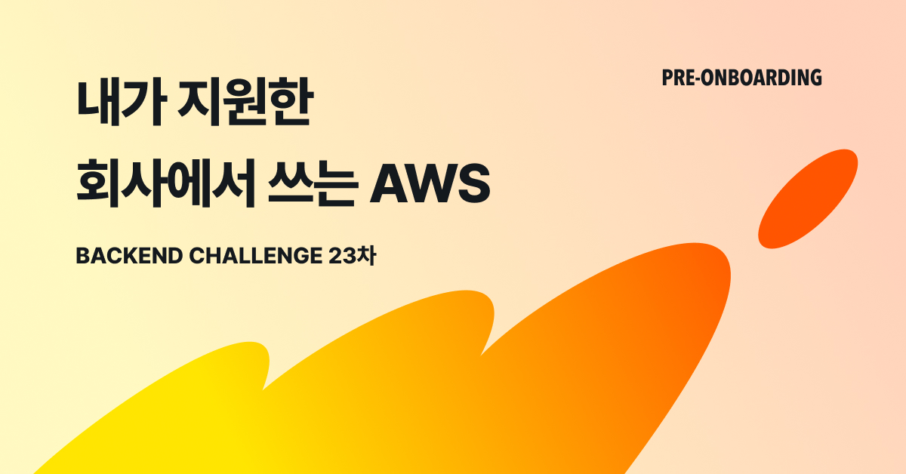

# 내가 지원한 회사에서 쓰는 AWS | 프리온보딩 BE 챌린지 9월

- 저작권으로 공부한 내용은 private 처리 합니다.
## 1-1 주차
##### S3의 응용
AWS 내 다양한 서비스들과의 통합을 통한 S3 활용법
- S3 기본 개념
- Cloudfront 를 통한 정적 콘텐츠 전달
- Hosting
- RDS 백업 데이터 내보내기를 통한 데이터 백업 및 복구
- Glue & Athena 를 통한 Data Lake 구축
## 1-2주차
##### AWS 내 네트워크 보안과 권한
AWS의 네트워크 관련 서비스 사용 사례와 IAM 에 대한 이해  
- VPC 기본 개념  
- 보안그룹 사용 사례  
- IAM 에 대한 기본 개념  
- IAM 기본 개념  
- Secret Manager  
- 회사의 규모별 보안 정책 사례 소개
## 2-1 주차
##### 오픈 소스 소프트웨어나 라이브러리를 래핑하여 관리형 서비스로 제공하는 사례 소개
AWS에서 제공하는 관리형 서비스의 종류 및 사용 사례에 대한 이해  
- 왜 AWS에서 제공해주는 관리형 서비스를 사용하는지  
- AWS ElaticCache  
- AWS RDS 및 Aurora  
- Amazon Opensearch  
- Amazon MSK
- Amazon Managed Grafana  
- AWS MWAA
## 2-2 주차
##### 서버리스 서비스의 응용
ECS(Fargate), Lambda, Aurora Serverless 에 대한 이해  
- Lambda 기본 개념  
- Lambda를 활용한 이미지 리사이징  
- ECS(Fargate) 기본 개념  
- ECR, AWS CodePipeline, Fargate를 활용한 배포 전략 및 자동화
- Aurora 및 Aurora Serverless 의 기본 개념 및 특장점

