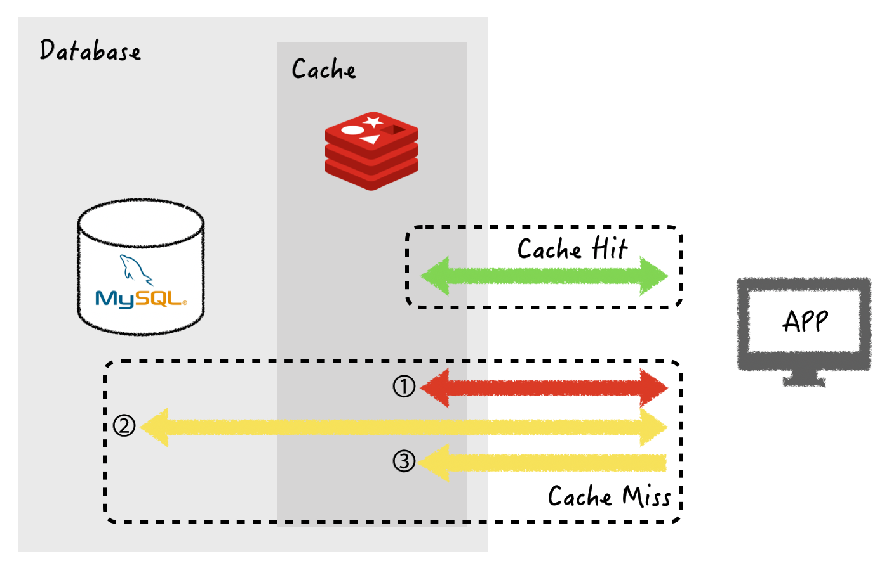
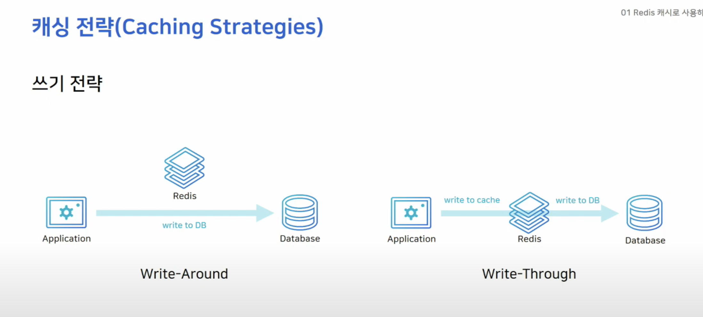

#Redis/caching-strategy-캐싱전략
# 캐싱 전략(Caching Strategies)
- 레디스를 어떻게 배치하냐에 따라 시스템 전체 성능에 큰 영향을 끼친다.
- 레디스를 어디에 어떻게 배치할 지에 대한 전략을 세우야 하는데 이를 캐싱전략(Caching Strategies)이라고 한다.
- 크게 읽기 전략과 쓰기 전략으로 두가지로 나뉜다.
## 읽기 전략 (Read Strategies)

### Look-aside (Lazy Loading) Pattern
> 데이터를 읽는 작업이 많을 때 사용하는 전략이다
   Redis를 캐시로 쓸 때 가장 일반적으로 사용 되는 방법

- `Cache Miss` : 캐시에서 원하는 데이터를 찾지 못한 상황을 가리킨다.
#### 동작 방식
1. 애플리케이션은 먼저 캐시에 데이터가 있는지 확인한다.
2. 만약 캐시에 데이터가 있으면 가져온다.
3. 만약 캐시에 데이터가 없으면 DB에서 조회 후 캐시에 저장 한다.
#### 장점
- Redis가 다운 되더라도 db에서 데이터를 가져오기 때문에 바로 장애로 이어지지 않는다.
	- 대신 cache에 붙은 connection이 많은 경우 해당 connection이 db로 붙기 때문에 갑자기 많은 부하가 몰릴 수 도 있다.
		- 이를 해결하기 위해 캐시를 새로 투입하거나 DB에만 새로운 데이터를 저장 했다면 처음에 `Cache Miss` 가 발생해서 성능 저하를 초래함.
		- 그래서 데이터베이스에서 cache로 데이터를 밀어주는 작업을 통해서 해결 할 수 있다 이를 `Cache Warming` 이라고 한다.
			- Ex) `NHN의 티켓링크` 에서는 상품 오픈 전 상품의 정보를 미리 DB에서 캐시로 올려주는 작업(`Cache Warming)` 을 매번 하고 있다.

#Redis/cache-warming
##### 활용 사례
- 자주 변경 되지 않는 데이터
- 데이터 접근 패턴이 예측 불가능한 경우

##### 사용금지 사례
- 데이터가 빈번하게 업데이트 되는 경우
	- Ex) 주식 거래
- 데이터 초기 로딩 시간에 민감한 애플리케이션
	- Ex) 실시간 게임 애플리케이션

#### 단점
- 캐시에 없는 데이터를 쿼리할 때 더 오랜 시간이 걸린다는 단점이 있다.
- 캐시가 최신 데이터를 가지고 있다는 것을 보장하지 못하는 단점이 있다.
- 캐시에 해당 key 값이 존재하지 않을 때만 캐시에 대한 업데이트가 일어나기 때문에 데이터베이스에서 데이터가 변경될 때에는 해당 값을 캐시가 알지 못하기 때문이다.

### Read Through Pattern
> 캐시가 데이터베이스와 연결되어, `Cache Miss` 시에 데이터베이스에서 데이터를 가져와 캐시에 저장
> 이 방식 또한 서비스 운영 초반에 `Cache Warming` 을 수행하는것이 좋다.
#### 장점
- 데이터베이스와 캐시 간 데이터 동기화가 항상 이루어짐
- 읽기 작업의 성능 향상
#### 단점
- Redis 다운 시 서비스 장애 발생
- 데이터 조회 속도 느림
##### 활용 사례
- 고정적이고 변하지 않는 데이터 
- 읽기 작업이 많은 경우
##### 사용금지 사례
- 처음 요청 시 지연 시간이 중요한 경우
	- Ex) 광고 서버

## 쓰기 전략 (Writing Strategies)

### Write-around Pattern
> 데이터가 데이터베이스에만 쓰이고, 캐시에는 갱신되지 않고, 읽기 시에만 캐시에 저장

- DB에 데이터를 저장하고 `Cache miss` 가 발생할 경우 DB에서 데이터를 캐싱한다.
	- 이 경우 cache 내의 데이터와 DB 내의 데이터가 다를 수 있다.
	- 캐싱된 데이터가 있을 경우 데이터를 수정할 때 캐싱된 데이터를 수정하지 않고, 캐시에 데이터는 있기 때문에 새로 캐싱을 하지 않는다.
#### 장점
- 데이터베이스 쓰기 작업 부하 감소
- 캐시 크기 최적화
#### 단점
- 캐시와 데이터베이스 간 데이터 불일치 발생 가능
##### 활용 사례
- 읽기 작업이 적고 쓰기 작업이 많은 경우
- 데이터가 자주 읽히지 않는 경우
##### 사용금지 사례
- 읽기 작업의 빈도가 높고, 캐시에 데이터가 자주 갱신 되어야 하는 경우
	- Ex) 소셜 미디어 피드
### Write-through Pattern
> 데이터베이스에 쓰기 전에 캐시에 먼저 데이터를 쓰고, 동기적으로 데이터베이스에 반영

- DB에 데이터를 저장 할 때 cache에도 함께 저장하는 방식이다.
	- cache는 항상 최신 정보를 가지고 있다는 장점이 있지만 저장할 때마다 두 단계(DB저장, 캐시저장)를 거쳐야 하기 때문에 상대적으로 느리다.
	- 재사용되지 않는 데이터도 무조건 캐시에 넣어버리기 때문에 일종의 리소스 낭비를 초래할 수 있다.
	- 이 경우 데이터를 저장할 때는 `Expire time` 을 설정해주는 것이 좋다.
#### 장점
- 데이터 일관성 보장
- 최신 데이터를 항상 캐시에 유지
- 빠른 조회 가능
#### 단점
- 쓰기 작업의 지연 시간 증가
- 자주 요청되지 않는 데이터도 캐시에 저장되어 비용 증가
##### 활용 사례
- 데이터가 자주 변경되고 최신 상태를 유지해야 하는 경우
- 캐시와 DB 간의 일관성이 중요한 경우
##### 사용금지 사례
- 쓰기 작업의 지연 시간이 중요한 경우
	- Ex) 금융 거래 시스템
- 쓰기 빈도가 매우 높은 애플리케이션
	- Ex) 실시간 메시징 애플리케이션

### Write-Back Pattern
> 데이터가 캐시에 먼저 저장되고, 비동기로 데이터베이스에 반영

#### 장점
- 쓰기 작업의 비용과 부하 감소
- 빠른 응답 제공
#### 단점
- 캐시 오류 시 데이터 영구 소실 가능성
- 비동기 업데이트로 인한 데이터 불일치 가능성
##### 활용 사례
- 쓰기 작업이 빈번하고 읽기 작업에 많은 리소스가 필요한 경우
##### 사용금지 사례
- 캐시가 중요한 데이터를 포함하고 있어 캐시 장애 시 데이터 손실이 용납되지 않는 경우
	- Ex) 의료 기록 시스템

# 레디스 활용 사례
## 좋아요 처리하기
- 하나의 댓글에 한번 만 `좋아요` 를 할 수 있도록 제한
- RDBMS에서는 유니크 제약조건을 생성해 처리 할 수 있지만 이는 insert와 update에 의한 성능 저하를 일으킨다.
- 레디스의 `set` 을 이용하여 이 기능을 간단하게 구현할 수 있으며, 빠른 시간 안에 처리할 수 있다.
	1. 댓글의 번호를 사용해서 key를 생성
	2. 해당 댓글에 좋아요를 누른 사용자의 ID를 아이템으로 추가하면 동일한 ID값을 저장할 수 없으므로 한 명의 사용자는 하나의 댓글에 한번 만 좋아요를 누를 수 있게 된다.

- [8] Reference

- [NHN Redis 야무지게 사용하기](https://www.youtube.com/watch?v=92NizoBL4uA) 
- [NHN Meetup 개발자를 위한 레디스 튜토리얼02](https://meetup.nhncloud.com/posts/225) 
- [캐시-설계-전략-총정리](https://inpa.tistory.com/entry/REDIS-%F0%9F%93%9A-%EC%BA%90%EC%8B%9CCache-%EC%84%A4%EA%B3%84-%EC%A0%84%EB%9E%B5-%EC%A7%80%EC%B9%A8-%EC%B4%9D%EC%A0%95%EB%A6%AC#%EC%BA%90%EC%8B%9C_%EC%A0%80%EC%9E%A5_%EB%B0%A9%EC%8B%9D_%EC%A7%80%EC%B9%A8) 
- [금융서비스-redis-적용기](https://medium.com/@hyeongrae/%EA%B8%88%EC%9C%B5%EC%84%9C%EB%B9%84%EC%8A%A4-redis-%EC%A0%81%EC%9A%A9%EA%B8%B0-read-write-transaction-%EA%B3%BC-event-strategy-2b3b3fa9a9f4) 

