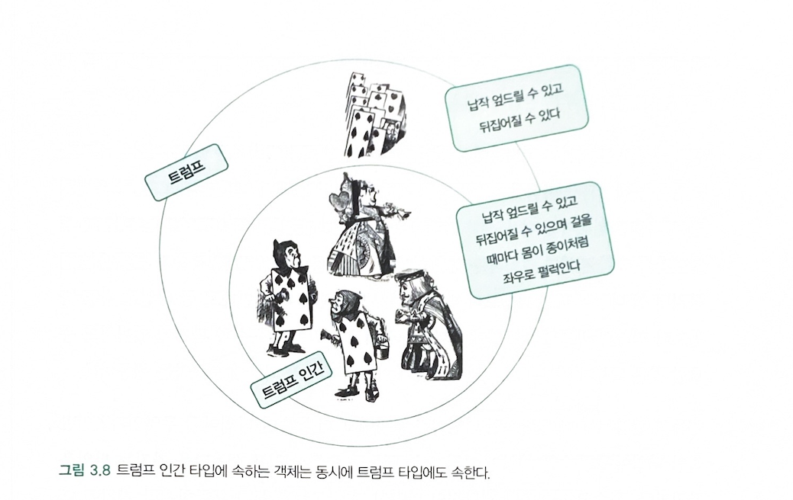
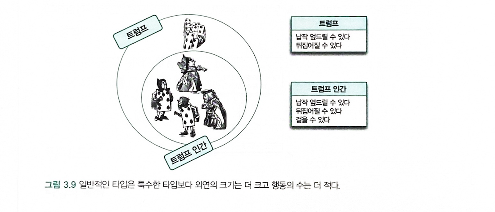

# 추상화를 통한 복잡성 극복

*추상화* 
> **추상화란 어떤 양상, 세부 사항, 구조를 좀 더 명확하게 이해하기 위해 특정 절차나 물체를 의도적으로 생략하거나 감춤으로써 복잡도를 극복하는 방법이다.** 
> 다음 두 차원에서 이뤄진다

- 첫 번째 차원: 구체적인 사물들 간의 공통점은 취하고 차이점은 버리는 일반화를 통해 단순하게 만든다.
- 두 번째 차원: 중요한 부분을 강조하기 위해 불필요한 세부 사항을 제거함으로써 단순하게 만든다.

**모든 경우에 추상화의 목적은 복잡성을 이해하기 쉬운 수준으로 단순화하는 것이다.** 

### 개념
> *개념(concept)* 이란 공통점을기반으로 객체들을 묶기 위한 그릇
> 일반적으로 우리가 인식하고 있는 다양한 사물이나 객체에 적용할 수 있는 아이디어나 관념을 뜻한다.

- *객체* 란 특정한 개념을 적용할 수 있는 구체적인 사물을 의미한다. 개념이 객체에 적용됐을 때 **객체를 개념의 인스턴스라** 고 한다.

- [n] comment
> 앨리스 이야기에서 하트 여왕은 "트럼프" 라는 개념 그룹의 일원이고 하얀 토끼는 "토끼" 라는 개념 그룹의 일원으로 객체에 어떤 개념을 적용하는것이 가능해서 개념 그룹의 일원이 될 때 객체를 그 개념의 인스턴스라고 한다. 즉, 하트 여왕은 트럼프의 인스턴스 하얀 토끼는 토끼의 인스턴스다.

### 개념의 세 가지 관점
- 심볼(symbol) : 개념을 가리키는 간략한 이름이나 명칭
- 내연(intension) : 개념의 완전한 정의를 나타내며 내연의 의미를 이용해 객체가 개념에 속하는지 여부를 확인 할 수 있다.
- 외연(extension) : 개념에 속하는 모든 객체의 집합(set)

> **트럼프라는 개념** 을 다음과 같이 표현 할 수 있다.

- 심볼 : 트럼프
- 내연(intension) : 몸은 납작하고 두 손과 발은 네모 귀퉁이에 달려 있는 등장인물
- 외연(extension) : 정원사, 병사, 신하, 하트 여왕 등등

- [n] comment
> 심볼은 개념의 가리키는 말로 "트럼프"는 개념의 심볼이 된다.
> 내연 : 개념의 의미 트럼프에 대한 설명
> 외연 : 개념의 인스턴스들이 모여 이뤄진 집합

>**개념을 이용해 객체를 분류할 수 있다는 사실이 더 중요하다.** 

### 객체를 분류하기 위한 틀
> 분류란 객체를 특정한 개념을 적용하는 작업. 객체에 특정한 개념을 적용하기로 결심 했을 때 우리는 그 객체를 특정한 집합의 멤버로 분류하고 있는 것이다.

# 타입
> 타입은 개념과 동일하다. 우리가 인식하고 있는 다양한 사물이나 객체에 적용할 수 있는 아이디어나 관념을 의미한다. 어떤 객체에 타입을 적용할 수 있을 때 그 객체를 타입의 인스턴스라고 한다.
> 타입의 인스턴스는 타입을 구성하는 외연인 객체 집합의 일원이 된다.

### 데이터 타입
> 메모리 안에 저장된 데이터의 종류를 분류하는 데 사용하는 메모리 집합에 관한 메타 데이터다.
> 데이터에 대한 분류는 암시적으로 어떤 종류의 연산이 해당 데이터에 대해 수행될 수 있는지를 결정한다.

### 객체와 타입
> **객체에서 중요한 것은 객체의 행동이다. *상태* 는 행동의 결과로 초래된 부수효과를 쉽게 표현하기 위해 도입한 추상적인 개념일 뿐이다**

- 데이터 타입과 주의해야 할 점이 동일하다
1. 어떤 객체가 어떤 타입에 속하는지를 결정하는 것은 객체가 수행하는 행동이다.
2. 객체의 내부적인 표현은 외부로부터 철저하게 감춰진다.

### 행동이 우선이다
> 객체의 타입을 결정하는 것은 객체의 행동뿐이다. 객체가 어떤 데이터를 보유하고 있는지는 타입을 결정하는 데 아무런 영향도 미치지 않는다.
> 외부에서 행동만을 제공하고 데이터는 행동 뒤로 감춰야 한다 이를 *캡슐화* 라고 한다.
> 객체의 책임을 먼저 결정하고 그 후에 데이터를 결정 해야 한다. (책임 주도 설계 - RDD)

# 타입의 계층

### 트럼프 계층

> 트럼프는 다음과 같이 나눌 수 있다

- 트럼프 : 납작 엎드릴 수 있고 뒤지업질 수 있는 객체
- 트럼프 인간 : 납작 엎드릴 수 있고 뒤집어질 수 있으며 걸을 때마다 몸이 종이처럼 좌우로 펄럭일 수 있다.

> 트럼프 인간은 트럼프보다 좀 더 특화된 행동을 하는 특수한 개념이다. 이 두 개념 사이의 관계를 *일반화/특수화(generalization/specialization)* 관계라고 한다.

### 일반화/특수화 관계
> 객체지향에서 일반화/특수화 관계를 결정하는 것은 객체의 상태를 표현하는 데이터가 아니라 행동이라는 것이다.

> **일반적인 타입은 특수한 타입보다 더 적은 수의 행동을 가지고 특수한 타입은 일반적인 타입보다 더 많은 수의 행동을 가진다** 
> 단, 특수한 타입은 일반적인 타입이 할 수 있는 모든 행동을 동일하게 수행 할 수 있어야 한다.
> 일반적인 타입은 특수한 타입보다 더 적은 수의 행동을 가지지만 더 큰 크기의 외연 집합을 가진다.
> 특수한 타입은 일반적인 타입보다 더 많은 수의 행동을 가지지만 더 적은 크기의 외연 집합을 가진다.

### 슈퍼타입과 서브타입
> 좀 더 일반적인 타입을 슈퍼타입, 좀 더 특수한 타입을 서브타입이라고 한다.

### 일반화는 추상화를 위한 도구다
> 추상화의 두 번째 차원은 **중요한 부분을 강조하기 위해 불필요한 세부 사항을 제거시켜 단순하게 만드는 것이다** 
> "앨리스는 여왕을 쳐다보며 마음속으로 이렇게 속삭였다 기껏해야 트럼프에 불과해. 무서워 할 필요 없어"
> 앨리스 얘기에서 앨리스는 트럼프의 특성에만 집중하고 불필요한 트럼프 인간의 특성은 제거해서 상황을 단순하게 만들었다.

> 여기서 두 가지 추상화 기법이 함께 사용 됬다.

- 정원에 있던 등장인물들의 차이점은 배제하고 공통점만 강조함으로써 이들을 공통의 타입인 트럼프 인간으로 분류
- 트럼프 인간을 좀 더 단순한 관점에서 바라보기 위해 불필요한 특성을 배제하고 좀 더 포괄적인 의미를 지닌 트럼프로 일반화

# 정적 모델

### 타입의 목적
> 타입을 이용하면 객체의 동적인 특성을 추상화 할 수 있다.
> 시간에 따른 객체의 상태 변경이라는 복잡성을 단순화 시킬 수 있다.
### 동적 모델과 정적모델
- 동적 모델 : 스냅샷처럼 객체가 살아 움직이는 동안 상태가 어떻게 변하고 어떻게 행동하는지를 포착하는 것
- 정적 모델(타입 모델) : 객체가 가질 수 있는 모든 상태와 모든 행동을 시간에 독립적으로 표현

# 클래스
- 객체를 분류하는 기준은 타입이며, 타입을 나누는 기준은 객체가 수행하는 행동이다.
- 타입을 구현할 수 있는 한 가지 방법이 클래스다.