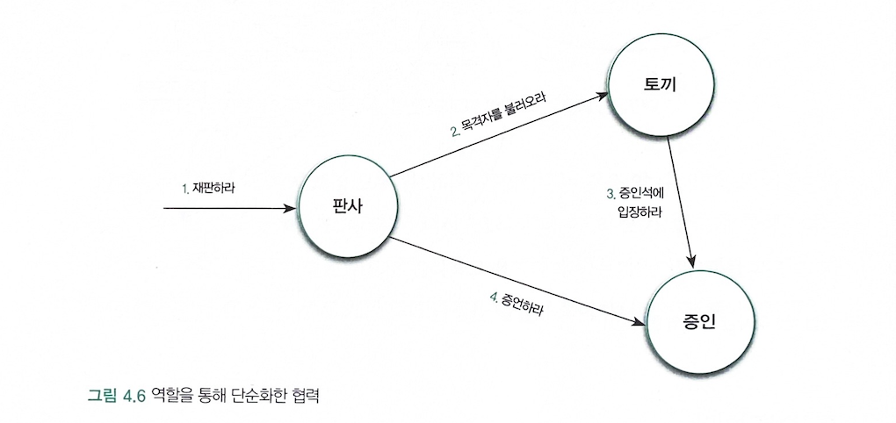
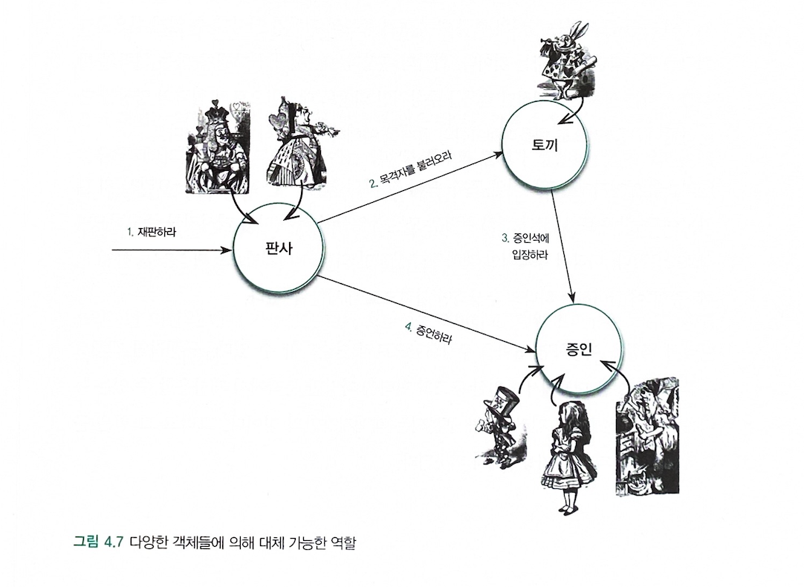

# 협력
- 다수의 요청과 응답으로 구성되며 전체적으로 다수의 연쇄적인 요청과 응답의 흐름으로 구성된다.
- 어떤 객체를 특정한 요청을 받아들일 수 있는 이유는 그 요청에 대해 적절한 방식으로 응답하는 데 필요한 지식과 행동 방식을  가지고 있기 때문이다.
- 요청과 응답은 협력에 참여하는 객체가 수행 할 책임을 정의한다.
# 책임
> 어떤 객체가 어떤 요청에 대해 대답해 줄 수 있거나, 적절한 행동을 할 의무가 있는 경우 해당 객체가 *책임* 을 가진다고 말한다.

### 책임의 분류
> 책임은 객체에 의해 정의되는 응집도 있는 행위의 집합으로, 객체가 알아야 하는 정보(knowing)와 객체가 수행할 수 있는 행위(doing)에 대해 개략적으로 서술한 문장이다.

- 하는 것 (doing)
	- 객체를 생성하거나 계산을 하는 등의 스스로 하는 것
	- 다른 객체의 행동을 시작시키는 것
	- 다른 객체의 활동을 제어하고 조절하는 것
- 아는것(knowing)
	- 개인적인 정보에 관해 아는 것
	- 관련된 객체에 관해 아는 것
	- 자신이 유도하거나 계산할 수 있는 것에 관해 아는 것

> 책임은 외부에 제공해줄 수 있는 정보(아는것)와 외부에 제공해 줄 수 있는 서비스(하는것)의 목록이다.
> 따라서 책임은 객체의 공용 인터페이스(public interface)를 구성한다.

### 책임과 메세지
> 객체가 다른 객체에게 주어진 책임을 수행하도록 요청을 보내는 것을 *메세지 전송(message-send)* 이라고 한다.
> 두 객체 간의 협력은 메세지를 통해 이뤄진다.
> *메세지* 는 협력을 위해 한 객체가 다른 객체로 접근할 수 있는 유일한 방법이다.

- *책임* 이 협력이라는 문맥 속에서 요청을 수신하는 한 쪽의 객체 관점에서 무엇을 할 수 있는지를 나열하는 것
- *메세지* 는 협력에 참여하는 두 객체 사이의 관계를 강조한 것

# 역할

- *역할* 은 협력 내에서 다른 객체로 대체할 수 있음을 나타내는 일종의 표식이다.
- 역할을 대체 할 수 있는 객체는 동일한 메세지를 이해할 수 있는 객체로 한정된다.
- 역할의 개념을 사용하면 유사한 협력을 추상화해서 인지 과부하를 줄일 수 있다.
- 또한 다양한 객체들이 협력에 참여할 수 있기 때문에 협력이 좀 더 유연해지며 재사용성이 높아진다.
- 역할은 객체지향 설계의 *단순성(simplicity)*, *유연성(flexibility)* , *재사용성(reusability)* 을 뒷받침하는 핵심 개념이다.

#### 대체 가능성
- 객체가 역할을 대체하기 위해서는 행동이 호환돼야 한다.
- 객체가 역할을 대체 가능하기 위해서는 협력 안에서 역할이 수행하는 모든 책임을 동일하게 수행할 수 있어야 한다.

> **역할의 대체 가능성은 행위 호환성을 의미하고, 행위 호환성은 동일한 책임의 수행을 의미한다.** 

# 객체의 모양을 결정하는 협력

### 흔한 오류
1. 첫번째 선입견은 데이터를 저장하기 위해 객체가 존재한다는 선입견을 가지고 있다.
2. 두번째 선입견은 객체지향이 클래스 와 클래스 간의 관계를 표현하는 시스템의 정적인 측면에 중점을 둔다는 것이다.

> **객체가 존재하는 이유는 행위를 수행하며 협력에 참여하기 위해서다.
> 실제로 중요한 것은 객체의 행동, 즉 책임이다.** 
> **클래스를 어떻게 구현할 것인가가 아니라 객체가 협력 안에서 어떤 책임과 역할을 수행할 것인지를 결정하는 것이다.** 

# 객체지향 설계 기법

- 역할, 책임, 협력 관점에서 애플리케이션을 설계하는 유용한 세 가지 기법

### 책임-주도 설계(RDD)
> 책임 주도 설계(Responsibility-Driven Design)

- 시스템이 사용자에게 제공해야 하는 기능인 시스템 책임을 파악한다.
- 시스템 책임을 더 작은 책임으로 분할한다.
- 분할된 책임을 수행할 수 있는 적절한 객체 또는 역할을 찾아 책임을 할당한다.
- 객체가 책임을 수행하는 중에 다른 객체의 도움이 필요한 경우 이를 책임질 적절한 객체 또는 역할을 찾는다.
- 해당 객체 또는 역할에게 책임을 할당함으로써 두 객체가 서로 협력하게 한다.

### 디자인 패턴
> 책임 주도 설계의 결과를 표현한다. 특정한 상황에서 설계를 돕기 위해 모방하고 수정할 수 있는 과거의 설계 경험이다.

- 디자인 패턴은 공통으로 사용할 수 있는 역할, 책임, 협력의 템플릿이다.

> 특정한 상황에 적용 가능한 디자인 패턴을 잘 알고 있다면 책임 주도 설계의 절차를 순차적으로 따르지 않고도 시스템 안에 구현할 객체들의 역할과 책임, 협력 관계를 빠르고 손쉽게 포착할 수 있을것이다.

- 디자인 패턴은 책임 주도 설계의 결과물인 동시에 지름길이다.

### 테스트 주도 개발
> 테스트 주도 개발은 **테스트를 작성하는 것이 아니라 책임을 수행할 객체 또는 클라이언트가 기대하는 객체의 역할이 메세지를 수신할 때 어떤 결과를 반환하고 그 과정에서 어떤 객체와 협력할 것인지에 대한 기대를 코드의 형태로 작성하는 것** 

- 테스트 주도 개발은 책임 주도 설계의 기본 개념을 따른다.
- 테스트 주도 개발은 책임 주도 설계를 통해 도달해야 하는 목적지를 테스트라는 안전장치를 통해 좀 더 빠르고 견고한 방법으로 도달할 수 있도록 해주는 최상의 설계 프랙티스다.
- 테스트에 필요한 간접 입력값을 제공하기 위해 *스텁(stub)* 을 추가하거나 간접 출력 값을 검증하기 위해 *목 객체(mock object)* 를 사용하는 것은 객체와 협력 해야 하는 협력자에 관해 고민한 결과를 코드로 표현한 것이다.

