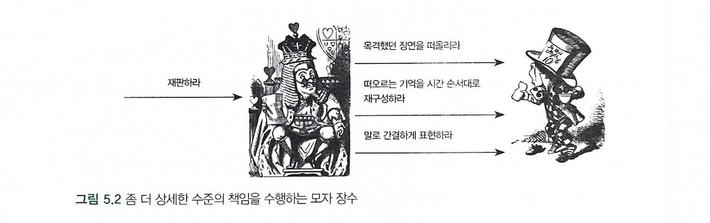
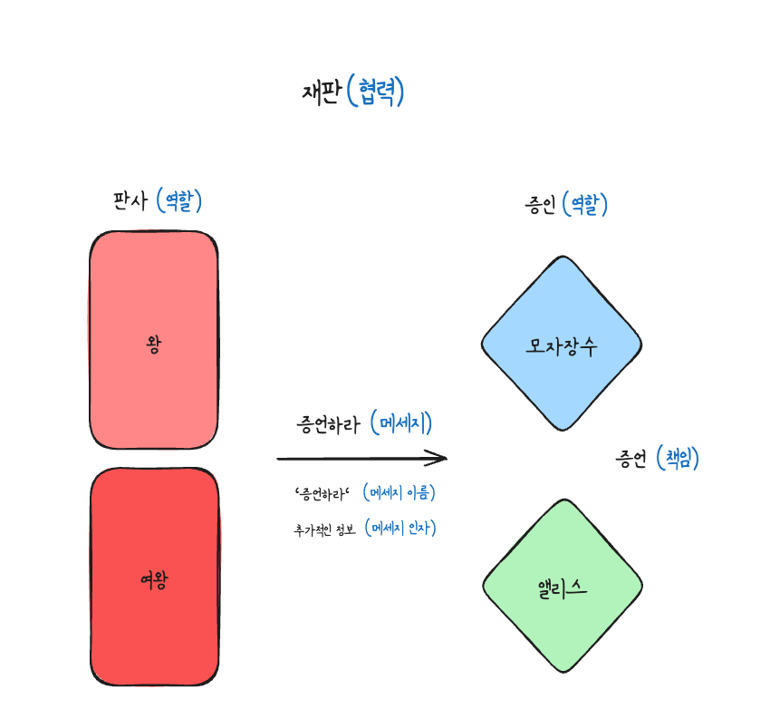

# 자율적인 책임

### 설계의 품질을 좌우하는 책임
- 협력에 참여하는 객체가 얼마나 자율적인지가 전체 애플리케이션의 품질을 결정한다.

### 자신의 의지에 따라 증언할 수 있는 자유
- 객체가 자율적이기 위해서는 객체에게 할당되는 책임이 자율적이어야 한다.

- 첫번째 협력

> 증언이라는 책임만 완수 할 수 있다면 나머지 구체적인 방법이나 절차는 모자 장수가 자유롭게 선택하도록 허용한다.

- 두번째 협력

> 책임들이 모자 장수가 증언하기 위해 선택할 수 있는 자유의 범위를 지나치게 제한하고 있다.

### 너무 추상적인 책임

-  포괄적이고 추상적인 자율적인 책임을 선택한다고 해서 무조건 좋은것은 아니다.
- 그림에서 모자 장수는 왕과 협력하기 위해 '설명하라' 라는 책임을 수행하는데 무엇을 설명 해야 하는지에 대한 범위가 너무 광범위 하다.

> 추상적이고 포괄적인 책임은 협력을 좀 더 다양한 환경에서 재사용할 수 있도록 유연성이라는 축복을 내려준다.
> 그러나 책임은 협력에 참여하는 의도를 명확하게 설명할 수 있는 수준 안에서 추상적이어야 한다.
### '어떻게'가 아니라 '무엇'을
- 자율적인 책임의 특징은 객체가 '어떻게(how)' 해야 하는가가 아니라 '무엇(what)'을 해야 하는가를 설명한다는 것이다.

> '증언한다' 라는 책임은 모자 장수가 협력을 위해 '무엇'을 해야 하는지를 결정하지만 '어떻게'해야 하는지에 대해서는 전혀 언급하지 않는다. 즉, 증언할 방법은 모자 장수가 자율적으로 선택할 수 있다.

### 책임을 자극하는 메세지
- 객체가 자신에게 할당된 책임을 수행하도록 만드는 것은 외부에서 전달되는 요청이다.

# 메세지와 메서드
### 메세지
- 메세지는 객체들이 서로 협력하기 위해 사용할 수 있는 유일한 의사소통 수단
- 객체가 메세지를 수신할 수 있다는 것은 객체가 메세지에 해당하는 책임을 수행할 수 있다는 것을 의미한다.
- 객체가 유일하게 이해할 수 있는 의사소통 수단은 메세지뿐이며 객체는 메세지를 처리하기 위한 방법을 자율적으로 선택할 수 있다.
- 외부의 객체는 메세지에 관해서만 볼 수 있고 객체 내부는 볼 수 없기 때문에 자연스럽게 객체의 외부와 내부가 분리된다.
- 객체가 수신할 수 있는 메세지의 모양이 객체가 수행할 책임의 모양을 결정한다.

> 왕이 모자 장수에게 '증언하라' 라는 메세지를 전송한다.
> 왕은 *송신자* 메세지를 수신하는 모자 장수는 *수신자* 가 된다.

- *메세지-전송* : 객체의 행동을 유발하는 행위, 메세지-전송 메커니즘은 객체가 다른 객체에 접근할 수 있는 유일한 방법이다.
- *메세지 이름(message name)* : 왕이 모자 장수에게 전송하는 메세지를 가리키는 '증언하라' 부분
- 메세지의 *인자(argument)* : 메세지를 전송할 때 추가적인 정보

> 메세지는 메세지 이름과 인자의 두 부분으로 구성된다
> 메세지 전송은 수신자와 메시지의 조합 -> **메세지 전송은 수신자, 메세지 이름, 인자의 조합** 

### 메서드
- 메세지를 처리하기 위해 내부적으로 선택하는 방법을 *메서드* 라고 한다.
- 메세지는 '어떻게' 수행될 것인지는 명시하지 않고 오퍼레이션을 통해 '무엇'이 실행되길를 바라는지만 명시하며, 어떤 메서드를 선택할 것인지는 전적으로 수신자의 결정에 좌우된다.

### 다형성
> *다형성* 이란 서로 다른 유형의 객체가 동일한 메세지에 대해 서로 다르게 반응 하는 것을 의미, 서로 다른 타입에 속하는 객체들이 동일한 메서드를 수신한 경우 서로 다른 방법으로 메세지를 처리할 수 있다.

- 다형성은 역할, 책임, 협력과 깊은 관련이 있다.
- 서로 다른 객체들이 다형성을 만족시킨다는 것은 객체들이 동일한 책임을 공유한다는 것을 의미
- 다형성은 동일한 역할을 수행할 수 있는 객체들 사이의 *대체 가능성* 을 의미
- 다형성은 객체들의 대체 가능성을 이용해 설계를 유연하고 재사용 가능하게 만든다.
- 다형성은 수신자의 종류를 캡슐화 한다.
- 다형성은 송신자와 수신자 간의 객체 타입에 대한 결합도를 메세지에 대한 결합도로 낮춤으로써 달성된다.

### 유연하고 확장 가능하고 재 사용성이 높은 협력의 의미
1. 협력이 유연 해진다
2. 협력이 수행되는 방식을 확장할 수 있다.
3. 협력이 수행되는 방식을 재 사용할 수 있다.

### 송신자와 수신자를 약하게 연결하는 메세지
> 메세지를 기반으로 한 두 객체 사이의 낮은 결합도가 바로 설계를 유연하고 확장 가능하며 재사용 가능하게 만들어 준다.

# 메세지를 따라라
- 훌륭한 객체지향 설계는 어떤 객체가 어떤 메세지를 전송할 수 있는가와 어떤 객체가 어떤 메세지를 이해할 수 있는가를 중심으로 객체 사이의 협력관계를 구성하는 것이다.
- 객체지향 설계의 중심에는 *메세지* 가 위치하고 메세지가 객체를 선택하게 해야한다.
- 메세지가 객체를 선택하게 만들려면 메세지를 중심으로 *협력* 을 설계해야 한다.

### 책임-주도 설계 다시 살펴보기
- 객체지향 설계는 적절한 책임을 적잘한 객체에게 할당하면서 메세지를 기반으로 협력하는 객체들의 관계를 발견하는 과정이다.
- 책임-주도 설계의 기본 아이디어는 객체들간에 주고 받는 *메세지* 를 기반으로 적절한 *역할* 과 *책임* , *협력* 을 발견하는 것이다.

1. 객체가 책임을 완수하기 위해 다른 객체의 도움이 필요하면 어떤 **메세지가 필요한지 결정** 
2. 메세지를 수신하기에 적합한 **객체를 선택**  한다.
3. 결과적으로 **메세지가 수신자의 책임을 결정** 한다.

### What/Who 사이클
> 책임-주도 설계의 핵심은 어떤 행위가 필요한지를 먼저 결정한 후에 이 행위를 수행 할 객체를 결정 하는 것

- 객체 사이의 협력 관계를 설계하기 위해서는 먼저 '어떤 행위(what)'를 수행할 것인지를 결정한 후에 '누가(who)' 그 행위를 수행할 것인지를 결정해야 한다는 것.
- '어떤 행위(what)'가 바로 *메세지* 
- **협력이라는 문맥 안에서 필요한 메세지를 먼저 결정한 후에 메세지를 수신하기에 적합한 객체를 선택한다. 그리고 수신된 메세지가 객체의 책임을 결정한다.** 

### 묻지 말고 시켜라
- 메세지 송신자는 메세지 수신자가 어떤 객체인지 모르지만 자산이 전송한 메세지를 잘 처리할 것이라는 것을 믿고 메세지를 전송하는 스타일의 협력 패턴을 '묻지 말고 시켜라' 라고 한다.
- 객체를 자율적으로 만들고 캡슐화를 보장하며 결합도를 낮게 유지시켜 주기 때문에 설계를 유연하게 만든다.

# 객체 인터페이스

### 인터페이스
> 어떤 두 사물이 마주치는 경계 지점에서 서로 상호작용 할 수 있게 이어주는 방법이나 장치

>인터페이스의 세가지 특징

1. 인터페이스의 사용법만 알고 있으면 대상의 내부 구조나 동작 방법을 몰라도 상호작용이 가능하다.
2. 인터페이스가 변경되지 않고 단순히 내부 구성이나 작동 방식이 변경되는 것은 인터페이스 사용자에게 아무런 영향도 미치지 않는다.
3. 인터페이스가 동일 하기만 하다면 어떤 대상과도 상호작용 할 수 있다.

> 자동차에 비유
> 자동차라는 인터페이스에
> 첫번째 특징 : 자동차 운전법(사용법)만 안다면 자동차 내부 부품이나 동작들을 몰라도 충분하다.
> 두번째 특징 : 정비소에서 자동차의 엔진을 교체 했다고해서 운전자가 운전하는 방법을 새로 배울 필요 없다.
> 세번째 특징 : 하나의 자동차를 운전하기 위한 인터페이스에 능숙하면 다른 자동차도 운전할 수 있다.

### 메세지가 인터페이스를 결정한다
- 인터페이스는 객체가 수신 할 수 있는 메세지의 목록으로 구성된다.

### 공용 인터페이스
> *공용 인터페이스* 란 외부에 공개된 인터페이스
> 내부에서만 접근 가능한 사적인 인터페이스와 구분
> **모든 인터페이스는 메세지 전송을 통해서만 접근할 수 있다.** 

### 책임, 메세지, 그리고 인터페이스
1. 협력에 참여하는 객체의 책임이 자율적 이어야 한다.
2. 메세지와 메서드의 구분은 객체를 외부와 내부라는 두 개의 명확하게 분리된 영역으로 구분하는 동시에 다형성을 통해 다양한 타입의 객체를 수용할 수 있는 유연성을 부과한다.
3. 객체가 어떤 메세지를 수신할 수 있느냐가 어떤 책임을 수행할 수 있느냐와 어떤 인터페이스를 가질것인지를 결정한다.
4. 메세지로 구성된 공용 인터페이스는 객체의 외부와 내부를 명확하게 분리한다.

# 인터페이스와 구현의 분리
### 객체 관점에서 생각하는 방법
> 객체지향적인 사고 방식을 이해하기 위한 세가지 원칙

1. 좀 더 추상적인 인터페이스
2. 최소 인터페이스
3. 인터페이스와 구현 간에 차이가 있다는 점을 인식

### 구현
> 객체를 구성하지만 공용 인터페이스에 포함되지 않는 모든것이 구현에 포함된다.

- 객체는 상태를 가진다. > 객체 외부에 노출 되는 공용 인터페이스가 아니며 상태를 어떻게 표현할 것인가는 객체의 구현에 해당한다.
- 객체는 행동을 가진다. > 객체 외부에 노출되는 공용 인터페이스가 아니며 객체의 구현 부분에 포함된다.

### 인터페이스와 구현의 분리 원칙
> 훌륭한 객체란 구현을 모른 채 인터페이스만 알면 쉽게 상호작용 할 수 있는 객체를 의미

- *인터페이스와 구현의 분리(separation of interface and implementation)* 원칙 : 객체 외부에 노출되는 인터페이스와 객체의 내부에 숨겨지는 구현을 명확하게 분리해서 고려해야 된다.

### 캡슐화
> 객체의 자율성을 보존하기 위해 구현을 외부로부터 감추는 것을 캡슐화라고 한다.

- 상태와 행위의 캡슐화
- 사적인 비밀의 캡슐화

#### 상태와 행위의 캡슐화
- 객체는 상태와 행동을 하나의 단위로 묶는 자율적인 실체이고 이 관점에서 캡슐화를 데이터 캡슐화 라고 한다.
- 데이터 캡슐화는 인터페이스와 구현을 분리하기 위한 전제 조건이다.
- 데이터 캡슐화는 자율적인 객체를 만들기 위한 전제 조건이다.

#### 사적인 비밀의 캡슐화
- 외부에서 객체와 의사소통할 수 있는 고정된 경로를 공용 인터페이스라고 한다.
- 객체는 공용 인터페이스를 경계로 최대한의 자율성을 보장받을 수 있다.
- 외부의 객체는 공용 인터페이스에만 의존해야하고 구현 세부 사항에 대해서는 직접적으로 의존해서는 안된다.

# 책임의 자율성이 협력의 품질을 결정한다
1. 자율적인 책임은 협력을 단순하게 만든다.
	- 자율적인 책임은 세부적인 사항들을 무시하고 의도를 드러내는 하나의 문장으로 표현함으로써 협력을 단순하게 만든다.
	- 책임이 적절하게 추상화 된다.
2. 자율적인 책임은 객체의 외부와 내부를 명확하게 분리한다.
	- 요청하는 객체가 몰라도 되는 사적인 부분이 객체 내부로 캡슐화 되기 때문에 인터페이스와 구현이 분리된다.
3. 책임이 자율적일 경우 책임을 수행하는 내부적인 방법을 변경 하더라도 외부에 영향을 미치지 않는다.
	- 책임이 자율적일수록 변경에 의해 수정돼야 하는 범위가 좁아지고 명확해진다.
	- 변경의 파급효과가 객체 내부로 캡슐화 되기 때문에 두 객체 간의 결합도가 낮아진다.
4. 자율적인 책임은 협력의 대상을 다양하게 선택할 수 있는 유연성을 제공한다.
	- 책임이 자율적일수록 협력이 좀 더 유연해지고 다양한 문맥에서 재활용 될 수 있다.
	- 설계가 유연해지고 재사용성이 높아진다.
5. 객체가 수행하는 책임들이 자율적일수록 객체의 역할을 이해하기 쉬워진다.
	- 책임이 자율적일수록 객체의 응집도를 높은 상태로 유지하기 쉬워진다.

> **책임이 자율적일수록 적절하게 *추상화* 되며, *응집도* 가 높아지고 *결합도* 가 낮아지며 *캡슐화* 가 증진되고 *인터페이스와 구현이 명확히 분리* 되며 설계의 *유연성* 과 *재사용성* 이 향상된다*** 
> *객체지향의 강력함은 책임을 자율적으로 만드는것이고 그리고 이것은 메세지에 따라 달라진다*  

