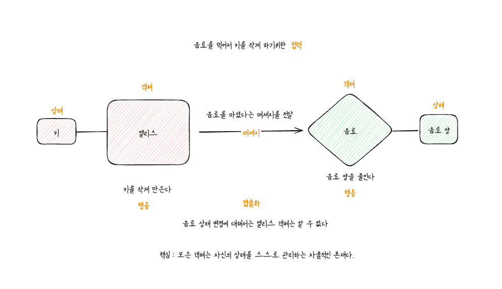

# 객체지향의 사실과 오해
 
# 🔑 요약
## 2장 이상한 나라의 객체
 

## 3장 타입과 추상화

## 5장 책임과 메세지

# 📆 정리 현황 테이블

아래 테이블에 각 장별로 작성한 README.md 를 링크 (연결) 합니다.

| Priority | Task             | Chapter | Link                                                                                                                                                                                                                                                                                                |
| -------- | ---------------- | ------- | --------------------------------------------------------------------------------------------------------------------------------------------------------------------------------------------------------------------------------------------------------------------------------------------------- |
| ⭐⭐⭐⭐⭐    | 5. 책임과 메세지       | 5장      | [링크](https://github.com/yanggwangseong/TIL/blob/main/%EB%8F%84%EC%84%9C/%EA%B0%9D%EC%B2%B4%EC%A7%80%ED%96%A5%EC%9D%98%20%EC%82%AC%EC%8B%A4%EA%B3%BC%20%EC%98%A4%ED%95%B4/Chapter/5.%20%EC%B1%85%EC%9E%84%EA%B3%BC%20%EB%A9%94%EC%84%B8%EC%A7%80.md)                                                 |
| ⭐⭐⭐⭐⭐    | 4. 역할, 책임, 협력    | 4장      | [링크](https://github.com/yanggwangseong/TIL/blob/main/%EB%8F%84%EC%84%9C/%EA%B0%9D%EC%B2%B4%EC%A7%80%ED%96%A5%EC%9D%98%20%EC%82%AC%EC%8B%A4%EA%B3%BC%20%EC%98%A4%ED%95%B4/Chapter/4.%20%EC%97%AD%ED%95%A0%2C%20%EC%B1%85%EC%9E%84%2C%20%ED%98%91%EB%A0%A5.md)                                        |
| ⭐⭐⭐⭐⭐    | 3. 타입과 추상화       | 3장      | [링크](https://github.com/yanggwangseong/TIL/blob/main/%EB%8F%84%EC%84%9C/%EA%B0%9D%EC%B2%B4%EC%A7%80%ED%96%A5%EC%9D%98%20%EC%82%AC%EC%8B%A4%EA%B3%BC%20%EC%98%A4%ED%95%B4/Chapter/3.%20%ED%83%80%EC%9E%85%EA%B3%BC%20%EC%B6%94%EC%83%81%ED%99%94.md)                                                 |
| ⭐⭐⭐⭐⭐    | 2. 이상한 나라의 객체    | 2장      | [링크](https://github.com/yanggwangseong/TIL/blob/main/%EB%8F%84%EC%84%9C/%EA%B0%9D%EC%B2%B4%EC%A7%80%ED%96%A5%EC%9D%98%20%EC%82%AC%EC%8B%A4%EA%B3%BC%20%EC%98%A4%ED%95%B4/Chapter/2.%20%EC%9D%B4%EC%83%81%ED%95%9C%20%EB%82%98%EB%9D%BC%EC%9D%98%20%EA%B0%9D%EC%B2%B4.md)                            |
| ⭐⭐⭐⭐     | 6. 객체지도          | 6장      | [링크](https://github.com/yanggwangseong/TIL/blob/main/%EB%8F%84%EC%84%9C/%EA%B0%9D%EC%B2%B4%EC%A7%80%ED%96%A5%EC%9D%98%20%EC%82%AC%EC%8B%A4%EA%B3%BC%20%EC%98%A4%ED%95%B4/Chapter/6.%20%EA%B0%9D%EC%B2%B4%EC%A7%80%EB%8F%84.md)                                                                      |
| ⭐⭐⭐⭐     | 7. 함께 모으기        | 7장      | [링크](https://github.com/yanggwangseong/TIL/blob/main/%EB%8F%84%EC%84%9C/%EA%B0%9D%EC%B2%B4%EC%A7%80%ED%96%A5%EC%9D%98%20%EC%82%AC%EC%8B%A4%EA%B3%BC%20%EC%98%A4%ED%95%B4/Chapter/7.%20%ED%95%A8%EA%BB%98%20%EB%AA%A8%EC%9C%BC%EA%B8%B0.md)                                                          |
| ⭐⭐⭐      | 1. 협력하는 객체들의 공동체 | 1장      | [링크](https://github.com/yanggwangseong/TIL/blob/main/%EB%8F%84%EC%84%9C/%EA%B0%9D%EC%B2%B4%EC%A7%80%ED%96%A5%EC%9D%98%20%EC%82%AC%EC%8B%A4%EA%B3%BC%20%EC%98%A4%ED%95%B4/Chapter/1.%20%ED%98%91%EB%A0%A5%ED%95%98%EB%8A%94%20%EA%B0%9D%EC%B2%B4%EB%93%A4%EC%9D%98%20%EA%B3%B5%EB%8F%99%EC%B2%B4.md) |

# 📝 키워드
