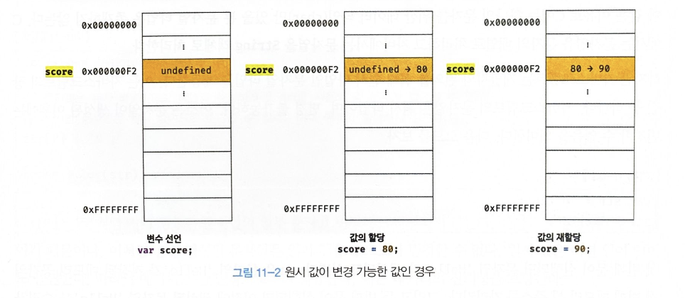
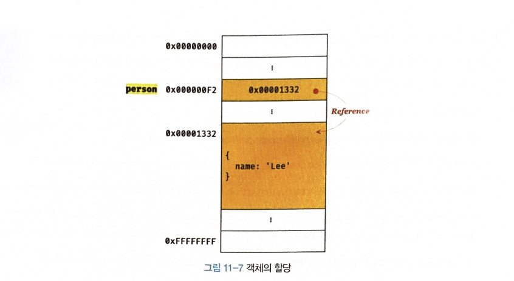
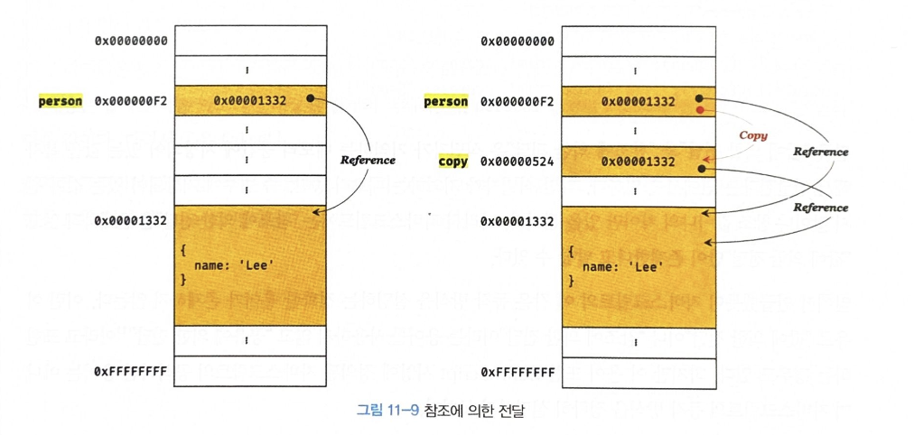

> 자바스크립트 7가지 데이터 타입(숫자, 문자열, 불리언, null, undefined, 심벌, 객체타입) 은 **크게 원시타입(primitive type)**  과 **객체 타입 (object/reference type)**  으로 구분 할 수 있다.

- 원시 타입의 값, 즉 원시 값은 변경 불가능한 값(immutable value).
- 객체(참조) 타입의 값은 변강 가능한 값(mutable value)이다.
- 원시 값을 변수에 할당하면 변수(확보된 메모리 공간)에는 실제 값이 저장된다.
- 객체를 변수에 할당하면 변수(확보된 메모리 공간)에는 참조 값이 저장된다.


## 🐨 11-1 원시 값
### 11-1-1 변경 불가능한 값
> 원시 타입(primitive type)의 값, 즉 원시 값은 변경 불가능한 값(immutable value)이다.

- 변경 불가능 하다는것은 변수가 아니라 값에 대한 진술이다.
- 변수는 언제든지 재할당을 통해 변수 값을 변경 할 수 있다.
- 재할당이 금지된 변수를 *상수* 라고 한다.
- 상수와 변경 불가능한 값(immutable value)는 다르다. 상수는 재할당이 금지된 변수일 뿐이다.


1. 0xc000000A2 -> 식별자: score, 값 : 0x000000F2 (undefined)
2. 0xc000000A2 -> 식별자: score, 값 : 0x0000001332 (80)
3. 0xc000000A2 -> 식별자: score, 값 : 0x00000F913 (90)
4. 0xc000000A2  -> 0x00000F913 메모리 주소를 참조
5. undefined(0x000000F2)나 80(0x0000001332) 등 안쓰는 메모리 공간들(참조 카운터가 0)은 garbage collector(gc)가 처리한다. 하지만 javascript에서는 언제 gc가 발생하는지 모르지만 gc가 처리한다.

> 변수가 참조하던 메모리 공간의 주소가 변경된 이유는 변수에 할당된 원시 값이 변경 불가능한 값이기 때문이다.
> 따라서 변수 값을 변경하기 위해 원시 값을 재할당하면 새로운 메모리 공간을 확보하고 재할당한 값을 저장한 후, 변수가 참조하던 메모리 공간의 주소를 변경한다. 값의 이러한 특성을 **불변성(immutability)** 라고 한다.
> 불변성을 갖는 원시 값을 할당한 변수는 재할당 이외에 변수 값을 변경할 수 있는 방법이 없다.


- 이런식으로 되면 되지 않겠냐 사람들이 추측하는 그림, 하지만 실제는 그림 11-1처럼 동작.

- [n] comment
> 변경 불가능한 값(immutable value)라는 뜻은 결국 undefined에서 80으로 값을 할당 할때나 90으로 재 할당 할때 그림 11-2처럼 같은 메모리에 값이 변경 되는것이 아니라 80으로 값을 할당 할때 새로운 메모리 공간에 80을 할당하고 90으로 값을 재할당 할때 다시 또 새로운 메모리 공간에 90을 할당 한다.
> 값의 이러한 특성을 **불변성(immutability)** 라고 한다.


### 11-1-2 문자열과 불변성
> javascript에서 문자열은 유사 배열 객체이면서 이터러블이므로 배열과 유사하게 문자에 접근할 수 있다.

#### 유사배열 객체(array-like object)
> 유사 배열 객체란 마치 배열처럼 인덱스로 프로퍼티 값에 접근할 수 있고 length 프로퍼티를 갖는 객체를 말한다. 문자열은 마치 배열처럼 인덱스를 통해 각 문자에 접근할 수 있으며, length 프로퍼티를 갖기 때문에 유사 배열 객체이고 for 문으로 순회할 수 도 있다.

```javascript
var str = 'string';

// 문자열은 유사 배열이므로 배열과 유사하게 인덱스를 사용해 각 문자에 접근할 수 있다.
console.log(str[0]); // s

// 원시 값인 문자열이 객체처럼 동작한다.
console.log(str.length); // 6
console.log(str.toUpperCase()); // STRING
```

> 원시 값을 객체처럼 사용하면 원시 값을 감싸는 래퍼 객체로 자동 변환된다.

```javascript
var str = 'string';

// 문자열은 유사 배열이므로 배열과 유사하게 인덱스를 사용해 각 문자에 접근할 수 있다.
// 하지만 문자열은 원시 값이므로 변경할 수 없다. 이때 에러가 발생하지 않는다.
str[0] = 'S';

console.log(str); // string
```

- 한번 생성된 문자열은 읽기 전용 값으로 변경할 수 없다.
- 원시 값은 불변하다.
- 예기치 못한 변경으로부터 자유롭다.
- 데이터의 신뢰성을 보장한다.
- 그러나 재할당 하는것은 가능하다. 이는 기존 문자열을 변경하는 것이 아니라 새로운 문자열을 새롭게 할당하는것.

### 11-1-3 값에 의한 전달(call by value)
#Javascript/call-by-value 

```javascript
var score = 80;
var copy = score;

console.log(score); // 80
console.log(copy); // 80

score = 100;

console.log(score); // 100
console.log(copy); // ? -> 정답 80
```


> 변수에 원시 값을 갖는 변수를 할당하면 할당받는 변수(copy)에는 할당되는 변수(score)의 원시 값이 복사되어 전달된다. 이를  **값에 의한 전달(call by value)** 이라 한다. copy 변수에 원시 값을 갖는 score변수를 할당하면 할당받는 변수(copy)에는 할당되는 변수(score)의 원시 값 80이 복사되어 전달된다.

```javascript
var score = 80;

// copy 변수에는 score 변수의 값 80이 복사되어 할당된다.
var copy = score;

console.log(score, copy); // 80 80
console.log(score === copy); // true
```


> score변수와 copy 변수의 값 80은 다른 메모리 공간에 저장된 별개의 값이다.

- [!] 중요
> 변수에는 값이 전달되는 것이 아니라 메모리 주소가 전달되기 때문이다. 이는 변수와 같은 식별자는 값이 아니라 메모리 주소를 기억하고 있기 때문이다.
> "값의 의한 전달(call by value)" 도 사실은 값을 전달하는것이 아니라 메모리 주소를 전달한다. 단, 전달된 메모리 주소를 통해 메모리 공간에 접근하면 값을 참조할 수 있다.


## 🐷 11-2 객체
### 11-2-1 변경 가능한 값
> 객체는 재할당 없이 직접 변경, 프로퍼티 동적 추가, 프로퍼티 값 갱신, 프로퍼티 삭제 할 수 있다.

```javascript
var person = {
	name: "Lee"
}
// 프로퍼티 값 갱신
person.name = 'Kim';

// 프로퍼티 동적 생성
person.address = 'Seoul';

console.log(person); // {name: "Kim",}
```



- [!] 중요
#### 얕은 복사(shallow copy) 와 깊은 복사(deep copy)
- 얕은 복사: 1단계만 복사
- 깊은 복사: 재귀적으로 원시값까지 전부 복사

> 객체를 프로퍼티 값으로 갖는 객체의 경우 얕은 복사는 한 단계까지만 복사하는 것을 말하고 깊은 복사는 객체에 중첩되어 있는 객체까지 모두 복사하는 것을 말한다.

```javascript
const o = { x: {y: 1 } };

// 얕은 복사
const c1 = { ...o } 
console.log(c1 === o); // false
console.log(c1.x === o.x) // true

// lodash의 cloneDeep을 사용한 깊은 복사
const _ = require('lodash');
// 깊은 복사
const c2 = _.cloneDeep(o);
console.log(c2 === o); // false
consoel.log(c2.x === o.x); // false

```

> 얕은 복사와 깊은 복사로 생성된 객체는 원본과는 다른 객체다. 즉, 원본과 복사본은 참조 값이 별개의 객체다.
> 하지만 얕은 복사는 객체에 중첩되어 있는 객체의 경우 참조 값을 복사하고 깊은 복사는 객체에 중첩되어 있는 객체까지 모두 복사해서 원시 값처럼 완전한 복사본을 만든다는 차이가 있다.

```javascript
const v =1;
// "깊은 복사"라고 부르기도 한다.
const c1 = v;
console.log(c1 === v); // true

const o = { x: 1 };

// "얕은 복사"라고 부르기도 한다.
const c2 = o;
console.log(c2 === o); // true
```

### 11-2-2 참조에 의한 전달(call by reference)
#Javascript/call-by-reference

> 객체의 단점중 하나 여러개의 식별자가 하나의 객체를 공유 할 수 있다는 것.

```javascript
var person = {
	name: 'Lee'
};

// 참조 값을 복사(얕은 복사)
var copy = person;
```



> 객체를 가리키는 변수(원본, person)을 다른 변수(사본, copy)에 할당하면 원본의 참조 값이 복사되어 전달된다. 이를 *참조에 의한 전달(call by reference)* 이라 한다.


> 원본 poersn과 사본 copy 모두 동일한 객체를 가리킨다. 
> **두 개의 식별자가 하나의 객체를 공유**  한다는 것을 의미한다.
> 따라서 원본 또는 사본 중 어느 한쪽에서 객체를 변경(변수에 새로운 객체를 재할당하는 것이 아니라 객체의 프로퍼티 값을 변경하거나 프로퍼티 추가, 삭제) 하면 서로 영향을 주고 받는다.

> 값에 의한 전달과 참조에 의한 전달은 식별자가 기억하는 메모리 공간에 저장되어 있는 값을 복사 해서 전달한다는 면에서 동일하다. 
> 자바스크립트에는 참조에 의한 전달은 존재하지 않고 값에 의한 전달만이 존재한다고 말할 수 있다.
> 원시값 이면 값에 의한 전달 과 참조 값 이면 참조에 의한 전달

```javascript
var person = {
	name: 'Lee'
};

// 참조 값을 복사(얕은 복사), copy와 person은 동일한 참조 값을 갖는다.
var copy = person;

// copy와 person은 동일한 객체를 참조한다.
console.log(copy === person); // true

// copy를 통해 객체를 변경한다.
copy.name = 'Kim';

// person을 통해 객체를 변경한다.
person.address = 'Seoul';

// copy와 person은 동일한 객체를 가리킨다.
// 따라서 어느 한쪽에서 객체를 변경하면 서로 영향을 주고 받는다.
console.log(person); // {name: 'Kim', address: "Seoul"}
console.log(person); // {name: 'Kim', address: "Seoul"}
```


```javascript
var person1 = {
	name: 'Lee'
};

var person2 = {
	name: 'Lee'
};

console.log(person1 === person2); // false
console.log(person1.name === person2.name) // true
```

> === 일치 비교 연산자는 변수에 저장되어 있는 값을 타입 변환하지 않고 비교한다.
> person1과 person2는 다른 메모리에 저장된 별개의 객체다. 그래서 참조 값은 전혀 다른 값이다. **false** 
> 프로퍼티 값을 참조하는 person1.name과 person2.name은 값으로 평가 될 수 있는 표현식이다. 두 표현식 모두 원시 값 'Lee'로 평가 된다 **true** 


