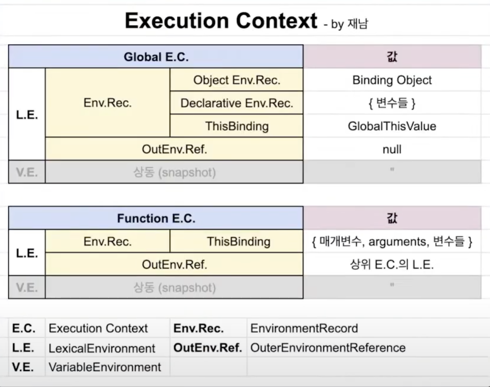
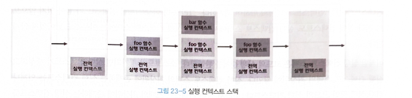
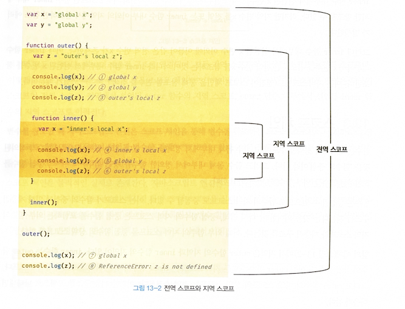

# 23. 실행 컨텍스트

> 실행 컨텍스트를 바르게 이해하면 알 수 있는 것들

- 자바스크립트가 스코프를 기반으로 식별자와 식별자에 바인딩된 값(식별자 바인딩)을 관리하는 방식
- 호이스팅이 발생하는 이유
- 클로저의 동작 방식
- 태스크 큐와 함께 동작하는 이벤트 핸들러와 비동기 처리의 동작방식

## 🐝 23-1 소스코드의 타입
> 소스코드를 4가지 타입으로 구분하는 이유는 소스코드의 타입에 따라 실행 컨텍스트를 생성하는 과정과 관리 내용이 다르기 때문

- [0]  1. 전역 코드 (global code)
- 전역 코드는 전역 변수를 관리하기 위해 최상위 스코프인 전역 스코프를 생성해야 한다.
- var 키워드로 선언된 전역 변수와 함수 선언문으로 정의된 전역 함수를 전역 객체의 프로퍼티와 메서드로 바인딩 하고 참조하기 위해 전역 객체와 연결 되어야 한다.
- 이를 위해 전역 코드가 평가되면 전역 실행 컨텍스트가 생성된다.

- [1]  2. 함수 코드 (function code)
- 함수 코드는 지역 스코프를 생성하고 지역 변수, 매개변수, arguments 객체를 관리해야 한다.
- 생성한 지역 스코프를 전역 스코프에서 시작하는 스코프 체인의 일원으로 연결해야 한다.
- 이를 위해 함수 코드가 평가되면 함수 실행 컨텍스트가 생성된다.

- [2]  3. eval 코드 (eval code)
- eval 코드는 strict mode (엄격 모드)에서 자신만의 독자적인 스코프를 생성한다.
- 이를 위해 eval 코드가 평가되면 eval 실행 컨텍스트가 생성된다.

- [3]  4. 모듈 코드 (module code)
- 모듈 코드는 모듈별로 독립적인 모듈 스코프를 생성한다.
- 이를 위해 모듈 코드가 평가되면 모듈 실행 컨텍스트가 생성된다.


## 🐌 23-2 소스코드의 평가와 실행
> 자바스크립트 엔진은 소스코드를 2개의 과정 "소스코드의 평가" 와 "소스코드의 실행" 과정으로 나누어 처리한다.


- [0]  1. 소스코드의 평가 (선언문)
- 실행 컨텍스트를 생성하고 변수, 함수 등의 선언문만 먼저 실행하여 생성된 변수나 함수 식별자를 키로 실행 컨텍스트가 관리하는 스코프에 등록 한다.

- [1] 2. 소스코드의 실행 (선언문 이외의 문)
- 선언문을 제외한 소스코드가 순차적으로 실행되기 시작한다. 즉, *런타임* 이 시작된다.
- 이때 소스코드 실행에 필요한 정보, 즉 변수나 함수의 참조를 실행 컨텍스트가 관리하는 스코프에서 검색해서 취득한다.
- 그리고 변수 값의 변경 등 소스코드의 실행 결과는 다시 실행 컨텍스트가 관리하 는 스코프에 등록된다.


## 🐙 23-3 실행 컨텍스트의 역할
```javascript
// 전역 변수 선언
const x = 1;
const y = 2;

// 함수 정의
function foo(a) {
  // 지역 변수 선언
  const x = 10;
  const y = 20;

  // 메서드 호출
  console.log(a + x + y); // 130
}

// 함수 호출
foo(100);

// 메서드 호출
console.log(x + y); // 3
```



- [n] comment
> 복습 필요

## 🐲 23-4 실행 컨텍스트 스택(호출 스택 call stack)
```javascript
const x = 1;

function foo () {
  const y = 2;

  function bar () {
    const z = 3;
    console.log(x + y + z);
  }
  bar();
}

foo(); // 6
```



- [n] comment
> 복습 필요


## 🐸 23-5 렉시컬 환경
- [n] comment
> 복습 필요

## 🐡 23-6 실행 컨텍스트의 생성과 식별자 검색 과정
- [n] comment
> 복습 필요


## 🐵 23-7 실행 컨텍스트와 블록 레벨 스코프
```javascript
let x = 1;

if (true) {
  let x = 10;
  console.log(x); // 10
}

console.log(x); // 1
```

- [n] comment
> 복습 필요


# 13. 스코프

## 🐠 13-1 스코프란?
```javascript
function add(x, y) {
  // 매개변수는 함수 몸체 내부에서만 참조할 수 있다.
  // 즉, 매개변수의 스코프(유효범위)는 함수 몸체 내부다.
  console.log(x, y); // 2 5
  return x + y;
}

add(2, 5);

// 매개변수는 함수 몸체 내부에서만 참조할 수 있다.
console.log(x, y); // ReferenceError: x is not defined
```

```javascript
var var1 = 1; // 코드의 가장 바깥 영역에서 선언한 변수

if (true) {
  var var2 = 2; // 코드 블록 내에서 선언한 변수
  if (true) {
    var var3 = 3; // 중첩된 코드 블록 내에서 선언한 변수
  }
}

function foo() {
  var var4 = 4; // 함수 내에서 선언한 변수

  function bar() {
    var var5 = 5; // 중첩된 함수 내에서 선언한 변수
  }
}

console.log(var1); // 1
console.log(var2); // 2
console.log(var3); // 3
console.log(var4); // ReferenceError: var4 is not defined
console.log(var5); // ReferenceError: var5 is not defined
```

> 모든 식별자(변수 이름, 함수 이름, 클래스 이름 등)는 자신이 선언된 위치에 의해 다른 코드가 식별자 자신을 참조할 수 있는 유효 범위가 결정된다. 이를 스코프라 한다. 즉, **스코프는 식별자가 유효한 범위** 를 말한다.

```javascript
var x = 'global';

function foo() {
  var x = 'local';
  console.log(x); // ①
}

foo();

console.log(x); // ②
```

> 스코프란 자바스크립트 엔진이 식별자를 검색할 때 사용하는 규칙이라고도 할 수 있다.


## 🐬 13-2 스코프의 종류

### 13-2-1 전역과 전역 스코프


## 🐟 13-3 스코프 체인

> OuterLexicalEnvirenmentReference로 인해서 상위의 LexicalEnvironment로 갈 수 있고 그걸 스코프 체인이라 한다.
- [n] comment
> 복습 필요

## 🐣 13-4 함수 레벨 스코프
```javascript
var x = 1;

if (true) {
  // var 키워드로 선언된 변수는 함수의 코드 블록(함수 몸체)만을 지역 스코프로 인정한다.
  // 함수 밖에서 var 키워드로 선언된 변수는 코드 블록 내에서 선언되었다 할지라도 모두 전역 변수다.
  // 따라서 x는 전역 변수다. 이미 선언된 전역 변수 x가 있으므로 x 변수는 중복 선언된다.
  // 이는 의도치 않게 변수 값이 변경되는 부작용을 발생시킨다.
  var x = 10;
}

console.log(x); // 10
```

> 코드 블록이 아닌 함수에 의해서만 지역 스코프가 생성된다는 의미
> **var 키워드로 선언된 변수는 오로지 함수의 코드 블록(함수 몸체)만을 지역 스코프로 인정한다.** 
> 이러한 특성을 함수 레벨 스코프(function level scope)라 한다.

```javascript
var i = 10;

// for 문에서 선언한 i는 전역 변수다. 이미 선언된 전역 변수 i가 있으므로 중복 선언된다.
for (var i = 0; i < 5; i++) {
  console.log(i); // 0 1 2 3 4
}

// 의도치 않게 변수의 값이 변경되었다.
console.log(i); // 5
```

> var 키워드로 선언된 변수는 블록 레벨 스코프(지역 스코프 생성)를 인정하지 않기 때문에 i 변수는 전역 변수가 된다. 따라서 전역 변수 1는 중복 선언되고 그 결과 의도치 않은 전역 변수의 값이 재할당된다.

## 🐶 13-5 렉시컬 스코프(lexical scope)
- 함수를 어디서 호출했는지에 따라 함수의 상위 스코프를 결정한다. (dynamic scope 동적 스코프)
- *함수를 어디서 정의했는지에 따라 함수의 상위 스코프를 결정한다. (lexical scopre 렉시컬 스코프)* 

> 자바스크립트는 렉시컬 스코프를 따르므로 함수를 어디서 호출했는지가 아니라 함수를 어디서 정의했는지에 따라 상위 스코프를 결정한다.
> 함수가 호출된 위치는 상위 스코프 결정에 어떠한 영향도 주지 않는다. 즉, 함 수의 상위 스코프는 언제나 자신이 정의된 스코프다.

