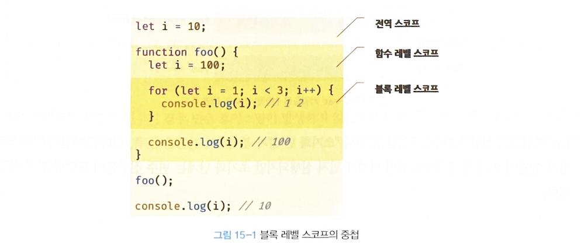

## 🦊 15-1 var 키워드로 선언한 변수의 문제점
- 변수 중복 선언 허용
- 함수 레벨 스코프
- 변수 호이스팅

## 🐱 15-2 let 키워드
### 15-2-1 변수 중복 선언 금지

### 15-2-2 블록 레벨 스코프
> 모든 코드 블록(함수, if 문, for 문, while 문, try/catch 문 등)을 지역 스코프로 인정하는 블록 레벨 스코프(block level scope)를 따른다

```javascript
let foo = 1; // 전역 변수

{
  let foo = 2; // 지역 변수
  let bar = 3; // 지역 변수
}

console.log(foo); // 1
console.log(bar); // ReferenceError: bar is not defined
```


### 15-2-3 변수 호이스팅
> *let 키워드* 로 선언한 변수는 선언 단계"와 "초기화 단계"가 분리되어 진행된다.

- [i] Information
일시적 사각지대(TDZ Temporal Dead Zone) : 스코프의 시작 지점부터 초기화 시작 지점까지 변수를 참조 할 수 없는 구간.

```javascript
// 런타임 이전에 선언 단계가 실행된다. 아직 변수가 초기화되지 않았다.
// 초기화 이전의 일시적 사각 지대에서는 변수를 참조할 수 없다.
console.log(foo); // ReferenceError: foo is not defined

let foo; // 변수 선언문에서 초기화 단계가 실행된다.
console.log(foo); // undefined

foo = 1; // 할당문에서 할당 단계가 실행된다.
console.log(foo); // 1
```


- [n] comment
>  위의 예제에서 블록 스코프에 있는 let foo는 호이스팅은 되지만, 실제로 선언된 let foo를 만나기 이전까지 TDZ에 갇히게 된다.


- [0] let 키워드로 선언한 변수는 변수 호이스팅이 발생하지 않는 것처럼 보인다.

```javascript
let foo = 1; // 전역 변수

{
  console.log(foo); // ReferenceError: Cannot access 'foo' before initialization
  let foo = 2; // 지역 변수
}
```

> 호이스팅이 발생하지 않는다면 1이 출력되어야 하지만 그렇지 않다.
> let 키워드로 선언한 변수도 여전히 호이스팅이 발생하기 때문에 참조 에러가 발생한다.
> ES6에서 도입된 let, const를 포함해서 모든 선언(var, let, const, function, function*, class 등)을 호이스팅한다.
> let, const, class를 사용한 선언문은 호이스팅이 발생하지 않는 것처럼 동작한다.

### 15-2-4 전역 객체와 let
> let 키워드로 선언한 전역 변수는 전역 객체 프로퍼티가 아니다.

```javascript
// 이 예제는 브라우저 환경에서 실행해야 한다.
let x = 1;

// let, const 키워드로 선언한 전역 변수는 전역 객체 window의 프로퍼티가 아니다.
console.log(window.x); // undefined
console.log(x); // 1
```


## 🐷 15-3 const 키워드

### 15-3-1 선언과 초기화
> const 키워드로 선언한 변수는 반드시 선언과 동시에 초기화 해야한다.

### 15-3-2 재할당 금지
> const키워드로 선언한 변수는 재할당이 금지 된다.

```javascript
const foo = 1;
foo = 2; // TypeError: Assignment to constant variable.
```

### 15-3-3 상수
> 상수는 재할당이 금지된 변수를 말한다.
> const 키워드로 선언된 변수에 원시 값을 할당한 경우 원시 값은 변경할 수 없는 값(immultable value)이고 const 키워드에 의해 재할당이 금지되므로 할당된 값을 변경할 수 있는 방법은 없다.

