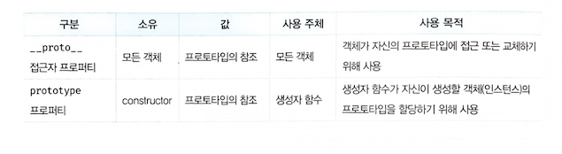
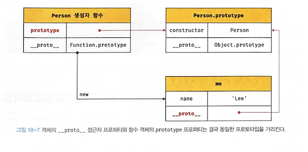
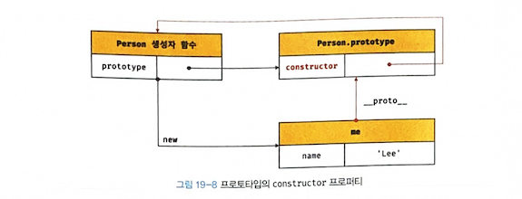
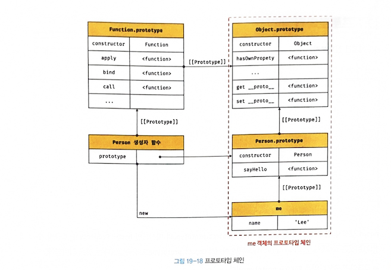
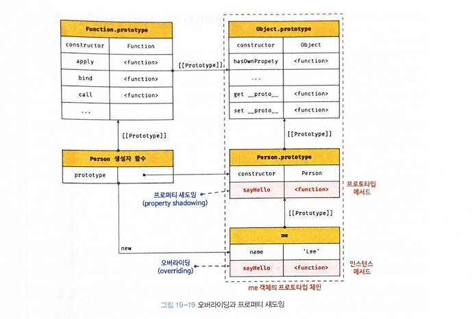
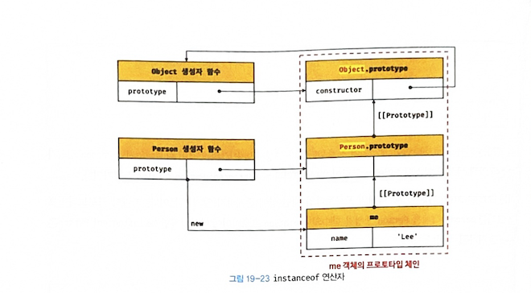

## 🐙 19-3 프로토타입 객체

### 19-3-2 함수 객체의 prototype 프로퍼티
> 함수 객체만이 소유하는 prototype 프로퍼티는 생성자 함수가 생성할 인스턴스의 프로토타입을 가리킨다.

```javascript
// 함수 객체는 prototype 프로퍼티를 소유한다.
(function () {}).hasOwnProperty('prototype'); // -> true

// 일반 객체는 prototype 프로퍼티를 소유하지 않는다.
({}).hasOwnProperty('prototype'); // -> false
```

- 모든 객체가 가지고 있는(엄밀히 말하면 0bject.prototype으로부터 상속받은) `__proto__` 접근자 프로퍼 티와 함수 객체만이 가지고 있는 prototype 프로퍼티는 결국 동일한 프로토타입을 가리킨다.



```javascript
// 생성자 함수
function Person(name) {
  this.name = name;
}

const me = new Person('Lee');

// 결국 Person.prototype과 me.__proto__는 결국 동일한 프로토타입을 가리킨다.
console.log(Person.prototype === me.__proto__);  // true
console.log(Person.prototype === Object.getPrototypeOf(me)); // true
```


### 19-3-3 프로토타입의 constructor 프로퍼티와 생성자 함수

```javascript
// 생성자 함수
function Person(name) {
  this.name = name;
}

const me = new Person('Lee');

// me 객체의 생성자 함수는 Person이다.
console.log(me.constructor === Person);  // true
console.log(Person.prototype.constructor === Person); // true
console.log(me.__proto__.constructor === Person); // true

const you = new me.constructor('Kim'); // Person {name: 'Kim'}
```



- Person 생성자 함수는 me 객체를 생성했다.
- me 객체는 프로토타입의 constructor 프로퍼티를 통해 생성자 함수와 연결된다.
- me 객체에는 constructor 프로퍼티가 없지만 me 객체의 프로토타입인 Person.prototype에는 constructor 프로퍼티가 있다.
- me 객체는 프로토타입인 Person. prototype의 constructor 프로퍼티를 상속받아 사용할 수 있다.


## 🌻 19-4 리터럴 표기법에 의해 생성된 객체의 생성자 함수와 프로토타입
- [n] comment
> 복습 필요


## 🌼 19-7 프로토타입 체인
```javascript
function Person(name) {
  this.name = name;
}

// 프로토타입 메서드
Person.prototype.sayHello = function () {
  console.log(`Hi! My name is ${this.name}`);
};

const me = new Person('Lee');

// hasOwnProperty는 Object.prototype의 메서드다.
console.log(me.hasOwnProperty('name')); // true
```

- me 객체는 0bject.prototype의 메서드인 hasownProperty를 호출할 수 있다.
- me 객체가 Person.prototype뿐만 아니라 0bject.prototype도 상속받았다는 것
- me 객체의 프로토타입은 Person. prototype

```javascript
Object.getPrototypeOf(me) === Person.prototype; // -> true
```

```javascript
Object.getPrototypeOf(Person.prototype) === Object.prototype; // -> true
```



> 자바스크립트는 객체의 프로퍼티(메서드 포함)에 접근하려고 할 때 해당 객체에 접근하려는 프로퍼티가 없 다면 `[[Prototype]]`  내부 슬롯의 참조를 따라 자신의 부모 역할을 하는 프로토타입의 프로퍼티를 순차적으 로 검색한다. 이를 *프로토타입 체인* 이라 한다.


## 🍀 19-8 오버라이딩과 프로퍼티 섀도잉
```javascript
const Person = (function () {
  // 생성자 함수
  function Person(name) {
    this.name = name;
  }

  // 프로토타입 메서드
  Person.prototype.sayHello = function () {
    console.log(`Hi! My name is ${this.name}`);
  };

  // 생성자 함수를 반환
  return Person;
}());

const me = new Person('Lee');

// 인스턴스 메서드
me.sayHello = function () {
  console.log(`Hey! My name is ${this.name}`);
};

// 인스턴스 메서드가 호출된다. 프로토타입 메서드는 인스턴스 메서드에 의해 가려진다.
me.sayHello(); // Hey! My name is Lee
```



> 인스턴스 메서드 sayHello는 프로토타입 메서드 sayHello를 *오버라이딩* 했고
> 상속 관계에 의해 프로퍼티가 가려지는 현상(오버라이딩)을 *프로퍼티 섀도잉(property shadowing)* 이라 한다.

```javascript
// 인스턴스 메서드를 삭제한다.
delete me.sayHello;
// 인스턴스에는 sayHello 메서드가 없으므로 프로토타입 메서드가 호출된다.
me.sayHello(); // Hi! My name is Lee

// 프로토타입 체인을 통해 프로토타입 메서드가 삭제되지 않는다.
delete me.sayHello;
// 프로토타입 메서드가 호출된다.
me.sayHello(); // Hi! My name is Lee
```

- [!] 중요
> 프로토타입 프로퍼티를 변경 또는 삭제하려면 하위 객체를 통해 프로토타입 체인으로 접근하는 것이 아니라 프로토타입에 직접 접근해야 한다.


## 🌷 19-9 프로토타입의 교체

### 19-9-1 생성자 함수에 의한 프로토타입의 교체
```javascript
const Person = (function () {
  function Person(name) {
    this.name = name;
  }

  // ① 생성자 함수의 prototype 프로퍼티를 통해 프로토타입을 교체
  Person.prototype = {
    sayHello() {
      console.log(`Hi! My name is ${this.name}`);
    }
  };

  return Person;
}());

const me = new Person('Lee');
```

- ①에서 Person. prototype에 객체 리터럴을 할당했다.


> 프로토타입으로 교체한 객체 리터럴에는 constructor 프로퍼티가 없다.

```javascript
// 프로토타입을 교체하면 constructor 프로퍼티와 생성자 함수 간의 연결이 파괴된다.
console.log(me.constructor === Person); // false
// 프로토타입 체인을 따라 Object.prototype의 constructor 프로퍼티가 검색된다.
console.log(me.constructor === Object); // true
```

### 19-9-2 인스턴스에 의한 프로토타입 교체
> 인스턴스의 `__proto__` 접근자 프로퍼티(또는 0bject.setPrototypeOf 메서드)를 통해 프로토타입을 교체할 수 있다.

```javascript
function Person(name) {
  this.name = name;
}

const me = new Person('Lee');

// 프로토타입으로 교체할 객체
const parent = {
  sayHello() {
    console.log(`Hi! My name is ${this.name}`);
  }
};

// ① me 객체의 프로토타입을 parent 객체로 교체한다.
Object.setPrototypeOf(me, parent);
// 위 코드는 아래의 코드와 동일하게 동작한다.
// me.__proto__ = parent;

me.sayHello(); // Hi! My name is Lee
```

- ①에서 me 객체의 프로토타입을 parent 객체로 교체했다.


> 프로토타입으로 교체한 객체에는 constructor 프로퍼티가 없으므로 constructor 프로퍼티와 생성자 함수 간의 연결이 파괴된다.

```javascript
// 프로토타입을 교체하면 constructor 프로퍼티와 생성자 함수 간의 연결이 파괴된다.
console.log(me.constructor === Person); // false
// 프로토타입 체인을 따라 Object.prototype의 constructor 프로퍼티가 검색된다.
console.log(me.constructor === Object); // true
```

- 생성자 함수에 의한 프로토타입 교체와 인스턴스에 의한 프로토타입 교체의 차이점


- [n] comment
> 코드로 나타내면 아래처럼으로 예시를 보면 이해가 잘된다.

```javascript
// 생성자 함수의 prototype 교체
const Person = (function () {
  function Person(name) {
    this.name = name;
  }

  // ① 생성자 함수의 prototype 프로퍼티를 통해 프로토타입을 교체
  Person.prototype = {
    sayHello() {
      console.log(`Hi! My name is ${this.name}`);
    }
  };

  return Person;
}());

const me = new Person('Lee');
me.sayHello();  // -> Hi! My name is Lee
const me2 = new Person('Lee');
me2.sayHello(); // -> Hi! My name is Lee
const me3 = new Person('Lee');
me3.sayHello(); // -> Hi! My name is Lee


// 인스턴스에 의한 프로토타입 교체
function Person(name) {
  this.name = name;
}

const me = new Person('Lee');
const me2 = new Person('Lee');
const me3 = new Person('Lee');

// 프로토타입으로 교체할 객체
const parent = {
  sayHello() {
    console.log(`Hi! My name is ${this.name}`);
  }
};

// ① me 객체의 프로토타입을 parent 객체로 교체한다.
Object.setPrototypeOf(me, parent);
// 위 코드는 아래의 코드와 동일하게 동작한다.
// me.__proto__ = parent;

me.sayHello(); // Hi! My name is Lee
me2.sayHello(); // Error: m2.sayHello is not a function
me3.sayHello(); // Error: m3.sayHello is not a function
```

- [!] 중요
> 1. 생성자 함수의 prototype 프로퍼티에 다른 임의의 객체를 바인딩하는 것은 미래에 생성할 인스턴스의 프로 토타입을 교체하는 것이다.
> 2. `__proto__`  접근자 프로퍼티를 통해 프로토타입을 교체하는 것은 이미 생성된 객체의 프로토타입을 교체 하는 것이다.


## 🍁 19-10 instanceof 연산자
```javascript
객체 instanceof 생성자 함수
```

```javascript
// 생성자 함수
function Person(name) {
  this.name = name;
}

const me = new Person('Lee');

// Person.prototype이 me 객체의 프로토타입 체인 상에 존재하므로 true로 평가된다.
console.log(me instanceof Person); // true

// Object.prototype이 me 객체의 프로토타입 체인 상에 존재하므로 true로 평가된다.
console.log(me instanceof Object); // true
```

- instanceof 연산자가 어떻게 동작 하는지

```javascript
// 생성자 함수
function Person(name) {
  this.name = name;
}

const me = new Person('Lee');

// 프로토타입으로 교체할 객체
const parent = {};

// 프로토타입의 교체
Object.setPrototypeOf(me, parent);

// Person 생성자 함수와 parent 객체는 연결되어 있지 않다.
console.log(Person.prototype === parent); // false
console.log(parent.constructor === Person); // false

// Person.prototype이 me 객체의 프로토타입 체인 상에 존재하지 않기 때문에 false로 평가된다.
console.log(me instanceof Person); // false

// Object.prototype이 me 객체의 프로토타입 체인 상에 존재하므로 true로 평가된다.
console.log(me instanceof Object); // true

// parent 객체를 Person 생성자 함수의 prototype 프로퍼티에 바인딩한다.
Person.prototype = parent;

// Person.prototype이 me 객체의 프로토타입 체인 상에 존재하므로 true로 평가된다.
console.log(me instanceof Person); // true

// Object.prototype이 me 객체의 프로토타입 체인 상에 존재하므로 true로 평가된다.
console.log(me instanceof Object); // true
```

- [!] 중요
> instanceof 연산자는 프로토타입의 constructor 프로퍼티가 가리키는 생성자 함수를 찾는 것이 아니라 **생성자 함수의 prototype에 바인딩된 객체가 프로토타입 체인 상에 존재하는지**  확인한다.



```javascript
const Person = (function () {
  function Person(name) {
    this.name = name;
  }

  // 생성자 함수의 prototype 프로퍼티를 통해 프로토타입을 교체
  Person.prototype = {
    sayHello() {
      console.log(`Hi! My name is ${this.name}`);
    }
  };

  return Person;
}());

const me = new Person('Lee');

// constructor 프로퍼티와 생성자 함수 간의 연결은 파괴되어도 instanceof는 아무런 영향을 받지 않는다.
console.log(me.constructor === Person); // false

// Person.prototype이 me 객체의 프로토타입 체인 상에 존재하므로 true로 평가된다.
console.log(me instanceof Person); // true
// Object.prototype이 me 객체의 프로토타입 체인 상에 존재하므로 true로 평가된다.
console.log(me instanceof Object); // true
```

> 생성자 함수에 의해 프로토타입이 교체되어 constructor 프로퍼티와 생성자 함수 간의 연결이 파괴 되어도 생성자 함수의 prototype 프로퍼티와 프로토타입 간의 연결은 파괴되지 않으므로 instanceof는 아무런 영향을 받지 않는다.


## 🍉 19-13 프로퍼티 존재 확인

### 19-13-1 in 연산자

```javascript
/**
* key : 프로퍼티 키를 나타내는 문자열
* object: 객체로 평가되는 표현식
*/
key in object
```

- [!] 중요
> in을 사용할 때 확인 대상 객체가 상속받은 모든 프로토타입의 프로퍼티를 확인.
> 즉, 프로토타입 체인상에 있는 모든 프로퍼티를 확인한다.

```javascript
const person = {
  name: 'Lee',
  address: 'Seoul'
};

// person 객체에 name 프로퍼티가 존재한다.
console.log('name' in person);    // true
// person 객체에 address 프로퍼티가 존재한다.
console.log('address' in person); // true
// person 객체에 age 프로퍼티가 존재하지 않는다.
console.log('age' in person);     // false


console.log('toString' in person); // true
```

> tostring은 0bject.prototype의 메서드다. Object.prototype은 객체의 제일 최상위의 프로토타입이다.
> 즉 person객체는 `[[Prototype]]` 내부 슬롯으로 Object.prototype과 프로토 타입 체인으로 연결 되어 있다.
> 

- [n] comment
> in 연산자의 단점을 해결 하는 방법

```javascript
const Person = function(name){ this.name = name };
Person.prototype = {
	age(){},
	getName(){}
}

const person = new Person('bro');
for(let key in person){ console.log(key);}
// -> name age getName
```

> toString은 Object.prototype의 프로퍼티이고 열거 되지 않는다.
> 하지만 Person의 age와 getName을 열거 대상이다.
> {age: ƒ, getName: ƒ} 이렇게 나온다.
> 이렇게 for in 문을 돌리면 열거 대상은 나오기 때문에 자기 자신것만 출력 하려면 아래와 같이 안전장치를 해주어야 한다.

```javascript
const Person = function(name){ this.name = name };
Person.prototype = {
	age(){},
	getName(){}
}

const person = new Person('bro');
for(let key in person){
	if(person.hasOwnProperty(key)){
		console.log(key);
	}
}
// -> name
```

> 해당 방법으로 in 연산자의 단점인 프로토타입 체인상의 모든 프로퍼티를 가져오는 단점을 해결할 수 있다.


## 🍊 19-14 프로퍼티 열거

### 19-14-1 for ... in 문

```javascript
const person = {
  name: 'Lee',
  address: 'Seoul'
};

// in 연산자는 객체가 상속받은 모든 프로토타입의 프로퍼티를 확인한다.
console.log('toString' in person); // true

// for...in 문도 객체가 상속받은 모든 프로토타입의 프로퍼티를 열거한다.
// 하지만 toString과 같은 Object.prototype의 프로퍼티가 열거되지 않는다.
for (const key in person) {
  console.log(key + ': ' + person[key]);
}

// name: Lee
// address: Seoul
```

> 0bject.prototype.string 프로퍼티의 프로퍼티 어트리뷰트 `[[Enumerable]]`의 값이 false이기 때문이다.

- [!] 중요
> for ... in 문은 객체의 프로토타입 체인 상에 존재하는 모든 프로토타입의 프로퍼티 중에서 프로퍼티 어트리 뷰트 `[[Enumerable]]` 의 값이 true인 프로퍼티를 순회하며 열거enumeration한다.


- [!] 중요
- for .. in 문은 프로퍼티를 열거할 때 순서를 보장하지 않는다.
- 배열에는 for .. in 문을 사용하지 말고 일반적인 for 문이나 for ... of 문 또는 Array.prototype.forEach 메서드를 사용하기를 권장한다.

```javascript
const arr = [1, 2, 3];
arr.x = 10; // 배열도 객체이므로 프로퍼티를 가질 수 있다.

for (const i in arr) {
  // 프로퍼티 x도 출력된다.
  console.log(arr[i]); // 1 2 3 10
};

// arr.length는 3이다.
for (let i = 0; i < arr.length; i++) {
  console.log(arr[i]); // 1 2 3
}

// forEach 메서드는 요소가 아닌 프로퍼티는 제외한다.
arr.forEach(v => console.log(v)); // 1 2 3

// for...of는 변수 선언문에서 선언한 변수에 키가 아닌 값을 할당한다.
for (const value of arr) {
  console.log(value); // 1 2 3
};
```

- [n] comment
> 결론적으로 for ... in 구려
### 19-14-2 Object.keys/ values / entries 메서드
```javascript
const person = {
  name: 'Lee',
  address: 'Seoul',
  __proto__: { age: 20 }
};

console.log(Object.keys(person)); // ["name", "address"]
console.log(Object.values(person)); // ["Lee", "Seoul"]
console.log(Object.entries(person)); // [["name", "Lee"], ["address", "Seoul"]]

Object.entries(person).forEach(([key, value]) => console.log(key, value));
/*
name Lee
address Seoul
*/
```

