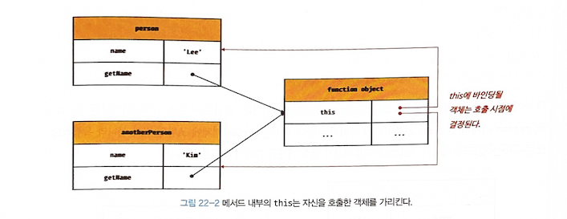
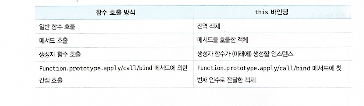

## 🦊 22-1 this 키워드

- this는 자신이 속한 객체 또는 자신이 생성할 인스턴스를 가리키는 자기 참조 변수(self-referencing variable)이다.
- this를 통해 자신이 속한 객체 또는 자신이 생성할 인스턴스의 프로퍼티나 메서드를 참조할 수 있다.
- this가 가리키는 값, 즉 this 바인딩은 함수 호출 방식에 의해 동적으로 결정된다.

```javascript
function Circle(radius) {
  // 이 시점에는 생성자 함수 자신이 생성할 인스턴스를 가리키는 식별자를 알 수 없다.
  ????.radius = radius;
}

Circle.prototype.getDiameter = function () {
  // 이 시점에는 생성자 함수 자신이 생성할 인스턴스를 가리키는 식별자를 알 수 없다.
  return 2 * ????.radius;
};

// 생성자 함수로 인스턴스를 생성하려면 먼저 생성자 함수를 정의해야 한다.
const circle = new Circle(5);
```

> 생성자 함수로 인스턴스를 생성하려면 먼저 생성자 함수가 존재해야 한다.
> 생성자 함수를 정의하는 시점에는 아직 인스턴스를 생성하기 이전이므로 생성자 함수가 생성할 인스턴스를 가리키는 식별자를 알 수 없다.


- 객체 리터럴

```javascript
// 객체 리터럴
const circle = {
  radius: 5,
  getDiameter() {
    // this는 메서드를 호출한 객체를 가리킨다.
    return 2 * this.radius;
  }
};

console.log(circle.getDiameter()); // 10
```

> this는 메서드를 호출한 객체, 즉 circle을 가리킨다.


- 생성자 함수

```javascript
// 생성자 함수
function Circle(radius) {
  // this는 생성자 함수가 생성할 인스턴스를 가리킨다.
  this.radius = radius;
}

Circle.prototype.getDiameter = function () {
  // this는 생성자 함수가 생성할 인스턴스를 가리킨다.
  return 2 * this.radius;
};

// 인스턴스 생성
const circle = new Circle(5);
console.log(circle.getDiameter()); // 10
```

> 생성자 함수 내부의 this는 생성자 함수가 생성할 인스턴스를 가리킨다.


## 🐱 22-2 함수 호출 방식과 this 바인딩
> this 바인딩(this에 바인딩될 값)은 함수 호출 방식, 즉 함수가 어떻게 호출되었는지에 따라 동적으로 결정 된다.

- [!] 중요
> *렉시컬 스코프와 this 바인딩은 결정 시기가 다르다.* 
> 함수의 상위 스코프를 결정하는 방식인 레시컬 스코프(lexical scope)는 함수 정의가 평가되어 함수 객체가 생성되는 시점에 상위 스코프를 결정한다. 하지만 this 바인딩은 함수 호출 시점에 결정된다.


- 함수도 다양한 방식으로 호출할 수 있다.

1. 일반 함수 호출
2. 메서드 호출
3. 생성자 함수 호출
4. Function.prototype.apply/call/bind 메서드에 의한 간접 호출

```javascript
// this 바인딩은 함수 호출 방식에 따라 동적으로 결정된다.
const foo = function () {
  console.dir(this);
};

// 동일한 함수도 다양한 방식으로 호출할 수 있다.

// 1. 일반 함수 호출
// foo 함수를 일반적인 방식으로 호출
// foo 함수 내부의 this는 전역 객체 window를 가리킨다.
foo(); // window

// 2. 메서드 호출
// foo 함수를 프로퍼티 값으로 할당하여 호출
// foo 함수 내부의 this는 메서드를 호출한 객체 obj를 가리킨다.
const obj = { foo };
obj.foo(); // obj

// 3. 생성자 함수 호출
// foo 함수를 new 연산자와 함께 생성자 함수로 호출
// foo 함수 내부의 this는 생성자 함수가 생성한 인스턴스를 가리킨다.
new foo(); // foo {}

// 4. Function.prototype.apply/call/bind 메서드에 의한 간접 호출
// foo 함수 내부의 this는 인수에 의해 결정된다.
const bar = { name: 'bar' };

foo.call(bar);   // bar
foo.apply(bar);  // bar
foo.bind(bar)(); // bar
```


### 22-2-1 일반 함수 호출
> 기본적으로 this에는 전역 객체 (global object)가 바인딩된다.

```javascript
function foo() {
  console.log("foo's this: ", this);  // window
  function bar() {
    console.log("bar's this: ", this); // window
  }
  bar();
}
foo();
```

> 일반 함수로 호출하면 함수 내부의 this에는 전역 객체가 바인딩된다.

```javascript
// var 키워드로 선언한 전역 변수 value는 전역 객체의 프로퍼티다.
var value = 1;
// const 키워드로 선언한 전역 변수 value는 전역 객체의 프로퍼티가 아니다.
// const value = 1;

const obj = {
  value: 100,
  foo() {
    console.log("foo's this: ", this);  // {value: 100, foo: ƒ}
    console.log("foo's this.value: ", this.value); // 100

    // 메서드 내에서 정의한 중첩 함수
    function bar() {
      console.log("bar's this: ", this); // window
      console.log("bar's this.value: ", this.value); // 1
    }

    // 메서드 내에서 정의한 중첩 함수도 일반 함수로 호출되면 중첩 함수 내부의 this에는 전역 객체가 바인딩된다.
    bar();
  }
};

obj.foo();
```

> 메서드 내에서 정의한 중첩 함수도 일반 함수로 호출되면 중첩 함수 내부의 this에는 전역 객체가 바인딩된다.

```javascript
var value = 1;

const obj = {
  value: 100,
  foo() {
    console.log("foo's this: ", this); // {value: 100, foo: ƒ}
    // 콜백 함수 내부의 this에는 전역 객체가 바인딩된다.
    setTimeout(function () {
      console.log("callback's this: ", this); // window
      console.log("callback's this.value: ", this.value); // 1
    }, 100);
  }
};

obj.foo();
```

> 콜백 함수가 일반 함수로 호출된다면 콜백 함수 내부의 this에도 전역 객체가 바인딩된다.

> 이처럼 일반 함수로 호출된 모든 함수(중첩 함수, 콜백 함수 포함) 내부의 this에는 전역 객체가 바인딩된다.


### 22-2-2 메서드 호출
> 메서드를 호출할 때 메서드 이름 앞의 마침표(.) 연산자 앞에 기술한 객체가 바인딩된다.
> 메서드 내부의 this는 메서드를 소유한 객체가 아닌 메서드를 호출한 객체에 바인딩된다는 것이다.

```javascript
const person = {
  name: 'Lee',
  getName() {
    // 메서드 내부의 this는 메서드를 호출한 객체에 바인딩된다.
    return this.name;
  }
};

// 메서드 getName을 호출한 객체는 person이다.
console.log(person.getName()); // Lee
```


> getName 메서드는 다른 객체의 프로퍼티에 할당하는 것 으로 다른 객체의 메서드가 될 수도 있고 일반 변수에 할당하여 일반 함수로 호출될 수도 있다.

```javascript
const anotherPerson = {
  name: 'Kim'
};
// getName 메서드를 anotherPerson 객체의 메서드로 할당
anotherPerson.getName = person.getName;

// getName 메서드를 호출한 객체는 anotherPerson이다.
console.log(anotherPerson.getName()); // Kim

// getName 메서드를 변수에 할당
const getName = person.getName;

// getName 메서드를 일반 함수로 호출
console.log(getName()); // ''
// 일반 함수로 호출된 getName 함수 내부의 this.name은 브라우저 환경에서 window.name과 같다.
// 브라우저 환경에서 window.name은 브라우저 창의 이름을 나타내는 빌트인 프로퍼티이며 기본값은 ''이다.
// Node.js 환경에서 this.name은 undefined다.
```



- [n] comment
> 객체에 존재하는 메소드는 객체에 포함된것이 아니라 독립적으로 있는거구나, 중요한게 결국 this는 메서드를 호출한 객체에 바인딩 된다.
> 그렇다면 class도 객체니까 class로 해보면 어떻게 될까?

```javascript
const person = {
  name: 'Lee',
  getName() {
    return this.name;
  }
};
console.log(person); // -> {name: 'Lee', getName: ƒ}

// 2. class로 해보기
class Person{
  name = "Lee"
    getName(){
      return this.name;
    }
}

const person = new Person();
console.log(person); // -> Person {name: 'Lee'}

// 3. static class로 일반함수 만들어보기
class StaticPerson{
  static name = "Lee"
    static getName(){
      return this.name;
    }
}

const getName = StaticPerson.getName; // Uncaught TypeError: Cannot read properties of undefined (reading 'name') 에러 발생
console.log(getName());

// 4. static class의 메소드 화살표 함수로 변경 잘됨.
class StaticPerson{
  static name = "Lee"
  
    static getName = () => {
      return this.name;
    }
}
const getName = StaticPerson.getName;
console.log(getName()); // -> Lee

// 5. 일반 class 메소드 화살표 함수로 변경 잘됨.
class Person{
  name = "Lee"
    getName = () => {
      return this.name;
    }
}

const person = new Person();
const getName = person.getName;
console.log(getName()); // -> Lee
```

> 정리
> 메소드에서 일반 함수로 변경하여 호출하면 this가 메서드를 호출한 객체에 바인딩되기 때문에 `getName`을 일반 함수로 호출했기 때문에 함수 내부의 `this`는 호출 시점의 컨텍스트를 가리키는데, 이 경우에는 전역 객체 (global object)가 된다. 그래서 this.name 프로퍼티를 찾을 수 없어서 에러가 발생.
> 메소드를 화살표 함수로 정의 했을때는 화살표 함수는 함수가 정의된 시점에서의 `this` 는 `StaticPerson` 클래스를 가리킨다.

- 함수 호출 방식에 따라 this 바인딩이 동적으로 결정된다.




