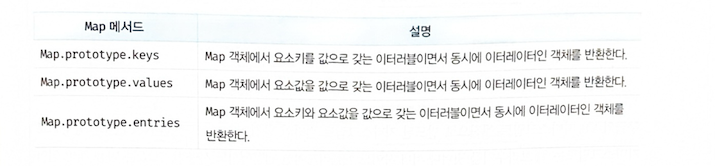

## 🐸 37-1 Set
> Set 객체는 중복되지 않는 유일한 값들의 집합(set)이다.


### 37-1-1 Set 객체의 생성
> Set 객체는 Set 생성자 함수로 생성한다.
> Set 생성자 함수에 인수를 전달하지 않으면 빈 Set 객체가 생성된다.

```javascript
const set1 = new Set([1, 2, 3, 3]);
console.log(set1); // Set(3) {1, 2, 3}

const set2 = new Set('hello');
console.log(set2); // Set(4) {"h", "e", "l", "o"}
```

> **Set 생성자 함수는 이터러블을 인수로 전달받아 Set 객체를 생성한다.**
> **이때 이터러블의 중복된 값은 Set 객 체에 요소로 저장되지 않는다.** 

```javascript
// 배열의 중복 요소 제거
const uniq = array => array.filter((v, i, self) => self.indexOf(v) === i);
console.log(uniq([2, 1, 2, 3, 4, 3, 4])); // [2, 1, 3, 4]

// Set을 사용한 배열의 중복 요소 제거
const uniq = array => [...new Set(array)];
console.log(uniq([2, 1, 2, 3, 4, 3, 4])); // [2, 1, 3, 4]
```

- [n] comment
> 나같은 경우에 set자료형을 보통 코딩 테스트때 스프레드 연산자와 함께 중복 제거를 할 때 사용한다.

```javascript
const uniqueArray = [...new Set([1,2,3,3,3,4,5])];
console.log(uniqueArray); // -> [1, 2, 3, 4, 5]
```


### 37-1-2 요소 개수 확인
> size 프로퍼티는 setter 함수 없이 getter 함수만 존재하는 접근자 프로퍼티다.

```javascript
const set = new Set([1, 2, 3]);

console.log(Object.getOwnPropertyDescriptor(Set.prototype, 'size'));
// {set: undefined, enumerable: false, configurable: true, get: ƒ}

set.size = 10; // 무시된다.
console.log(set.size); // 3
```

- [n] comment
> setter가 존재 하지않아서 size 프로퍼티를 변경 할 수 없는데 그렇다고 에러가 발생하진 않는다.


### 37-1-3 요소 추가
> add 메서드는 새로운 요소가 추가된 Set 객체를 반환한다.
> add 메서드를 연속적으로 호출(*method chaning* ) 할 수 있다.

```javascript
const set = new Set();

set.add(1).add(2).add(2);
console.log(set); // Set(2) {1, 2}
```


### 37-1-4 요소 존재 여부 확인
```javascript
const set = new Set([1, 2, 3]);

console.log(set.has(2)); // true
console.log(set.has(4)); // false
```

> has 메서드는 특정 요소의 존재 여부를 나타내는 불리언 값을 반환한다.

### 37-1-5 요소 삭제
> delete 메서드는 삭제 성공 여부를 나타내는 불리언 값을 반환한다.
> delete 메서드에는 인덱스가 아니라 삭제하려는 요소값을 인수로 전달해야 한다.
> Set 객체는 순서에 의미가 없다.
> 배열과 같이 인덱스를 갖지 않는다.
> 연속적으로 호출(*method chaning* ) 불가하다!

```javascript
const set = new Set([1, 2, 3]);

// 요소 2를 삭제한다.
set.delete(2);
console.log(set); // Set(2) {1, 3}

// 요소 1을 삭제한다.
set.delete(1);
console.log(set); // Set(1) {3}

const set = new Set([1, 2, 3]);

// 존재하지 않는 요소 0을 삭제하면 에러없이 무시된다.
set.delete(0);
console.log(set); // Set(3) {1, 2, 3}
```

### 37-1-6 요소 일괄 삭제
> Set 객체의 모든 요소를 일괄 삭제하려면 Set.prototype.clear 메서드를 사용한다.

```javascript
const set = new Set([1, 2, 3]);

set.clear();
console.log(set); // Set(0) {}
```

### 37-1-7 요소 순회
> set 객체의 요소를 순회하려면 Set.prototype.forEach 메서드를 사용한다.
> **Set.prototype.forEach 메서드는 Array.prototype.forEach 메서드와 유사하게**  콜백 함수와 forEach 메서드의 콜백 함수 내부에서 this로 사용될 객체(옵션)를 인수로 전달한다.


- Set.prototype.forEach 메서드의 3가지 인수

- [0] 1. 첫 번째 인수 : 현재 순회 중인 요소값

- [1] 2. 두 번째 인수 : 현재 순회 중인 요소값

- [2] 3. 세 번째 인수 : 현재 순회 중인 Set 객체 자체

```javascript
const set = new Set([1, 2, 3]);

set.forEach((v, v2, set) => console.log(v, v2, set));
/*
1 1 Set(3) {1, 2, 3}
2 2 Set(3) {1, 2, 3}
3 3 Set(3) {1, 2, 3}
*/
```

> 첫 번째 인수와 두 번째 인수는 같은 값이다.
> 이처럼 동작하는 이유는 Array.prototype.forEach 메서드와 인터페이스를 통일하기 위함이며 다른 의미는 없다.
> Set 객체는 순서에 의미가 없어 배열과 같이 인덱스를 갖지 않는다.


- Set 객체는 이터러블이다.

> for ... of 문
> 스프레드 문법
> 배열 디스트럭처링의
> 가능하다.

```javascript
const set = new Set([1, 2, 3]);

// Set 객체는 Set.prototype의 Symbol.iterator 메서드를 상속받는 이터러블이다.
console.log(Symbol.iterator in set); // true

// 이터러블인 Set 객체는 for...of 문으로 순회할 수 있다.
for (const value of set) {
  console.log(value); // 1 2 3
}

// 이터러블인 Set 객체는 스프레드 문법의 대상이 될 수 있다.
console.log([...set]); // [1, 2, 3]

// 이터러블인 Set 객체는 배열 디스트럭처링 할당의 대상이 될 수 있다.
const [a, ...rest] = [...set];
console.log(a, rest); // 1, [2, 3]
```


### 37-1-8 집합 연산
> Set 객체는 수학적 집합을 구현하기 위한 자료구조다.
> Set 객체를 통해 교집합, 합집합, 차집합 등을 구현할 수 있다.


- [0] 교집합

- 방법 1 for... of와 has와 add를 이용

```javascript
Set.prototype.intersection = function (set) {
  const result = new Set();

  for (const value of set) {
    // 2개의 set의 요소가 공통되는 요소이면 교집합의 대상이다.
    if (this.has(value)) result.add(value);
  }

  return result;
};

const setA = new Set([1, 2, 3, 4]);
const setB = new Set([2, 4]);

// setA와 setB의 교집합
console.log(setA.intersection(setB)); // Set(2) {2, 4}
// setB와 setA의 교집합
console.log(setB.intersection(setA)); // Set(2) {2, 4}
```

- 방법 2 스프레드 연산자 이용

```javascript
Set.prototype.intersection = function (set) {
  return new Set([...this].filter(v => set.has(v)));
};

const setA = new Set([1, 2, 3, 4]);
const setB = new Set([2, 4]);

// setA와 setB의 교집합
console.log(setA.intersection(setB)); // Set(2) {2, 4}
// setB와 setA의 교집합
console.log(setB.intersection(setA)); // Set(2) {2, 4}
```


- [1] 합집합

- 방법 1 for... of와  add를 이용

```javascript
Set.prototype.union = function (set) {
  // this(Set 객체)를 복사
  const result = new Set(this);

  for (const value of set) {
    // 합집합은 2개의 Set 객체의 모든 요소로 구성된 집합이다. 중복된 요소는 포함되지 않는다.
    result.add(value);
  }

  return result;
};

const setA = new Set([1, 2, 3, 4]);
const setB = new Set([2, 4]);

// setA와 setB의 합집합
console.log(setA.union(setB)); // Set(4) {1, 2, 3, 4}
// setB와 setA의 합집합
console.log(setB.union(setA)); // Set(4) {2, 4, 1, 3}
```

- 방법 2 스프레드 연산자 이용

```javascript
Set.prototype.union = function (set) {
  return new Set([...this, ...set]);
};

const setA = new Set([1, 2, 3, 4]);
const setB = new Set([2, 4]);

// setA와 setB의 합집합
console.log(setA.union(setB)); // Set(4) {1, 2, 3, 4}
// setB와 setA의 합집합
console.log(setB.union(setA)); // Set(4) {2, 4, 1, 3}
```


- [2] 차집합

- 방법 1 for... of와 delete를 이용

```javascript
Set.prototype.difference = function (set) {
  // this(Set 객체)를 복사
  const result = new Set(this);

  for (const value of set) {
    // 차집합은 어느 한쪽 집합에는 존재하지만 다른 한쪽 집합에는 존재하지 않는 요소로 구성된 집합이다.
    result.delete(value);
  }

  return result;
};

const setA = new Set([1, 2, 3, 4]);
const setB = new Set([2, 4]);

// setA에 대한 setB의 차집합
console.log(setA.difference(setB)); // Set(2) {1, 3}
// setB에 대한 setA의 차집합
console.log(setB.difference(setA)); // Set(0) {}
```

- 방법 2 스프레드 연산자 이용

```javascript
Set.prototype.difference = function (set) {
  return new Set([...this].filter(v => !set.has(v)));
};

const setA = new Set([1, 2, 3, 4]);
const setB = new Set([2, 4]);

// setA에 대한 setB의 차집합
console.log(setA.difference(setB)); // Set(2) {1, 3}
// setB에 대한 setA의 차집합
console.log(setB.difference(setA)); // Set(0) {}
```


- [3] 부분 집합과 상위 집합

```javascript
// this가 subset의 상위 집합인지 확인한다.
Set.prototype.isSuperset = function (subset) {
  for (const value of subset) {
    // superset의 모든 요소가 subset의 모든 요소를 포함하는지 확인
    if (!this.has(value)) return false;
  }

  return true;
};

const setA = new Set([1, 2, 3, 4]);
const setB = new Set([2, 4]);

// setA가 setB의 상위 집합인지 확인한다.
console.log(setA.isSuperset(setB)); // true
// setB가 setA의 상위 집합인지 확인한다.
console.log(setB.isSuperset(setA)); // false
```

```javascript
// this가 subset의 상위 집합인지 확인한다.
Set.prototype.isSuperset = function (subset) {
  const supersetArr = [...this];
  return [...subset].every(v => supersetArr.includes(v));
};

const setA = new Set([1, 2, 3, 4]);
const setB = new Set([2, 4]);

// setA가 setB의 상위 집합인지 확인한다.
console.log(setA.isSuperset(setB)); // true
// setB가 setA의 상위 집합인지 확인한다.
console.log(setB.isSuperset(setA)); // false
```


- [n] comment
> Set 자료형의 용도
> 1. 중복제거 -> 배열로 변환 (나도 이걸 가장 많이 사용)
> 2. set 자체로 쓸 때는 index 접근 X -> iteration에만 쓸 수 있다.
> 3. has를 이용하여 값이 있는지 확인 용도 -> *has가 Array includes* 에 비해서 성능이 좋다. 기억 해두자.


## 🐠 37-2 Map
> Map 객체는 키와 값의 쌍으로 이루어진 컬렉션이다.

- Map 객체와 객체의 차이점


- [n] comment
> 이전시간에 일반 객체는 이터러블이 아닌데, 대신 스프레드 연산자는 예외적으로 허용해줌 원래는 안되는게 맞음 이터러블 객체로 바꿀때 Map 객체로 바꿔서 사용 하면 용도가 늘어날것 같다.
### 37-2-1 Map 객체의 생성
> Map 객체는 Map 생성자 함수로 생성한다.
> Map 생성자 함수에 인수를 전달하지 않으면 빈 Map 객체가 생성된다.
> **Map 생성자 함수는 이터러블을 인수로 전달받아 Map 객체를 생성한다.**
> **이때 인수로 전달되는 이터러블은 키 와 값의 쌍으로 이루어진 요소로 구성되어야 한다.** 

- [n] comment
> 이게 무슨말이냐면 string 같이 이터러블이여도 키와 값의 쌍으로 이루어지지 않으면 인수로 전달 못한다는거다.

```javascript
const abc = ["12344445"];
console.log(new Set(...abc)); // -> Set(5) {'1', '2', '3', '4', '5'}
console.log(new Map(...abc)); // -> Uncaught TypeError: Iterator value 1 is not an entry object


```


```javascript
const map1 = new Map([['key1', 'value1'], ['key2', 'value2']]);
console.log(map1); // Map(2) {"key1" => "value1", "key2" => "value2"}

const map2 = new Map([1, 2]); // TypeError: Iterator value 1 is not an entry object
```

> Map 생성자 함수의 인수로 전달한 이터러블에 중복된 키를 갖는 요소가 존재하면 값이 덮어써진다.
> Map 객체에는 중복된 키를 갖는 요소가 존재할 수 없다.

```javascript
const map = new Map([['key1', 'value1'], ['key1', 'value2']]);
console.log(map); // Map(1) {"key1" => "value2"}
```


### 37-2-2 요소 개수 확인
> Set과 동일 size사용


### 37-2-3 요소 추가
> Map 객체에 요소를 추가할 때는 *Map.prototype.set*  메서드를 사용한다.

> set 메서드는 새로운 요소가 추가된 Map 객체를 반환한다.
> set 메서드를 호출한 후에 set 메서드를 연속적으로 호출(method chaning)할 수 있다

```javascript
const map = new Map();

map
  .set('key1', 'value1')
  .set('key2', 'value2');

console.log(map); // Map(2) {"key1" => "value1", "key2" => "value2"}
```


### 37-2-4 요소 취득
> Set의 has와 동일

### 37-2-5 요소 존재 여부 확인
> Set의 delete와 동일

### 37-2-6 요소 삭제
> Set의 delete와 동일

### 37-2-7 요소 일괄 삭제
> Set의 clear와 동일

### 37-2-8 요소 순회
> Set의 요소 순회와 동일


- [0] Map 객체는 이터러블이면서 동시에 이터레이터인 객체를 반환하는 메서드를 제공한다.



- [n] comment
> Object.keys, Object.values, Object.entries랑 같은듯
> map 같은경우에 일반 객체는 이터러블 하지 않지만 그걸 바꿔주니까 이터러블 하지 않은 객체를 이터러블하게 만들어줄때 사용하면 좋을것 같다.


