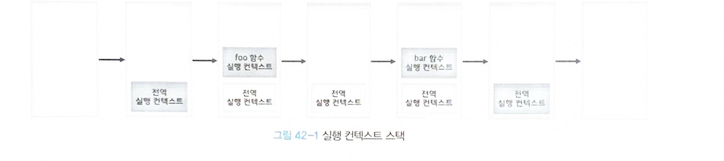

## 🐼 42-1 동기 처리와 비동기 처리
> 함수를 호출하면 함수 코드가 평가되어 함수 실행 컨텍스트가 생성된다.
> 이때 생성된 함수 실행 컨텍스트는 실행 컨텍스트 스택(콜 스택이라고도 부른다)에 푸시되고 함수 코드가 실행된다.
> 함수 코드의 실행이 종료하면 함수 실행 컨텍스트는 실행 컨텍스트 스택에서 팝(pop)되어 제거 된다.
> 

```javascript
const foo = () => {};
const bar = () => {};

foo();
bar();
```

> 호출된 순서대로 스택 자료구조인 실행 컨텍스트 스택에 푸시되어 실행 된다.



- 함수가 실행되려면 "함수 코Ï드 평가 과정"에서 생성된 함수 실행 컨텍스트가 실행 컨텍스트 스택에 푸시되 어야 한다.
- 실행 컨텍스트 스택에 함수 실행 컨텍스트가 푸시되는 것은 바로 함수 실행의 시작을 의미한다.
- 함수가 호출된 순서대로 순차적으로 실행되는 이유는 함수가 호출된 순서대로 함수 실행 컨텍스트 가 실행 컨텍스트 스택에 푸시되기 때문이다.
- 함수의 실행 순서는 실행 컨텍스트 스택으로 관리한다.
- 자바스크립트 엔진은 단 하나의 실행 컨텍스트 스택을 갖는다.
- 2개 이상의 함수를 동시에 실행할 수 없다는 것을 의미한다.
- 실행 컨텍스트 스택의 최상위 요소인 **"실행 중인 실행 컨텍스트"** 를 제외한 모든 실행 컨텍스트는 모두 실행 대기 중인 **태스크(task)**  들이다.
- 대기 중인 태스크들은 현재 실행 중인 실행 컨텍스트가 팝(pop)되어 실행 컨텍스트 스택에서 제거되면,
- 다시 말해 현재 실행 중인 함수가 종료하면 비로소 실행되기 시작한다.

> 자바스크립트 엔진은 한 번에 하나의 태스크만 실행할 수 있는 *싱글 스레드(single thread)* 방식으로 동작한 다.
> 싱글 스레드 방식은 한 번에 하나의 태스크만 실행할 수 있기 때문에 처리에 시간이 걸리는 태스크를 실행하는 경우 블로킹(blocking)(작업중단)이 발생한다.


```javascript
// sleep 함수는 일정 시간(delay)이 경과한 이후에 콜백 함수(func)를 호출한다.
function sleep(func, delay) {
  // Date.now()는 현재 시간을 숫자(ms)로 반환한다.("30.2.1. Date.now" 참고)
  const delayUntil = Date.now() + delay;

  // 현재 시간(Date.now())에 delay를 더한 delayUntil이 현재 시간보다 작으면 계속 반복한다.
  while (Date.now() < delayUntil);
  // 일정 시간(delay)이 경과한 이후에 콜백 함수(func)를 호출한다.
  func();
}

function foo() {
  console.log('foo');
}

function bar() {
  console.log('bar');
}

// sleep 함수는 3초 이상 실행된다..
sleep(foo, 3 * 1000);
// bar 함수는 sleep 함수의 실행이 종료된 이후에 호출되므로 3초 이상 블로킹된다.
bar();
// (3초 경과 후) foo 호출 -> bar 호출
```

> sleep 함수는 3초 후에 foo 함수를 호출한다. 이때 bar 함수는 sleep 함수의 실행이 종료된 이후에 호출되므로 3초 이상(foo 함수의 실행 시간 + 3초) 호출되지 못하고 블로킹(작업 중단)된다.
> 이처럼 현재 실행 중인 태스크가 종료할 때까지 다음에 실행될 태스크가 대기하는 방식을
> **동기(synchronous) 처리** 라고 한다.
> 동기 처리 방식은 태스크를 순서대로 하나씩 처리하므로 실행 순서가 보장된다는 장점이 있지만,
> 앞선 태스크가 종료할 때까지 이후 태스크들이 블로킹되는 단점이 있다.


- 비동기 처리

```javascript
function foo() {
  console.log('foo');
}

function bar() {
  console.log('bar');
}

// 타이머 함수 setTimeout은 일정 시간이 경과한 이후에 콜백 함수 foo를 호출한다.
// 타이머 함수 setTimeout은 bar 함수를 블로킹하지 않는다.
setTimeout(foo, 3 * 1000);
bar();
// bar 호출 -> (3초 경과 후) foo 호출
```

> 현재 실행 중인 태스크가 종료 되지 않은 상태라 해도 다음 태스크를 곧바로 실행하는 방식을 **비동기(asynchronous)**  처리라고 한다.


- 동기 처리 방식
> 태스크를 순서대로 하나씩 처리하므로 실행 순서가 보장
> 앞선 태스 크가 종료할 때까지 이후 태스크들이 블로킹 되는 단점

- 비동기 처리 방식
> 현재 실행 중인 태스 크가 종료되지 않은 상태라 해도 다음 태스크를 곧바로 실행하므로 블로킹이 발생하지 않는다는 장점
> 태스크의 실행 순서가 보장되지 않는 단점

- 비동기 처리 방식 종류
> 타이머 함수인 setTimeout과 setInterval
> HTTP 요청
> 이벤트 핸들러

> 비동기 처리는 이벤트 루프와 태스크 큐와 깊은 관계가 있다.


## 🐨 42-2 이벤트 루프와 태스크 큐

- [n] comment
> 인프런에 강사님 그림이랑 설명 보면서 이해해야 되는 파트
> ㅈㄴ 어렵다. 실행 컨텍스트 공부 하고 여기도 다시 보자


