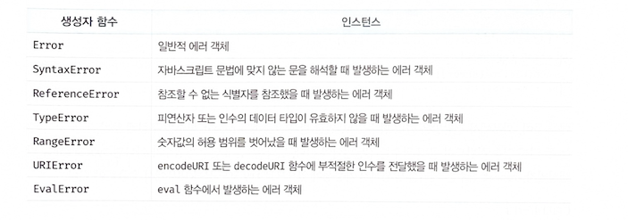

## 🐣 47-3 Error 객체
> Error 생성자 함수는 에러 객체를 생성한다.
> Error 생성자 함수에는 에러를 상세히 설명하는 에러 메시지를 인수로 전달할 수 있다.

- 자바스크립트 7가지의 에러 객체

## 🐼 47-5 에러의 전파
> 에러는 호출자(caller) 방향으로 전파된다. 즉, 콜 스택의 아래 방향(실행 중인 실행 컨텍스트가 푸시되기 직전에 푸시된 실행 컨텍스트 방향)으로 전파된다.

```javascript
const foo = () => {
  throw Error('foo에서 발생한 에러'); // ④
};

const bar = () => {
  foo(); // ③
};

const baz = () => {
  bar(); // ②
};

try {
  baz(); // ①
} catch (err) {
  console.error(err);
}
```

> ①에서 baz 함수를 호출하면 ②에서 bar 함수가 호출되고 ③에서 foo 함수가 호출되고 foo 함수는 ④에서 에 러를 throw한다.
> 이때 foo 함수가 throw한 에러는 다음과 같이 호출자에게 전파되어 전역에서 캐치된다.


> 이처럼 thron된 에러를 캐치하지 않으면 호출자 방향으로 전파된다. 
> 이때 throw된 에러를 캐치하여 적절히 대응하면 프로그램을 강제 종료시키지 않고 코드의 실행 흐름을 복구할 수 있다.
> throw된 에러를 어디에서도 캐치하지 않으면 프로그램은 강제 종료된다.

- [!] 중요
> 비동기 함수인 setTimeout이나 프로미스 후속 처리 메서드의 콜백 함수는 호출자가 없다는 것 이다. setTimeout이나 프로미스 후속 처리 메서드의 콜백 함수는 태스크 큐나 마이크로태스크 큐에 일시 저 장되었다가 콜 스택이 비면 이벤트 루프에 의해 콜 스택으로 푸시되어 실행된다. 이때 콜 스택에 푸시된 콜백 함수의 실행 컨텍스트는 콜 스택의 가장 하부에 존재하게 된다. 따라서 에러를 전파할 호출자가 존재하지 않는다.

