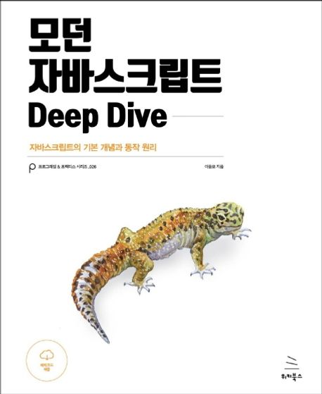

# 모던 자바스크립트 딥다이브

# 📚 참고
## 예제 코드
- [모던 자바스크립트 딥다이브 예제코드](https://github.com/wikibook/mjs) 
## 강의
- [인프런 정재남 모던 자바스크립트 딥다이브](https://www.inflearn.com/course/%EB%AA%A8%EB%8D%98-%EC%9E%90%EB%B0%94%EC%8A%A4%ED%81%AC%EB%A6%BD%ED%8A%B8-%EB%94%A5%EB%8B%A4%EC%9D%B4%EB%B8%8C) 
# 🔑 요약

# 📆 정리 현황 테이블

아래 테이블에 각 장별로 작성한 README.md 를 링크 (연결) 합니다.

| Priority | Task | Chapter | Link |
| ---- | ---- | ---- | ---- |
| ⭐⭐⭐⭐⭐ | 스코프(Scope) | 13장 | 테스트3 |
| ⭐⭐⭐⭐⭐ | 실행컨텍스트(Execution Context) | 23장 | 테스트3 |
| ⭐⭐⭐⭐⭐ | 호출스택(Call Stack) | 23장 | 테스트3 |
| ⭐⭐⭐⭐⭐ | 비동기 프로그래밍 | 42장 |  |
| ⭐⭐⭐⭐⭐ | this | 22장 |  |
| ⭐⭐⭐⭐⭐ | 프로미스(Promise) | 45장 |  |
| ⭐⭐⭐⭐⭐ | 배열(Array) | 27장 |  |
| ⭐⭐⭐⭐⭐ | 이터러블 | 34장 |  |
| ⭐⭐⭐⭐⭐ | 스프레드 문법 | 35장 |  |
| ⭐⭐⭐⭐⭐ | 디스트럭처링 할당 | 36장 |  |
| ⭐⭐⭐⭐ | 프로토타입(Prototype) | 19장 |  |
| ⭐⭐⭐⭐ | 클래스(Class) | 25장 |  |
| ⭐⭐⭐ | Set과 Map | 37장 |  |
| ⭐ | 빌트인 객체 | 21장 |  |
# 📝 키워드

[일급객체](https://github.com/YangGwangSeong/TIL) , [래퍼객체](https://github.com/YangGwangSeong/TIL)

