> [아는 만큼 보이는 데이터베이스 설계와 구축](https://product.kyobobook.co.kr/detail/S000001223487) 정리
# PK컬럼순서, 대충하지 말자

- [!] 스키마를 생성하기 이전에, 데이터 모델의 PK 순서를 조정하지 않은 채 테이블을 생성하면 인덱스를 이용하지 못해 테이블 Full Scan 현상이 발생하는 경우가 있다.

**테이블: 입시마스터**

|수험번호|년도|학기|대학원구분코드|학위구분코드|
|---|---|---|---|---|
|1|2023|1|USA|ㄴㅇㄹ|
|2|2023|1|Canada|ㄴㅇㄹ|
|3|2023|1|UK|ㄴㅇㄹ|

**테이블: 전형과목실적**

|수험번호(FK)|년도(FK)|학기(FK)|전형과목코드(FK)|점수|결시여부|과락여부|
|---|---|---|---|---|---|---|
|1|2023|1|USA|80|true|false|
|2|2023|1|Canada|90|true|false|
|3|2023|1|UK|70|true|false|

````
```sql

CREATE UNIQUE INDEX 입시마스터_01 ON 입시마스터 (수험번호, 년도, 학기)

```
````

````
```sql

SELECT COUNT(수험번호)
FROM 입시마스터
WHERE 년도= '2008'
AND 학기 = '1'

Execution Plan

0 SELECT STATEMENT Opti...
1 0 SORT (AGGREGATE)
2 1 TABLE ACCESS (FULL) OF '입시마스터'
-> 테이블 FULL SCAN으로 성능 저하됨
```
````

- [i] 입시마스터_01 인덱스가 수험번호+년도+학기 중 수험번호에 대한 값이 WHERE절에 들어오지 않아 FULL TABLE SCAN이 발생한다.

즉, 200만 건의 데이터를 모두 읽게 되어 성능이 저하된다.

>  [해결방법]
>  입시마스터 테이블에 데이터를 조회할 때 년도와 학기에 대한 내용이 빈번하게 들어가므로 PK순서를 변경한다.
>  
>  CREATE UNIQUE INDEX 입시마스터_01 ON 입시마스터 (년도, 학기, 수험번호)
>
>  -> 인덱스 스캔을 하게 되어 성능이 향상됨.
>  

```sql
CREATE UNIQUE INDEX 입시마스터_01 ON 입시마스터 (수험번호, 년도, 학기)
아래로 변경
CREATE UNIQUE INDEX 입시마스터_01 ON 입시마스터 (년도, 학기, 수험번호)
```

- [!] 인덱스는 이용하는데 범위가 넓어져 성능이 저하되는 경우.

> SQL 문장의 where절에 *'='* 이나 *'Between'*, *'<', '>'* 등을 분석하여 PK 컬럼을 범위가 들어오는 조건부터 앞쪽으로 위치.

즉,
```sql
SELECT COUNT(수험번호)
FROM 입시마스터
WHERE 년도 = '2008' // 1순서
AND 학기 = '1'      // 2순서
```
- where 절에 오는 (자주 들어오는)순서에따라 PK 컬럼 순서를 앞쪽에 위치


## 🙈 PK컬럼 순서를 효율적으로 만드려면
- 여러개의 속성이 하나의 인덱스로 구성되어 있을 때 앞쪽에 위치한 속성의 값이 비교자로 있어야 인덱스가 좋은 효율을 나타낼 수 있다. 
- 앞쪽에 위치한 속성 값이 가급적 *'='* 또는 최소한 범위 *'BETWEEN'*, *'<' '>'* 가 들어와야 인덱스를 이용 할 수 있다.

# 식별자관계와 비식별자관계 설정

## 👻 비식별자 관계를 선정하는 기준
- 자식 테이블의 독립된 PK 구성이 필요한지를 분석 하는 부분이 가장 중요하다.


| |식별자관계|비식별자관계|
|---|---|---|
|목적|강한 연결관계 표현|약한 연결관계 표현|
|자식 PK 영향|자식 PK의 구성에 포함됨|자식 일반 속성에 포함됨|
|표기법|실선 표현|점선 표현|
|연결 고려사항| - 반드시 부모 엔티티타입 종속<br>  - 자식 PK 구성에 부모 PK 포함 필요<br> - 상속받은 PK 속성을 타 엔티티타입에 이전 필요| - 약한 종속관계<br> - 자식 PK 구성을 독립적으로 구성<br> - 부모 쪽의 관계 참여가 선택 관계임<br> - 상속받은 PK 속성을 타 엔티티타입에 재상속 차단 필요|

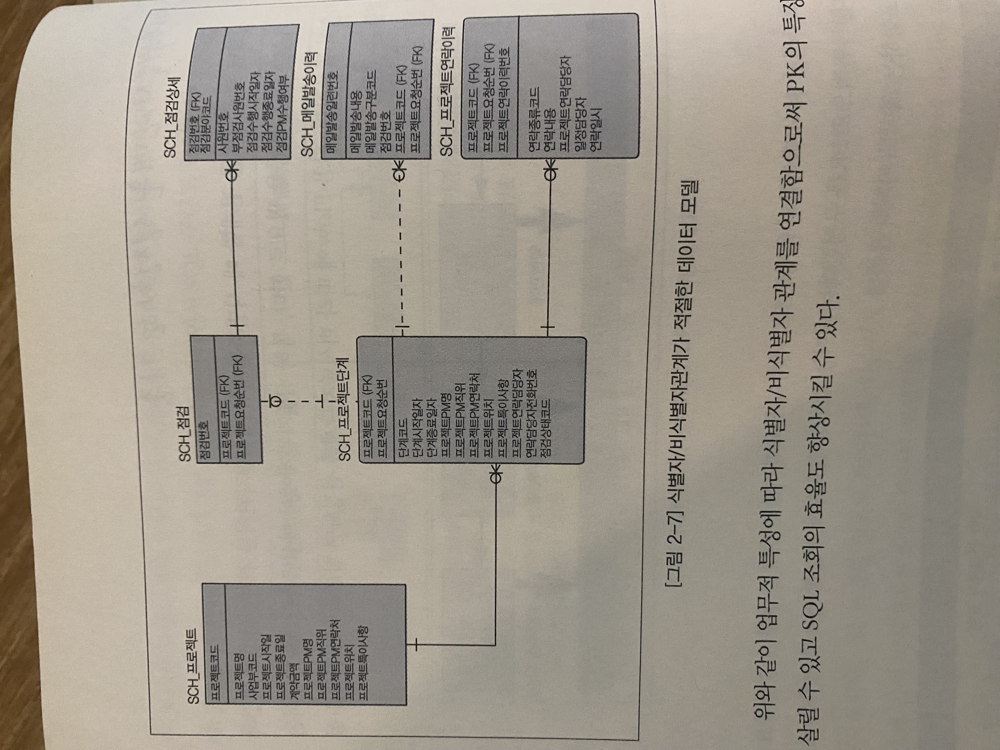
# 이력 유형 데이터 모델링, 이렇게 하라

![[Pasted image 20231226224152.png]]

- [0]  1. 변경 이력/발생 이력

- 변경 이력과 발생이력은 최근값 조회 빈도가 높기 때문에 '최신여부' 등의 기능성 컬럼을 추가하여 설계 하는것이 성능면에서 좋다

> 변경 이력/발생이력을 예를들어 최신여부를 결정하는 기능성 컬럼에 예를들어 'Y'값으로 구분할때 새로운 데이터 가 입력될 때 이전 변경일자에 대한 최신 여부값을 'Y'에서 'N'으로 바꾸어야 하는 부가적인 작업이 발생한다
> 즉, 입력,수정,삭제시 기능성 컬럼에 대해 추가적인 고려가 필요하다.

- [1]  2. 진행이력

- 진행이력 같은 경우 생성된 시점과 완료된 시점을 지정하는것이 성능면에서 좋다

> 진행이력 같은 경우 예를들어 적용일자이외에 적용종료일자라는 기능성 컬럼을 추가 하게 될때, 그 값이 예를들어 2023-01-26일때, 새로운 데이터가 입력될때 적용일자 컬럼에 편의상 최대값(예를들어 9999년 1월 1일)을 입력하여 인덱스를 이용할 때 문제가 없도록 해야한다.


# 엔티티타입, 통합할 것인가 분리할 것인가?

- [0]  1. 트랜잭션을 고려해서 엔티티타입을 통합할지 분리할지 정한다.

- 하나의 테이블에 여러개의 트랜잭션이 집중될것으로 예상되면 1:1관계로 모델링함.

- [1]  2. Constraint(제약조건)을 고려해서 엔티티타입을 통합할지 분리할지 정한다.

- 테이블이 독립된 상태일때는 예를들어 *NOT NULL* Constraint를 설정 할 수 있었으나, 엔티티 통합시에 해당 Constraint조건을 지정 할 수 없을경우 개별적 엔티티타입을 유지시키는 모델로 모델링함. 

## 🐙 통합과 분리, 선택의 기준

- [0]  1. 상세 표현 단계

- 논리적 데이터 모델링 단계에서는 가능한 엔티티타입을 상세하게 표현한다.

- [1]  2. 통합 고려 단계

- 물리적 데이터 모델링 단계에서는 성능을 고려하여 데이터 모델 통합을 유도하되 성능의 Trade Off(조인 성능 개선 vs 데이터 집약 성능 저하)를 분석하여 통합과 분리를 결정한다.

- [2]  3. 트랜잭션 고려 단계

- 트랜잭션이 해당 엔티티타입에 통합하여 발생하는지 분리되어 발생하는지를 분석하고 업무적 중요성을 갖는 트랜잭션의 발생 패턴에 따라 통합과 분리를 결정한다.

- [3]  4. 데이터량과 트랜잭션 빈도에 따른 결정 단계

- 데이터량과 트랜잭션 빈도가 많지 않은 경우 가급적 통합된 데이터 모델을 구성하여 단순성을 확보한다.
- 데이터량과 트랜잭션 빈도가 많은 경우 데이터베이스 성능을 충분히 고려하여 통합과 분리를 결정한다.


# Primary key와 Unique Index 논쟁에 대하여

- PK 써라


# 자기참조관계모델링기법

## 🐨 자기참조관계에서 주의할점

- [0]  1. 관계의 연결이 되는 속성에 인덱스를 설정하라

- [1]  2. 자기참조관계에 적합한 SQL 문장을 실행하라


# 엔티티타입, 이렇게 도출하라

## 🦀 도출 방법은 세가지

- [0]  1. 명사형 도출

- [1]  2. 정규화 이용

- [2]  3. 엔티티타입 구분에 의한 4-STEP 데이터 모델링

## 🥝 도출한 엔티티타입 검증하기

### 상관매트릭스(CRUD Matrix)


- 누락, 중복된 엔티티타입을 검증


# 데이터 모델링에서 관계의 중요성

## 🦁 관계를 표현하지 않으면?

- [0]  1. 업무의 구조와 흐름을 파악할 수 없다

- [1]  2. PK의 구조를 정확하게 가져갈 수 없다

- [2]  3. 효율적인 SQL 구문을 작성할 수 없다

- [3]  4. 참조 무결성 제약 조건에 의한 데이터 참조 무결성 유지가 어렵다


# 용어사전과 도메인을 정의하라

## 🐡 용어사전과 도메인이 없으면?
- [0]  1. 일관성 있고 품질이 좋은 데이터 모델/데이터베이스를 구축 할 수 없다

> 예를들어 인사시스템을 만들 데이터베이스를 모델링 할 때
> 모델링 할 테이블이 100개 넘는다는 가정하에 사원번호에 대해 A테이블엔 EMPNO라고 기술하고 B테이블엔 SAWON_BUNHO라고 기술하게 된다면 동일한 정보임에도 불구하고 다른속성으로 인식된다. 또한 주민번호의 타입을 A테이블에선 NUMBER(14)로 기술 하였는데, B테이블에선 VARCHAR(13)으로 기술하게 된다면 값을 비교하면 원하는 결과가 도출되지 않는다.
> 이처럼 작은 단위의 프로젝트는 경험만으로 가능할지 모르겠지만 대규모 시스템을 구축 할때는 경험만으론 해당 실수를 범하기 마련이다.


- 해당 SQL문을 이용하여 구축된 데이터베이스에 대해 도메인의 일관성을 체크해 보자.


- [1]  2. 애플리케이션 로직 에러를 초래할 수 있다

- A 직무구분코드 VARCHAR(5) B 직무구분코드 CHAR(5) 같은 칼럼이지만 서로 다른 테이블에 데이터 타입이 다른경우 WHERE A.직무구분코드 = B.직무구분코드 가 다른경우

- [2]  3. 데이터 처리에 성능 저하를 유발할 수 있다

- 다르게 설정한 데이터 타입으로 인해 제대로 인덱스를 제대로 타지 않고 FULL TABLE SCAN됨.


# 데이터 모델을 검증하라

## 🐶 검증 수행방법

### 데이터 모델 검증 시의 관점

- 사용자 요구사항과 대비하여 미도출된 엔티티타입 및 속성은 없는가?
- 엔티티타입간의 관계는 업무절차와 잘 부합하는가?
- 다른 타입/크기, CONSTRAINT를 가지는 중복된 속성은 존재 하지 않는가?
- 엔티티간의 관계가 M:N으로 정의된 것은 없는가?
- 엔티티타입명, 속성명, 관계명에 대한 정의는 모델의 일반규약을 준수하고 있는가?

### 데이터 모델 검증 시 체크리스트

- [0]  1. 엔티티타입 검토 체크리스트

- 선정된 PRIMARY KEY가 업무적으로 발생하는 자료의 유일성을 보장하는가?
- 선정된 PRIMARY KEY는 효율적인 모습을 가지고 있는가?
- 자료의 발생 유형이 유사한 엔티티는 통합되었는가?
- 독립된 엔티티타입이나 엔티티타입의 그룹은 존재하지 않는가?
- 병합 또는 분리되어야 할 엔티티타입은 존재하지 않는가?
- 추가적으로 도출되어야 하거나 불필요한 엔티티타입은 없는가?
- 엔티티타입이 주변 여러 엔티티타입의 공통 엔티티타입인 경우 자료 원천이 어느 엔티티타입인지 추적 가능한가?
- PRIMARY KEY의 순서는 시스템의 성능을 고려하여 적절한 순서로 정의되어 있는가?

- [1]  2. 속성 검토 체크리스트

- 반정규화된 속성은 식별되는가?
- 반정규화는 시스템 복잡도와 성능을 고려하여 적절하게 이루어졌는가?
- 동일 명칭을 가지는 속성의 타입과 크기는 동일한가?
- 내부적인 속성을 가지고 있는 속성은 존재하지 않는가?
- 병합되어야 할 속성은 존재하지 않는가?
- 전후 레코드 간 영향을 미칠 수 있는 속성은 없는가?
- 감사, 통계 등을 고려하여 속성이 정의되었는가?

- [2]  3. 관계 검토 체크리스트

- 엔티티타입 간의 관계가 M:N인 속성은 없는가?
- 엔티티타입 간의 관계는 업무적 흐름과 규약이 일치하는가?
- 업무적 흐름에 비추어 미도출된 관계는 없는가?
- 관계에 대한 표현은 적절한 수준에서 이루어졌는가?

- [3]  4. 도메인/용어 검토 체크리스트

- 도메인이 적절히 정의되어 관리되고 있는가?
- 도메인의 변경에 따라 속성이 변경되고 있는가?
- 데이터 모델의 용어가 일관성을 유지하고 있는가?

> 체크 항목을 체크하고 피드백하는 과정을 반복적으로 수행하여 데이터 모델의 완성도를 높이는것이 바로 *모델 검토 태스크* 이다


# 논리/물리 데이터 모델을 생성하라

## 🐼 논리적데이터 모델이 없으면?

- [0]  1. 데이터 모델의 확장성을 확보할 수 없다

- 업무적 의미가 있는 단위별로 엔티티타입과 속성을 디자인하여 모델에 반영하고 데이터 모델의 관계도 업무의 구조와 흐름에 따라 표현 하는것이 논리적인 데이터 모델인데, 이것을 무시하고 바로 반정규화 중심의 /통합/분리/추출 등을 적용한 물리적인 데이터 모델을 만들게 되면, 업무적으로 특성있는 엔티티타입이 다른 엔티티타입 안에 묻혀있게 된다. 그러면 관계도 다르게 형성이 되는 현상이 발생한다.

> 즉, 내가 이해한걸로 논리적데이터 모델로 각 엔티티간의 관계나 속성이 잘 표현 되어 있어야 또 추가되는 엔티티를 관계 맺는것에 구조와 흐름이 정확한데, 물리적 데이터 모델로 반정규화 하게 되면 어떤게 어떤거와 관계가 있었는지 구분 하기 힘들어 지는걸 말하는것 같다.


- [1]  2. 모델을 통해 업무흐름파악이 안 되어 커뮤니케이션 제약이 발생한다

- 위와 같은 의미로 반정규화로 업무 파악이 힘들어 지게 된다.

## 🐌 물리적데이터 모델이 없으면?
- [0]  1. 데이터베이스 성능 저하를 초래 할 수 있다.

- 물리적데이터 모델에서 데이터베이스에 중심을 두고 성능을 고려하여 반정규화를 적용한 모델을 만들어낸다.
- 용량과 데이터베이스 분산등을 고려하여 데이터의 분산, 파티셔닝 등을 고려한 물리적인 데이터 모델을 설계 해야한다.

- [1] 2. 데이터베이스 오브젝트에 대해 관리가 수행되지 않는다.

- 물리적 데이터모델에서 오브젝트, 접근방법, 트랜잭션 분석, 저장 방법, 인덱스, 뷰 등을 설계한다
- 이러한 오브젝트들은 데이터 모델에 기반하여 물리적인 데이터 모델링 단계에서 설계하여 반영하는 오브젝트이다.


## 🐞 논리에서 물리로 변환하기


- 데이터베이스의 물리 설계는 크게 세 가지로 나눠 **ERD의 테이블 전환, 데이터베이스 물리 설계, 분산 설계 작업** 이 수행되어야 한다

# 데이터 독립성의 실무 적용

## 👻 등장 배경과 정의

- 데이터 독립성은 지속적으로 증가하는 유지보수 비용을 절감하고 데이터 복잡도를 낮추며 중복된 데이터를 줄이기 위해 나타났다.
- 끈임없이 생겨나는 사용자 요구사항에 대응하면서 화면과 데이터베이스 간에 독립성을 유지하기 위해서 데이터 독립성 개념이 출현했다고 할 수 있다.

> 나의 comment
> 읽어도 도무지 뭔 소린지 모르겠다 어렵다


# 데이터 무결성의 실무적용

- 참조 무결성과 Constraint(NOT NULL, CHECK 등)를 생략 하게 되었을때 부모 없는 자식 데이터가 생성 된다던지, Null이 있으면 안되는 데이터에 Null값이 포함된 데이터 생성 된다던지, 업무적인 규칙에 의해 일정한 값만 들어와야 하는 컬럼에 이상한 값이 포함된 데이터가 생성된다던지로 인해 데이터 무결성이 깨진다.


## 🐻 데이터 무결성 설계를 하지 않으면?

- [0]  1. 데이터베이스 테이블에 중복된 데이터가 존재할 수 있게 된다.(PK)

- [1]  2. 참조 무결성 제약 조건에 의해 지켜져야 할 부모와 자식 데이터의 논리적인 관계가 깨지게 된다.(FK)

- [2]  3. 컬럼 무결성 제약 조건에 의해 지켜져야 할 컬럼의 기본값, Null값 등이 비정상적으로 데이터베이스에 존재하게 된다. (Default Value, Check Constraint, Null/Not Null)


> *데이터 무결성* 이란 데이터의 정확성과 일관성이 보장된 상태를 의미한다.
> 정확성이란 : 중복이나 누락이 없는 상태 
> 일관성이란 : 원인과 결과 의미의 연속성이 보장된, 변하지 않은 상태 


- 데이터 무결성의 종류
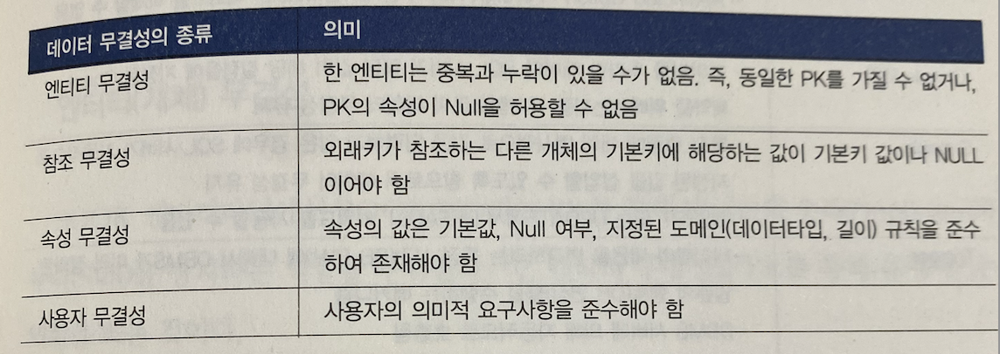

- DBMS에서 제공하는 무결성 요소
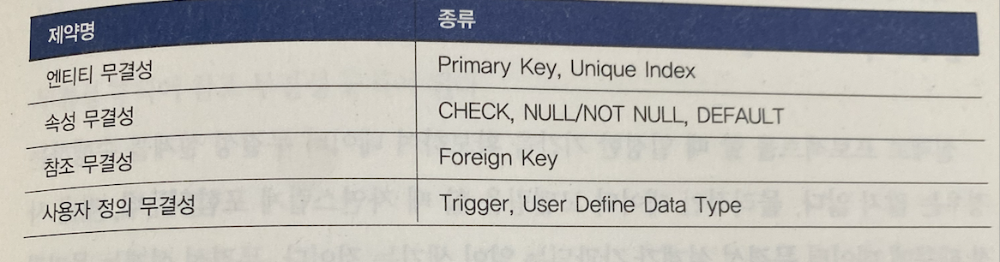

# 트랜잭션 관리의 실무 적용

## 🐼 ACID(Atomicity, Consistency, Isolation, Durability)

- [0]  1. Atomicity(원자성)

- [1]  2. Consistency(일관성)

- [2]  3. Isolation(고립성)

- [3] 4. Durability(영속성)

## 🤖 실무 적용방법

### 트랜잭션 설계
- ELEMENTARY PROCESS와 CRUD MATRIX를 이용하여 트랜잭션 분석서(TRANSACTION ACTION DIAGRAM OR LOGICAL ACCESS MAP)을 작성한다.
- 만약에 분석 산출물이 존재 하지 않는다면 ELEMENTARY PROCESS에 해당하는 프로세스 목록을 선택하여 프로세스의 흐름을 따라 작업을 하도록 한다.


- '제품주문을 신청한다' 라는 하나의 업무 트랜잭션인 ELEMENTARY PROCESS을 트랜잭션 분석도에 표현한것이다
- ERD에 CRUD MATRIX에 있는 내용 ELEMENTARY PROCESS의 내용을 순서에 맞게 표현하고 이를 표로 그렸다.


# 정규화의 실무 적용

- 아래 예문을 설명 할 수 있을정도로 정규화 이론을 깊게 이해 해야한다.

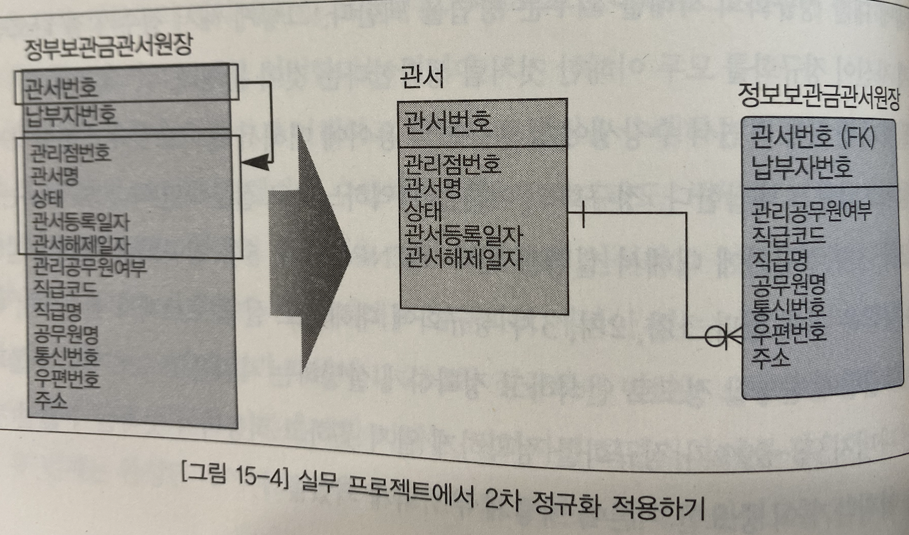

# 성능 데이터 모델링

- 성능 데이터 모델링이란 데이터베이스 성능 향상을 목적으로 설계 단계의 데이터 모델링 때부터 정규화, 반정규화, 테이블 통합, 테이블 분할, 조인 구조, PK, FK 등 여러 가지 성능과 관련된 사항을 데이터 모델링에 반영 하는것으로 정의 할 수 있다.

## 🍙 어떻게 수행 하는가?

- [0]  1. 정규화를 정확하게 수행한다.

- [1]  2. 데이터베이스 용량 산정을 수행한다.

- [2]  3. 데이터베이스에 발생하는 트랜잭션의 유형을 파악한다.

- [3]  4. 용량과 트랜잭션의 유형에 따라 반정규화를 수행한다.

- [4]  5. 이력모델 조정, PK/FK조정, 슈퍼타입/서브타입 조정 등을 수행한다.

- [5]  6. 데이터 모델을 검증한다.


# 정규화를 통한 데이터베이스 성능 향상

## 🐣 정규화와 조회 성능


- PK가 걸려 있는 Unique Index를 곧바로 찾아서 성능저하가 거의 없다.
- '관서등록일자가 2008년 이후 관서를 모두 조회하라'는 SQL 구문은 2차 정규화된 테이블이 훨씬 빠르다.

### 두 개의 엔티티타입이 통합되어 반정규화된 경우
> 가정
> 매각일자 5,000건이 있다
> 일자별 매각물건은 100만건이 있다


- 예를들어 '서울 7호'에서 매각된 총매각금액, 총유찰금액을 산출하는 조회용 SQL문장
```sql
SELECT B.총매각금액 , B.총유찰금액
FROM (SELECT DISTINCT 매각일자
	 FROM 일자별매각물건
	 WHERE 매각장소 = '서울 7호') AS A, /* <== 100만건의 데이터를 읽어 DISTINCT함 */
	 매각일자별매각내역 B
WHERE A.매각일자 = B.매각일자 
```

> 대량의 데이터에서 찾기 때문에 성능이 저하된다.


> 복합식별자 중에서 일반 속성이 주식별자 속성 중 일부에만 종속관계를 가지고 있으므로 2차 정규화의 대상이 된다.

```sql
SELECT B.총매각금액, B.총유찰금액
FROM 매각기일 AS A,
		매각일자별매각내역 AS B
WHERE A.매각장소 = '서울 7호' /* <== 5천 건의 데이터를 읽음 */
AND   A.매각일자 = B.매각일자;
```

> 매각기일 테이블이 정규화되면서 드라이빙이 되는 대상 테이블의 데이터가 5천건으로 줄어들어 조회 처리가 빨라진다.


### 두 개의 속성을 나열하여 반정규화한 경우
- 한테이블에 인덱스 수를 가급적 **7~8**  개가 넘지 않도록 하는것이 좋다.


> 예시로 만약 각 유형코드별로 조건을 부여하여 모델코드와 모델명을 조회하는 SQL 문장을 작성하면 다음과 같이 나온다.

```sql
SELECT 모델코드, 모델명
FROM   모델
WHERE  ( A유형기능분류코드1 = '01' )
OR     ( B유형기능분류코드2 = '02' )
OR     ( C유형기능분류코드2 = '07' )
OR     ( D유형기능분류코드2 = '01' )
OR     ( E유형기능분류코드2 = '02' )
OR     ( F유형기능분류코드2 = '07' )
OR     ( G유형기능분류코드2 = '03' )
OR     ( H유형기능분류코드2 = '09' )
OR     ( I유형기능분류코드2 = '09' )
```

> 각 유형별로 모두 인덱스가 걸려 있어야 인덱스에 의해 데이터를 찾을 수 있다.
> 로우 단위의 대상도 1차 정규화의 대상이 되지만 컬럼 단위로 중복이 되는 경우도 1차 정규화의 대상이 된다.


> 1차 정규화 후 추가 인덱스가 0개가 되었다.

```sql
SELECT 모델코드, 모델명
FROM   모델 AS A, 모델기능분류코드 AS B
WHERE  ( B.유형코드 = 'A' AND B.기능분류코드 = '01' AND A.모델코드 = B.모델코드 )
OR     ( B.유형코드 = 'B' AND B.기능분류코드 = '02' AND A.모델코드 = B.모델코드 )
OR     ( B.유형코드 = 'C' AND B.기능분류코드 = '07' AND A.모델코드 = B.모델코드 )
OR     ( B.유형코드 = 'D' AND B.기능분류코드 = '01' AND A.모델코드 = B.모델코드 )
OR     ( B.유형코드 = 'E' AND B.기능분류코드 = '02' AND A.모델코드 = B.모델코드 )
OR     ( B.유형코드 = 'F' AND B.기능분류코드 = '07' AND A.모델코드 = B.모델코드 )
OR     ( B.유형코드 = 'G' AND B.기능분류코드 = '03' AND A.모델코드 = B.모델코드 )
OR     ( B.유형코드 = 'H' AND B.기능분류코드 = '09' AND A.모델코드 = B.모델코드 )
OR     ( B.유형코드 = 'I' AND B.기능분류코드 = '09' AND A.모델코드 = B.모델코드 )
```

> 유형코드 + 기능분류 + 모델코드에 인덱스가 걸려 있으므로 인덱스를 통해 조회 성능이 향상된다.

(다른 예)


# 반정규화를 통한 데이터베이스 성능 향상

> 컬럼에 대한 반정규화가 많은데 그 이유는 개발자가 개발을 하다가 특정 컬럼에 대해 join을 많이 사용 한다던지 이유 때문에 컬럼을 추가 하는 컬럼에 대한 반정규화를 사용하게 되는데 무분별한 컬럼 반정규화는 데이터 무결성을 깨뜨리는 결정적인 원인이 된다.

- 물리적인 데이터 모델을 만들 때 반정규화 해야한다.
- 반정규화의 핵심 기술은 테이블, 컬럼, 관계를 모두에 대해 상황에 따라 적용 하는것.


### 반정규화의 의미
- 좁은 의미의 반정규화는 데이터를 중복하여 성능을 향상시키는 기법을 의미한다.
- 더 넓은 의미의 반정규화는 성능을 향상시키기 위해 정규화된 데이터 모델에서 중복, 통합, 분리 등을 수행하는 모든 과정을 의미한다.
- 데이터의 무결성이 깨질 가능성을 항상 고려 해야한다.


### 테이블을 반정규화 하는 방법

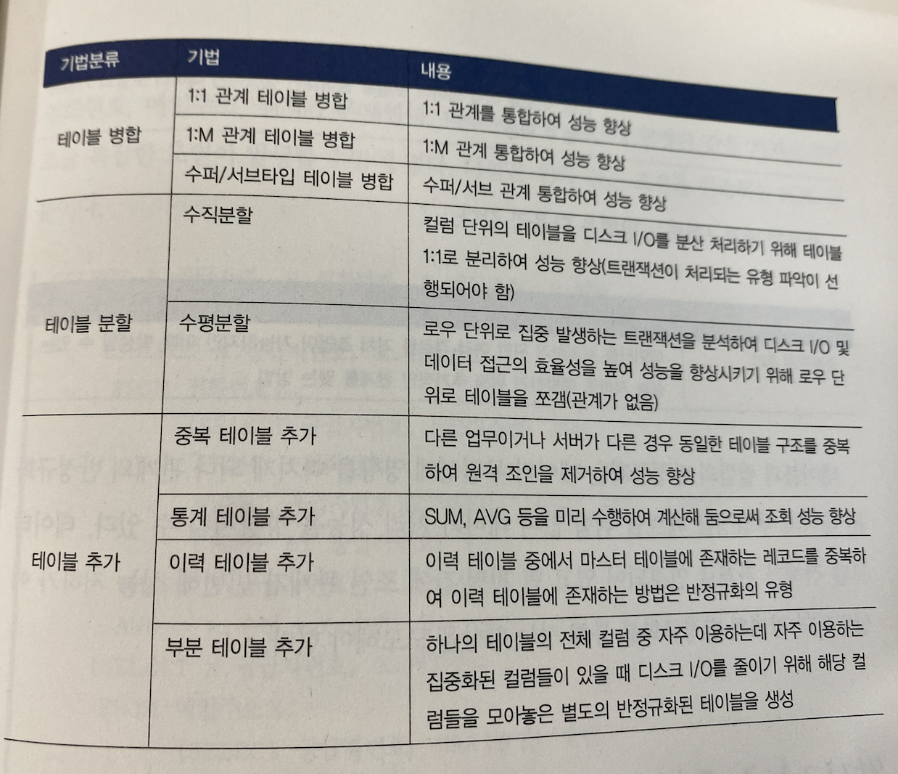

### 컬럼을 반정규화 하는 방법

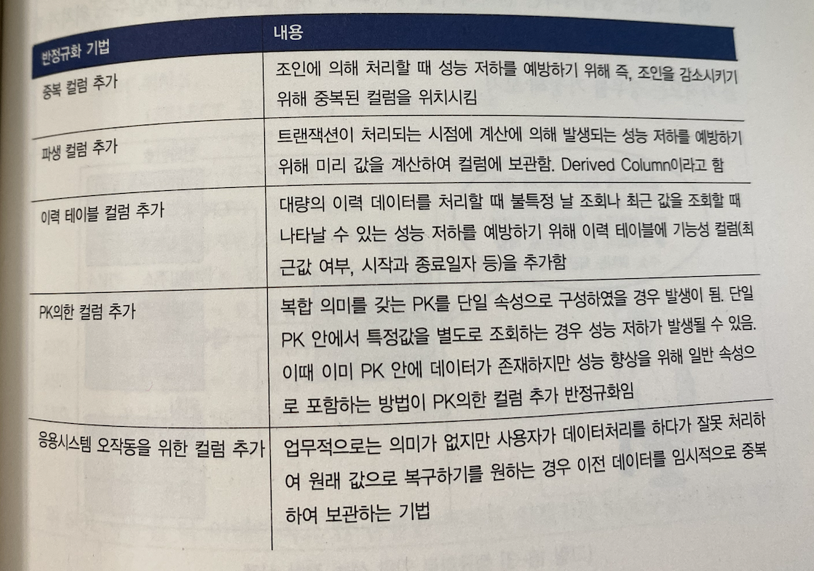

### 관계를 반정규화 하는 방법

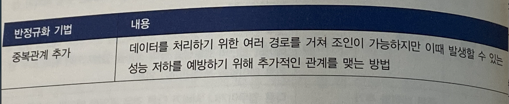

- 테이블과 컬럼의 반정규화는 데이터 무결성에 영향을 미치게 되나 관계의 반정규화는 데이터 무결성을 깨뜨릴 위험 없이 데이터 처리 성능을 향상시킬 수 있다.
# 데이터 모델 단순화를 통한 데이터베이스 성능 향상

## 🐟 사례1 - 내/외부/국제 등 배달

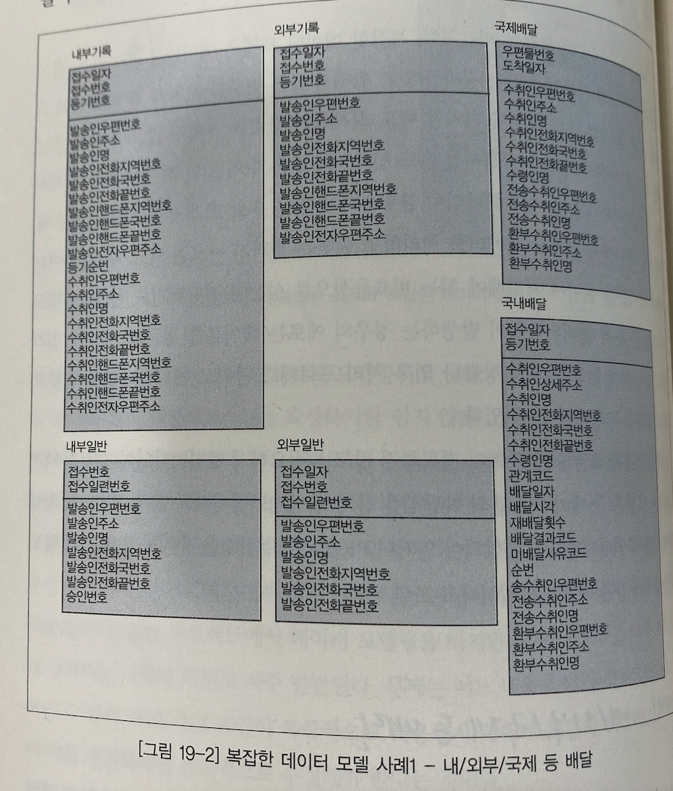

- 고객을 별도의 엔티티타입으로 정규화하여 생성하지 않고 개별 프로세스 단위로 엔티티타입을 생성한 데이터 모델이다.


> 고객정보에 대해 3차 정규화를 적용

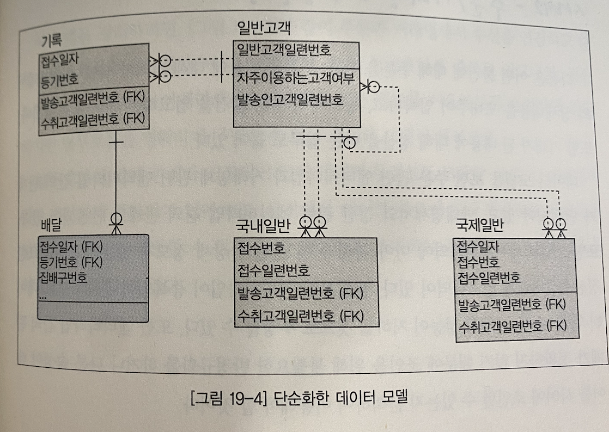
## 🌻 사례2 - 주문/거래명세서/정산 등

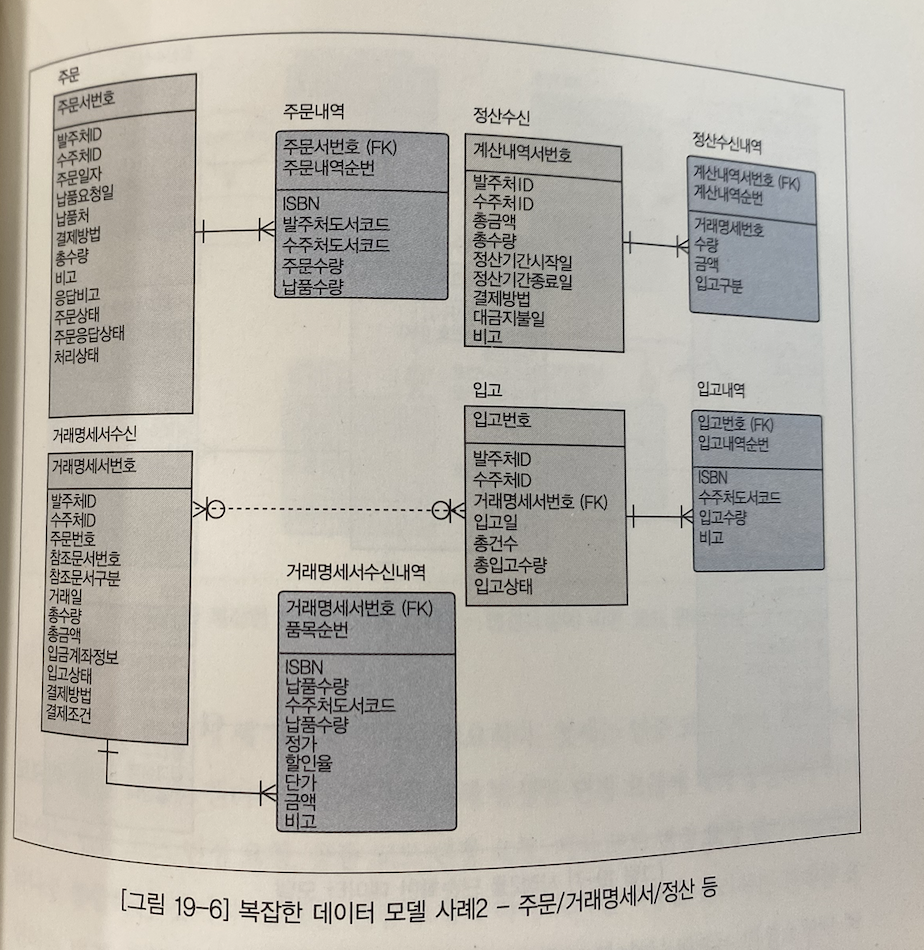
- 다음은 어떤 물건에 대해 주문을 하고, 주문된 내용에 대해 거래가 되면 거래명세서와 상세내용을 보내주어 입력하고, 창고에 주문한 물건을 입고하는 데이터 모델이다.


> 주문과 거래명세서 수신을 연결하고 다시 거래명세서수신과 정산수신을 연결한다.
> 또한 불필요하게 중복된 입고내역, 정산수신내역을 제거하고 거래명세서수신내역에 있는 정보를 이용하도록 수정하면 단순화된 데이터 모델이 된다.


## 🌹 사례3 - 변경요청에 따른 코드 관리 모델

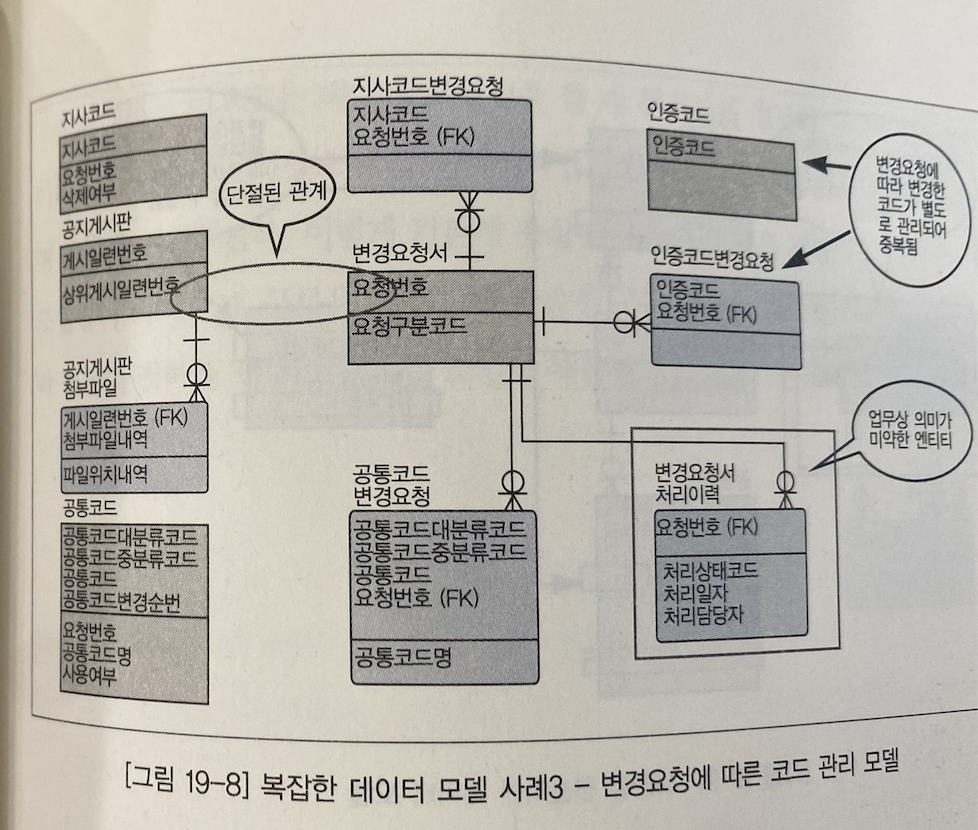
- 공통 코드에 대한 변경 요청이 들어오면 변경 요청된 상세코드를 포함한 변경요청서를 접수하고, 변경 작업이 수행되면 작업 결과를 등록하고 공지게시판에 게시하는 업무 흐름을 가지고 있다.


> 1. 인증 코드, 지사 코드, 공통 코드와 같은 코드성 엔티티타입 각각에 대해 발생한 변경 요청에 대해 동일하게 가지고 있는 인증 코드 변경 요청, 공통 코드 변경 요청, 지사 코드 변경 요청 엔티티타입을 하나로 통합하는 것이다.
> 2. 변경 요청에 따라 게시한 내용을 관리하는 관계를 표현하는 변경 요청과 공지게시판과의 관계를 표현하는 것이다.
> 3. 변경요청서 처리 이력을 삭제하는 것인데, 이는 일반적으로 변경요청서는 한명의 사람이 최종적으로 처리하는 것이 의미가 있기 때문이다.

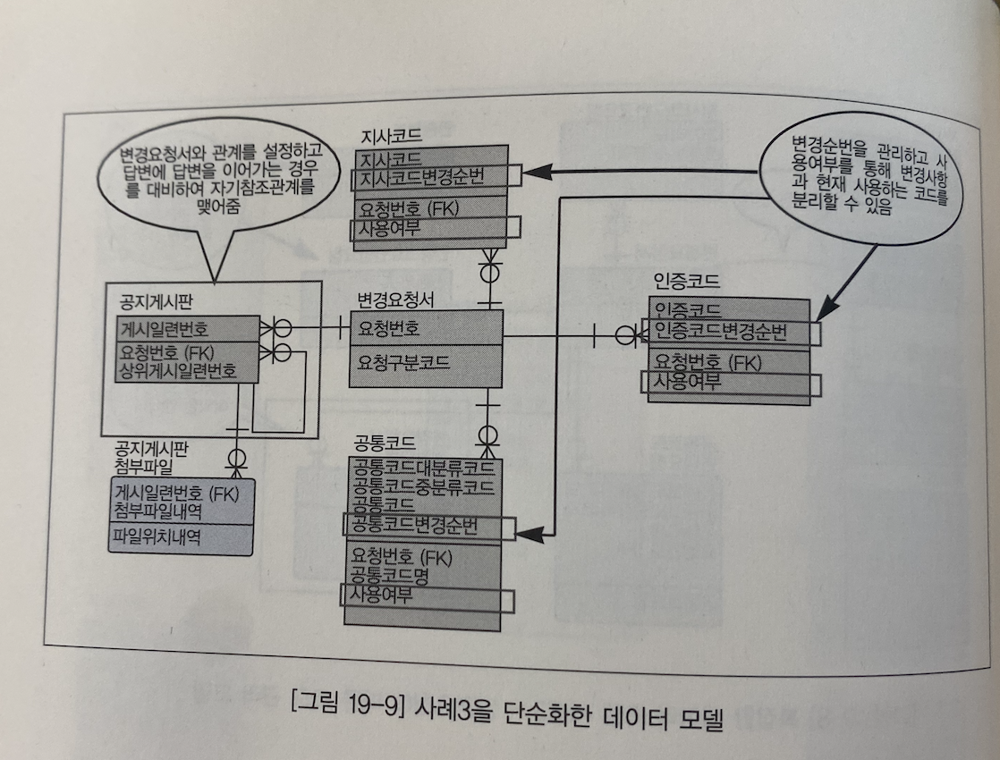

## 👾 단순화, 어떻게 하는가?
> 데이터 모델링을 수행하는 방식에 따라 함수적 종속관계에 의존하여 정규화를 적용하고,
> 엔티티타입 간에 관계가 있는지 분석하여 상호 관계를 연결하는 데이터 모델링을 전개하는 것이 데이터 모델을 단순하게 하는 비결이다.
> 
> 여기서 핵심 적인 키워드는 *'업무 흐름에 맞는 엔티티타입과 관계의 표현 및 정규화 '* 이다


# 테이블 수직/수평 분할에 의한 성능 향상

- 컬럼 수가 많은 테이블에서 컬럼을 기준으로 테이블을 수직 분할 해라
- 데이터가 row(행)이 너무 많은 테이블에서 row(행)을 기준으로 수평 분할 해라 (파티셔닝)


# 수퍼타입/서브타입 모델의 성능 고려 방법

- 어렵다.


# 인덱스 특성을 고려한 PK/FK 데이터베이스 성능 향상

- PK 순서를 결정할 때에는*인덱스 정렬 구조를 이해한 상태에서 인덱스를 효율적으로 이용할 수 있도록* 지정 해야한다
- PK순서가 앞쪽에 위치한 속성 값에 가급적 '=' 아니면 최소한 범위 'BETWEEN' '<>'가 들어와야 인덱스를 이용할 수 있는것이다.
- FK는 데이터를 조회할 때 조인의 경로를 제공하는 역할을 수행하므로 FK에 대해서는 반드시 인덱스를 생성하도록 한다.
- 인덱스 컬럼의 순서를 정할 때도 조회의 조건을 고려하여 접근이 가장 효율적인 컬럼 순서대로 인덱스를 생성하도록 주의 해야한다.

## 🦁 PK 컬럼 순서와 성능 저하의 관계

## 🐱 물리적인 테이블과 FK 인덱스

> 가정
> 학사기준 테이블에 데이터 5만건
> 수강신청 테이블에 데이터가 500만건


- 학사기준과 수강신청에 대한 데이터 모델이다.

> 인덱스를 생성하지 않았기 때문에 학사기준과 수강신청 테이블이 조인되면서 500만건의 수강신청 테이블에 FULL TABLE SCAN이 발생하여 성능이 저하되었다.
>


> FK 인덱스 생성으로 INDEX SCAN이 발생하여 성능이 향상됨.

# 효율적인 채번방식을 통한 성능 향상

- 채번 테이블은 필연적으로 Lock을 유별하는 속성이 있다.
- 마스터 테이블 수정과 같이 Commit이 되어야 한다.

> 왜 채번 테이블을 이용하면 성능이 저하될까? 채번 테이블을 이용할 때 필연적으로 채번의 대상이 되는 테이블을 수정해야 하고 Commit을 날리지 않은 상태에서 즉, 잠금 현상이 지속되고 있는 상태에서 일련번호를 가지고 있는 다른 테이블에 데이터를 입력해야 한다는 특징 때문에 그렇다.


## 🦊 채번의 방법

- [0]  1. 채번 테이블을 이용하여 일련번호를 증가시키는 방법

- [1]  2. 해당 테이블에 일련번호에 최대값+1을 바로 가져오면서 입력하는 방법

- [2]  3. DBMS에서 제공하는 일련번호 증가 오브젝트(예, 오라클의 시퀸스 오브젝트 Mysql AI )를 이용하여 처리하는 방법


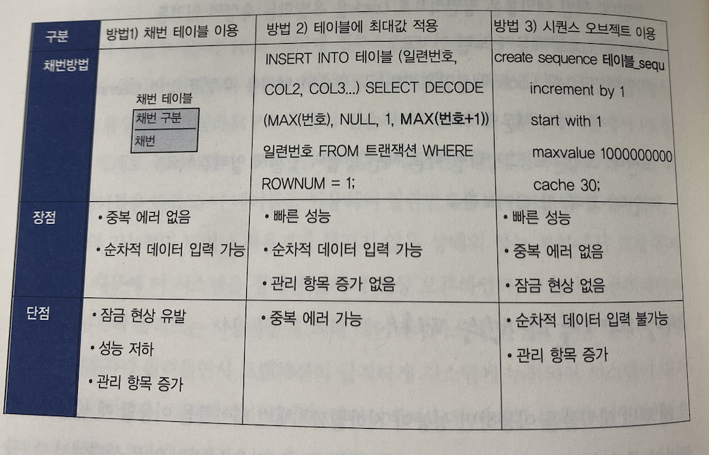

## 🐵 어떤 방법을 선택할까?

> 최대값 사용 : 트랜잭션 많지 않고, 데이터 중복에러 애플리케이션에서 처리 가능 할 때 사용
> 시퀸스 오브젝트 이용 : 중복에러가 발생 할 만큼 트랜잭션 양이 많고 순차적 데이터 입력이 요구되지 않는다면 사용
> 채번 테이블 : 처리 트랜잭션이 적을 때, 업무 특성상 성능이 문제가 되지 않는 경우 사용, 또한 트랜잭션이 대량으로 발생하여 중복 에러가 예상되고 데이터도 순차적으로 입력이 되어야 한다는 전제가 있을 경우 사용.

> 필자는 최대값 사용을 권장함.


# Foreign Key를 이용할 것인가?

- 데이터베이스에 FK가 생성되든 안되든 데이터 모델에는 관계로 모델링되어 있어야 한다.


## 🐶 FK를 생성하지 않으면?
- 데이터의 참조 무경설이 깨지는 것이다.

## 🧚 FK 이용은 필수


# 데이터베이스 분산 설계를 활용하라

- 업무적인 특징을 고려해라


