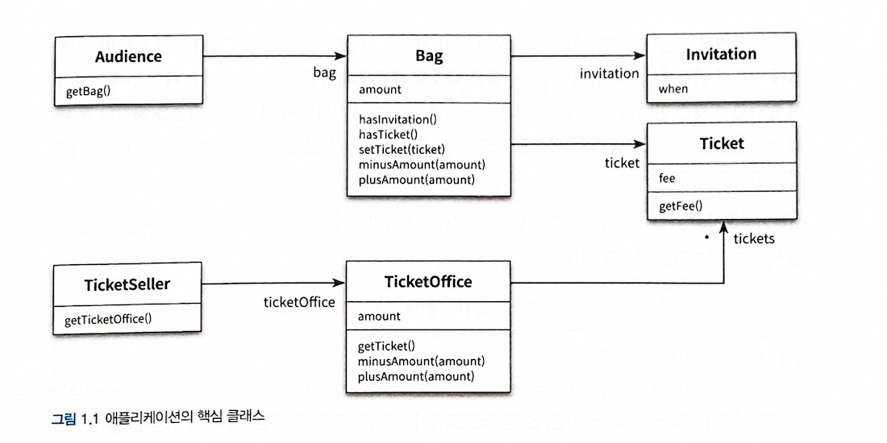

# 티켓 판매 애플리케이션 구현하기
- 티켓을 판매하는 애플리케이션
	- 이벤트에 당첨된 관람객과 그렇지 못한 관람객은 다른 방식으로 입장시켜야 한다.
	- 이벤트 당첨 여부를 확인하고 당첨자가 아닌 경우에는 티켓을 판매한 후에 입장 시켜야 한다.



```ts title="모든 클래스 코드"
// 초대장 클래스
class Invitation {
	private when: Date;

	constructor(when: Date){
		this.when = when;
	}
}

// 티켓 클래스
class Ticket {
	private fee: number;

	constructor(fee: number){
		this.fee = fee;
	}

	public get Fee(): number {
		return this.fee;
	}
}

// 가방 클래스
class Bag {
  private amount: number;
  private invitation?: Invitation; // Optional parameter
  private ticket?: Ticket;

  constructor(amount: number);
  constructor(invitation: Invitation | null, amount: number);
  constructor(invitationOrAmount: Invitation | number | null, amount?: number) {
    if (typeof invitationOrAmount === "number") {
      this.amount = invitationOrAmount;
    } else {
      this.invitation = invitationOrAmount || undefined;
      this.amount = amount!;
    }
  }

  public hasInvitation(): boolean {
    return !!this.invitation;
  }

  public hasTicket(): boolean {
    return !!this.ticket;
  }

  public set Ticket(ticket: Ticket) {
    this.ticket = ticket;
  }

  public minusAmount(amount: number): void {
    this.amount -= amount;
  }

  public plusAmount(amount: number): void {
    this.amount += amount;
  }
}

// 관람객 클래스
class Audience {
	private bag: Bag;

	constructor(bag: Bag) {
		this.bag = bag;
	}

	public get Bag(): Bag {
		return this.bag;
	}
}


// 매표소
class TicketOffice {
	private amount: number;
	private tickets:Ticket[];

	constructor(amount:number, tickets:Ticket[]){
		this.amount = amount;
		this.tickets = tickets;
	}

	public get Ticket(){
		return this.tickets.shift();
	}

    public minusAmount(amount: number): void {
	    this.amount -= amount;
    }

    public plusAmount(amount: number): void {
	    this.amount += amount;
    }
}
// 판매원
class TicketSeller {
	private ticketOffice: TicketOffice;

	constructor(ticketOffice: TicketOffice){
		this.ticketOffice = ticketOffice;
	}

	public get TicketOffice(): TicketOffice {
		return this.ticketOffice;
	}
}

// 소극장 클래스
class Theater{
	private ticketSeller:TicketSeller;

	constructor(ticketSeller:TicketSeller){
		this.ticketSeller = ticketSeller;
	}

	public enter(audience: Audience){
		if (audience.Bag.hasInvitation()){
			const ticket:Ticket = this.ticketSeller.TicketOffice.Ticket!;
			audience.Bag.Ticket = ticket; 
		}else {
			const ticket:Ticket = this.ticketSeller.TicketOffice.Ticket!;
			audience.Bag.minusAmount(ticket.Fee);
			this.ticketSeller.TicketOffice.plusAmount(ticket.Fee);
			audience.Bag.Ticket = ticket;
		}
	}
}
```

> 초대장이라는 개념을 구현한 Invitation
> 공연을 관람할 수 있는 초대일자(when)를 인스턴스 변수로 포함하는 클래스다.
> 공연 관람을 위한 Ticket 클래스
> Bag 클래스는 초대장(invitation), 티켓(ticket), 현금(amount)을 인스턴스 변수로 포함한다.
> 관람객이라는 개념을 구현하는 Audience 클래스는 관람객은 소지품을 보관하기 위해 가방을 소지할 수 있다.
> TicketOffice 매표소클래스 매표소에는 관람객에게 판매할 티켓과 티켓의 판매 금액이 보관돼 있어야 한다.
> TicketOffice는 판매하거나 교환해 줄 티켓의 목록(tickets)과 판매 금액(amount)을 인스턴스 변수로 포함한다.
> TicketSeller 클래스는 초대장을 티켓으로 교환해주거나 티켓을 판매하는 역할
> TicketSeller 클래스는 자신이 일하는 매표소(TicketOffice)를 알고 있어야 한다.
> 핵심 클래스들을 조합해서 관람객을 소극장에 입장 시키는 로직을 완성하면 끝이다.
> Theater (소극장) 클래스가 관람객을 맞이 할 수 있도록 enter 메서드를 구현

- 소극장
	- 관람객 가방안에 초대장 확인
		- 초대장 O
			- 판매원한테 받은 티켓을 관람객 가방에 넣어준다.
		- 초대장 X
			- 티켓을 판매한다.


# 무엇이 문제인가
> 로버트 마틴 소프트웨어 모듈이 가져야 하는 세 가지 목적

1. 모든 모듈은 제대로 동작해야 한다.
2. 모든 모듈은 변경을 위해 존재 하는 것이다.
3. 코드를 읽는 사람과 의사소통 하는 것이다.

> 위의 프로그램은 관람객들을 입장 시키는 데 필요한 기능을 오류 없이 정확하게 수행하고 있기 때문에 첫번째 목적은 부합한다.
> 하지만 변경 용이성과 읽는 사람과의 의사소통이라는 목적은 만족시키지 못한다.

## 예상을 빗나가는 코드

- **문제**  : 관람객과 판매원이 소극장의 통제를 받는 수동적인 존재라는 점이다.

> 즉, 당신이 관람객이라면  소극장이라는 제 3자가 초대장 확인을 위해 관람객의 가방을 마음대로 열어 본다
> 당신이 판매원이라면 소극장이 허락도 없이 매표소에 보관중인 티켓과 현금에 마음대로 접근 할 수 있다.

- *이해 가능한 코드* : 그 동작이 우리의 예상에서 크게 벗어나지 않는 코드이다.


## 변경에 취약한 코드
> enter 메서드를 다시 한번 확인 해보면
> *Audience와 TicketSeller를 변경 할 경우 Theater도 함께 변경 해야 한다는 사실이 가장 심각한 문제이다* 

```ts
class Theater{
	private ticketSeller:TicketSeller;

	constructor(ticketSeller:TicketSeller){
		this.ticketSeller = ticketSeller;
	}

	public enter(audience: Audience){
		if (audience.Bag.hasInvitation()){
			const ticket:Ticket = this.ticketSeller.TicketOffice.Ticket!;
			audience.Bag.Ticket = ticket; 
		}else {
			const ticket:Ticket = this.ticketSeller.TicketOffice.Ticket!;
			audience.Bag.minusAmount(ticket.Fee);
			this.ticketSeller.TicketOffice.plusAmount(ticket.Fee);
			audience.Bag.Ticket = ticket;
		}
	}
}
```

> 관람객이 가방을 들고 있다는 가정으로 바꾸게 되었다면 `Audience` 클래스에서 `Bag` 을 제거 해야 할 뿐만 아니라 `Audience` 의 `Bag` 에 직접 접근하는 `Theater` 의 `enter` 메서드 역시 수정해야 한다.

- *의존성(dependency)* #객체지향/depencency: 다른 클래스가 `Audience` 의 내부에 대해 더 많이 알면 알수록 `Audience` 를 변경하기 어려워지고 이것을 객체 사이의 의존성 과 관련된 문제이다.
- 목표는 애플리케이션의 기능을 구현하는 데 필요한 최소한의 의존성만 유지하고 불필요한 의존성을 제거하는 것이다.


- *결합도(coupling)* #객체지향/coupling: 객체 사이의 의존성이 과한 경우
- 결합도가 낮다 : 객체들이 합리적인 수준으로 의존할 경우
- 결합도 -> 의존성 -> 변경

# 설계 개선하기
> 관람객과 판매원을 *자율적인 존재* 로 만들면 된다.


-  *캡슐화(encapsulation)* #객체지향/encapsulation 
	- 개념적이나 물리적으로 세부적인 사항을 감추는 것을 캡슐화라고 한다.
	- 변경하기 쉬운 객체를 만드는것이 목적이다.
	- 캡슐화를 통해 객체 내부로의 접근을 제한하면 객체와 객체 사이의 결합도를 낮출 수 있으므로 설계를 좀 더 쉽게 변경할 수 있다.
	- 객체를 인터페이스와 구현으로 나누고 인터페이스만 공개하는 것은 객체 사이의 결합도를 낮추고 변경하기 쉬운 코드를 작성하기 위한 가장 기본적인 설계 원칙


> 핵심은 객체 내부의 상태를 캡슐화 하고 객체 간에 오직 메세지를 통해서만 상호작용하도록 만드는것


- *응집도(cohesion)* #객체지향/cohesion 
	- 밀접하게 연관된 작업만을 수행하고 연관성 없는 작업은 다른 객체에게 위임하는 객체를 응집도가 높다고 한다.
	- 자신의 데이터를 스스로 처리하는 자율적인 객체를 만들면 결합도를 낮추고 응집도를 높일 수 있다.
	- 응집도를 높이기 위해서는 객체 스스로 자신의 데이터를 책임져야한다.

## 결론
> 객체는 자신의 데이터를 스스로 처리하는 *자율적인 존재* 여야 한다.
> 외부의 간섭을 최대한 배제하고 *메세지* 를 통해서만 *협력* 하는 *자율적인 객체* 들의 공동체를 만드는것이 훌륭한 객체지향 설계

## 절차지향과 객체지향

