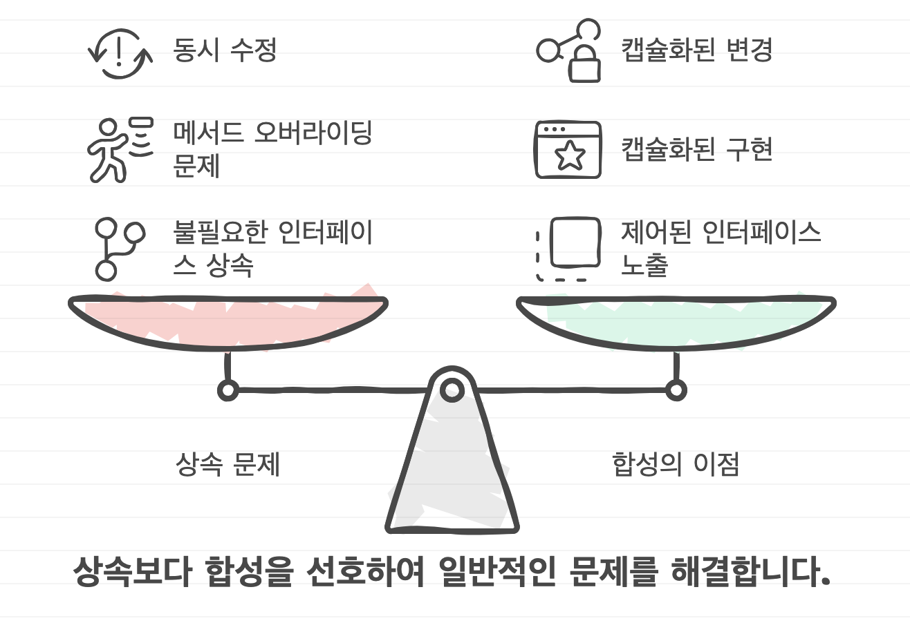
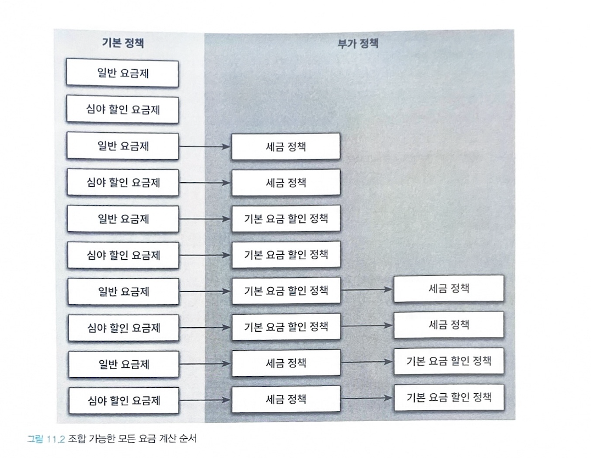
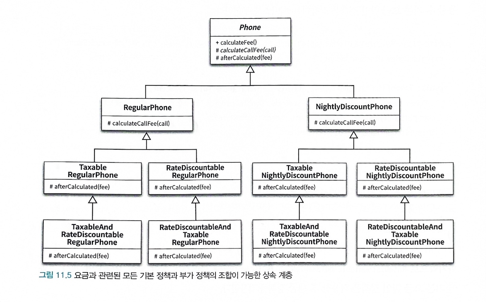
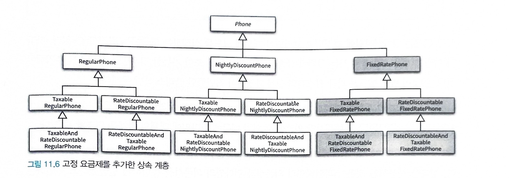
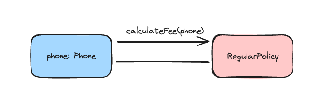
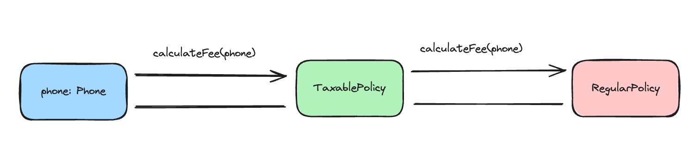
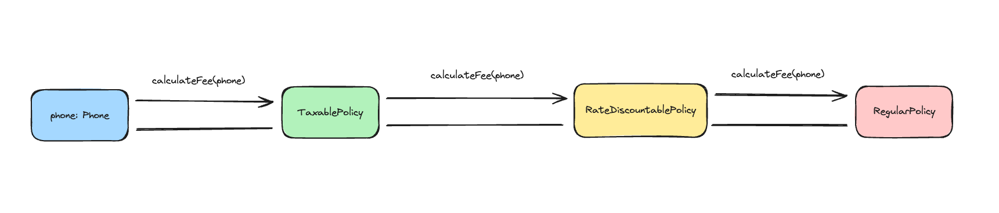
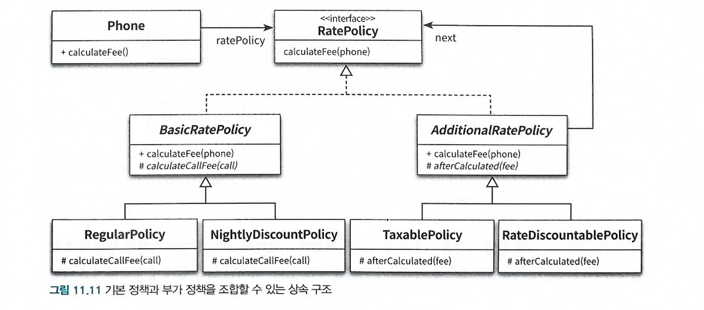

#객체지향/composition-합성 
- 상속
	- 부모 클래스와 자식 클래스를 연결해서 부모 클래스의 코드를 재사용한다.
	- 의존성은 컴파일 타임에서 해결된다.
	- `is-a 관계` 라고 부른다.
	- 상속 관계는 클래스 사이의 정적인 관계
	- 코드 작성 시점에 결정한 상속 관계는 변경이 불가능
	- 부모 클래스 안에 구현된 코드 자체를 재사용한다.
	- 클래스 사이의 높은 결합도 발생

- 합성
	- 전체를 표현하는 객체가 부분을 표현하는 객체를 포함해서 부분 객체의 코드를 재사용한다.
	- 두 객체 사이의 의존성은 런타임에 해결된다.
	- `has-a 관계` 라고 부른다.
	- 객체 사이의 동적인 관계
	- 실행 시점에 동적으로 변경 할 수 있다.
	- 포함되는 객체의 퍼블릭 인터페이스를 재사용 한다. 구현에 대한 의존성을 인터페이스에 대한 의존성으로 변경할 수 있다.
	- 클래스 사이의 높은 결합도를 객체 사이의 낮은 결합도로 대체할 수 있다.

> *합성* 은 구현에 의존하지 않는다. 내부에 포함되는 객체의 구현이 아닌 퍼블릭 인터페이스에 의존하므로 구현이 변경되더라도 영향을 최소화 할 수 있다.


# 🍊 상속을 합성으로 변경하기
> 상속을 남용 했을 때 생길 수 있는 세가지 문제

- [0] 불필요한 인터페이스 상속 문제


```java title="Properties를 합성 관계로 변경"
public class Properties {
	private Hashtable<String, String> properties = new Hashtable <>();

	public String setProperty(String key, String value){
		return properties.put(key, value);
	}

	public String getProperty(String key){
		return properties.get(key);
	}
}
```

- 합성 관계로 변경하기 위해 `Properties` 클래스에서 상속 관계를 제거하고 `Hashtable` 을 `Properties` 의 인스턴스 변수로 포함 시키면 합성 관계로 변경 할 수 있다.

- [1] 메서드 오버라이딩의 오작용 문제

```java title="InstrunmentedHashSet를 합성 관계로 변경"
public class InstrunmentedHashSet<E>{
	private int addCount = 0;
	private Set<E> = set;

	public InstrunmentedHashSet(Set<E> set) {
		this.set = set;
	}

	public boolean add(E e){
		addCount++;
		return set.add(e);
	}

	public boolean addAll(Collection<? extends E> c){
		addCount += c.size();
		return set.addAll(c);
	}

	public int getAddCount(){
		return addCount;
	}
}
```

- 위의 `Properties` 를 합성으로 변경한 이유는 불필요한 오퍼레이션들이 퍼블릭 인터페이스에 스며드는것을 방지하기 위해서고
- `InstrumentedHashSet` 의 경우에 `HashSet` 이 제공하는 퍼블릭 인터페이스를 그대로 제공해야 한다.
- `InstrumentedHashSet` 이 `Set` 인터페이스를 실체화하면서 내부에 `HashSet` 의 인스턴스를 합성하면 `HashSet` 에 대한 구현 결합도는 제거하면서 퍼블릭 인터페이스는 그대로 유지할 수 있다.


- [2] 부모 클래스와 자식 클래스의 동시 수정 문제

```java
public class PersonalPlaylist{
	private Playlist playlist = new Playlist();

	public void append(Song song){
		playlist.append(song);
	}

	public void remove(Song song){
		playlist.getTracks().remove(song);
		playlist.getSingers().remove(song.getSinger());
	}
}
```

- `Playlist` 의 경우에는 합성으로 변경하더라도 함께 수정되는 문제가 해결되지 않는다.
- 그래도 *상속보다 합성을 사용하는게 더 좋다* 
	- 향후 `Playlist` 의 내부 구현을 변경하더라도 파급효과를 최대한 `PersonalPlaylist` 내부로 캡슐화 할 수 있기 때문이다.
- **구현에 대한 결합보다(상속) 인터페이스에 대한 결합(합성)이 더 좋다**

## 결론
- 합성을 사용하면 위의 세가지 문제를 해결 할 수 있다.
- 상속을 합성으로 바꾸는 방법은 자식 클래스에 선언된 상속 관계를 제거하고 부모 클래스의 인스턴스를 자식 클래스의 인스턴스 변수로 선언하면 된다.




# 🍉 상속으로 인한 조합의 폭발적인 증가
> 상속으로 인해 결합도가 높아지면 생길 수 있는 문제

- 하나의 기능을 추가하거나 수정하기 위해 불필요하게 많은 수의 클래스를 추가하거나 수정해야 한다.
- 단일 상속만 지원하는 언어에서는 오히려 중복 코드의 양이 늘어날 수 있다.

`합성` 을 사용하면 이와 같은 문제들을 해결할 수 있다.

## 기본 정책과 부가 정책 조합하기
> 10장의 '핸드폰 과금 시스템'을 예시로 사용

- 기본 정책
	- 일반 요금제
	- 심야 할인 요금제
- 부가 정책
	- 세금 정책
	- 기본 요금 할인 정책

> 예시를 이해하기 위한 부가 정책의 특성

- 기본 정책의 계산 결과에 적용된다.
	- 세금 정책은 기본 정책인 `RegularPhone` 이나 `NgightlyDiscountPhone` 의 계산이 끝난 결과에 세금을 부과한다.
- 선택적으로 적용할 수 있다.
	- 기본 정책의 계산 결과에 세금 정책을 적용할 수 도 있고 적용하지 않을 수 도 있다.
- 조합 가능하다
	- 기본 정책에 세금 정책만 적용하는 것도 가능하고, 기본 요금 할인 정책만 적용하는 것도 가능하다.
	- 세금 정책과 기본 요금 할인 정책을 함께 적용 하는것도 가능해야 한다.
- 부가 정책은 임의의 순서로 적용 가능하다
	- 기본 정책에 세금 정책과 기본 요금 할인 정책을 함께 적용 할 경우 세금 정책을 적용한 후에 기본 요금 할인 정책을 적용할 수 있도 있고, 기본 요금 할인 정책을 적용한 후에 세금 정책을 적용할 수 도 있다.



> 기본 정책과 부가 정책을 조합해서 만들 수 있는 모든 요금 정책의 종류의 그림


## 상속을 이용해서 기본 정책 구현하기

```typescript title="10장 예제코드"
class Call {
  private from: Date;
  private to: Date;
  constructor(from: Date, to: Date) {
    this.from = from;
    this.to = to;
  }

  public get Duration(): number {
    return (this.to.getTime() - this.from.getTime()) / 1000;
  }

  public get From(): Date {
    return this.from;
  }
}

abstract class Phone {
  private calls: Call[] = [];

  public calculateFee(): Money {
    let result = Money.ZERO;

    for (const call of this.calls) {
      result = result.plus(this.calculateCallFee(call));
    }

    return result;
  }

  protected abstract calculateCallFee(call: Call): Money;
}

class RegularPhone extends Phone {
  private amount: Money;
  private seconds: number;

  constructor(amount: Money, seconds: number) {
    super();
    this.amount = amount;
    this.seconds = seconds;
  }

  protected override calculateCallFee(call: Call): Money {
    return this.amount.times(call.Duration / this.seconds);
  }
}

class NightlyDiscountPhone extends Phone {
  private static LATE_NIGHT_HOUR: number = 22;

  private nightlyAmount: Money;
  private regularAmount: Money;
  private seconds: number;

  constructor(nightlyAmount: Money, regularAmount: Money, seconds: number) {
    super();
    this.nightlyAmount = nightlyAmount;
    this.regularAmount = regularAmount;
    this.seconds = seconds;
  }

  protected override calculateCallFee(call: Call): Money {
    if (call.From.getHours() >= NightlyDiscountPhone.LATE_NIGHT_HOUR) {
      return this.nightlyAmount.times(call.Duration / this.seconds);
    }
    return this.regularAmount.times(call.Duration / this.seconds);
  }
}
```

## 기본 정책에 세금 정책 조합하기
> 일반 요금제에 세금 정책을 조합
> > RegularPhone클래스를 상속받은 TaxableRegularPhone 클래스를 추가하는것

```typescript title="TaxableRegularPhone 클래스 "
class TaxableRegularPhone extends RegularPhone {
  private taxRate: number;

  constructor(amount: Money, seconds: number, taxRate: number) {
    super(amount, seconds);
    this.taxRate = taxRate;
  }

  protected override calculateCallFee(call: Call): Money {
    const fee = super.calculateFee();
    return fee.plus(fee.times(this.taxRate));
  }
  
}
```

> 부모의 결과값 `{ts icon title:"부모의 calculateFee 결과"}const fee = super.calculateFee();` 
> 를 받아서 taxRate를 계산 해준다.

- 자식 클래스와 부모 클래스 사이의 결합도가 높아진다.
	- *결합도를 낮추려면 자식 클래스가 부모 클래스의 메서드를 호출하지 않도록 부모 클래스에 추상 메서드를 제공 한다.* 

```ts title="Phone 추상 클래스" hl:15
abstract class Phone {
  private calls: Call[] = [];

  public calculateFee(): Money {
    let result = Money.ZERO;

    for (const call of this.calls) {
      result = result.plus(this.calculateCallFee(call));
    }

    return result;
  }

  protected abstract calculateCallFee(call: Call): Money;
  protected abstract afterCalculated(fee: Money): Money;
}
```

```typescript title="RegularPhone 수정" hl:15-17
class RegularPhone extends Phone {
  private amount: Money;
  private seconds: number;

  constructor(amount: Money, seconds: number) {
    super();
    this.amount = amount;
    this.seconds = seconds;
  }

  protected override calculateCallFee(call: Call): Money {
    return this.amount.times(call.Duration / this.seconds);
  }
  
  protected override afterCalculated(fee: Money) {
    return fee;
  }
}
```

```ts title="NightlyDiscountPhone 수정" hl:22-24
class NightlyDiscountPhone extends Phone {
  private static LATE_NIGHT_HOUR: number = 22;

  private nightlyAmount: Money;
  private regularAmount: Money;
  private seconds: number;

  constructor(nightlyAmount: Money, regularAmount: Money, seconds: number) {
    super();
    this.nightlyAmount = nightlyAmount;
    this.regularAmount = regularAmount;
    this.seconds = seconds;
  }

  protected override calculateCallFee(call: Call): Money {
    if (call.From.getHours() >= NightlyDiscountPhone.LATE_NIGHT_HOUR) {
      return this.nightlyAmount.times(call.Duration / this.seconds);
    }
    return this.regularAmount.times(call.Duration / this.seconds);
  }

  protected override afterCalculated(fee: Money) {
    return fee;
  }
}
```

> 위 코드에서의 문제점

- *부모 클래스에 추상 메서드를 추가하면 모든 자식 클래스들이 추상 메서드를 오버라이딩해야 하는 문제가 발생한다* 
- 모든 추상 메서드의 구현이 동일 하다.


```typescript title="유연성은 유지하면서 중복 코드를 제거하는 방법"
abstract class Phone {
  private calls: Call[] = [];

  protected afterCalculated(fee: Money): Money {
    return fee;
  }

  public calculateFee(): Money {
    let result = Money.ZERO;

    for (const call of this.calls) {
      result = result.plus(this.calculateCallFee(call));
    }

    return result;
  }

  protected abstract calculateCallFee(call: Call): Money;
}
```

> 유연성은 유지하면서 중복 코드를 제거하는 방법
> 이제 `RegularPhone` 과 `NightlyDiscountPhone` 클래스에서 `afterCalculated` 메서드를 오버라이딩 할 필요가 없다.


## 추상 메서드와 훅 메서드
#객체지향/추상메서드와훅메서드
- 개방-폐쇄 원칙을 만족하는 설계를 만드는 방법은 한가지로 부모 클래스에 새로운 추상 메서드를 추가하고 부모 클래스의 다른 메서드 안에서 호출하는 것이다.
	- 자식 클래스는 추상 메서드를 오버라이딩함.
- *추상 메서드의 단점*  : 상속 계층에 속하는 **모든 자식 클래스가 추상 메서드를 오버라이딩** 해야 한다.
- *훅 메서드(hook method)* : 자식 클래스가 추상 메서드를 동일한 방식으로 구현 했을때 중복 코드가 존재하게 되는데 이를 해결하기 위해 추상 메서드와 동일하게 자식 클래스에서 오버라이딩할 의도로 메서드를 추가 했지만 편의를 위해 기본 구현을 제공하는 메서드.

```typescript title="일반 요금제 세금 정책과 심야 할인 요금 세금 정책"
class TaxableRegularPhone extends RegularPhone {
  private taxRate: number;

  constructor(amount: Money, seconds: number, taxRate: number) {
    super(amount, seconds);
    this.taxRate = taxRate;
  }

  // protected override calculateCallFee(call: Call): Money {
  //   const fee = super.calculateFee();
  //   return fee.plus(fee.times(this.taxRate));
  // }

  protected override afterCalculated(fee: Money): Money {
    return fee.plus(fee.times(this.taxRate));
  }
}
// 심야 할인 요금제의 세금 부과
class TaxableNightlyDiscountPhone extends NightlyDiscountPhone {
  private taxRate: number;

  constructor(
    nightlyAmount: Money,
    regularAmount: Money,
    seconds: number,
    taxRate: number
  ) {
    super(nightlyAmount, regularAmount, seconds);
    this.taxRate = taxRate;
  }

  protected override afterCalculated(fee: Money): Money {
    return fee.plus(fee.times(this.taxRate));
  }
}
```


### 사용
```ts
...

// 일반 요금제 단독 사용
const regularPhone = new RegularPhone(Money.wons(10), 10);

// 일반 요금제 + 세금 적용
const taxableRegularPhone = new TaxableRegularPhone(Money.wons(10), 10, 0.05);

// 심야 할인 요금제 단독 사용
const nightlyDiscountPhone = new NightlyDiscountPhone(
  Money.wons(5),
  Money.wons(10),
  10
);

// 심야 할인 요금제 + 세금 적용
const taxableNightlyDiscountPhone = new TaxableNightlyDiscountPhone(
  Money.wons(5),
  Money.wons(10),
  10,
  0.05
);
```

> 문제
> `TaxableNightlyDiscountPhone` 과 `TaxableRegularPhone` 사이에 코드를 중복했다는 것이다.
> 보통 객체지향 언어는 단일 상속만 지원하기 때문에 *상속으로 인해 발생하는 중복 코드 문제를 해결하기가 쉽지 않다.* 


## 기본 정책에 기본 요금 할인 정책 조합하기
> 두번째 부가 정책 기본 요금 할인 정책 추가


> 일반 요금제와 기본 요금 할인 정책

```ts title="일반 요금제와 기본 요금 할인 정책"
class RateDiscountableRegularPhone extends RegularPhone {
  private discountAmount: Money;

  constructor(amount: Money, seconds: number, discountAmount: Money) {
    super(amount, seconds);
    this.discountAmount = discountAmount;
  }

  protected override afterCalculated(fee: Money): Money {
    return fee.minus(this.discountAmount);
  }
}
```

> 심야 할인 요금제와 기본 할인 정책

```ts title="심야 할인 요금제와 기본 할인 정책"
class RateDiscountableNightlyDiscountPhone extends NightlyDiscountPhone {
  private discountAmount: Money;

  constructor(
    nightlyAmount: Money,
    regularAmount: Money,
    seconds: number,
    discountAmount: Money
  ) {
    super(nightlyAmount, regularAmount, seconds);
    this.discountAmount = discountAmount;
  }

  protected override afterCalculated(fee: Money): Money {
    return fee.minus(this.discountAmount);
  }
}
```


## 중복 코드의 덫에 걸리다
> 부가 정책을 구현한 `RateDiscountableRegularPhone` 클래스와 `RateDiscountableNightlyDiscountPhone` 클래스 사이에 중복 코드로 인해 초래하는 문제

1. 부가 정책은 자유롭게 조합할 수 있어야 한다.
	- 세금 정책과 기본 요금 할인 정책을 함께 적용하는것도 가능해야 한다.
2. 부가 정책은 적용 순서 역시 임의로 결정 할 수 있어야 한다.
	- 세금 정책을 적용한 후에 기본 요금 할인 정책을 적용하거나 기본 요금 할인 정책을 적용한 후에 세금 정책을 적용하는것도 가능해야 한다.

> 상속으로 해결하는 방법은 모든 가능한 조합별로 자식 클래스를 하나씩 추가하는것이다.

```typescript

/**
 * 일반 요금제의 계산 결과에 세금 정책을 조합한 후 기본 요금 할인 정책을 추가
 */
class TaableAndRateDiscountableRegularPhone extends TaxableRegularPhone {
  private discountAmount: Money;

  constructor(
    amount: Money,
    seconds: number,
    taxRate: number,
    discountAmount: Money
  ) {
    super(amount, seconds, taxRate);
    this.discountAmount = discountAmount;
  }

  protected override afterCalculated(fee: Money): Money {
    return fee.minus(this.discountAmount);
  }
}
```

```typescript
/**
 * 표준 요금제에 기본 요금 할인 정책을 먼저 적용한 후 세금을 나중에 부과
 */
class RateDiscountableAndTaxableRegularPhone extends RateDiscountableRegularPhone {
  private taxRate: number;

  constructor(
    amount: Money,
    seconds: number,
    discountAmount: Money,
    taxRate: number
  ) {
    super(amount, seconds, discountAmount);
    this.taxRate = taxRate;
  }

  protected override afterCalculated(fee: Money): Money {
    return fee.plus(fee.times(this.taxRate));
  }
}
```

```typescript
/**
 *심야 할인 요금제의 계산 결과에 세금 정책을 적용한 후 기본 요금 할인 정책을 적용
 */
class TaxableAndDiscountableNightlyDiscountPhone extends TaxableNightlyDiscountPhone {
  private discountAmount: Money;

  constructor(
    nightlyAmount: Money,
    regularAmount: Money,
    seconds: number,
    taxRate: number,
    discountAmount: Money
  ) {
    super(nightlyAmount, regularAmount, seconds, taxRate);
    this.discountAmount = discountAmount;
  }

  protected override afterCalculated(fee: Money): Money {
    return fee.minus(this.discountAmount);
  }
}
```

```typescript
/**
 * 심야 할인 요금제의 계산 결과에 기본 요금 할인 정책을 적용한 후 세금 정책을 적용
 */
class RateDiscountableAndTaxableNightlyDiscountPhone extends RateDiscountableNightlyDiscountPhone {
  private taxRate: number;

  constructor(
    nightlyAmount: Money,
    regularAmount: Money,
    seconds: number,
    discountAmount: Money,
    taxRate: number
  ) {
    super(nightlyAmount, regularAmount, seconds, discountAmount);
    this.taxRate = taxRate;
  }

  protected override afterCalculated(fee: Money): Money {
    return fee.plus(fee.times(this.taxRate));
  }
}
```




### 문제 발생
- 새로운 정책을 추가하기가 어렵다.
- 새로운  기본 정책으로 `FixedRatePhone` 고정 요금제를 추가 한다고 가정
	- 모든 부가 정책은 기본 정책에 적용 가능해야 하며 조합 순서 역시 자유로워야 한다.
	- 새로운 기본 정책을 추가하면 그에 따라 조합 가능한 부가 정책의 수만큼 새로운 클래스를 추가 해야함.
- 새로운 부가 정책을 추가하는 경우
	- 개통 후 일정 기간 동안 요금 일부를 할인해 주는 '약정 할인 정책' 추가 한다고 가정
		- 문제는 `RegularPhone` , `NightlyDiscountPhone` , `FixedRatePhone` 약정 할인 정책을 선택적으로 적용할 수 있어야 한다.
		- 또한 다른 부가 정책 세금 정책, 기본 요금 할인 정책과도 임의 순서로 조합 가능 해야 한다.
		- 즉, 엄청난 갯수의 클래스를 추가 해야함 이를 클래스 폭발이라고 함 
- 클래스 폭발(class explosion) : 상속의 남용으로 하나의 기능을 추가하기 위해 필요 이상으로 많은 수의 클래스를 추가 해야 하는 경우를 가리킨다.
- *부모 클래스와 자식 클래스의 다양한 조합이 필요한 상황에서 유일한 해결 방법은 조합의 수만큼 새로운 클래스를 추가하는것 뿐이다* 
- 클래스 폭발 문제는 새로운 기능을 추가할 때 뿐만 아니라 수정할때도 문제가 된다.


```ts title="최종코드"
class Call {
  private from: Date;
  private to: Date;
  constructor(from: Date, to: Date) {
    this.from = from;
    this.to = to;
  }

  public get Duration(): number {
    return (this.to.getTime() - this.from.getTime()) / 1000;
  }

  public get From(): Date {
    return this.from;
  }
}

abstract class Phone {
  private calls: Call[] = [];

  protected afterCalculated(fee: Money): Money {
    return fee;
  }

  public calculateFee(): Money {
    let result = Money.ZERO;

    for (const call of this.calls) {
      result = result.plus(this.calculateCallFee(call));
    }

    return result;
  }

  protected abstract calculateCallFee(call: Call): Money;
}

class RegularPhone extends Phone {
  private amount: Money;
  private seconds: number;

  constructor(amount: Money, seconds: number) {
    super();
    this.amount = amount;
    this.seconds = seconds;
  }

  protected override calculateCallFee(call: Call): Money {
    return this.amount.times(call.Duration / this.seconds);
  }
}

class NightlyDiscountPhone extends Phone {
  private static LATE_NIGHT_HOUR: number = 22;

  private nightlyAmount: Money;
  private regularAmount: Money;
  private seconds: number;

  constructor(nightlyAmount: Money, regularAmount: Money, seconds: number) {
    super();
    this.nightlyAmount = nightlyAmount;
    this.regularAmount = regularAmount;
    this.seconds = seconds;
  }

  protected override calculateCallFee(call: Call): Money {
    if (call.From.getHours() >= NightlyDiscountPhone.LATE_NIGHT_HOUR) {
      return this.nightlyAmount.times(call.Duration / this.seconds);
    }
    return this.regularAmount.times(call.Duration / this.seconds);
  }
}

class Money {
  static readonly ZERO = Money.wons(0);

  constructor(private _amount: number) {}

  static wons(amount: number) {
    return new Money(amount);
  }

  public plus(money: Money): Money {
    return new Money(this._amount + money._amount);
  }

  public minus(money: Money): Money {
    return new Money(this._amount - money._amount);
  }

  public times(percent: number): Money {
    return new Money(this._amount * percent);
  }

  public get Amount(): number {
    return this._amount;
  }
}

class TaxableRegularPhone extends RegularPhone {
  private taxRate: number;

  constructor(amount: Money, seconds: number, taxRate: number) {
    super(amount, seconds);
    this.taxRate = taxRate;
  }

  // protected override calculateCallFee(call: Call): Money {
  //   const fee = super.calculateFee();
  //   return fee.plus(fee.times(this.taxRate));
  // }

  protected override afterCalculated(fee: Money): Money {
    return fee.plus(fee.times(this.taxRate));
  }
}

class TaxableNightlyDiscountPhone extends NightlyDiscountPhone {
  private taxRate: number;

  constructor(
    nightlyAmount: Money,
    regularAmount: Money,
    seconds: number,
    taxRate: number
  ) {
    super(nightlyAmount, regularAmount, seconds);
    this.taxRate = taxRate;
  }

  protected override afterCalculated(fee: Money): Money {
    return fee.plus(fee.times(this.taxRate));
  }
}

class RateDiscountableRegularPhone extends RegularPhone {
  private discountAmount: Money;

  constructor(amount: Money, seconds: number, discountAmount: Money) {
    super(amount, seconds);
    this.discountAmount = discountAmount;
  }

  protected override afterCalculated(fee: Money): Money {
    return fee.minus(this.discountAmount);
  }
}

class RateDiscountableNightlyDiscountPhone extends NightlyDiscountPhone {
  private discountAmount: Money;

  constructor(
    nightlyAmount: Money,
    regularAmount: Money,
    seconds: number,
    discountAmount: Money
  ) {
    super(nightlyAmount, regularAmount, seconds);
    this.discountAmount = discountAmount;
  }

  protected override afterCalculated(fee: Money): Money {
    return fee.minus(this.discountAmount);
  }
}

/**
 * 일반 요금제의 계산 결과에 세금 정책을 조합한 후 기본 요금 할인 정책을 추가
 */
class TaableAndRateDiscountableRegularPhone extends TaxableRegularPhone {
  private discountAmount: Money;

  constructor(
    amount: Money,
    seconds: number,
    taxRate: number,
    discountAmount: Money
  ) {
    super(amount, seconds, taxRate);
    this.discountAmount = discountAmount;
  }

  protected override afterCalculated(fee: Money): Money {
    return fee.minus(this.discountAmount);
  }
}

/**
 * 표준 요금제에 기본 요금 할인 정책을 먼저 적용한 후 세금을 나중에 부과
 */
class RateDiscountableAndTaxableRegularPhone extends RateDiscountableRegularPhone {
  private taxRate: number;

  constructor(
    amount: Money,
    seconds: number,
    discountAmount: Money,
    taxRate: number
  ) {
    super(amount, seconds, discountAmount);
    this.taxRate = taxRate;
  }

  protected override afterCalculated(fee: Money): Money {
    return fee.plus(fee.times(this.taxRate));
  }
}

/**
 *심야 할인 요금제의 계산 결과에 세금 정책을 적용한 후 기본 요금 할인 정책을 적용
 */
class TaxableAndDiscountableNightlyDiscountPhone extends TaxableNightlyDiscountPhone {
  private discountAmount: Money;

  constructor(
    nightlyAmount: Money,
    regularAmount: Money,
    seconds: number,
    taxRate: number,
    discountAmount: Money
  ) {
    super(nightlyAmount, regularAmount, seconds, taxRate);
    this.discountAmount = discountAmount;
  }

  protected override afterCalculated(fee: Money): Money {
    return fee.minus(this.discountAmount);
  }
}

/**
 * 심야 할인 요금제의 계산 결과에 기본 요금 할인 정책을 적용한 후 세금 정책을 적용
 */
class RateDiscountableAndTaxableNightlyDiscountPhone extends RateDiscountableNightlyDiscountPhone {
  private taxRate: number;

  constructor(
    nightlyAmount: Money,
    regularAmount: Money,
    seconds: number,
    discountAmount: Money,
    taxRate: number
  ) {
    super(nightlyAmount, regularAmount, seconds, discountAmount);
    this.taxRate = taxRate;
  }

  protected override afterCalculated(fee: Money): Money {
    return fee.plus(fee.times(this.taxRate));
  }
}
```
# 🐼 합성 관계로 변경하기
## 상속
- 상속은 컴파일타임에 결정되고 고정되기 때문에 코드를 실행하는 도중에는 변경할 수 없다.
	- 여러 기능을 조합해야 하는 설계에 상속을 이용하면 모든 조합 가능한 경우별로 클래스를 추가 해야한다.
		- 이것이 *클래스 폭발* 문제이다.
- 상속은 컴파일 타임 의존성과 런타임의 의존성을 동일하게 만들겠다고 선언하는 것이다.
- 상속은 부모 클래스와 자식 클래스 사이의 관계가 정적으로 고정, 실행 시점에 동적으로 관계를 변경 할 수 있는 방법이 없다.
- 상속은 조합의 결과를 개별 클래스 안으로 밀어 넣는 방법


## 합성
- 합성은 컴파일타임 관계를 런타임 관계로 변경함으로써 이 문제를 해결한다.
	- 합성을 사용하면 구현이 아닌 퍼블릭 인터페이스에 대해서만 의존할 수 있기 때문에 런타임에 객체의 관계를 변경할 수 있다.
- 합성은 런타임에 동적으로 변경할 수 있다.
- 합성은 컴파일타임 의존성과 런타임 의존성을 다르게 만들 수 있다.
- 합성을 사용하면 구현 시점에 정책들의 관계를 고정시킬 필요가 없으며 실행 시점에 정책들의 관계를 유연하게 변경할 수 있게 된다.
- 합성은 조합을 구성하는 요소들을 개별 클래스로 구현한 후 실행 시점에 인스턴스를 조립하는 방법을 사용
- 가장 큰 장점은 컴파일 의존성에 속박되지 않고 다양한 방식의 런타임 의존성을 구성할 수 있다는것


> 유연한 설계를 위해서
> *컴파일 타임 의존성과 런타임 의존성의 거리가 멀수록 설계가 유연해진다* 
> 컴파일 타임 의존성과 런타임 의존성의 거리가 멀면 멀수록 설계의 복잡도가 증가해서 코드를 이해하기 어려운것도 사실이다.
> *설계는 변경과 유지보수를 위해 존재한다는 사실을 기억하라*  **설계는 트레이드오프의 산물이다** 

## 기본 정책 합성하기
> 합성 하기 위해 할 일

1. 각 정책을 별도의 클래스로 구현
2. 핸드폰이라는 개념으로부터 요금 계산 방법이라는 개념을 분리해야 한다.

```ts
/**
* 기본 정책과 부과정책을 포괄하는 RatePolicy 인터페이스
* RatePolict는 Phone을 인자로 받아 계산된 요금을 반환하는 calculateFee 오퍼레이션을 포함하는 인터페이스
*/
public interface RatePolicy {
	calculateFee(phone Phone): Money;
}

/**
 * 기본 정책
 */
abstract class BasicRatePolicy implements RatePolicy {
  public calculateFee(phone: Phone): Money {
    let result = Money.ZERO;

    for (const call of phone.Calls) {
      result = result.plus(this.calculateCallFee(call));
    }

    return result;
  }

  protected abstract calculateCallFee(call: Call): Money;
}

/**
 * 일반 요금제
 */
class RegularPolicy extends BasicRatePolicy {
  private amount: Money;
  private seconds: number;

  constructor(amount: Money, seconds: number) {
    super();
    this.amount = amount;
    this.seconds = seconds;
  }

  protected override calculateCallFee(call: Call): Money {
    return this.amount.times(call.Duration / this.seconds);
  }
}

/**
 * 심야 할인 요금제
 */
class NightlyDiscountPolicy extends BasicRatePolicy {
  private static LATE_NIGHT_HOUR: number = 22;

  private nightlyAmount: Money;
  private regularAmount: Money;
  private seconds: number;

  constructor(nightlyAmount: Money, regularAmount: Money, seconds: number) {
    super();
    this.nightlyAmount = nightlyAmount;
    this.regularAmount = regularAmount;
    this.seconds = seconds;
  }

  protected override calculateCallFee(call: Call): Money {
    if (call.From.getHours() >= NightlyDiscountPolicy.LATE_NIGHT_HOUR) {
      return this.nightlyAmount.times(call.Duration / this.seconds);
    }
    return this.regularAmount.times(call.Duration / this.seconds);
  }
}

/**
 *  기본 정책을 이용해 요금을 계산 할 수 있게 Phone 수정
 */
class Phone {
  private ratePolicy: RatePolicy;
  private calls: Call[] = [];

  constructor(ratePolicy: RatePolicy) {
    this.ratePolicy = ratePolicy;
  }

  public get Calls(): Call[] {
    return this.calls;
  }

  public calculateFee(): Money {
    return this.ratePolicy.calculateFee(this);
  }
}

class Call {
  private from: Date;
  private to: Date;
  constructor(from: Date, to: Date) {
    this.from = from;
    this.to = to;
  }

  public get Duration(): number {
    return (this.to.getTime() - this.from.getTime()) / 1000;
  }

  public get From(): Date {
    return this.from;
  }
}

class Money {
  static readonly ZERO = Money.wons(0);

  constructor(private _amount: number) {}

  static wons(amount: number) {
    return new Money(amount);
  }

  public plus(money: Money): Money {
    return new Money(this._amount + money._amount);
  }

  public minus(money: Money): Money {
    return new Money(this._amount - money._amount);
  }

  public times(percent: number): Money {
    return new Money(this._amount * percent);
  }

  public get Amount(): number {
    return this._amount;
  }
}
```

> `Phone` 내부에 `RatePolicy` 에 대한 참조자가 포함돼 있는게 바로 *합성* 이다.
> `Phone` 은 컴파일타임 의존성을 구체적인 런타임 의존성으로 대체하기 위해 생성자를 통해 `RatePolicy` 의 인스턴스에 대한 의존성을 주입 받는다.

- 합성 사용의 일반적인 방법
	- 합성하는 객체의 타입을 인터페이스나 추상 클래스로 선언하고 의존성 주입을 사용해 런타임에 필요한 객체를 설정할 수 있도록 구현하는것이 일반적이다.

```typescript
/**
 * 일반 요금제의 규칙에 따라 통화 요금 계산
 */
const phone = new Phone(new RegularPolicy(Money.wons(5), 10));

/**
 * 심야 할인 요금제의 규칙에 따라 통화 요금 계산
 */
const phone2 = new Phone(
  new NightlyDiscountPolicy(Money.wons(5), Money.wons(3), 10)
);

```


## 부가 정책 적용하기
> 부가정책을 구현해야 할 두가지 제약

- 부가 정책은 기본 정책이나 다른 부가 정책의 인스턴스를 참조할 수 있어야 한다.
	- 부가 정책의 인스턴스는 어떤 종류의 정책과도 합성될 수 있어야 한다.
- Phone의 입장에서는 자신이 기본 정책의 인스턴스에게 메세지를 전송하고 있는지
	- 부가 정책의 인스턴스에게 메세지를 전송하고 있는지를 몰라야한다.
	- 기본 정책과 부가 정책은 협력 안에서 동일한 "역할"을 수행해야 한다.
	- 이것은 부가 정책이 기본 정책과 동일한 `RatePolicy` 인터페이스를 구현해야 한다는것을 의미한다.


- [0]   기본 요금제의 인스턴스 관계



- [1]  기본 요금제에 세금 정책을 부과한 인스턴스 관계




- [2]  기본 요금제에 기본 요금 할인 정책을 적용한 후 세금 정책을 부과한 인스턴스 관계




> 즉, 부가정책은 `RatePolicy` 인터페이스를 구현해야 하며, 내부에 또 다른 `RatePolicy` 인스턴스를 합성할 수 있어야 한다.

```typescript
/**
 * 부가 정책 추상 클래스
 */
abstract class AdditionalRatePolicy implements RatePolicy {
  private next: RatePolicy;

  constructor(next: RatePolicy) {
    this.next = next;
  }

  public calculateFee(phone: Phone): Money {
    const fee = this.next.calculateFee(phone);
    return this.afterCalculated(fee);
  }

  protected abstract afterCalculated(fee: Money): Money;
}

/**
 * 세금 정책
 */
class TaxablePolicy extends AdditionalRatePolicy {
  private taxRatio: number;

  constructor(taxRatio: number, next: RatePolicy) {
    super(next);
    this.taxRatio = taxRatio;
  }

  protected override afterCalculated(fee: Money): Money {
    return fee.plus(fee.times(this.taxRatio));
  }
}

/**
 * 기본 요금 할인 정책
 */
class RateDiscountablePolicy extends AdditionalRatePolicy {
  private discountAmount: Money;

  constructor(discountAmount: Money, next: RatePolicy) {
    super(next);
    this.discountAmount = discountAmount;
  }

  protected override afterCalculated(fee: Money): Money {
    return fee.minus(this.discountAmount);
  }
}
```



