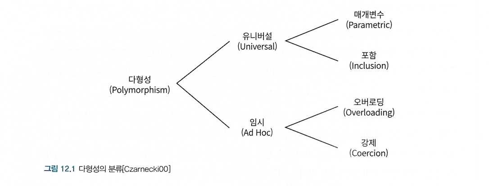

# 12. 다형성


- *상속의 목적은 코드 재사용이 아니다.* 
	- *타입 계층을 구조화하기 위해 사용해야 한다.* 

상속을 이용해 자식 클래스를 추가하려 할 때
1. 상속을 사용하려는 목적이 단순히 코드를 재사용하기 위해서인가?
2. 클라이언트 관점에서 인스턴스들을 동일하게 행동하는 그룹으로 묶기 위해서인가?

> *만약 1번이 이유라면 상속을 사용하지 말아야 한다* 

> 12장 
> 이번장에서 상속의 관점에서 다형성이 구현되는 기술적인 메커니즘을 살펴보고
> 다형성이 런타임에 메세지를 처리하기에 적합한 메서드를 동적으로 탐색하는 과정을 통해 구현되며,
> 상속이 이런 메서드를 찾기 위한 일종의 탐색 경로를 클래스 계층의 형태로 구현하기 위한 방법이라는 사실을 이해하게 된다.

# 🐷 다형성
#객체지향/Polymorphism-다형성
> 다형성(Polymorphism) : "많은 형태를 가질 수 있는 능력"
> > 하나의 추상 인터페이스에 대해 코드를 작성하고 이 추상 인터페이스에 대해 서로 다른 구현을 연결할 수 있는 능력으로 정의한다.

#객체지향/객체지향프로그래밍에서-사용되는-다형성
- 객체지향 프로그래밍에서 사용되는 다형성
	- 유니버설(Universal) 다형성
		- 매개변수(Parametric) 다형성
		- 포함(Inclustion) 다형성
	- 임시(Ad Hoc) 다형성
		- 오버로딩(Overloading) 다형성
		- 강제(Coercion) 다형성



- [0] 오버로딩 다형성(Overloading)
- 하나의 클래스 안에 동일한 이름의 메서드가 존재하는 경우

- [1] 강제(Coercion)
- 언어가 지원하는 자동 타입 변환이나 사용자가 직접 구현한 타입 변환을 이용해 동일한 연산자를 다양한 타입에 사용할 수 있는 방식
	- ex) 예를 들어 자바에서 이항 연산자인 '+'는 타입에 따라 덧셈으로 동작하기도 하고 연결 동작을 하기도 한다.

```ts title="+연산자 강제 다형성"
// '+' 연산자의 강제 다형성
function addOrConcat(a: number | string, b: number | string): number | string {
  if (typeof a === "number" && typeof b === "number") {
    return a + b;
  } else if (typeof a === "string" && typeof b === "string") {
    return a + b;
  } else {
    return a + b;
  }
}

console.log(addOrConcat(5, 3)); // 출력: 8 (숫자 덧셈)
console.log(addOrConcat("Hello", "World")); // 출력: "HelloWorld" (문자열 연결)
console.log(addOrConcat(5, "3")); // 출력: "53" (숫자가 문자열로 강제 변환)
```

- [2] 매개변수 다형성(Parametric)
- *제네릭 프로그래밍* 과 관련이 높다.
- 클래스의 인스턴스 변수나 메서드의 매개변수 타입을 임의의 타입으로 선언한 후 사용하는 시점에 구체적인 타입으로 지정하는 방식

```typescript title="제네릭 매개변수 다형성"
// 제네릭 함수
function identity<T>(arg: T): T {
    return arg;
}

let output1 = identity<string>("myString");
let output2 = identity<number>(100);

console.log(output1); // 출력: myString
console.log(output2); // 출력: 100
```

- [3] 포함 다형성(Inclusion)
- 메세지가 동일하더라도 수신한 객체의 타입에 따라 실제로 수행되는 행동이 달라지는 능력
- 서브타입(Subtype) 다형성이라고도 부름.
- 포함 다형성은 객체지향 프로그래밍에서 가장 널리 알려진 형태의 다형성
- 포함 다형성을 위한 전제조건은 자식 클래스가 부모 클래스의 서브타입이어야 한다.
	- *상속의 진정한 목적은 코드 재사용이 아니라 다형성을 위한 서브타입 계층을 구축하는 것이다.* 

```typescript title="포함 다형성"
class Movie{
	private discountPolicy: DiscountPolicy;

	constructor(discountPolicy:DiscountPolicy){
		this.discountPolicy = discountPolicy;
	}

	public calculateMovieFee(screening: Screening){
		return fee.minus(discountPolicy.calculateDiscountAmount(screening));
	}
}
```

> 포함 다형성을 구현하는 가장 일반적인 방법은 상속이고
> 자식 클래스에서 부모 클래스의 메서드를 오버라이딩한 후 클라이언트는 부모 클래스만 참조하면 포함 다형성을 구현할 수 있다.

**12장 목표 : 포함 다형성의 관점에서 런타임에 상속 계층 안에서 적절한 메서드를 선택하는 방법을 이해하는 것** 

# 🐨 상속의 양면성
> 데이터 관점의 상속 : 부모 클래스에서 정의한 모든 데이터를 자식 클래스의 인스턴스에 자동으로 포함시킬 수 있다.
> 행동 관점의 상속 : 부모 클래스에서 정의한 일부 메서드 역시 자동으로 자식 클래스에 포함시킬 수 있다.

- *상속의 목적은 코드 재사용이 아니다.* 
- 상속은 *다형성을 가능하게 하는 타입 계층을 구축하기 위한 것이다* 
- 상속 내부의 메커니즘뿐만 아니라 타입 계층을 기반으로 한 다형성의 동작 방식을 이해 할 수 있는 개념들
	- 업캐스팅
	- 동적 메서드 탐색
	- 동적 바인딩
	- self 참조
	- super 참조

## 상속을 사용한 강의 평가
> 수강생들의 성적을 계산하는 프로그램 예제
> `Pass:3 Fail:2` 강의 이수 학생수와 낙제한 학생의 수
> `A:1 B:1 C:1 D:0 F:2` 는 등급별 학생들의 분포 현황

```ts
class Lecture {
  private pass: number;
  private title: string;
  private scores: number[] = [];

  constructor(pass: number, title: string, scores: number[]) {
    this.pass = pass;
    this.title = title;
    this.scores = scores;
  }

  public get Average() {
    return this.scores.reduce((a, b) => a + b, 0) / this.scores.length;
  }

  public get Scores() {
    return this.scores;
  }

  public evaluate() {
    return `Pass: ${this.passCount()}, Fail: ${this.failCount()}`;
  }

  private passCount() {
    return this.scores.filter((score) => score >= this.pass).length;
  }

  private failCount() {
    return this.scores.filter((score) => score < this.pass).length;
  }
}

/**
 * 이수 기준이 70점인 객체지향 프로그래밍 과목의 수강생 5명에 대한 성적 통계
 */

const lecture = new Lecture(70, "객체지향 프로그래밍", [81, 95, 75, 50, 45]);

console.log(lecture.evaluate()); // Pass: 3, Fail: 2
```

### 상속을 이용해 Lecture 클래스 재사용하기
> `Lecture` 의 출력 결과에 등급별 통계를 추가

```ts
class Grade {
  private name: string;
  private upper: number;
  private lower: number;

  constructor(name: string, upper: number, lower: number) {
    this.name = name;
    this.upper = upper;
    this.lower = lower;
  }

  public get Name() {
    return this.name;
  }

  public isName(name: string) {
    return this.name === name;
  }

  public include(score: number) {
    return score >= this.lower && score <= this.upper;
  }
}

/**
 * `Lecture` 의 출력 결과에 등급별 통계를 추가
 */
class GradeLecture extends Lecture {
  private grades: Grade[];

  constructor(pass: number, title: string, grades: Grade[], scores: number[]) {
    super(pass, title, scores);
    this.grades = grades;
  }

  public override evaluate(): string {
    console.log("자식 GradeLecture evaluate");
    return super.evaluate() + `, Grade: ${this.gradesStatistics()}`;
  }

  private gradesStatistics() {
    return this.grades
      .map((grade) => {
        return this.format(grade);
      })
      .join(" ");
  }

  private format(grade: Grade) {
    return `${grade.Name}: ${this.gradeCount(grade)}`;
  }

  private gradeCount(grade: Grade) {
    return this.Scores.filter((score) => grade.include(score)).length;
  }

  // TS에서 오버로딩을 구현하기 위해서는 시그니처 선언부와 구현부를 나눠야 한다.
  public override average(): number; // 시그니처 1: 매개변수 없이 호출
  public override average(gradeName: string): number; // 시그니처 2: gradeName이 있는 경우 호출

  // 실제 구현부 (함수 시그니처를 기반으로 처리)
  public override average(gradeName?: string): number {
    if (gradeName) {
      // gradeName이 주어진 경우
      const grade = this.grades.find((grade) => grade.isName(gradeName));
      if (!grade) {
        throw new Error(`${gradeName} 과목이 존재하지 않습니다.`);
      }
      return this.gradeAverage(grade);
    } else {
      // 매개변수 없이 호출된 경우
      return super.average(); // 부모 클래스의 average 호출
    }
  }

  public gradeAverage(grade: Grade) {
    return (
      this.Scores.filter((score) => grade.include(score)).reduce(
        (a, b) => a + b,
        0
      ) / this.gradeCount(grade)
    );
  }
}

const lecture2 = new GradeLecture(
  70,
  "객체지향 프로그래밍",
  [
    new Grade("A", 100, 95),
    new Grade("B", 94, 80),
    new Grade("C", 79, 70),
    new Grade("D", 69, 50),
    new Grade("F", 49, 0),
  ],
  [81, 95, 75, 50, 45]
);

console.log(lecture2.evaluate()); // Pass: 3, Fail: 2, Grade: A: 1 B: 1 C: 1 D: 1 F: 1
console.log(lecture2.average()); // 71
console.log(lecture2.gradeAverage(new Grade("A", 100, 95))); // 95
```

> `GradeLecture` 의 `evaluate` 메서드에서는 예약어 `super` 를 이용해 `Lecture` 클래스의 `evaluate` 메서드를 먼저 실행 한다는 사실을 눈여겨 봐라.

#객체지향/overriding-오버라이딩 , #객체지향/overloading-오버로딩 

> 위의 예제는 오버라이딩과 오버로딩이 함께 있는 예제다.
> *메서드 오버라이딩* : 자식 클래스 안에 상속 받은 메서드와 동일한 시그니처의 메서드를 재정의해서 부모 클래스의 구현을 새로운 구현으로 대체하는 것
> `lecture2.evaluate()` 메세지를 전송하면 `Lecture` 의 `evaluate` 메서드를 오버라이딩한 `GradeLecture` 의 `evaluate` 메서드가 실행 된다.
> *메서드 오버로딩* : 부모 클래스에서 정의한 메서드의 이름은 동일하지만 시그니처는 다른 메서드를 자식 클래스에 추가하는 것
> `GradeLecture` 의 `average` 메서드는 부모 클래스인 `Lecture` 에 정의된 `average` 메서드와 이름은 같지만 *시그니처* 가 다르다.

## 데이터 관점의 상속
#객체지향/데이터관점의상속 

```ts
const lecture = new GradeLecture(
  70,
  "객체지향 프로그래밍",
  [
    new Grade("A", 100, 95),
    new Grade("B", 94, 80),
    new Grade("C", 79, 70),
    new Grade("D", 69, 50),
    new Grade("F", 49, 0),
  ],
  [81, 95, 75, 50, 45]
);
```

- *데이터 관점에서 상속은 자식 클래스의 인스턴스 안에 부모 클래스의 인스턴스를 포함하는 것으로 볼 수 있다.* 
- *자식 클래스의 인스턴스는 자동으로 부모 클래스에 정의한 모든 인스턴스 변수를 내부에 포함하게 되는 것이다.* 


## 행동 관점의 상속
#객체지향/행동관점의상속

> 데이터 관점의 상속 -> 자식 클래스의 인스턴스 안에 부모 클래스의 인스턴스를 포함
> 행동 관점의 상속 -> 부모 클래스가 정의한 일부 메서드를 자식 클래스의 메서드로 포함시키는 것

- 부모 클래스의 모든 퍼블릭 메서드는 자식 클래스의 퍼블릭 인터페이스에 포함된다.
- 외부 객체가 부모 클래스의 인스턴스에게 전송할 수 있는 모든 메세지는 자식 클래스의 인스턴스에게도 전송 할 수 있다.

> 부모 클래스에서 구현한 메서드를 자식 클래스의 인스턴스에서 수행할 수 있는 이유

- 런타임에 시스템이 자식 클래스에 정의되지 않은 메서드가 있을 경우 이 메서드를 부모 클래스 안에서 탐색하기 때문이다.
- 객체의 경우에는 서로 다른 상태를 저장할 수 있도록 각 인스턴스별로 독립적인 메모리를 할당받아야 한다.
- 메서드의 경우에는 동일한 클래스의 인스턴스까지 공유가 가능하기 때문에 클래스는 한 번만 메모리에 로드하고 각 인스턴스별 클래스를 가리키는 포인터를 갖게 하는것이 경제적이다.

# 🍑 업캐스팅과 동적 바인딩

## 같은 메세지 , 다른 메서드
> 성적 계산 프로그램 예제에 각 교수별로 강의 대한 성적 통계를 계산하는 기능 추가
> 통계를 계산하는 책임은 `Professor` 클래스로 담당 

```ts
/**
 * compileStatistics 메서드는 통계 정보 생성
 * Lecture의 evaludate 메서드와 average 메서드 호출.
 */
class Professor {
  private name: string;
  private lecture: Lecture;

  constructor(name: string, lecture: Lecture) {
    this.name = name;
    this.lecture = lecture;
  }

  compileStatistics() {
    return `[${this.name}] ${this.lecture.evaluate()} - Avg: ${
      this.lecture.Average
    }`;
  }
}

/**
 * 다익스트라 교수가 강의하는 알고리즘 과목의 성적 통계
 */
const professor = new Professor(
  "다익스트라",
  new Lecture(70, "알고리즘", [81, 95, 75, 50, 45])
);
console.log(professor.compileStatistics()); // 결과 => "[다익스트라] Pass:3 Fail:2 - Avg: 69.2"

/*
* 출력
* 부모 Lecture evaluate
* 부모 Lecture Average
* [다익스트라] Pass: 3, Fail: 2 - Avg: 69.2
*/

/**
 * If Lecture 클래스 대신 자식 클래스인 GradeLecture의 인스턴스를 전달하면 어떻게 될까?
 */
const professor2 = new Professor(
  "다익스트라",
  new GradeLecture(
    70,
    "알고리즘",
    [
      new Grade("A", 100, 95),
      new Grade("B", 94, 80),
      new Grade("C", 79, 70),
      new Grade("D", 69, 50),
      new Grade("F", 49, 0),
    ],
    [81, 95, 75, 50, 45]
  )
);

console.log(professor2.compileStatistics()); // [다익스트라] Pass: 3, Fail: 2, Grade: A: 1 B: 1 C: 1 D: 1 F: 1 - Avg: 69.2

/*
* 자식 GradeLecture evaluate
* 부모 Lecture evaluate - super로 호출하는거 때문에 호출되는거 
* 부모 Lecture Average
* [다익스트라] Pass: 3, Fail: 2, Grade: A: 1 B: 1 C: 1 D: 1 F: 1 - Avg: 69.2
*/
```

```ts title="출력"
[다익스트라] Pass: 3, Fail: 2 - Avg: 69.2
자식 GradeLecture evaluate
부모 Lecture evaluate
부모 Lecture Average
[다익스트라] Pass: 3, Fail: 2, Grade: A: 1 B: 1 C: 1 D: 1 F: 1 - Avg: 69.2
```

> *Professor* 생성자의 2번째 인자타입은 *Lecture* 로 선언돼 있지만 `GradeLecture` 의 인스턴스를 전달하더라도 아무 문제 없이 실행된다는것 알 수 있다!!!
> 동일한 객체 참조인 `lecture` 에 대해 동일한 `evaluate` 메세지를 전송하는 동일한 코드 안에서 서로 다른 클래스 안에 구현된 메서드를 실행할 수 있다는 사실을 알 수 있다.

**코드 안에서 선언된 참조 타입과 무관하게 실제 메세지를 수신하는 객체의 타입에 따라 실행되는 메서드가 달라질 수 있는 것은 업캐스팅과 동적 바인딩 이라는 메커니즘이 작용하기 때문** 

#객체지향/업캐스팅 , #객체지향/동적바인딩 #객체지향/OCP-개방-폐쇄원칙 

- *업캐스팅* : 
	- 부모 클래스 타입으로 선언된 변수에 자식 클래스의 인스턴스를 할당하는 것이 가능하다.
	- 서로 다른 클래스의 인스턴스를 동일한 타입에 할당하는 것을 가능하게 해준다.
	- 부모 클래스에 대해 작성된 코드를 전혀 수정 하지 않고도 자식 클래스에 적용할 수 있다.
- *동적 바인딩* : 
	- 선언된 변수의 타입이 아니라 메세지를 수신하는 객체의 타입에 따라 실행되는 메서드가 결정된다.
		- 이것은 객체지향 시스템이 메세지를 처리할 적절한 메서드를 **컴파일 시점이 아니라 실행 시점에 결정하기 떄문에 가능하다** 
	- 부모 클래스의 타입에 대해 메세지를 전송하더라도 실행 시에는 실제 클래스를 기반으로 실행될 메서드가 선택되게 해준다.
	- 코드를 변경하지 않고도 실행되는 메서드를 변경할 수 있다.
- **업캐스팅과 동적 바인딩은 코드 변경 없이도 기능을 추가할 수 있게 해주며 개방-폐쇄 원칙의 의도와도 일치한다** 
## 업캐스팅
> 상속을 이용시 부모 클래스의 퍼블릭 인터페이스가 자식 클래스의 퍼블릭 인터페이스에 합쳐지기 때문에
> 부모 클래스의 인스턴스에게 전송할 수 있는 메세지를 자식 클래스의 인스턴스에게 전송할 수 있다.
> 부모 클래스의 인스턴스 대신 자식 클래스의 인스턴스를 사용하더라도 메세지를 처리하는 데는 아무런 문제가 없으며, 컴파일러는 명시적인 타입 변환 없이도 자식 클래스가 부모 클래스를 대체할 수 있게 허용한다.

- 대표적인 예제
	- 대입문
	- 메서드의 파라미터 타입

### 다운 캐스팅
#객체지향/다운캐스팅 

- *다운 캐스팅(downcasting)* : 부모 클래스의 인스턴스를 자식 클래스 타입으로 변환하기 위해서는 명시적인 타입 캐스팅이 필요하다 이를 다운 캐스팅이라고 함.

```typescript title="다운캐스팅"
/*
* 업캐스팅 예제
*/
const professor = new Professor(
  "다익스트라",
  new GradeLecture(
    50,
    "OOP",
    [
      new Grade("A", 100, 95),
      new Grade("B", 94, 80),
      new Grade("C", 79, 70),
      new Grade("D", 69, 50),
      new Grade("F", 49, 0),
    ],
    [100, 95, 90, 80, 70, 60, 50, 40]
  )
);
console.log(professor);
/*
* 
* Professor {
  name: '다익스트라',
  lecture: GradeLecture {
    pass: 50,
    title: 'OOP',
    scores: [
      100, 95, 90, 80,
       70, 60, 50, 40
    ],
    grades: [ [Grade], [Grade], [Grade], [Grade], [Grade] ]
  }
}
*
*/

// 부모 클래스 인스턴스를 가짐
let lecture: Lecture = new GradeLecture(
  50,
  "OOP",
  [
    new Grade("A", 100, 95),
    new Grade("B", 94, 80),
    new Grade("C", 79, 70),
    new Grade("D", 69, 50),
    new Grade("F", 49, 0),
  ],
  [100, 95, 90, 80, 70, 60, 50, 40]
);

console.log(lecture);
/*
* 
* GradeLecture {
  pass: 50,
  title: 'OOP',
  scores: [
    100, 95, 90, 80,
     70, 60, 50, 40
  ],
  grades: [
    Grade { name: 'A', upper: 100, lower: 95 },
    Grade { name: 'B', upper: 94, lower: 80 },
    Grade { name: 'C', upper: 79, lower: 70 },
    Grade { name: 'D', upper: 69, lower: 50 },
    Grade { name: 'F', upper: 49, lower: 0 }
  ]
}
*/
const gradeLecture = lecture as GradeLecture;

console.log(gradeLecture);
/*
* GradeLecture {
  pass: 50,
  title: 'OOP',
  scores: [
    100, 95, 90, 80,
     70, 60, 50, 40
  ],
  grades: [
    Grade { name: 'A', upper: 100, lower: 95 },
    Grade { name: 'B', upper: 94, lower: 80 },
    Grade { name: 'C', upper: 79, lower: 70 },
    Grade { name: 'D', upper: 69, lower: 50 },
    Grade { name: 'F', upper: 49, lower: 0 }
  ]
}
GradeLecture {
  pass: 50,
  title: 'OOP',
  scores: [
    100, 95, 90, 80,
     70, 60, 50, 40
  ],
  grades: [
    Grade { name: 'A', upper: 100, lower: 95 },
    Grade { name: 'B', upper: 94, lower: 80 },
    Grade { name: 'C', upper: 79, lower: 70 },
    Grade { name: 'D', upper: 69, lower: 50 },
    Grade { name: 'F', upper: 49, lower: 0 }
  ]
}
*
/
```

> 부모 클래스의 인스턴스를 자식 클래스 타입으로 변환 하는것이 핵심 키워드
> `타입` 이라는것이 들어가는것을 기억하라 런타임 환경에서 동작을 말하는것이 아님.
> 런타임 실행 환경에 영향을 미치는것이 아니다.

## 동적 바인딩
#객체지향/static_binding-정적바인딩 , #객체지향/dynamic_binding-동적바인딩

- 정적 바인딩(static binding)
	- 컴파일 타임에 호출할 함수를 결정하는 방식
	- 예) 함수
- 동적 바인딩(dynamic binding)
	- 객체지향 언어에서는 메세지를 수신했을 때 실행될 메서드가 런타임에 결정된다.
	- 실행될 메서드를 런타임에 결정하는 방식

> `Professor` 의 `compileStatistics` 메서드가 호출하는 `lecture` 의 `evaluate` 메서드는 실행 시점에 어떤 클래스의 인스턴스를 생성해서 전달하는지를 알아야만 실제로 실행되는 메서드를 알 수 있다.

- *객체지향 언어가 제공하는 업캐스팅과 동적 바인딩을 이용하면 부모 클래스 참조에 대한 메세지 전송을 자식 클래스에 대한 메서드 호출로 변환할 수 있다* 

# 동적 메서드 탐색과 다형성
- 객체지향 시스템이 실행 할 메서드를 선택하는 규칙
	- 메세지를 수신한 객체는 먼저 자신을 생성한 클래스에 적합한 메서드가 존재하는지 검사
		- 존재하면 메서드를 실행하고 탐색을 종료한다.
- 메서드를 찾지 못했다면 부모 클래스에서 메서드를 탐색을 계속한다. 이 과정은 적합한 메서드를 찾을 때까지 상속 계층을 따라 올라가며 계속된다.
- 상속 계층의 가장 최상위 클래스에 이르렀지만 메서드를 발견하지 못한 경우 예외를 발생시키며 탐색을 중단한다.

> `Javascript` 의 프로토타입 상속과 굉장히 유사한것 같다.

> 메세지 탐색과 관련해서 이해해야 하는 중요한 변수 `self 참조(self reference)` 
> 객체가 메세지를 수신하면 컴파일러는 self 참조라는 임시 변수를 자동으로 생성한 후 메세지를 수신한 객체를
> 가리키도록 설정한다.
> 동적 메서드 탐색은 self가 가리키는 객체의 클래스에서 시작해서 상속 계층의 역방향으로 이뤄지며 메서드 탐색이 종료되는 순간 self 참조는 자동으로 소멸된다.

## 자동적인 메세지 위임
#객체지향/overriding-오버라이딩, #객체지향/overloading-오버로딩
### 메서드 오버라이딩
```typescript title="오버라이딩"
const lecture2 = new GradeLecture(
  70,
  "객체지향 프로그래밍",
  [
    new Grade("A", 100, 95),
    new Grade("B", 94, 80),
    new Grade("C", 79, 70),
    new Grade("D", 69, 50),
    new Grade("F", 49, 0),
  ],
  [81, 95, 75, 50, 45]
);
```

> 익숙한 오버라이딩 예제이다. `GradeLecture` 에 정의된 메서드가 실행된다.
> *동적 메서드 탐색* 은 `self` 참조가 가리키는 객체의 클래스인 `GradeLecture` 에서 시작되고 `GradeLecture` 클래스 안에서 `evaluate` 메서드가 구현돼 있기 때문에 먼저 발견된 메서드가 실행됨.
> 자식 클래스가 부모 클래스의 메서드를 오버라딩하면 자식 클래스에서 부모 클래스로 향하는 메서드 탐색 순서 때문에 자식 클래스의 메서드가 부모 클래스의 메서드를 감추게 된다.
### 메서드 오버로딩
> 시그니처가 다른 동일한 이름의 메서드가 공존하는 경우를 메서드 오버로딩이라고 부른다.
> 메서드 오버라이딩은 메서드를 감추지만 메서드 오버로딩은 사이좋게 공존한다.
> *많은 사람들이 하나의 클래스 안에서 같은 이름을 가진 메서드들을 정의 하는것을 오버로딩이라고 생각하고* 
> *상속 계층 사이에서 같은 이름을 가진 메서드를 정의하는 것은 메서드 오버로딩으로 생각하지 않는 경향이 있다.* 

## 동적인 문맥
- 메세지를 수신한 객체가 무엇이냐에 따라 메서드를 탐색을 위한 문맥이 동적으로 바뀐다.
- 동적인 문맥을 결정하는 것은 바로 메세지를 수신한 객체를 가리키는 `self` 참조이다.
- 동일한 코드라고 하더라도 `self` 참조가 가리키는 객체가 무엇인지에 따라 메서드 탐색을 위한 상속 계층의 범위가 동적으로 변한다.
- `self` 참조가 가리키는 객체의 타입을 변경함으로써 객체가 실행될 문맥을 동적으로 바꿀 수 있다.
### self 전송 (self send)
> `self 전송` : self 참조가 가리키는 자기 자신에게 메세지를 전송하는 것
> self 전송을 이해하기 위해서는 self 참조가 가리키는 바로 그 객체에서부터 메세지를 탐색을 다시 시작한다는 사실을 기억 해야 한다.

```typescript
class Lecture {
  private pass: number;
  private title: string;
  private scores: number[] = [];

  constructor(pass: number, title: string, scores: number[]) {
    this.pass = pass;
    this.title = title;
    this.scores = scores;
  }

  /**
   * self send 위한 예제코드
   * 평가 기준에 대한 정보를 반환하는 stats 메서드
   */
  public stats() {
    return `Title: ${this.title}, ${this.getEvaluationMethod()}`;
  }

  public getEvaluationMethod() {
    return "Pass or Fail";
  }

  public average() {
    console.log("부모 Lecture Average");
    return this.scores.reduce((a, b) => a + b, 0) / this.scores.length;
  }

  public get Scores() {
    return this.scores;
  }

  public evaluate() {
    console.log("부모 Lecture evaluate");
    return `Pass: ${this.passCount()}, Fail: ${this.failCount()}`;
  }

  private passCount() {
    return this.scores.filter((score) => score >= this.pass).length;
  }

  private failCount() {
    return this.scores.filter((score) => score < this.pass).length;
  }
}
```

> `Lecture` 클래스에서는 `stats` 메서드 안에서 자신의 `getEvaluationMethod` 메서드를 호출 한다는 사실을 주의깊게 보자.
> *현재 클래스의 메서드를 호출 하는것이 아니라 현재 겍체에게 메시지를 전송하는 것이다* 
> 여기서 현재 객체는 `self` 참조가 가리키는 객체다.

> self전송에서 상속

```ts
class Lecture {
  private pass: number;
  private title: string;
  private scores: number[] = [];

  constructor(pass: number, title: string, scores: number[]) {
    this.pass = pass;
    this.title = title;
    this.scores = scores;
  }

  /**
   * self send 위한 예제코드
   * 평가 기준에 대한 정보를 반환하는 stats 메서드
   */
  public stats() {
    return `Title: ${this.title}, ${this.getEvaluationMethod()}`;
  }

  public getEvaluationMethod() {
    return "Pass or Fail";
  }

  public average() {
    console.log("부모 Lecture Average");
    return this.scores.reduce((a, b) => a + b, 0) / this.scores.length;
  }

  public get Scores() {
    return this.scores;
  }

  public evaluate() {
    console.log("부모 Lecture evaluate");
    return `Pass: ${this.passCount()}, Fail: ${this.failCount()}`;
  }

  private passCount() {
    return this.scores.filter((score) => score >= this.pass).length;
  }

  private failCount() {
    return this.scores.filter((score) => score < this.pass).length;
  }
}

class GradeLecture extends Lecture {
  private grades: Grade[];

  constructor(pass: number, title: string, grades: Grade[], scores: number[]) {
    super(pass, title, scores);
    this.grades = grades;
  }

  public override getEvaluationMethod() {
    return "Grade";
  }

  public override evaluate(): string {
    console.log("자식 GradeLecture evaluate");
    return super.evaluate() + `, Grade: ${this.gradesStatistics()}`;
  }

  private gradesStatistics() {
    return this.grades
      .map((grade) => {
        return this.format(grade);
      })
      .join(" ");
  }

  private format(grade: Grade) {
    return `${grade.Name}: ${this.gradeCount(grade)}`;
  }

  private gradeCount(grade: Grade) {
    return this.Scores.filter((score) => grade.include(score)).length;
  }

  // TS에서 오버로딩을 구현하기 위해서는 시그니처 선언부와 구현부를 나눠야 한다.
  public override average(): number; // 시그니처 1: 매개변수 없이 호출
  public override average(gradeName: string): number; // 시그니처 2: gradeName이 있는 경우 호출

  // 실제 구현부 (함수 시그니처를 기반으로 처리)
  public override average(gradeName?: string): number {
    if (gradeName) {
      // gradeName이 주어진 경우
      const grade = this.grades.find((grade) => grade.isName(gradeName));
      if (!grade) {
        throw new Error(`${gradeName} 과목이 존재하지 않습니다.`);
      }
      return this.gradeAverage(grade);
    } else {
      // 매개변수 없이 호출된 경우
      return super.average(); // 부모 클래스의 average 호출
    }
  }

  public gradeAverage(grade: Grade) {
    return (
      this.Scores.filter((score) => grade.include(score)).reduce(
        (a, b) => a + b,
        0
      ) / this.gradeCount(grade)
    );
  }
}

const lectrue4 = new GradeLecture(
  50,
  "OOP",
  [
    new Grade("A", 100, 95),
    new Grade("B", 94, 80),
    new Grade("C", 79, 70),
    new Grade("D", 69, 50),
    new Grade("F", 49, 0),
  ],
  [100, 95, 90, 80, 70, 60, 50, 40]
);

console.log(lectrue4.stats());
// 결과 : Title: OOP, Grade
```

> `GradeLecture` 에 `stats` 메세지를 전송하면 `self` 참조는 `GradeLecture` 의 인스턴스를 가리키도록 설정되고 메서드 탐색은 `GradeLecture` 클래스에서부터 시작된다.
> `self` 전송은 자식 클래스에서 부모 클래스 방향으로 진행되는 동적 메서드 탐색 경로를 다시 `self` 참조가 가리키는 원래의 자식 클래스로 이동시킨다.

- `GradeLecture` 에서 `stats` 메세지 전송 -> 없기 때문에 부모 `Lecture` 에서 찾아서 실행 -> `self` 참조는 `GradeLecture` 의 인스턴스를 가리키도록 설정 -> `stas` 실행 후 -> 다시 `GradeLecture` 의 `getEvaluationMethod` 메서드 실행 -> 결과 : Title: OOP, Grade

## 이해할 수 없는 메세지
- 이해할 수 없는 메세지를 처리하는 방법은 프로그래밍 언어가 정적 타입 언어에 속하는지 동적 타입 언어에 속하는지에 따라 달라진다.

- 정적 타입 언어
	- 코드를 컴파일 할 때 상속 계층 안의 클래스들이 메세지를 이해할 수 있는지 여부를 판단한다.
	- 발견 못했다면 컴파일 에러를 발생 시킨다.
- 동적 타입 언어
	- 컴파일 단계가 존재하지 않으므로 실제 코드 실행 전까지 메세지 처리 가능 여부를 판단할 수 없다.
	- 하지만 예외를 던지거나 응답할 수 있는 메서드를 구현하면 자신의 인터페이스에 정의되지 않은 메세지를 처리할 수 있게 된다.


## self vs super
### self 참조
- self 참조의 가장 큰 특징은 동적이다.
- self 참조는 메세지를 수신한 객체의 클래스에 따라 메서드 탐색을 위한 문맥(context)을 실행 시점에 결정한다.
- self 전송이 메세지를 수신 하는 객체의 클래스에 따라 메서드를 탐색할 시작 위치를 동적으로 결정
- self 전송에서 메세지 탐색을 시작하는 클래스는 미정 (동적이다)
- self 전송의 경우 메서드 탐색을 시작할 클래스를 반드시 실행시점에 동적으로 결정 해야한다.
- *self 참조는 항상 메세지를 수신한 객체를 가리킨다* 
### super 참조
- `super` 참조의 정확한 의도는 부모 클래스에 정의된 메서드를 실행하기 위한게 아니라 '지금 이클래스의 부모 클래스에서부터 메서드 탐색을 시작하세요.' 다
- super 전송은 항상 메세지를 전송하는 클래스의 부모 클래스에서부터 시작된다.
- super 전송에서는 미리 정해진다는 것이다. (정적이다)
- super 전송의 경우에는 컴파일 시점에 미리 결정해 놓을 수 있다.


# 🍓 상속 vs 위임

## 위임과 self 참조
- 위임 : 자신이 수신한 메세지를 다른 객체에게 동일하게 전달해서 처리를 요청하는것.
- 프로토타입 기반의 객체지향 언어는 객체 사이의 자동적인 메세지 위임을 통해 상속을 구현한다.


# 결론
- 상속은 단지 클래 사이의 정적인 관계로만 구현되지 않는다.
- 프로토타입 언어처럼 위임을 통해 객체 수준에서 상속을 구현하는 언어도 존재한다.
- 중요한 것은 클래스 기반의 상속과 객체 기반의 위임 사이에 기본 개념과 메커니즘을 공유한다는 점이다.
- 이 사실을 이해하면 다형성과 상속, 나아가 객체지향 언어를 바라보는 시각이 달라지게 될것이다.


```typescript title="전체 코드"
class Lecture {
  private pass: number;
  private title: string;
  private scores: number[] = [];

  constructor(pass: number, title: string, scores: number[]) {
    this.pass = pass;
    this.title = title;
    this.scores = scores;
  }

  /**
   * self send 위한 예제코드
   * 평가 기준에 대한 정보를 반환하는 stats 메서드
   */
  public stats() {
    return `Title: ${this.title}, ${this.getEvaluationMethod()}`;
  }

  public getEvaluationMethod() {
    return "Pass or Fail";
  }

  public average() {
    console.log("부모 Lecture Average");
    return this.scores.reduce((a, b) => a + b, 0) / this.scores.length;
  }

  public get Scores() {
    return this.scores;
  }

  public evaluate() {
    console.log("부모 Lecture evaluate");
    return `Pass: ${this.passCount()}, Fail: ${this.failCount()}`;
  }

  private passCount() {
    return this.scores.filter((score) => score >= this.pass).length;
  }

  private failCount() {
    return this.scores.filter((score) => score < this.pass).length;
  }
}

class GradeLecture extends Lecture {
  private grades: Grade[];

  constructor(pass: number, title: string, grades: Grade[], scores: number[]) {
    super(pass, title, scores);
    this.grades = grades;
  }

  public override getEvaluationMethod() {
    return "Grade";
  }

  public override evaluate(): string {
    console.log("자식 GradeLecture evaluate");
    return super.evaluate() + `, Grade: ${this.gradesStatistics()}`;
  }

  private gradesStatistics() {
    return this.grades
      .map((grade) => {
        return this.format(grade);
      })
      .join(" ");
  }

  private format(grade: Grade) {
    return `${grade.Name}: ${this.gradeCount(grade)}`;
  }

  private gradeCount(grade: Grade) {
    return this.Scores.filter((score) => grade.include(score)).length;
  }

  // TS에서 오버로딩을 구현하기 위해서는 시그니처 선언부와 구현부를 나눠야 한다.
  public override average(): number; // 시그니처 1: 매개변수 없이 호출
  public override average(gradeName: string): number; // 시그니처 2: gradeName이 있는 경우 호출

  // 실제 구현부 (함수 시그니처를 기반으로 처리)
  public override average(gradeName?: string): number {
    if (gradeName) {
      // gradeName이 주어진 경우
      const grade = this.grades.find((grade) => grade.isName(gradeName));
      if (!grade) {
        throw new Error(`${gradeName} 과목이 존재하지 않습니다.`);
      }
      return this.gradeAverage(grade);
    } else {
      // 매개변수 없이 호출된 경우
      return super.average(); // 부모 클래스의 average 호출
    }
  }

  public gradeAverage(grade: Grade) {
    return (
      this.Scores.filter((score) => grade.include(score)).reduce(
        (a, b) => a + b,
        0
      ) / this.gradeCount(grade)
    );
  }
}

/**
 * 이수 기준이 70점인 객체지향 프로그래밍 과목의 수강생 5명에 대한 성적 통계
 */

const lecture11 = new Lecture(70, "객체지향 프로그래밍", [81, 95, 75, 50, 45]);

//console.log(lecture11.evaluate()); // Pass: 3, Fail: 2

class Grade {
  private name: string;
  private upper: number;
  private lower: number;

  constructor(name: string, upper: number, lower: number) {
    this.name = name;
    this.upper = upper;
    this.lower = lower;
  }

  public get Name() {
    return this.name;
  }

  public isName(name: string) {
    return this.name === name;
  }

  public include(score: number) {
    return score >= this.lower && score <= this.upper;
  }
}

const lecture2 = new GradeLecture(
  70,
  "객체지향 프로그래밍",
  [
    new Grade("A", 100, 95),
    new Grade("B", 94, 80),
    new Grade("C", 79, 70),
    new Grade("D", 69, 50),
    new Grade("F", 49, 0),
  ],
  [81, 95, 75, 50, 45]
);

//console.log(lecture2.evaluate()); // Pass: 3, Fail: 2, Grade: A: 1 B: 1 C: 1 D: 1 F: 1
//console.log(lecture2.average()); // 71
//console.log(lecture2.gradeAverage(new Grade("A", 100, 95))); // 95

class Professor {
  private name: string;
  private lecture: Lecture;

  constructor(name: string, lecture: Lecture) {
    this.name = name;
    this.lecture = lecture;
  }

  compileStatistics() {
    return `[${
      this.name
    }] ${this.lecture.evaluate()} - Avg: ${this.lecture.average()}`;
  }
}

/**
 * 다익스트라 교수가 강의하는 알고리즘 과목의 성적 통계
 */
const professor11 = new Professor(
  "다익스트라",
  new Lecture(70, "알고리즘", [81, 95, 75, 50, 45])
);
//console.log(professor11.compileStatistics()); // 결과 => "[다익스트라] Pass:3 Fail:2 - Avg: 69.2"

/**
 * If Lecture 클래스 대신 자식 클래스인 GradeLecture의 인스턴스를 전달하면 어떻게 될까?
 */

const professor2 = new Professor(
  "다익스트라",
  new GradeLecture(
    70,
    "알고리즘",
    [
      new Grade("A", 100, 95),
      new Grade("B", 94, 80),
      new Grade("C", 79, 70),
      new Grade("D", 69, 50),
      new Grade("F", 49, 0),
    ],
    [81, 95, 75, 50, 45]
  )
);

console.log(professor2.compileStatistics()); // [다익스트라] Pass: 3, Fail: 2, Grade: A: 1 B: 1 C: 1 D: 1 F: 1 - Avg: 69.2

const professor = new Professor(
  "다익스트라",
  new GradeLecture(
    50,
    "OOP",
    [
      new Grade("A", 100, 95),
      new Grade("B", 94, 80),
      new Grade("C", 79, 70),
      new Grade("D", 69, 50),
      new Grade("F", 49, 0),
    ],
    [100, 95, 90, 80, 70, 60, 50, 40]
  )
);

let lecture: Lecture = new GradeLecture(
  50,
  "OOP",
  [
    new Grade("A", 100, 95),
    new Grade("B", 94, 80),
    new Grade("C", 79, 70),
    new Grade("D", 69, 50),
    new Grade("F", 49, 0),
  ],
  [100, 95, 90, 80, 70, 60, 50, 40]
);

console.log(lecture);

const gradeLecture = lecture as GradeLecture;

console.log(gradeLecture);

const lectrue3: Lecture = new GradeLecture(
  50,
  "OOP",
  [
    new Grade("A", 100, 95),
    new Grade("B", 94, 80),
    new Grade("C", 79, 70),
    new Grade("D", 69, 50),
    new Grade("F", 49, 0),
  ],
  [100, 95, 90, 80, 70, 60, 50, 40]
);

const lectrue4 = new GradeLecture(
  50,
  "OOP",
  [
    new Grade("A", 100, 95),
    new Grade("B", 94, 80),
    new Grade("C", 79, 70),
    new Grade("D", 69, 50),
    new Grade("F", 49, 0),
  ],
  [100, 95, 90, 80, 70, 60, 50, 40]
);

console.log(lectrue4.stats());


```

