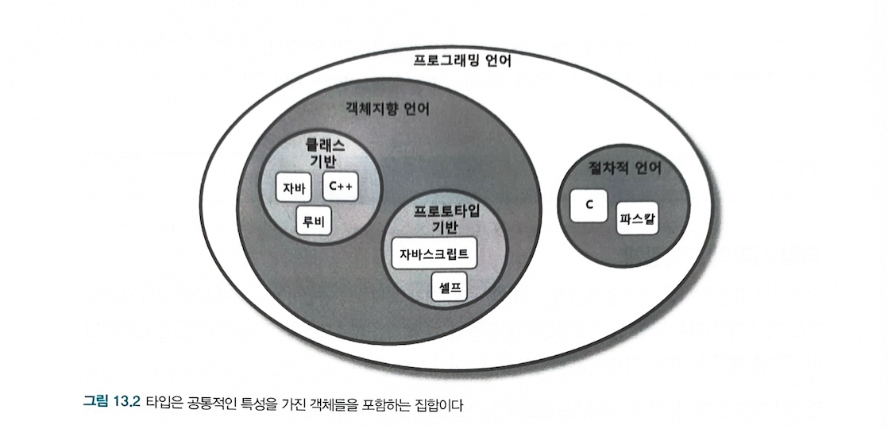
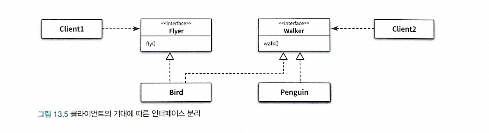

- 상속의 사용 용도
	1.  *타입 계층* 을 구현하는것
		- 타입 계층의 관점에서 부모 클래스는 자식 클래스이 *일반화(generalization)* 이고 자식 클래스는 부모 클래스의 *특수화(specialization)* 이다.
		- 상속의 두번째 용도 *코드 재사용* 이다.
	2. 코드 재사용
		- 재사용을 위해 상속을 사용할 경우 부모 클래스와 자식 클래스가 강하게 결합되기 때문에 변경하기 어려운 코드를 얻게 될 확률이 높다.
- 상속을 사용하는 일차적인 목표는 코드 재사용이 아니라 타입 계층을 구현하는 것이어야 한다.
- 타입 계층을 목표로 상속을 사용한다면 다형적으로 동작하는 객체들의 관계에 기반해 확장 가능하고 유연한 설계를 얻을 수 있게 된다.
- 동일한 메세지에 대해 서로 다르게 행동할 수 있는 다형적인 객체를 구현하기 위해서는 객체의 행동을 기반으로 타입 계층을 구성해야 한다.
- **타입 사이의 관계를 고려하지 않은 채 단순히 코드를 재사용하기 위해 상속을 사용해서는 안된다** 
- 상속이 서브타입 다형성과 동적 메서드 탐색에 밀접하게 연관돼 있다.
# 🍉 타입
## 개념 관점의 타입
#객체지향/심볼 , #객체지향/내연 , #객제치향/외연 

- 우리가 인식하는 객체들에 적용하는 개념이나 아이디어를 가리켜 타입이라고 부른다.
- 예) 자바 , 루비, 자바스크립트, C를 프로그래밍 언어라는 타입으로 분류 할 수 있다.
- *인스턴스(instance)* : 어떤 대상이 타입으로 분류될 때 그 대상을 타입의 인스턴스라고 부른다.
- 자바, 루비, 자바스크립트, C는 프로그래밍 언어의 인스턴스다.
- 일반적으로 타입의 인스턴스를 *객체* 라고 부른다.

- 타입의 구성 요소
	- 심볼
		- 타입에 이름을 붙인것
		- '프로그래밍 언어'가 타입의 심볼에 해당
	- 내연  
		- 타입에 속하는 객체들이 가지는 공통적인 속성이나 행동
		- 일반적으로 타입에 속하는 객체들이 공유하는 속성과 행동의 집합이 내연을 구성한다.
	- 외연
		- 타입에 속하는 객체들의 집합
		- ex) '프로그래밍 언어' 타입의 경우에는 자바, 루비, 자바스크립트, C가 속한 집합이 외연

## 프로그래밍 언어 관점의 타입
- 타입에 수행될 수 있는 유효한 오퍼레이션의 집합을 정의한다.
- 타입에 수행되는 오퍼레이션에 대해 미리 약속된 문맥을 제공한다.

> 타입은 적용 가능한 오퍼레이션의 종류와 의미를 정의함으로써 코드의 의미를 명확하게 전달하고 개발자의 실수를 방지하기 위해 사용된다.

## 객체지향 패러다임 관점의 타입
- 개념 관점에서 타입이란 공통의 특징을 공유하는 대상들의 분류다.
- 프로그래밍 언어 관점에서 타입이란 동일한 오퍼레이션을 적용할 수 있는 인스턴스들의 집합이다.
- 객체지향 프로그래멩에서 타입을 정의하는 것은 객체의 퍼블릭 인터페이스를 정의 하는것과 동일하다.

```typescript
class Dog {
  // 'leg'은 private 상태를 나타냄, 외부에서 접근 불가, 생성자에서만 초기화
  private readonly leg: number;

  // 'name'은 public 상태를 나타내며 외부에서 접근 가능
  public name: string;

  // 생성자에서 상태 초기화
  constructor(leg: number, name: string) {
    this.leg = leg; // 다리는 불변 상태로 설정됨
    this.name = name;
  }

  // public 메서드로 외부에서 호출 가능
  public countLeg(): number {
    return this.leg; // leg는 private 상태지만 외부에서 접근할 수 있도록 메서드를 통해 노출
  }

  // public 메서드로 행동을 추가할 수 있음
  public bark(): string {
    return `${this.name} is barking!`;
  }
}
```

- 해당 예제 코드 상태, 행동, 퍼블릭 인터페이스
	- 상태 : `leg` , `name` 
	- 행동 : `countLeg` , `bark` 
	- 퍼블릭 인터페이스 : `name` , `countLeg` , `bark` 

**객체를 바라볼 때는 항상 객체가 외부에 제공하는 행동에 초점을 맞춰야 한다. 객체의 타입을 결정하는 것은 내부의 속성이 아니라 객체가 외부에서 제공하는 행동이라는 사실을 기억하라**
# 🍉 타입 계층
## 타입 사이의 포함관계


- 슈퍼타입(supertype)
	- 타입 계층을 구성하는 두 타입 간의 관계에서 더 일반적인 타입
	- 집합이 다른 집합의 모든 멤버를 포함한다.
	- 타입 정의가 다른 타입보다 좀 더 일반적이다.
- 서브타입(subtype) : 더 특수한 타입
	- 집합에 포함되는 인스턴스들이 더 큰 집합에 포함된다.
	- 타입 정의가 다른 타입보다 좀 더 구체적이다.

> 프로그래밍 언어에서 타입은 '객체지향 언어' 타입과 '절차적 언어'타입의 슈퍼타입
> '객체지향 언어' 타입은 '클래스 기반 언어 타입' 과 '프로토타입 기반 언어' 타입의 슈퍼타입이다.

## 객체지향 프로그래밍과 타입 계층
- 슈퍼타입이란 서브타입이 정의한 퍼블릭 인터페이스를 일반화시켜 상대적으로 범용적이고 넓은 의미로 정의한 것이다.
- 서브타입이란 슈퍼타입이 정의한 퍼블릭 인터페이스를 특수화시켜 상대적으로 구체적이고 좁은 의미로 정의한 것이다.
*서브타입의 인스턴스는 슈퍼타입의 인스턴스로 간주될 수 있다* 

# 🍑 서브 클래싱과 서브타이핑
#객체지향/상속을사용하는상황
> 객체지향 프로그래밍 언어에서 타입을 구현하는 일반적인 방법은 클래스를 이용하는것이다.
> 타입 계층을 구현하는 일반적인 방법은 상속을 이용하는 것이다.
## 언제 상속을 사용해야 하는가?
- *상속은 올바른 용도는 타입 계층을 구현하는 것이다* 

**다음 두 질문에 만족하는 상황일때 상속을 사용** 
- *상속 관계가 is-a 관계를 모델링하는가?* 
	- 이것은 애플리케이션을 구성하는 어휘에 대한 우리의 관점에 기반한다.
	- 일반적으로 "자식 클래스"는 "부모 클래스" 라고 말해도 이상하지 않다면 상속을 사용 할 후보로 간주한다.
- *클라이언트 입장에서 부모 클래스의 타입으로 자식 클래스를 사용해도 무방한가?* 
	- 상속 계층을 사용하는 클라이언트의 입장에서 부모 클래스와 자식 클래스의 차이점을 몰라야 한다.
	- 이를 자식 클래스와 부모 클래스 사이의 행동 호환성이라고 부른다.

## is-a 관계
> 두 클래스가 어휘적으로 `is-a` 관계를 모델링할 경우에만 상속을 해야한다.
> 타입 계층의 의미는 행동이라는 문맥에 따라 달라질 수 있다.
> 슈퍼 타입과 서브타입 관계에서는 `is-a` 보다 행동 호환성이 더 중요하다.

```ts title="새 Bird 클래스"
class Bird {
	public fly(): void {}
}
class Penguin extends Bird{}
```

> `Penguin` 은 `Bird` 를 상속 받기 때문 `is-a` 관계로 모델링 되지만 중요한것은 펭귄은 날 수 없다.
> 그렇기 때문에 슈퍼타입과 서브타입의 관계에서는 `is-a` 보다 행동 호환성이 더 중요하다.

## 행동 호환성
- 타입이 행동과 관련이 있다
- 타입의 이름 사이에 개념적으로 어떤 연관성이 있다고 하더라도 행동에 연관성이 없다면 `is-a` 관계를 사용하지 말아야 한다.
- 두 타입 사이에 행동이 호환될 경우에만 타입 계층으로 묶어야 한다는 것이다.
- 행동의 호환 여부를 판단하는 기준은 *클라이언트의 관점* 이라는 것이다.

```ts
class flyBird(bird: Bird){
	// 인자로 전달된 모든 bird는 날 수 있어야 한다.
	bird.fly();
}
```

```ts title="업캐스팅"
class Penguin extends Bird {
  public flyBird(bird: Bird): void {
    bird.fly(); // Penguin 인스턴스도 Bird 타입으로 전달 가능
  }
}

const penguin = new Penguin();
penguin.flyBird(penguin); // Penguin을 Bird로 업캐스팅
```

> flyBird 메서드에는 Bird가 와야 되지만 `Penguin` 은 `Bird` 의 자식 클래스이기 때문에 컴파일러는 업캐스팅 한다. `Penguin` 은 날수 없고 클라이언트는 모든 `bird` 가 날 수 있기를 기대하기 때문에 `flyBird` 메서드로 전달 돼서는 안된다. 

```ts title="업캐스팅이 중요한 이유"
class Bird {
  public fly(): void {
    console.log("Bird is flying");
  }
}

class Penguin extends Bird {
  public override fly(): void {
    console.log("Penguins can't fly, but they swim");
  }

  public flyBird(bird: Bird): void {
    bird.fly(); // Bird 타입을 사용하므로 다양한 새들에 대해 fly 호출 가능
  }
}

class Crow extends Bird {
  public override fly(): void {
    console.log("Crow is flying high");
  }

  public flyBird(bird: Bird): void {
    bird.fly(); // Bird 타입을 사용하므로 다양한 새들에 대해 fly 호출 가능
  }
}

const penguin = new Penguin();
const crow = new Crow();

// Penguin 클래스에서 다른 새의 인스턴스를 받아 fly를 호출
penguin.flyBird(new Penguin()); // Crow 인스턴스가 Bird로 업캐스팅, "Penguins can't fly, but they swim" 출력

crow.flyBird(new Crow()); // Penguin 인스턴스가 Bird로 업캐스팅, "Crow is flying high" 출력
```

> `Bird` 의 자식클래스 라면 업캐스팅 을 허용한다.
> *업캐스팅을 알아야 되는 이유가 여기서 penguin아니라 다른 까마귀라는 새로 Bird를 상속받아도 똑같이 flyBird실행 할 수 있게 해주네* 

- 상속 관계를 유지하면서 문제를 해결하기 위해 시도해 볼 수 있는 세 가지 방법

1. `Penguin` 의 메서드를 오버라이딩해서 내부 구현을 비워두는 것이다.

```ts
class Penguin extends Bird{

	public override fly(): void {}
}
```

> 하지만 이코드는 모든 `bird` 가 날 수 있다는 클라이언트의 기대를 만족시키지 못한다. -> 올바른 설계 X 
> `Penguin` 과 `Bird` 의 행동은 호환되지 않기 때문에 -> 올바른 타입 계층 X

2. `Penguin` 의 `fly` 메서드를 오버라이딩한 후 예외를 던지게 하는 것이다.

```ts
class Penguin extends Bird {
	public override fly(){
		throw new UnsupportedOperationException();
	}
}
```

> 이경우에는 `flyBird` 메서드에 전달되는 인자의 타입에 따라 메서드가 실패하거나 성공하게 된다.
> 클라이언트 관점에서 `Bird` 와 `Penguin` 의 행동이 호환되지 않는다.

3. `flyBird` 메서드를 수정해서 인자로 전달된 `bird` 타입이 `Penguin` 이 아닐경우에만 `fly` 메세지를 전송하도록 하는 것이다.

```ts
class Bird {
  public fly(): void {
    console.log("Bird is flying");
  }
}

class Penguin extends Bird {
  public flyBird(bird: Bird): void {
    // 인자로 전달된 모든 bird가 Penguin의 인스턴스가 아닐 경우에만
    // fly() 메세지를 전송한다
    if (!(bird instanceof Penguin)) {
      bird.fly();
    }
  }
}

```

> 만약 `Penguin` 이외에 날수 없는 또 다른 새가 상속 계층에 추가된다면 새로운 타입을 체크하는 코드를 추가해야 할것이다. 결합도를 높이고 코드 수정을 요구하기 때문에 개방-폐쇄 원칙을 위반한다.

## 클라이언트의 기대에 따라 계층 분리하기
- `flyBird` 메서드는 파라미터로 전달되는 모든 새가 날 수 있다고 가정하기 때문에 `flyBird` 메서드와 협력하는 모든 객체는 `fly` 메세지에 대해 올바르게 응답할 수 있어야 한다.
- 날수 있는 새와 날 수 없는 새를 명확하게 구분할 수 있게 상속 계층을 분리하면 서로 다른 요구사항을 가진 클라이언트를 만족시킬 수 있을 것이다.

```ts
class Bird {
  public fly(): void {
    console.log("Bird is flying");
  }
}

class FlyingBird extends Bird {
  public override fly(): void {
    console.log("Flying Bird is flying");
  }

  public flyBird(bird: FlyingBird): void {
    bird.fly();
  }
}

class Penguin extends Bird {
  public override fly(): void {
    console.log("Penguins can't fly, but they swim");
  }
}
```

> 이제 날 수 있는 새 `FlyingBird` 타입
> 날 수 없는 새와 협력하는 메서드가 존재한다면 `Bird` 타입
> 따라서 잘못된 객체와 협력해서 기대했던 행동이 수행되지 않거나 예외가 던져지는 일은 일어나지 않을 것이다.
### 다른 방법은 인터페이스를 분리하는 것이다.
#객체지향/ISP-인터페이스와구현의분리원칙 

- 만약 `Bird` 가 날 수 있으면서걸을 수 도 있어야 하고, `Penguin` 은 오직 걸을 수만 있다고 가정
- `Bird` 는 `fly` 와 `walk` 메서드를 함께 구현, `Penguin` 은 오직 `walk` 메서드만 구현
- 오직 `fly` 메세지만 전송하는 클라이언트와 오직 `walk` 메세지만 전송하는 또 다른 클라이언트가 존재한다고 가정
- *인터페이스는 클라이언트가 기대하는 바에 따라 분리돼야 한다는것을 기억하라* 
- `fly` 오퍼레이션을 가진 `Flyer` 인터페이스와 `walk` 오퍼레이션을 가진 `Walker` 인터페이스로 분리하는것.



> 해당 상황에서 client1의 기대가 바뀌어서 `Flyer` 의 인터페이스가 변경돼야 한다고 가정해보자.
> `Flyer` 에 의존하고 있는 `Bird` 가 영향을 받게 된다. 하지만 변경의 영향은 `Bird` 에서 끝난다.
> Client2는 `Flyer` 나 `Bird` 에 대해 전혀 알지 못하기 때문에 영향을 받지 않는다.
> 인터페이스를 클라이언트의 기대에 따라 분리함으로써 변경에 의해 영향을 제어하는 설계 원칙을 *인터페이스 분리 원칙(Interface Segregation Principle, ISP)*

```ts title="클라이언트의 기대에 따른 인터페이스 분리"
// Flyer 인터페이스: fly 메서드를 포함
// interface Flyer {
//   fly(): void;
// }

// Walker 인터페이스: walk 메서드를 포함
interface Walker {
  walk(): void;
}

// Bird 클래스는 Flyer와 Walker 인터페이스를 모두 구현
// class Bird implements Flyer, Walker {
//   public fly(): void {
//     console.log("Bird is flying!");
//   }

//   public walk(): void {
//     console.log("Bird is walking!");
//   }
// }

/**
 * 요구 사항 변경
 */
// Flyer 인터페이스가 확장되었다고 가정
interface Flyer {
  fly(): void;
  flySpeed(): number; // 새로운 메서드 추가
}

// Bird 클래스가 Flyer 인터페이스를 구현하기 때문에 영향을 받음
class Bird implements Flyer, Walker {
  public fly(): void {
    console.log("Bird is flying!");
  }

  public flySpeed(): number {
    return 20; // 예시로 고정된 속도 반환
  }

  public walk(): void {
    console.log("Bird is walking!");
  }
}

// Penguin 클래스는 Walker 인터페이스만 구현 (Flyer는 구현하지 않음)
class Penguin implements Walker {
  public walk(): void {
    console.log("Penguin is walking, but can't fly!");
  }
}

// Client1: Flyer 인터페이스만 사용 (fly 메서드만 호출)
class Client1 {
  private flyer: Flyer;

  constructor(flyer: Flyer) {
    this.flyer = flyer;
  }

  public makeFly(): void {
    this.flyer.fly();
  }
}

// Client2: Walker 인터페이스만 사용 (walk 메서드만 호출)
class Client2 {
  private walker: Walker;

  constructor(walker: Walker) {
    this.walker = walker;
  }

  public makeWalk(): void {
    this.walker.walk();
  }
}

// Client1은 Flyer 인터페이스만 알기 때문에 Bird에 의존하지만 Penguin은 사용할 수 없음
const bird = new Bird();
const client1 = new Client1(bird);
client1.makeFly(); // 출력: Bird is flying!

// Client2는 Walker 인터페이스를 알기 때문에 Bird와 Penguin 둘 다 사용 가능
const penguin = new Penguin();
const client2 = new Client2(bird);
client2.makeWalk(); // 출력: Bird is walking!

const client2WithPenguin = new Client2(penguin);
client2WithPenguin.makeWalk(); // 출력: Penguin is walking, but can't fly!
```
## 서브 클래싱과 서브타이핑
#객체지향/상속사용목적-서브클래싱, #객체지향/상속사용목적-서브타이핑
- 상속을 사용하는 두 가지 목적
	- *서브클래싱(subclassing)* : 
		- 다른 클래스의 코드를 재사용할 목적으로 상속을 사용하는 경우
		- 자식 클래스와 부모 클래스의 행동이 호환되지 않기 때문에 자식 클래스의 인스턴스가 부모 클래스의 인스턴스를 대체할 수 없다.
		- 서브클래싱을 `구현상속(implementation inheriatance)`  또는 `클래스 상속(class inheritance)` 
	- *서브타이핑(subtyping)* 
		- 타입 계층을 구성하기 위해 상속을 사용하는 경우
		- Ex) 이전 영화 예매 시스템에서 구현한 `DiscountPolicy` 상속 계층이 서브타이핑에 해당
		- 서브타이핑에서는 자식 클래스와 부모 클래스의 행동이 호환되기 때문에 자식 클래스의 인스턴스가 부모 클래스의 인스턴스를 대체할 수 있다.
		- 이때 부모 클래스는 자식 클래스의 슈퍼타입이 되고 자식 클래스는 부모 클래스의 서브타입이 된다.
		- 서프타이핑을 `인터페이스 상속(interface inheritance)` 라고 부르기도 한다.

# 🦁 리스코프 치환 원칙
#객체지향/LSP-리스코프치환원칙

- 리스코프치환원칙(LSP, LiskovSubstitution Principle) : 서브타입은 그것의 기반 타입에 대해 대체 가능 해야한다. 즉, 클라이언트가 차이점을 인식하지 못한 채 기반 클래스의 인터페이스를 통해 서브클래스를 사용할 수 있어야 한다.

> 클라이언트가 

