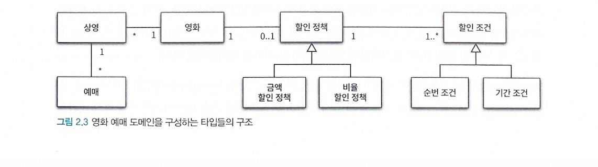
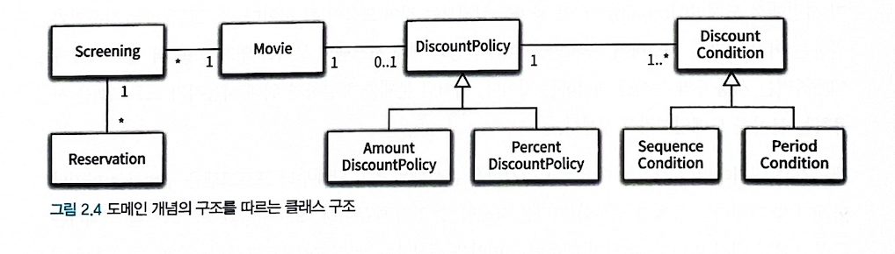

# 객체지향 프로그래밍을 향해
```typescript title="기본 예제 코드"
class Reservation {
  private _cutomer: Customer;
  private _screening: Screening;
  private _fee: Money;
  private _audienceCount: number;

  constructor(
    customer: Customer,
    screening: Screening,
    fee: Money,
    audienceCount: number
  ) {
    this._cutomer = customer;
    this._screening = screening;
    this._fee = fee;
    this._audienceCount = audienceCount;
  }
}

class Customer {
  constructor(
    private _id: string,
    private _name: string,
    private _age: number
  ) {}
}

class Screening {
  private _movie: Movie;
  private _sequence: number;
  private _whenScreened: Date;
  constructor(movie: Movie, sequence: number, whenScreened: Date) {
    this._movie = movie;
    this._sequence = sequence;
    this._whenScreened = whenScreened;
  }

  private calculateFee() {}

  get startTime() {}

  isSequence() {}

  get movieFee() {}

  reserve() {}
}

class Movie {
  private _title: string;
  private _runningTime: number;
  private _fee: Money;
  private _discountPolicy: DiscountPolicy;

  constructor(
    title: string,
    runningTime: number,
    fee: Money,
    discountPolicy: DiscountPolicy
  ) {
    this._title = title;
    this._runningTime = runningTime;
    this._fee = fee;
    this._discountPolicy = discountPolicy;
  }

  get fee() {}

  calculateMovieFee() {}
}

class Money {
  static readonly ZERO = Money.wons(0);

  constructor(private readonly _amount: number) {}

  static wons() {}

  plus() {}

  minus() {}

  times() {}

  isLessThen() {}

  isGreaterThenOrEqual() {}
}

abstract class DiscountPolicy {
  private _conditions: Array<DiscountCondition>;

  constructor(conditions: Array<DiscountCondition>) {
    this._conditions = [...conditions];
  }

  calculateDiscountAmount() {}

  abstract getDiscountAmount();
}

class AmountDiscountPolicy extends DiscountPolicy {
  private _discountAmount: Money;
  constructor(discountAmount: Money, ...conditions: Array<DiscountCondition>) {
    super(conditions);
    this._discountAmount = discountAmount;
  }

  getDiscountAmount() {}
}

class PercentDiscountPolicy extends DiscountPolicy {
  private _percent: number;

  constructor(percent: number, conditions: Array<DiscountCondition>) {
    super(conditions);
    this._percent = percent;
  }

  getDiscountAmount() {}
}

class NoneDiscountPolicy extends DiscountPolicy {
  getDiscountAmount() {}
}

interface DiscountCondition {
  isSatisfiedBy: (screening: Screening) => boolean;
}

class SequenceCondition implements DiscountCondition {
  constructor(private _sequence: number) {}

  isSatisfiedBy() {}
}

class PeriodCondition implements DiscountCondition {
  private _dayOfWeek: number;
  private _startTime: number;
  private _endTime: number;

  constructor(dayOfWeek: number, startTime: number, endTime: number) {
    this._dayOfWeek = dayOfWeek;
    this._startTime = startTime;
    this._endTime = endTime;
  }

  isSatisfiedBy() {}
}
```

## 협력, 객체, 클래스
> 진정한 객체지향 패러다임으로의 전환은 클래스가 아닌 객체에 초점을 맞출 때에만 얻을 수 있다.

1. 어떤 클래스가 필요한지를 고민하기 전에 어떤 객체들이 필요한지 고민하라.
2. 객체를 독립적인 존재가 아니라 기능을 구현하기 위해 협력하는 공동체의 일원으로 봐야 한다.

## 도메인의 구조를 따르는 프로그램 구조
> *도메인(domain)* #객체지향/도메인
> 도메인이란 사용자가 문제를 해결하기 위해 프로그램을 사용하는 분야

- 클래스 사이의 관계도 최대한 도메인 개념 사이에 맺어진 관계와 유사하게 만들어서 프로그램 구조를 이해하고 예상하기 쉽게 만들어야 한다.
- 도메인 개념과 관계를 반영하도록 프로그램을 구조화해야 하기 때문에 클래스의 구조는 도메인의 구조와 유사한 형태를 띄어야 한다.





## 클래스 구현하기
- 클래스의 내부와 외부를 구분해야 하는 이유?
	- 경계의 명확성이 *객체의 자율성* 을 보장하기 때문이다.
	- *프로그래머에게 구현의 자유* 을 제공하기 때문이다.
### 자율적인 객체
1. 객체가 `상태(state)` 와 `행동(behavior)` 을 함께 가지는 복합적인 존재라는 것이다.
2. 객체가 스스로 판단하고 행동하는 `자율적인 존재` 이다.

> 캡슐화란 데이터와 기능을 객체 내부로 함께 묶는것이다.

- 캡슐화와 접근 제어는 객체를 두 부분으로 나눈다.
	- 외부에서 접근 가능한 부분으로 이를 퍼블릭 인터페이스(public interface)라고 부른다.
	- 외부에서 접근 불가능하고 오직 내부에서만 접근 가능한 부분으로 이를 구현(implementation) 이라고 부른다.

> `인터페이스와 구현의 분리(separation of interface and implementation)` 원칙은 훌륭한 객체지향 프로그램을 만들기 위해 따라야 하는 핵심 원칙이다.

#### 결론
- 객체가 자율성을 보장하기 위해서 캡슐화를 통해 접근제어를 접근 가능한 부분 *퍼블릭 인터페이스(public interface)* 와 접근 불가능한 부분 *구현(implementation)* 으로 나눠서 외부의 간섭을 최소화 해야한다. 이를 *인터페이스와 구현의 분리(separation of interface and implementation)* 이라고 한다.

### 프로그래머의 자유
#### 결론
- `구현 은닉(implementation hiding)` 이란 클래스 작성자가 클라이언트 프로그래머에게 필요한 부분만 공개하고 나머지는 꽁꽁 숨겨서 마음대로 접근할 수 없도록 방지함으로써 클라이언트 프로그래머에 대한 영향을 걱정하지 않고도 내부 구현을 마음대로 변경할 수 있다.


> **설계가 필요한 이유는 변경을 관리하기 위해서라는것을 꼭 기억하라.** 
> 객체의 변경을 관리할 수 있는 기법 중에서 가장 대표적인 것이 바로 접근 제어다.

## 협력하는 객체들의 공동체
> 객체지향 프로그램을 작성할 땐 먼저 협력의 관점에서 어떤 객체가 필요한지를 결정한다.

- 객체는 다른 객체의 인터페이스에 공개된 행동을 수행하도록 *요청* 할 수 있다.
- 요청을 받은 객체는 자율적인 방법에 따라 요청을 처리한 후 *응답* 한다.
- 객체와 객체는 오직 *메세지* 를 통해서만 상호작용할 수 있고 메세지를 처리하기 위한 자신만의 방법을 *메서드* 라고 부른다.


# 할인 요금 구하기
```ts
class Movie {
  private _title: string;
  private _runningTime: number;
  private _fee: Money;
  private _discountPolicy: DiscountPolicy;

  constructor(
    title: string,
    runningTime: number,
    fee: Money,
    discountPolicy: DiscountPolicy
  ) {
    this._title = title;
    this._runningTime = runningTime;
    this._fee = fee;
    this._discountPolicy = discountPolicy;
  }

  get fee(): Money {
    return this._fee;
  }

  public calculateMovieFee(screening: Screening) {
    return this._fee.minus(discountPolicy.calculateDiscountAmount(screening));
  }
}
```

> 해당 예제는 영화 예매 프로그램이다.
> 영화 예매 시스템에는 두 가지 종류의 할인 정책이 존재한다.
> 1. 일정한 금액을 할인 해주는 금액 할인 정책.
> 2. 일정한 비율에 따라 할인 요금을 결정하는 비율 할인 정책.
> 어떤 할인 정책을 사용할 것인지 결정하는 코드가 어디에도 존재하지 않는다는 것이다.


> 이 코드가 어색하다면 객체지향 패러다임에 익숙하지 않은 것이라고 봐도 무방하다.
> 이 코드에는 객체지향에서 중요하다고 여기는 두 가지 개념이 숨겨져 있다.

1. *상속(inheritance)* 
2. *다형성* 

- 그 기반에는 *추상화(abstraction)* 라는 원리가 숨겨져 있다.

> 두가지 할인 정책을 각각 `AmountDiscountPolicy` 와 `PercentDiscountPolicy` 라는 클래스로 구현

```ts hl:1-11 title="부모 클래스인 DiscountPolicy안에 중복 코드를 두고 상속 받는다"
abstract class DiscountPolicy {
  private _conditions: Array<DiscountCondition>;

  constructor(conditions: Array<DiscountCondition>) {
    this._conditions = [...conditions];
  }

  calculateDiscountAmount() {}

  abstract getDiscountAmount();
}

class AmountDiscountPolicy extends DiscountPolicy {
  private _discountAmount: Money;
  constructor(discountAmount: Money, ...conditions: Array<DiscountCondition>) {
    super(conditions);
    this._discountAmount = discountAmount;
  }

  getDiscountAmount() {}
}

class PercentDiscountPolicy extends DiscountPolicy {
  private _percent: number;

  constructor(percent: number, conditions: Array<DiscountCondition>) {
    super(conditions);
    this._percent = percent;
  }

  getDiscountAmount() {}
}

interface DiscountCondition {
  isSatisfiedBy: (screening: Screening) => boolean;
}
```

- 부모 클래스인 `DiscountPolicy` 안에 중복 코드를 두고 `AmountDiscountPolicy` 와 `PercentDiscountPolicy` 가 이 클래스를 상속받는다.
- 실제 애플리케이션에서는 `DiscountPolicy` 의 인스턴스를 생성 할 필요가 없기 때문에 *추상 클래스(abstract class)* 로 구현
- 이 같은 구현을 템플릿 메서드 패턴
## 템플릿 메서드 패턴(TEMPLATE METHOD)
#객체지향/TEMPLATE-METHOD-템플릿메서드패턴
- 부모 클래스에 기본적인 알고리즘의 흐름을 구현하고 중간에 필요한 처리를 자식 클래스에게 위임하는 디자인 패턴.
- abstract를 사용한 추상 클래스(abstract class)로 구현

> `DiscountCondition` 은 인터페이스를 이용해 선언 되어 있고 `isSatisfiedBy` 오퍼레이션은 인자로 전달된 `screening` 이 할인이 가능한 경우 `true`  할인이 불가능한 경우 `false` 를 반환 


# 상속과 다형성
```typescript title="예제코드"
class Reservation {
  private _customer: Customer;
  private _screening: Screening;
  private _fee: Money;
  private _audienceCount: number;

  constructor(
    customer: Customer,
    screening: Screening,
    fee: Money,
    audienceCount: number
  ) {
    this._customer = customer;
    this._screening = screening;
    this._fee = fee;
    this._audienceCount = audienceCount;
  }
}

class Screening {
  private _movie: Movie;
  private _sequence: number;
  private _whenScreened: Date;

  constructor(movie: Movie, sequence: number, whenScreened: Date) {
    this._movie = movie;
    this._sequence = sequence;
    this._whenScreened = whenScreened;
  }

  get startTime(): Date {
    return this._whenScreened;
  }

  isSequence(sequence: number): Boolean {
    return this._sequence === sequence;
  }

  get movieFee(): Money {
    return this._movie.fee;
  }

  private calculateFee(audienceCount: number): Money {
    return this._movie.calculateMovieFee(this).times(audienceCount);
  }

  reserve(customer: Customer, audienceCount: number): Reservation {
    return new Reservation(
      customer,
      this,
      this.calculateFee(audienceCount),
      audienceCount
    );
  }
}

class Movie {
  private _title: string;
  private _runningTime: number;
  private _fee: Money;
  private _discountPolicy: DiscountPolicy;

  constructor(
    title: string,
    runningTime: number,
    fee: Money,
    discountPolicy: DiscountPolicy
  ) {
    this._title = title;
    this._runningTime = runningTime;
    this._fee = fee;
    this._discountPolicy = discountPolicy;
  }

  get fee(): Money {
    return this._fee;
  }

  calculateMovieFee = (screening: Screening) => {
    if (!this._discountPolicy) {
      return this.fee;
    }

    return this._fee.minus(
      this._discountPolicy.calculateDiscountAmount(screening)
    );
  };

  set discountPolicy(discountPolicy: DiscountPolicy) {
    this._discountPolicy = discountPolicy;
  }
}

interface DiscountPolicy {
  calculateDiscountAmount(screening: Screening): Money;
}

abstract class DefaultDiscountPolicy implements DiscountPolicy {
  private _conditions: Array<DiscountCondition>;

  constructor(conditions: Array<DiscountCondition>) {
    this._conditions = [...conditions];
  }

  calculateDiscountAmount(screening: Screening): Money {
    let conditions: DiscountCondition[] = [];
    this._conditions
      .filter((condition) => condition.isSatisfiedBy(screening))
      .forEach((condition) => conditions.push(condition));

    if (conditions.length) {
      return this.getDiscountAmount(screening);
    } else {
      return Money.ZERO;
    }
  }

  abstract getDiscountAmount(sereening: Screening): Money;
}

class AmountDiscountPolicy extends DefaultDiscountPolicy {
  private _discountAmount: Money;

  constructor(discountAmount: Money, conditions: Array<DiscountCondition>) {
    super(conditions);
    this._discountAmount = discountAmount;
  }

  getDiscountAmount(screening: Screening): Money {
    return this._discountAmount;
  }
}

class PercentDiscountPolicy extends DefaultDiscountPolicy {
  private _percent: number;

  constructor(percent: number, conditions: Array<DiscountCondition>) {
    super(conditions);
    this._percent = percent;
  }

  getDiscountAmount(screening: Screening): Money {
    return screening.movieFee.times(this._percent);
  }
}

class NoneDiscountPolicy implements DiscountPolicy {
  calculateDiscountAmount(screening: Screening): Money {
    return Money.ZERO;
  }
}

interface DiscountCondition {
  isSatisfiedBy(screening: Screening): Boolean;
}

class SequenceCondition implements DiscountCondition {
  constructor(private _sequence: number) {}

  sequenceConfition(sequence: number) {
    this._sequence = sequence;
  }

  isSatisfiedBy(screening: Screening): Boolean {
    return screening.isSequence(this._sequence);
  }
}

class PeriodCondition implements DiscountCondition {
  private _dayOfWeek: number;
  private _startTime: number;
  private _endTime: number;

  constructor(dayOfWeek: number, startTime: number, endTime: number) {
    this._dayOfWeek = dayOfWeek;
    this._startTime = startTime;
    this._endTime = endTime;
  }

  isSatisfiedBy(screening: Screening): Boolean {
    const { startTime } = screening;
    return (
      startTime.getDay() === this._dayOfWeek &&
      this._startTime <= startTime.getTime() &&
      this._endTime >= startTime.getTime()
    );
  }
}

class Money {
  static readonly ZERO = Money.wons(0);

  constructor(private _amount: number) {}

  static wons(amount: number) {
    return new Money(amount);
  }

  get amount(): number {
    return this._amount;
  }

  plus = (amount: number): Money => {
    return new Money(this._amount + amount);
  };

  minus = (amount: any): Money => {
    return new Money(this._amount - amount);
  };

  times = (percent: number): Money => {
    return new Money(this._amount * percent);
  };

  isLessThan = (other: Money): boolean => {
    return this._amount < other.amount;
  };

  isGreaterThanOrEqual = (other: Money): boolean => {
    return this._amount >= other.amount;
  };
}

class Customer {
  constructor(
    private _id: string,
    private _name: string,
    private _age: number
  ) {}
}
```


## 컴파일 시간 의존성과 실행 시간 의존성

```ts
class Reservation {
  private _customer: Customer;
  private _screening: Screening;
  private _fee: Money;
  private _audienceCount: number;

  constructor(
    customer: Customer,
    screening: Screening,
    fee: Money,
    audienceCount: number
  ) {
    this._customer = customer;
    this._screening = screening;
    this._fee = fee;
    this._audienceCount = audienceCount;
  }
}

class Screening {
  private _movie: Movie;
  private _sequence: number;
  private _whenScreened: Date;

  constructor(movie: Movie, sequence: number, whenScreened: Date) {
    this._movie = movie;
    this._sequence = sequence;
    this._whenScreened = whenScreened;
  }

  get startTime(): Date {
    return this._whenScreened;
  }

  isSequence(sequence: number): Boolean {
    return this._sequence === sequence;
  }

  get movieFee(): Money {
    return this._movie.fee;
  }

  private calculateFee(audienceCount: number): Money {
    return this._movie.calculateMovieFee(this).times(audienceCount);
  }

  reserve(customer: Customer, audienceCount: number): Reservation {
    return new Reservation(
      customer,
      this,
      this.calculateFee(audienceCount),
      audienceCount
    );
  }
}

class Movie {
  private _title: string;
  private _runningTime: number;
  private _fee: Money;
  private _discountPolicy: DiscountPolicy;

  constructor(
    title: string,
    runningTime: number,
    fee: Money,
    discountPolicy: DiscountPolicy
  ) {
    this._title = title;
    this._runningTime = runningTime;
    this._fee = fee;
    this._discountPolicy = discountPolicy;
  }

  get fee(): Money {
    return this._fee;
  }

  public calculateMovieFee(screening: Screening) {
    return this._fee.minus(
      this._discountPolicy.calculateDiscountAmount(screening)
    );
  }

  set discountPolicy(discountPolicy: DiscountPolicy) {
    this._discountPolicy = discountPolicy;
  }
}

interface DiscountPolicy {
  calculateDiscountAmount(screening: Screening): Money;
}

abstract class DefaultDiscountPolicy implements DiscountPolicy {
  private _conditions: Array<DiscountCondition>;

  constructor(conditions: Array<DiscountCondition>) {
    this._conditions = [...conditions];
  }

  calculateDiscountAmount(screening: Screening): Money {
    let conditions: DiscountCondition[] = [];
    this._conditions
      .filter((condition) => condition.isSatisfiedBy(screening))
      .forEach((condition) => conditions.push(condition));

    if (conditions.length) {
      return this.getDiscountAmount(screening);
    } else {
      return Money.ZERO;
    }
  }

  abstract getDiscountAmount(sereening: Screening): Money;
}

class AmountDiscountPolicy extends DefaultDiscountPolicy {
  private _discountAmount: Money;

  constructor(discountAmount: Money, conditions: Array<DiscountCondition>) {
    super(conditions);
    this._discountAmount = discountAmount;
  }

  getDiscountAmount(screening: Screening): Money {
    return this._discountAmount;
  }
}

class PercentDiscountPolicy extends DefaultDiscountPolicy {
  private _percent: number;

  constructor(percent: number, conditions: Array<DiscountCondition>) {
    super(conditions);
    this._percent = percent;
  }

  getDiscountAmount(screening: Screening): Money {
    return screening.movieFee.times(this._percent);
  }
}

class NoneDiscountPolicy implements DiscountPolicy {
  calculateDiscountAmount(screening: Screening): Money {
    return Money.ZERO;
  }
}

interface DiscountCondition {
  isSatisfiedBy(screening: Screening): Boolean;
}

class SequenceCondition implements DiscountCondition {
  constructor(private _sequence: number) {}

  sequenceConfition(sequence: number) {
    this._sequence = sequence;
  }

  isSatisfiedBy(screening: Screening): Boolean {
    return screening.isSequence(this._sequence);
  }
}

class PeriodCondition implements DiscountCondition {
  private _dayOfWeek: number;
  private _startTime: number;
  private _endTime: number;

  constructor(dayOfWeek: number, startTime: number, endTime: number) {
    this._dayOfWeek = dayOfWeek;
    this._startTime = startTime;
    this._endTime = endTime;
  }

  isSatisfiedBy(screening: Screening): Boolean {
    const { startTime } = screening;
    return (
      startTime.getDay() === this._dayOfWeek &&
      this._startTime <= startTime.getTime() &&
      this._endTime >= startTime.getTime()
    );
  }
}

class Money {
  static readonly ZERO = Money.wons(0);

  constructor(private _amount: number) {}

  static wons(amount: number) {
    return new Money(amount);
  }

  get amount(): number {
    return this._amount;
  }

  plus = (amount: number): Money => {
    return new Money(this._amount + amount);
  };

  minus = (amount: any): Money => {
    return new Money(this._amount - amount);
  };

  times = (percent: number): Money => {
    return new Money(this._amount * percent);
  };

  isLessThan = (other: Money): boolean => {
    return this._amount < other.amount;
  };

  isGreaterThanOrEqual = (other: Money): boolean => {
    return this._amount >= other.amount;
  };
}

class Customer {
  constructor(
    private _id: string,
    private _name: string,
    private _age: number
  ) {}
}

const avatar = new Movie(
  "아바타",
  120,
  Money.wons(10000),
  new AmountDiscountPolicy(Money.wons(800), [
    new SequenceCondition(1),
    new SequenceCondition(10),
  ])
);
```

> `Movie` 클래스가 `DiscountPolicy` 클래스와 연결돼 있다는점을 주목 해야 된다.
> **문제는 영화 요금을 계산하기 위해서는 추상클래스인** `DiscountPolicy` 가 아니라 `AmountDiscountPolicy` 와 `PercentDiscountPolicy` 의 인스턴스에 의존 해야한다.
> *하지만 코드 수준에서 오직 추상 클래스인 `DiscountPolicy` 에만 의존한다*   


- Movie의 인스턴스가 AmountDiscountPolicy 클래스의 인스턴스에 의존

```ts hl:5 title="AmountDiscountPolicy 클래스의 인스턴스에 의존"
const avatar = new Movie(
  "아바타",
  120,
  Money.wons(10000),
  new AmountDiscountPolicy(Money.wons(800), [
    new SequenceCondition(1),
    new SequenceCondition(10),
    ...
  ])
);
```

- Movie의 인스턴스가 PercentDiscountPolicy의 인스턴스에 의존

```ts hl:5 title="PercentDiscountPolicy에 의존"
const avatar = new Movie(
  "아바타",
  120,
  Money.wons(10000),
  new PercentDiscountPolicy(0.1, [
	  new SequenceCondition(2),
	  ...
  ])
);
```

### 결론
> 코드의 의존성과 실행 시점의 의존성이 서로 다를 수 있다는 것이다.
> *코드 상에서 Movie는 `DiscountPolicy` 에 의존 한다. 어디에도 Movie가 `AmountDiscountPolicy` 나 `PercentDiscountPolicy` 에 의존 하는것을 찾을 수 없다* 
> 그러나 **실행 시점에는 Movie의 인스턴스는 AmountDiscountPolicy 나 PercentDiscountPolicy의 인스턴스에 의존한다** 

- 클래스 사이의 의존성과 객체 사이의 의존성은 다를 수 있다.
	- *클래스 사이의 의존성과 객체 사이의 의존성이 다를수록 코드를 이해하기 어려워지고 디버깅하기 어려워진다.* 
	- *반면에 코드는 더 유연해지고 확장 가능성이 높아진다.* 
	- 이와 같은 의존성의 양면성은 설계가 트레이드오프의 산물이라는 사실을 잘 보여준다.


## 차이에 의한 프로그래밍
> 클래스를 하나 추가하고 싶은데 기존의 어떤 클래스와 매우 흡사하다고 가정.

### 상속
- 코드를 재사용하기 위해 가장 널리 사용되는 방법
- 상속을 이용하면 클래스 사이에 관계를 설정하는 것만으로 기존 클래스가 가지고 있는 모든 속성과 행동을 새로운 클래스에 포함시킬 수 있다.
- *차이에 의한 프로그래밍(programming by difference)* : 부모 클래스와 다른 부분만을 추가해서 새로운 클래스를 쉽고 빠르게 만드는 방법


## 상속과 인터페이스
- **상속이 가치 있는 이유는 부모 클래스가 제공하는 모든 인터페이스를 자식 클래스가 물려받을 수 있기 때문** 
- 대부분의 사람들은 상속의 목적이 메서드나 인스턴스 변수를 재사용하는 것이라고 생각한다. (짧은 생각)
- 상속을 통해 자식 클래스는 자신의 인터페이스에 부모 클래스의 인터페이스를 포함하게 된다.
- 인터페이스는 객체가 이해할 수 있는 메세지의 목록
- 자식 클래스는 부모 클래스가 수신할 수 있는 모든 메세지를 수신 할 수 있기 때문에 외부 객체는 자식 클래스를 부모 클래스와 동일한 타입으로 간주

```ts
class Movie {
  ...

  public calculateMovieFee(screening: Screening) {
    return this._fee.minus(
      this._discountPolicy.calculateDiscountAmount(screening)
    );
  }

  ...
}
```


> 위의 Movie가 DiscountPolicy의 인터페이스에 정의된 calculateDiscountAmount 메세지를 전송하고 있다.
> Movie 입장에서는 자신과 협력하는 객체가 어떤 클래스의 인스턴스인지 중요한것이 아니라 calculateDiscountAmount 메세지를 수신할 수 있다는 사실이 중요하다.
> **결론적으로 `AmountDiscountPolicy` 와 `PercentDiscountPolicy` 모두 Movie와 협력 할 수 있다.** 
### 결론
> 자식 클래스는 상속을 통해 부모 클래스의 인터페이스를 물려받기 때문에 부모 클래스 대신 사용될 수 있다.
> 이처럼 자식 클래스가 부모 클래스를 대신하는 것을 *업캐스팅(upcasting)* 


## 다형성
#객체지향/다형성
> *다형성* 이란 동일한 메세지를 전송하더라도 실제로 어떤 메서드가 실행될 것인지는 메세지를 수신하는 객체의 클래스가 무엇이냐에 따라 달라진다.(컴파일 시간 의존성과 런타임 의존성 참고)

- 다형성은 컴파일 시간 의존성과 실행 시간 의존성을 다르게 만들 수 있는 객체지향의 특성을 이용해 서로 다른 메서드를 실행 할 수 있게 한다.
- 다형성이란 동일한 메세지를 수신했을 때 객체의 타입에 따라 다르게 응답할 수 있는 능력을 의미한다.
- 다형적인 협력에 참여하는 객체들은 모두 같은 메세지를 이해할 수 있어야 하는데 그러기 위해서는 인터페이스가 동일해야 한다.
- 인터페이스를 통일하기 위해 사용한 구현 방법이 *상속* 이다

> 메세지와 메서드를 컴파일 시점에 바인딩 : 초기 바인딩(early binding), 정적 바인딩(static binding)
> 메세지와 메서드를 런타임 시점에 바인딩 : 지연 바인딩(lazy binding), 동적 바인딩(dynamic binding)


## 추상화와 유연성
- 추상화를 사용하면 세부적인 내용을 무시한 채 상위 정책을 쉽고 간단하게 표현할 수 있다.
- 추상화를 이용해 상위 정책을 기술한다는 것은 기본적인 애플리케이션의 협력 흐름을 기술한다는 것을 의미한다.
	- 재사용 가능한 설계의 기본을 이루는 디자인 패턴이나 프레임워크 모두 추상화를 이용해 상위 정책을 정의하는 객체지향의 매커니즘을 활용하고 있다.
- 기본 구조를 수정하지 않고도 새로운 기능을 쉽게 추가하고 확장할 수 있다.


```ts
const avatar = new Movie(
  "스타워즈",
  210,
  Money.wons(10000),
  new NoneDiscountPolicy()
);
```

> Movie 인스턴스에 `NoneDiscountPolicy` 의 인스턴스를 연결해서 할인되지 않는 영화를 생성 할 수 있다.

- **중요한 것은 기존의 Movie와 DiscountPolicy는 수정하지 않고 NoneDiscountPolicy 라는 새로운 클래스를 추가하는 것만으로 애플리케이션의 기능을 확장 했다는 것이다** 

### 결론
- *유연성이 필요한 곳에 추상화를 사용하라* 


## 코드 재사용
- *합성(composition)* #객체지향/composition-합성: 다른 객체의 인스턴스를 자신의 인스턴스 변수로 포함해서 재사용 하는 방법이다. 코드 재사용을 위해 상속보다 더 좋은 방법

> 상속은 객체지향에서 코드를 재사용하기 위해 널리 사용되는 기법이지만 다음 문제점이 있다.

### 상속의 문제점
- 캡슐화를 위반한다.
- 설계를 유연하지 못하게 만든다.
	- 상속은 부모클래스와 자식 클래스 사이의 관계를 컴파일 시점에 결정
	- 실행 시점에 객체의 종류를 변경하는 것이 불가능하다.

### 합성
- *인터페이스에 정의된 메세지를 통해서만 재사용이 가능하기 때문에 구현을 효과적으로 캡슐화 할 수 있다.* 
- *의존하는 인스턴스를 교체하는 것이 비교적 쉽기 때문에 설계를 유연하게 만든다.* 
	- 상속은 클래스를 통해 강하게 결합되는 반면 합성은 메세지를 통해 느슨하게 결합 된다.


> 대부분의 설계에서는 상속과 합성을 함께 사용 해야 한다.
> 코드를 재사용하는 경우 : 합성
> 다형성을 위해 인터페이스를 재사용하는 경우 : 상속과 합성 함께 조합

## 결론
> 프로그래밍의 관점에서 클래스와 상속은 중요하지만 프로그래밍 관점에 너무 치우쳐서 객체지향을 바라볼 경우 객체지향의 본질을 놓치기 쉽다.
> 객체지향의 핵심은 **적절한 협력을 식별하고 협력에 필요한 역할을 정의한 후에 역할을 수행할 수 있는 적절한책임을 할당하는 것이다.** 
