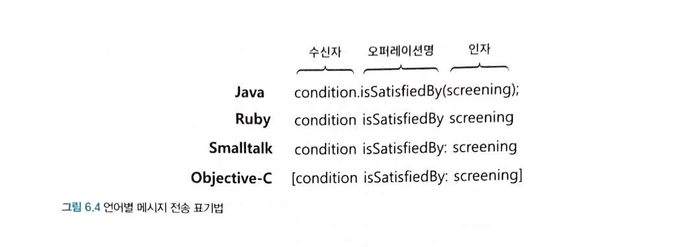

- 객체지향 프로그래밍의 가장 중요한 재료는 클래스가 아니라 객체들이 주고받는 메세지다.

# 🐵 협력과 메세지

## 클라이언트 - 서버 모델
- 협력은 어떤 객체가 다른 객체에게 메세지를 통해 무언가를 요청할 때 시작된다.
	- 클라이언트 : 메세지를 전송하는 객체
	- 서버 : 메세지를 수신하는 객체

> 객체는 협력에 참여하는 동안 클라이언트와 서버의 역할을 동시에 수행하는 것이 일반적이다.

- 협력의 관점에서 객체의 두가지 종류의 메세지 집합
	1. 객체가 수신하는 메세지의 집합
	2. 외부의 객체에게 전송하는 메세지의 집합
- 협력에 적합한 객체를 설계하기 위해서 객체가 수신하는 메세지집합과 외부에 전송하는 메세지의 집합도 함께 고려해야 한다.

> 객체가 독립적으로 수행할 수 있는 것보다 더 큰 책임을 수행하기 위해서는 다른 객체와 협력 해야 한다.


## 메세지와 메세지 전송
- `메세지(message)` 
	- 객체들이 협력하기 위해 사용할 수 있는 유일한 의사소통 수단이다.
	- `오퍼레이션명(operation name)` 과 `인자(argument)` 로 구성된다.
- `메세지 전송(message sending)` : 한 객체가 다른 객체에게 도움을 요청하는 것.
- `메세지 전송자(message sender)` : 메세지를 전송하는 객체
- `메세지 수신자(message receiver)` : 메세지를 수신하는 객체

> 메세지는 오퍼레이션명과 인자로 구성되고 메세지 전송은 여기에 메세지 수신자를 추가한것
> 메세지 전송은 메세지 수신자, 오퍼레이션명, 인자의 조합이다.



```typescript title="메세지 전송 표기법"
condition.isSatisfiedBy(screening);
```

- condition : 수신자
- isSatisfiedBy : 오퍼레이션명
- (screening) : 인자


## 메세지와 메서드
- *메서드* : 메세지를 수신했을 때 실제로 실행되는 함수 또는 프로시저

> 전통적인 방식의 개발자는 코드의 의미가 컴파일 시점과 실행 시점에 동일한 코드를 작성하는데
> 객체지향적인 방식의 객체는 메세지와 메서드라는 두 가지 서로 다른 개념을 실행 시점에 연결해야 하기 때문에
> **컴파일 시점과 실행 시점의 의미가 달라질 수 있다.** 
> **실행 시점에 실제로 실행되는 코드는 메세지를 수신하는 객체의 타입에 따라 달리지기 때문에** 우리는 그저 메세지에 응답할 수 있는 객체가 존재하고 그 객체가 적절한 메서드를 선택해서 응답할 것이라고 믿을 수 밖에 없다.

- 메세지 전송자와 메세지 수신자는 서로에 대한 상세한 정보를 알지 못한 채 메세지라는 끈을 통해서만 연결된다.
- 실행 시점에 메세지와 메서드를 바인딩하는 메커니즘은 두 객체 사이의 결합도를 낮춘다.


## 퍼블릭 인터페이스와 오퍼레이션

- 퍼블릭 인터페이스(public interface) : 객체가 의사소통을 위해 외부에 공개하는 메세지의 집합
- 오퍼레이션(operation) : 퍼블릭 인터페이스에 포함된 메세지.
	- 수행 가능한어떤 행동에 대한 추상화
- 메서드 : 메세지를 수신했을 때 실제로 실행되는 코드

> 예제 코드에서 `DiscountCondition` 인터페이스에서 `isSatisfiedBy` 가 *오퍼레이션* 이고
> `SequenceCondition` 과 `PeriodCondition` 에 정의된 각각의 `isSatisfiedBy` 는 실제 구현을 포함하기 때문에 *메서드* 라고 한다.

## 시그니처
- 시그니처 : 오퍼레이션이나 메서드의 명세를 나타낸 것으로 이름과 인자의 목록을 포함한다.

# 🌼 인터페이스와 설계 품질
- 좋은 인터페이스는 *최소한의 인터페이스* 와 *추상적인 인터페이스* 라는 조건을 만족해야 한다.
- 추상적인 인터페이스를 설계할 수 있는 가장 좋은 방법은 책임 주도 설계(RDD) 방법 이다.

- [0] 퍼블릭 인터페이스의 품질에 영향을 미치는 원칙과 기법

- 디미터 법칙
- 묻지 말고 시켜라
- 의도를 드러내는 인터페이스
- 명령-쿼리 분리


## 디미터 법칙
- 객체의 내부구조에 강하게 결합되지 않도록 협력 경로를 제한하라는 것이다.
- 캡슐화를 다른 관점에서 표현한것
	- 협력하는 클래스의 캡슐화를 지키기 위해 접근해야 하는 요소를 제한한다.
- 객체가 자기 자신을 책임지는 자율적인존재여야 한다.

> 디미터 법칙을 따르기 위해서는 클래스가 특정 조건을 만족하는 대상에게만 메세지를 전송하도록 프로그래밍 해야한다.
> 아래는 클래스 내부의 메서드가 아래 조건을 만족하는 인스턴스에만 메세지를 전송해야 하는 조건

- this 객체
- 메서드의 매개변수
- this의 속성
- this의 속성인 컬렉션의 요소
- 메서드 내에서 생성된 지역 객체
## 묻지 말고 시켜라
- 훌륭한 메세지는 객체의 상태에 관해 묻지 말고 원하는 것을 시켜야 한다.
- 밀접하게 연관된 정보와 행동을 함께 가지는 객체를 만들 수 있다.
- 자연스럽게 정보와 행동을 동일한 클래스 안에 두게 된다.
- 자연스럽게 정보 정문가에게 책임을 할당하게 되고 높은 응집도를 가진 클래스를 얻을 확률이 높아진다.
## 의도를 드러내는 인터페이스
- 메서드 명명법
	1. 메서드가 작업을 어떻게 수행 하는지를 나타내도록 이름 짓는 것이다.
	2. '어떻게' 가 아니라 '무엇'을 하는지를 드러내는 것
- 의도를 드러내는 인터페이스(Intenion Revealing Interface) : 구현과 관련된 모든 정보를 캡슐화하고 객체의 퍼블릭 인터페이스에는 협력과 관련된 의도만을 표현해야 한다.
- 객체에게 묻지 말고 시키되 구현 방법이 아닌 클라이언트의 의도를 드러내야 한다.
## 함께 모으기

```ts title="1장 기본 예제 코드"
// 초대장 클래스
class Invitation {
	private when: Date;

	constructor(when: Date){
		this.when = when;
	}
}

// 티켓 클래스
class Ticket {
	private fee: number;

	constructor(fee: number){
		this.fee = fee;
	}

	public get Fee(): number {
		return this.fee;
	}
}

// 가방 클래스
class Bag {
  private amount: number;
  private invitation?: Invitation; // Optional parameter
  private ticket?: Ticket;

  constructor(amount: number);
  constructor(invitation: Invitation | null, amount: number);
  constructor(invitationOrAmount: Invitation | number | null, amount?: number) {
    if (typeof invitationOrAmount === "number") {
      this.amount = invitationOrAmount;
    } else {
      this.invitation = invitationOrAmount || undefined;
      this.amount = amount!;
    }
  }

  public hasInvitation(): boolean {
    return !!this.invitation;
  }

  public hasTicket(): boolean {
    return !!this.ticket;
  }

  public set Ticket(ticket: Ticket) {
    this.ticket = ticket;
  }

  public minusAmount(amount: number): void {
    this.amount -= amount;
  }

  public plusAmount(amount: number): void {
    this.amount += amount;
  }
}

// 관람객 클래스
class Audience {
	private bag: Bag;

	constructor(bag: Bag) {
		this.bag = bag;
	}

	public get Bag(): Bag {
		return this.bag;
	}
}


// 매표소
class TicketOffice {
	private amount: number;
	private tickets:Ticket[];

	constructor(amount:number, tickets:Ticket[]){
		this.amount = amount;
		this.tickets = tickets;
	}

	public get Ticket(){
		return this.tickets.shift();
	}

    public minusAmount(amount: number): void {
	    this.amount -= amount;
    }

    public plusAmount(amount: number): void {
	    this.amount += amount;
    }
}
// 판매원
class TicketSeller {
	private ticketOffice: TicketOffice;

	constructor(ticketOffice: TicketOffice){
		this.ticketOffice = ticketOffice;
	}

	public get TicketOffice(): TicketOffice {
		return this.ticketOffice;
	}
}

// 소극장 클래스
class Theater{
	private ticketSeller:TicketSeller;

	constructor(ticketSeller:TicketSeller){
		this.ticketSeller = ticketSeller;
	}

	public enter(audience: Audience){
		if (audience.Bag.hasInvitation()){
			const ticket:Ticket = this.ticketSeller.TicketOffice.Ticket!;
			audience.Bag.Ticket = ticket; 
		}else {
			const ticket:Ticket = this.ticketSeller.TicketOffice.Ticket!;
			audience.Bag.minusAmount(ticket.Fee);
			this.ticketSeller.TicketOffice.plusAmount(ticket.Fee);
			audience.Bag.Ticket = ticket;
		}
	}
}
```
### 디미터 법칙을 위반하는 티켓 판매 도메인
```typescript title="소극장 클래스" 

class Theater{
	private ticketSeller:TicketSeller;

	constructor(ticketSeller:TicketSeller){
		this.ticketSeller = ticketSeller;
	}

	public enter(audience: Audience){
		if (audience.Bag.hasInvitation()){
			const ticket:Ticket = this.ticketSeller.TicketOffice.Ticket!;
			audience.Bag.Ticket = ticket; 
		}else {
			const ticket:Ticket = this.ticketSeller.TicketOffice.Ticket!;
			audience.Bag.minusAmount(ticket.Fee);
			this.ticketSeller.TicketOffice.plusAmount(ticket.Fee);
			audience.Bag.Ticket = ticket;
		}
	}
}
```

> `enter` 메서드는 디미터 법칙을 위반한다.
> `Theater` 가 `audience` 와 `ticketSeller` 내부에 포함된 객체에 직접 접근 하는 것이 문제다.

- **디미터 법칙을 위반하는 설계는 인터페이스와 구현의 분리 원칙(ISP: Interface Segregaion Principle)** 을 위반한다.

### 묻지 말고 시켜라
- `TicketSeller` 와 `Audience` 는 묻지 말고 시켜라 스타일을 따르는 퍼블릭 인터페이스를 가져야한다.

```typescript title="TicketSeller 클래스"
class TicketSeller {
  private ticketOffice: TicketOffice;
  constructor(ticketOffice: TicketOffice) {
    this.ticketOffice = ticketOffice;
  }

  getticketOffice(): TicketOffice {
    return this.ticketOffice;
  }

  sellTo(audience: Audience): void {
    this.ticketOffice.plusAmount(audience.buy(this.ticketOffice.getTicket()));
  }
}
```

```typescript title="Theater 클래스"
class Theater {
  // 문지말고 ticketseller에게 시켜라
  private ticketSeller: TicketSeller;

  constructor(ticketSeller: TicketSeller) {
    this.ticketSeller = ticketSeller;
  }

  enter = (audience: Audience) => {
    this.ticketSeller.sellTo(audience);
  };
}
```

```typescript title="Audience 클래스"
class Audience {
    // 디미터 법칙을 준수하는 Audience
    constructor(private bag: Bag) {
      this.bag = bag;
    }

    getbag(): Bag {
      return this.bag;
    }

    buy(ticket: Ticket): number {
      return this.bag.hold(ticket);
    }
  }
```

```typescript title="Bag 클래스"
class Bag {
  private amount: number;
  private invitation: Invitation;
  private ticket: Ticket;
  constructor(amount: number, invitation: Invitation, ticket: Ticket) {
    this.amount = amount;
    this.invitation = invitation;
    this.ticket = ticket;
  }

  plusAmount = (amount: number): void => {
    this.amount += amount;
  };

  minusAmount = (amount: number): void => {
    this.amount -= amount;
  };

  hold = (ticket: Ticket): number => {
    if (this.hasInvitation) {
      this.ticket = ticket;
      return 0;
    } else {
      this.ticket = ticket;
      this.minusAmount(ticket.fee);
      return ticket.fee;
    }
  };

  get hasInvitation(): boolean {
    return !!this.invitation;
  }

  get hasTicket(): boolean {
    return !!this.ticket;
  }
}
```

# 👻 원칙의 함정

## 디미터 법칙은 하나의 도트를 강제하는 규칙이아니다
```
IntStream.of(1, 15, 20, 3, 9).filter(x -> x > 10).distinct().count()
```

- 단순히 기차 충돌을 많이 초래한다고 해서 디미터 법칙을 위반하는 것은 아님
- *객체의 내부 구조가 외부로 노출되는 경우에만 한정됨.* 

## 결합도와 응집도의 충돌
- 모든 상황에서 맹목적으로 위임 메서드를 추가하면 같은 퍼블릭 인터페이스 안에 어울리지 않는 오퍼레이션들이 공존하게 된다.
- 결과적으로 객체는 상관 없는 책임들을 한꺼번에 떠안게 되기 때문에 결과적으로 응집도가 낮아진다.
- 디미터 법칙과 묻지 말고 시켜라 원칙을 무작정 따르면 애플리케이션은 응집도가 낮은 객체로 넘쳐날것이다.
- 즉, 디미터 법칙과 묻지 말고 시켜라원칙을 따르면서 설계 할 때 항상 *책임* 을 생각하고 설계 해야한다. 객체가 상관 없는 책임들을 한꺼번에 떠안게 되기 때문이다.


# 👽 명령-쿼리 분리 원칙
- *루틴(routine)* : 어떤 절차를 묶어 호출 가능하도록 이름을 부여한 기능 모듈
	- *프로시저(procedure)* 
		- 정해진 절차에 따라 내부의 상태를 변경하는 루틴의 한 종류다.
		- 부수효과를 발생시킬 수 있지만 값을 반환할 수 없다.
		- 명령(Command) 라고도 불린다.
	- *함수(function)*
		- 어떤 절차에 따라 필요한 값을 계산해서 반환하는 루틴의 한 종류다.
		- 값을 반환할 수 있지만 부수효과를 발생시킬 수 없다.
		- 쿼리(Query) 라고도 불린다.


> 명령-쿼리 분리 원칙의 요지는 오퍼레이션은 부수효과를 발생시키는 명령이거나 부수효과를 발생시키지 않는 쿼리 중 하나여야 한다.

- 명령과 쿼리를 분리하기 위한 두 가지 규칙
	1. 객체의 상태를 변경하는 명령은 반환값을 가질 수 없다.
	2. 객체의 정보를 반환하는 쿼리는 상태를 변경할 수 없다.

> 즉, 질문이 답변을 수정해서는 안된다


## 반복 일정의 명령과 쿼리 분리학

```typescript title="예제 코드"
class Event {
  private subject: string;
  private from: Date;
  private duration: any;

  constructor(subject: string, from: Date, duration: any) {
    this.subject = subject;
    this.from = from;
    this.duration = duration;
  }
  // 명령과 질의 (command & query)가 함께 있다.
  // 버그의 원인이 된다.
  public isSatisfied(schedule: RecurringSchedule): boolean {
    if (
      this.from.getDayOfWeek() != schedule.getDayOfWeek() ||
      !this.from.toLocalTime().equals(schedule.getFrom()) ||
      !this.duration.equals(schedule.getDuration())
    ) {
      this.reschedule(schedule);
      return false;
    }
    return true;
  }

  private reschedule(schedule: RecurringSchedule): void {
    this.from = LocalDateTime.of(
      this.from.toLocalDate().plusDays(daysDistance(schedule)),
      schedule.getFrom()
    );
    this.duration = schedule.getDuration();
  }

  private daysDistance(schedule: RecurringSchedule): number {
    return (
      schedule.getDayOfWeek().getValue() - this.from.getDayOfWeek().getValue()
    );
  }
}

class RecurringSchedule {
  private subject: string;
  private dayOfWeek: any;
  private from: Date;
  private duration: any;

  constructor(subject: string, dayOfWeek: any, from: Date, duration: any) {
    this.subject = subject;
    this.dayOfWeek = dayOfWeek;
    this.from = from;
    this.duration = duration;
  }

  public getDayOfWeek(): any {
    return this.dayOfWeek;
  }

  public getFrom(): Date {
    return this.from;
  }

  public getDuration(): any {
    return this.duration;
  }
}
```

> `isSatisfied` 가 명령과 쿼리의 두 가지 역할을 동시에 수행하고 있기 때문에 버그의 원인이 된다.

- `isSatisfied` 메서드는 `Event` 가 `RecurringSchedule` 의 조건에 부합하는지를 판단한 후 부합할 경우 true를, 부합 하지 않을 경우 false를 반환한다. 따라서 `isSatisfied` 메서드는 개념적으로 쿼리다.
- `isSatisfied` 메서드는 `Event` 가 `RecurringSchedule` 의 조건에 부합하지 않을 경우 `Event` 의 상태를 조건에 부합 하도록 변경한다. 따라서 `isSatisfied` 는 실제로는 부수효과를 가지는 명령이다.

```typescript title="코드 개선"
class Event {
  private subject: string;

  private from: Date;

  private duration: any;

  constructor(subject: string, from: Date, duration: any) {
    this.subject = subject;

    this.from = from;

    this.duration = duration;
  }

  // 명령을 제거했다

  public isSatisfied(schedule: RecurringSchedule): boolean {
    if (
      this.from.getDayOfWeek() != schedule.getDayOfWeek() ||
      !this.from.toLocalTime().equals(schedule.getFrom()) ||
      !this.duration.equals(schedule.getDuration())
    ) {
      return false;
    }

    return true;
  }

  // 상태를 변경하는 메서드를 퍼블릭으로 변경하여

  // 클라이언트가 필요할 경우 해당 메서드의 호출 여부 결정이 가능해짐

  public reschedule(schedule: RecurringSchedule): void {
    this.from = LocalDateTime.of(
      this.from.toLocalDate().plusDays(daysDistance(schedule)),

      schedule.getFrom()
    );

    this.duration = schedule.getDuration();
  }

  private daysDistance(schedule: RecurringSchedule): number {
    return (
      schedule.getDayOfWeek().getValue() - this.from.getDayOfWeek().getValue()
    );
  }
}

class RecurringSchedule {
  private subject: string;

  private dayOfWeek: any;

  private from: Date;

  private duration: any;

  constructor(subject: string, dayOfWeek: any, from: Date, duration: any) {
    this.subject = subject;

    this.dayOfWeek = dayOfWeek;

    this.from = from;

    this.duration = duration;
  }

  public getDayOfWeek(): any {
    return this.dayOfWeek;
  }

  public getFrom(): Date {
    return this.from;
  }

  public getDuration(): any {
    return this.duration;
  }
}
```

> 해결 하기 위해서는 명령과 쿼리를 명확하게 분리하는 것

## 명령-쿼리 분리와 참조 투명성
> 부수효과(Side Effect)를 이야기할 때 빠질 수 없는 것이 *참조 투명성* 이다.

- 참조 투명성 특성
	- 어떤 표현식 e가 있을 때 e의 값으로 e가 나타나는 모든 위치를 교체하더라도 결과가 달라지지 않는다.
	- 모든 함수를 이미 알고 있는 하나의 결과값으로 대체할 수 있으므로 식을 쉽게 계산할 수 있다.
	- 모든 곳에서 함수의 결과값이 동일하기 때문에 식의 순서를 변경하더라도 각 식의 결과는 달라지지 않는다.

> 참조 투명성 예제
> 수학 기준
> f(1) + f(1) = 6
> f(1) * 2 = 6
> f(1) - 1 = 2
> 여기서 f(1)을 함수의 결과값인 3으로 바꾸었을때 식의 결과는 변하지 않는데 이를 참조 투명성이라 한다.
> 3 + 3 = 6
> 3 * 2 = 6
> 3 - 1 = 2

- 이처럼 어떤 값이 변하지 않는 성징을 *불변성(immutability)* 이라고 한다.
- 어떤 값이 불변하다는 말은 부수효과가 발생하지 않는다는 말과 동일하다.

## 책임에 초점을 맞춰라
- *디미터 법칙을 준수하고, 묻지말고 시켜라 스타일을 따르면서, 의도를 드러내는 인터페이스를 설계 하려면 메세지를 먼저 선택하고 그 후에 메세지를 처리할 객체를 선택하라* 

- 메세지를 먼저 선택하는 방식이 디미터 법칙, 묻지 말고 시켜라 스타일, 의도를 드러내는 인터페이스, 명령-쿼리 분리 원칙에 미치는 긍정적인 영향
	- 디미터 법칙
		- 협력이라는 컨텍스트 안에서 객체보다 메세지를 먼저 결정하면 두 객체 사이의 구조적인 결합도를 낮출 수 있다. 
		- 수신 할 객체를 알지 못한 상태에서 메세지를 먼저 선택하기 때문에 객체의 내부 구조에 대해 고민할 필요가 없어진다. 
		- 따라서 메세지가 객체를 선택하게 함으로써 의도적으로 디미터 법칙을 위반 할 위험을 최소화 할 수 있다.
	- 묻지 말고 시켜라 
		- 메세지를 먼저 선택하면 묻지 말고 시켜라 스타일에 따라 협력을 구조화하게 된다.
		- 클라이언트의 관점에서 메세지를 선택하기 때문에 필요한 정보를 물을 필요 없이 원하는 것을 표현한 메세지를 전송하면 된다.
	- 의도를 드러내는 인터페이스 : 
		- 메세지를 먼저 선택한다는 것은 메세지를 전송하는 클라이언트의 관점에서 메세지의 이름을 정한다는 것이다.
		- 그 이름에는 클라이언트가 무엇을 원하는지, 그 의도가 분명하게 드러난다.
	- 명령-쿼리 분리 원칙:
		- 메세지를 먼저 선택한다는 것은 협력이라는 문맥안에서 객체의 인터페이스에 관해 고민한다는 것을 의미한다.
		- 객체가 단순히 어떤 일을 해야 하는지뿐만 아니라 협력 속에서 객체의 상태를 예측하고 이해하기 쉽게 만들기 위한 방법에 관해 고민하게 된다.
		- 따라서 예측 가능한 협력을 만들기 위해 명령과 쿼리를 분리하게 된다.

> 책임 주도 설계 방법에 따라 메세지가 객체를 결정하게 하라.

