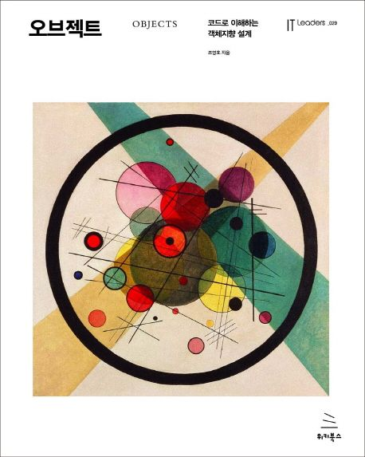
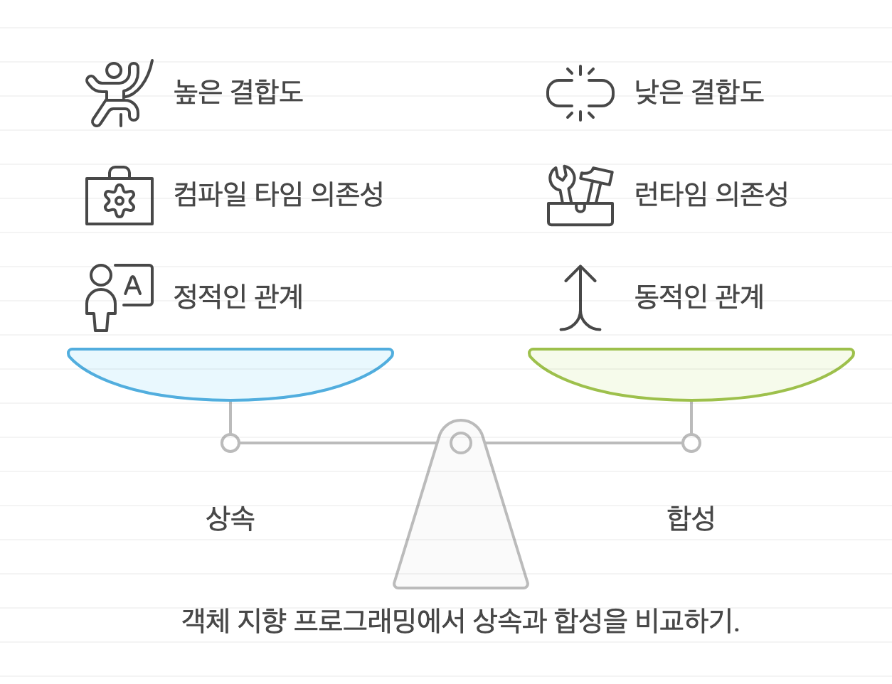
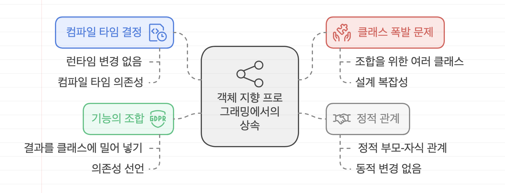
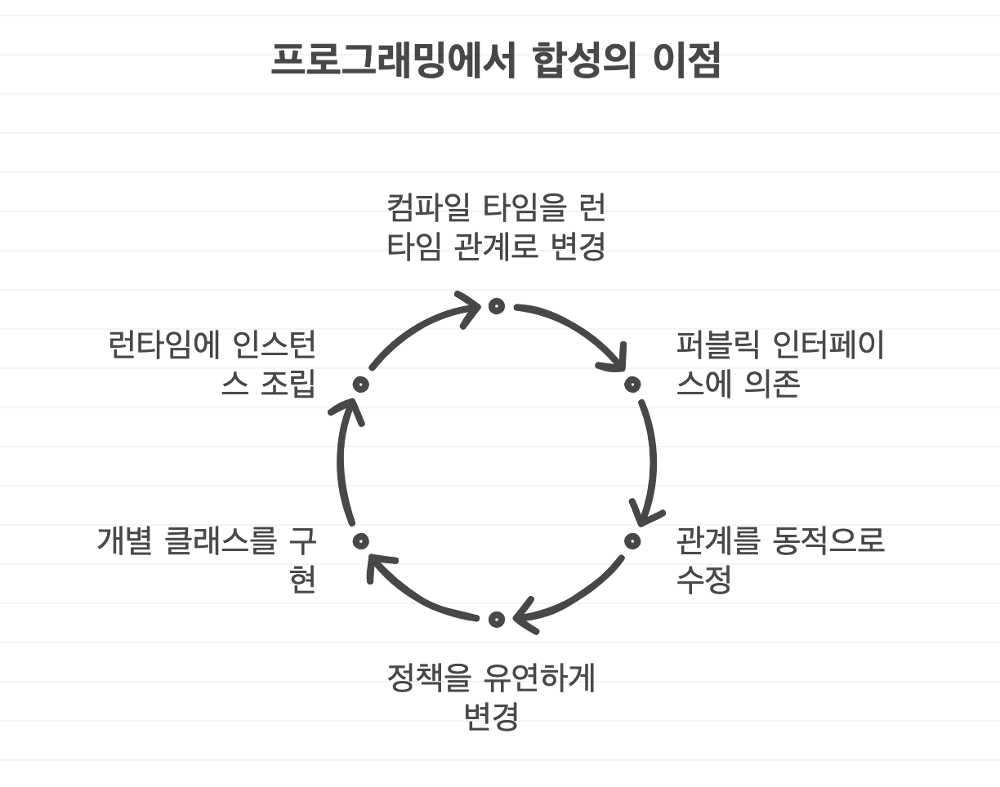
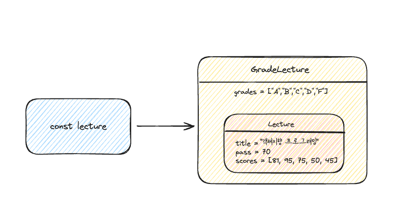

# 오브젝트

# 🔑 요약
# 1장 
- *의존성* 을 제거함으로써 객체 사이의 *결합도* 를 낮추고 낮추기 위한 방법으로 *캡슐화* 하여 객체의 *자율성* 을 높이고 *응집도* 높은 객체들의 공동체를 창조 할 수 있게 되는것이 훌륭한 객체지향 설계이다.
# 2장 
- 클래스 추상 클래스, 인터페이스를 조합해서 객체지향 프로그램을 구조화하는 기본적인 방법
- 상속을 이용해 다형성을 구현 하는 기법
- 다형성이 지연 바이딩이라는 메커니즘을 통해 구현된다는 사실
- 상속은 코드를 재사용할 수 있는 가장 널리 알려진 방법이지만 캡슐화의 측면에서 합성이 더 좋은 방법
- 유연한 객체 지향 프로그램을 위해서는 컴파일 시간 의존성과 실행 시간 의존성이 달라야 한다는 사실

# 3장 
- 객체지향에서 **협력**은 객체 간 상호작용을 통해 기능을 구현하는 핵심이며, **책임**과 **역할**은 협력 안에서 객체들이 수행하는 행동과 위치를 결정합니다.
- 설계는 역할과 책임을 기반으로 이루어지며, **추상화된 역할**을 통해 유연하고 재사용 가능한 시스템을 만들 수 있습니다.
- **객체의 행동이 상태를 결정**하며, 협력에 필요한 책임을 객체에게 적절히 할당하는 것이 중요합니다.
- *객체지향 설계에서 가장 중요한 것은 책임이다* 

## 책임 주도 설계
- 시스템이 사용자에게 제공해야 하는 기능인 시스템 책임을 파악한다.
- 시스템 책임을 더 작은 책임으로 분할한다.
- 분할된 책임을 수행할 수 있는 적절한 객체 또는 역할을 찾아 책임을 할당한다.
- 객체가 책임을 수행하는 도중 다른 객체의 도움이 필요한 경우 이를 책임질 적절한 객체 또는 역할을 찾는다.
- 해당 객체 또는 역할에게 책임을 할당함으로써 두 객체가 협력하게 한다.

## 메세지가 객체를 선택하게 하라
1. 객체가 *최소한의 인터페이스* 를 가질 수 있게 된다.
2. 객체가 충분히 *추상적인 인터페이스* 를 가질 수 있게 된다.

## 행동이 상태를 결정한다
- 객체가 가질 수 있는 상태는 행동을 결정하고 나서야 비로소 결정할 수 있다.

# 4장 
## 캡슐화
- 변경 가능성이 높은 부분을 *구현* , 상대적으로 안정적인 부분을 *인터페이스* 
- 변경의 정도에 따라 구현과 인터페이스를 분리하고 외부에서 인터페이스에만 의존하도록 관계를 조절하는 것이다.
- *캡슐화* 
	- 변경 가능성이 높은 부분을 객체 내부로 숨기는 추상화 기법.
	- 변경 될 수 있는 어떤 것이라도 캡슐화 해야 한다.

## 응집도와 결합도
### 변경의 관점에서 응집도
> 변경의 관점에서 응집도란 *변경이 발생할 때 모듈 내부에서 발생하는 변경의 정도* 

- 하나의 변경을 수용하기 위해 모듈 전체가 함께 변경된다면 응집도가 높다.
- 모듈 일부만 변경된다면 응집도가 낮다.
- 하나의 변경에 대해 하나의 모듈만 변경된다면 응집도가 높다.
- 다수의 모듈이 함께 변경돼야 한다면 응집도가 낮다.
### 변경의 관점에서 결합도
> 변경의 관점에서 결합도란 *한 모듈이 변경되기 위해서 다른 모듈의 변경을 요구하는 정도* 

- 하나의 모듈을 수정할 때 얼마나 많은 모듈을 함께 수정해야 하는지를 나타낸다.
- 결합도가 높을수록 함께 변경해야 하는 모듈의 수가 늘어나기 때문에 변경하기가 어렵다.
- 내부 구현을 변경 했을 때 이것이 다른 모듈에 영향을 미치는 경우에는 두 모듈 사이의 결합도가 높다고 표현한다.
- Public interface를 수정 했을 때만 다른 모듈에 영향을 미치는 경우에는 결합도가 낮다고 표현한다.
- 클래스의 구현이 아닌 인터페이스에 의존하도록 코드를 작성해야 낮은 결합도를 얻을 수 있다.
### 결론
- 응집도와 결합도는 변경과 관련이 깊다.
- 캡슐화의 정도가 응집도와 결합도에 영향을 미친다.

## 데이터 중심 설계 단점
- 캡슐화 위반
- 높은 결합도
- 낮은 응집도

# 5장 
> 데이터 중심의 설계에서 책임 중심의 설계로 전환하기 위해서는 두 가지 원칙을 따라야 한다.

- 데이터보다 행동을 먼저 결정하라
- 협력이라는 문맥 안에서 책임을 결정하라

## 책임 할당을 위한 GRASP 패턴
- INFROMATION EXPERT (가)패턴 : 책임을 수행할 정보를 알고 있는 객체에게 책임을 할당하는 것.
- LOW COUPLING(낮은 결합도) 패턴
- HIGH COHESION(높은 응집도) 패턴
- CREATOR(창조자) 패턴
- POLYMORPHISM(다형성) 패턴
- PROTECTED VARIATIONS(변경 보호) 패턴

## 높은 응집도와 낮은 결합도
> GRASP에서 LOW COUPLING(낮은 결합도) 패턴과 HIGH COHESION(높은 응집도) 패턴

- LOW COUPLING(낮은 결합도) 패턴
	- 어떻게 하면 의존성을 낮추고 변화의 영향을 줄이며 재사용성을 증가시킬 수 있을까?
	- 설계의 전체적인 결합도가 낮게 유지되도록 책임을 할당하라.
- HIGH COHESION(높은 응집도) 패턴
	- 어떻게 복잡성을 관리할 수 있는 수준으로 유지할 것인가?
	- 높은 응집도를 유지할 수 있게 책임을 할당하라.
### 클래스 응집도 판단하기
> 응집도가 낮다는 것은 서로 연관성이 없는 기능이나 데이터가 하나의클래스 안에 뭉쳐져 있다는 것을 의미한다.

1. 클래스가하나 이상의 이유로 변경 돼야 한다면 응집도가 낮은 것이다. 
2. 인스턴스 변수가 초기화 되는 시점
	- 응집도가 높은 클래스는 인스턴스를 생성할 때 모든 속성을 함께 초기화한다.
	- 응집도가 낮은 클래스는 객체의 속성 중 일부만 초기화 하고 일부는 초기화되지 않은 상태로 남겨진다.
3. 메서드들이 인스턴스 변수를 사용하는 방식
	- 모든 메서드가 객체의 모든 속성을 사용한다면 클래스의 응집도는 높다.
	- 메서드들이 사용하는 속성에 따라 그룹이 나뉜다면 응집도가 낮다.

#### 응집도가 높은 클래스를 만드려면
- *변경의 이유를 기준으로 클래스를 분리하라* 
- *함께 초기화되는 속성을 기준으로 코드를 분리해야 한다.* 
- *속성 그룹과 해당 그룹에 접근하는 메서드 그룹을 기준으로 코드를 분리해야 한다.* 

## 다형성
> GRASP에서 POLYMORPHISM(다형성) 패턴 : 객체의 타입에 따라 변하는 행동이 있다면 타입을 분리하고 변화하는 행동을 각 타입의 책임으로 할당하라는것.

- 추상 클래스나 인터페이스를 사용
- 프로그램을 if ~ else 또는 switch ~ case 등의 조건 논리를 사용해서 설계 한다면 새로운 변화가 일어난 경우 조건 논리를 수정해야 한다. 
- **다형성을 이용해 새로운 변화를 다루기쉽게 확장하라고 권고한다.** 

## 변경 보호 패턴
- *설계에서 변하는 것이 무엇인지 고려하고 변하는 개념을 캡슐화하라* 

# 6장 
- *메서드* : 메세지를 수신했을 때 실제로 실행되는 함수 또는 프로시저
- 메세지 전송자와 메세지 수신자는 서로에 대한 상세한 정보를 알지 못한 채 메세지라는 끈을 통해서만 연결된다.
- 실행 시점에 메세지와 메서드를 바인딩하는 메커니즘은 두 객체 사이의 결합도를 낮춘다.

> 전통적인 방식의 개발자는 코드의 의미가 컴파일 시점과 실행 시점에 동일한 코드를 작성하는데
> 객체지향적인 방식의 객체는 메세지와 메서드라는 두 가지 서로 다른 개념을 실행 시점에 연결해야 하기 때문에
> **컴파일 시점과 실행 시점의 의미가 달라질 수 있다.** 
> **실행 시점에 실제로 실행되는 코드는 메세지를 수신하는 객체의 타입에 따라 달리지기 때문에** 우리는 그저 메세지에 응답할 수 있는 객체가 존재하고 그 객체가 적절한 메서드를 선택해서 응답할 것이라고 믿을 수 밖에 없다.

- 퍼블릭 인터페이스(public interface) : 객체가 의사소통을 위해 외부에 공개하는 메세지의 집합
- 오퍼레이션(operation) : 퍼블릭 인터페이스에 포함된 메세지.
	- 수행 가능한어떤 행동에 대한 추상화
- 메서드 : 메세지를 수신했을 때 실제로 실행되는 코드

> 예제 코드에서 `DiscountCondition` 인터페이스에서 `isSatisfiedBy` 가 *오퍼레이션* 이고
> `SequenceCondition` 과 `PeriodCondition` 에 정의된 각각의 `isSatisfiedBy` 는 실제 구현을 포함하기 때문에 *메서드* 라고 한다.

## 좋은 인터페이스
- 좋은 인터페이스는 *최소한의 인터페이스* 와 *추상적인 인터페이스* 라는 조건을 만족해야 한다.
- 추상적인 인터페이스를 설계할 수 있는 가장 좋은 방법은 책임 주도 설계(RDD) 방법 이다.

- [0] 퍼블릭 인터페이스의 품질에 영향을 미치는 원칙과 기법

- 디미터 법칙
- 묻지 말고 시켜라
- 의도를 드러내는 인터페이스
- 명령-쿼리 분리

- **디미터 법칙을 위반하는 설계는 인터페이스와 구현의 분리 원칙(ISP: Interface Segregaion Principle)** 을 위반한다.

## 책임에 초점을 맞춰라
- *책임 주도 설계 방법에 따라 메세지를 먼저 선택하고 그 후에 메세지를 처리할 객체를 선택해라* 그렇게 하면 디미터 법칙을 준수하고, 묻지말고 시켜라 스타일을 따르면서, 의도를 드러내는 인터페이스를 설계, 명령과 쿼리 분리 설계 할 수 있다.  

# 8장
### 런타임 의존성
- 런타임 의존성이 다루는 주제는 객체 사이의 의존성이다.
- ex) Movie클래스와 AmountDiscountPolicy, PercentDiscountPolicy클래스 간의 의존성
### 컴파일 타임 의존성
- 컴파일 타임 의존성이 다루는 주제는 클래스 사이의 의존성이다.
- ex) Movie클래스와 DiscountPolicy 클래스간의 의존성

*컴파일타임 구조와 런타임 구조사이의 거리가 멀면 멀수록 설계가 유연해지고 재사용 가능해진다.* 
## 의존성 해결하기
- 컴파일타임 의존성은 구체적인 런타임 의존성으로 대체돼야 한다.
- 의존성 해결 : 컴파일 타임 의존성을 실행 컨텍스트에 맞는 적절한 런타임 의존성으로 교체하는 것
	- 객체를 실행하는 시점에 생성자를 통해 의존성 해결
	- 객체 생성 후 setter 메소드를 이용해 의존성 해결
	- 메서드 실행 시 인자를 이용해 의존성 해결
### 결론
- *메서드가 실행되는 동안만 일시적으로 의존 관계가 존재해도 무방하거나,* *메서드가 실행될 때마다 의존 대상이 매번 달라져야 하는 경우* 메서드 실행 시 인자를 이용해 의존성 해결하면 유용하다
- 클래스의 메서드를 호출하는 대부분의 경우에 매번 동일한 객체를 인자로 전달하고 있다면 *생성자를 이용하는 방식* 이나 *setter* 메서드를 이용해 의존성을 지속적으로 유지하는 방식을 사용하는것이 좋다.

## 의존성과 결합도
### 결론
- 서로에 대해 알고 있는 지식의 양이 결합도를 결정한다.
	- Movie클래스가 DiscountPolicy 클래스를 의존하면 구체적인 계산 알 필요가 없기 때문에 결합도가 낮다.
	- Movie 클래스가 PercentDiscountPolicy 클래스에 의존하면 협력할 객체가 비율 할인 정책에 따라 할인 요금을 계산 할 것이라는것을 알고 있다.
- 결합도를 느슨하게 만들려면 추상화가 가장 효과적이고 `DiscountPolicy` 클래스는`PercentDiscountPolicy` 클래스가 비율 할인 정책에 따라 할인 요금을 계산 한다는 사실을 숨겨주기 때문에 `PercentDiscountPolicy` 의 추상화다.
- 의존성을 `new` 를 통해 구현 내부에 숨겨두면 결합도가 높아진다. 의존성을 구현 내부에 숨겨두지말고 퍼블릭 인터페이스(public interface)를 통해 의존성은 명시적으로 표현되어야 한다.

> DiscountPolicy와 PercentDiscountPolicy(비율 할인 정책), AmountDiscountPolicy(금액 할인 정책), OverlappedDiscountPolicy(중복 할인), NoneDiscountPolicy(할인 없음) 추상화된 DiscountPolicy를 통해 재사용 가능한 설계를 가진다. 

# 9장
- 개방-폐쇄 원칙(OCP)은 런타임 의존성과 컴파일타임 의존성에 관한 이야기이다.
- 의존성 관계에서 개방-폐쇄 원칙을 따르는 설계란 컴파일 타임 의존성을 고정시키고 런타임 의존성을 확장하고 수정할 수 있는 구조라 할 수 있다.
- 개방-폐쇄 원칙의 핵심은 *추상화에 의존하는 것* 이다

## 의존성 주입
- *의존성 주입(Dependency-Injection)* 
	- 사용하는 객체가 아닌 외부의 독립적인 객체가 인스턴스를 생성한 후 이를 전달해서 의존성을 해결하는 방법
	- 의존성 주입이라고 부르는 이유는 외부에서 의존성의 대상을 해결한 후 이를 사용하는 객체쪽으로 주입하기 때문이다.
	- 의존성 주입은 의존성을 해결하기 위해 의존성을 객체의 퍼블릭 인터페이스에 명시적으로 드러내서 외부에서 필요한 런타임 의존성을 전달할 수 있도록 만드는 방법

> 의존성을 해결하는 세가지 방법

- 생성자 주입(constructor injection) : 객체를 생성하는 시점에 생성자를 통한 의존성 해결
- setter 주입(setter injection) : 객체 생성 후 setter 메서드를 통한 의존성 해결
- 메서드 주입(method injection) : 메서드 실행 시 인자를 이용한 의존성 해결

## 추상화와 의존성 역전
- *의존성 역전 원칙(DIP: Dependency Inversion Principle)* 
	1. 상위 수준의 모듈은 하위 수준의 모듈에 의존해서는 안된다.
		- 상위 수준의 클래스가 하위 수준의 클래스에 의존한다면 하위 수준의 변경에 의해 상위 수준의 클래스가 영향을 받게 된다.
		- 의존성은 변경의 전파와 관련된 것이므로 설계는 변경의 영향을 최소화하도록 의존성을 관리해야 한다.
	2. 상위 수준의 모듈과 하위 수준의 모듈 모두 추상화에 의존해야 한다.
	3. 추상화는 구체적인 사항에 의존해서는 안된다.
	4. 구체적인 사항은 추상화에 의존해야 한다.
### 정리 
- 유연하고 재사용 가능하며 컨텍스트에 독립적인 설계는 전통적인 패러다임이 고수하는 의존성의 방향을 역전시킨다.
- 전통적인 패러다임에서는 상위 수준 모듈이 하위 수준 모듈에 의존했다면 객체지향 패러다임에서는 상위 수준 모듈과 하위 수준 모듈이 모두 추상화에 의존한다.
- 전통적인 패러다임에서는 인터페이스가 하위 수준 모듈에 속했다면 객체지향 패러다임에서는 인터페이스가 상위 수준모듈에 속한다.
- *훌륭한 객체지향 설계를 위해서는 의존성을 역전 시켜야하고 그래야만 유연하고 재사용 가능한 설계를 얻을 수 있다.* 

# 10장
## 상속
### 상속을 위한 경고 1: 강력한 결합도
- 자식 클래스의 메서드 안에서 super 참조를 이용해 부모 클래스의 메서드를 직접 호출 할 경우 두 클래스는 강하게 결합된다.
- 부모 클래스의 변경에 의해 자식 클래스가 영향을 받을 수 있게 된다.
- `super` 호출을 제거할 수 있는 방법을 찾아 결합도를 제거하라.

### 상속을 위한 경고 2: 불필요한 인터페이스 상속
- 상속받은 부모 클래스의 메서드가 자식 클래스의 내부 구조에 대한 규칙을 깨드릴 수 있다.

### 상속을 위한 경고 3: 메서드 오버라이딩의 오작용 문제
- 자식 클래스가 부모 클래스의 메서드를 오버라이딩 할 경우 부모 클래스가 자신의 메서드를 사용하는 방법에 자식 클래스가 결합될 수 있다.

### 상속을 위한 경고 4: 부모 클래스와 자식 클래스의 동시 수정 문제
- 클래스를 상속하면 결합도로 인해 자식 클래스와 부모 클래스의 구현을 영원히 변경하지 않거나, 자식 클래스와 부모 클래스를 동시에 변경하거나 둘 중 하나를 선택할 수 밖에 없다.

## 추상화에 의존하자
- 자식 클래스가 부모 클래스의 구현이 아닌 추상화에 의존하도록 만든다. (정확하게는 부모 클래스와 자식 클래스 모두 추상화에 의존하도록 수정)

- *코드 중복을 제거하기 위해 상속을 도입할 때 따르는 두가지 원칙*
	1. 두 메서드가 유사하게 보인다면 차이점을 메서드로 추출하라.
		- 메서드 추출을 통해 두 메서드를 동일한 형태로 보이도록 만들 수 있다.
		- "변하는 것으로부터 변하지 않는 것을 분리하라" 또는 "변하는 부분을 찾고 이를 캡슐화 하라"
	1. 부모 클래스의 코드를 하위로 내리지 말고 자식 클래스의 코드를 상위로 올려라.
		- 부모 클래스의 구체적인 메서드를 자식 클래스로 내리는 것보다 자식 클래스의 추상적인 메서드를 부모 클래스로 올리는 것이 재사용성과 응집도 측면에서 더 뛰어난 결과를 얻을 수 있다.
		- 모든 클래스들이 추상화에 의존하도록 만드는것이 목표.
			- 추상화에 의존하도록 만드는 것이기 때문에 이클래스는 추상 클래스로 구현하는 것이 적합할 것이다.
		- 공통 코드를 옮길때 인스턴스 변수보다 메서드를 먼저 이동시키면 그 메서드에 필요한 메서드나 인스턴스 변수가 무엇인지를 컴파일 에러를 통해 자동으로 알 수 있기 떄문에 메서드를 먼저 이동시키는게 편하다.
### 결론
- 상속 계층이 코드를 진화시키는데 걸림돌이 된다면 추상화를 찾아내고 상속 계층 안의 클래스들이 그 추상화에 의존하도록 코드를 리팩터링 하라.
- 차이점을 메서드로 추출하고, 공통적인 부분은 부모 클래스로 이동하라

# 11장
## 합성
- 상속
	- 부모 클래스와 자식 클래스를 연결해서 부모 클래스의 코드를 재사용한다.
	- 의존성은 컴파일 타임에서 해결된다.
	- `is-a 관계` 라고 부른다.
	- 상속 관계는 클래스 사이의 정적인 관계
	- 코드 작성 시점에 결정한 상속 관계는 변경이 불가능
	- 부모 클래스 안에 구현된 코드 자체를 재사용한다.
	- 클래스 사이의 높은 결합도 발생

- 합성
	- 전체를 표현하는 객체가 부분을 표현하는 객체를 포함해서 부분 객체의 코드를 재사용한다.
	- 두 객체 사이의 의존성은 런타임에 해결된다.
	- `has-a 관계` 라고 부른다.
	- 객체 사이의 동적인 관계
	- 실행 시점에 동적으로 변경 할 수 있다.
	- 포함되는 객체의 퍼블릭 인터페이스를 재사용 한다. 구현에 대한 의존성을 인터페이스에 대한 의존성으로 변경할 수 있다.
	- 클래스 사이의 높은 결합도를 객체 사이의 낮은 결합도로 대체할 수 있다.

### 상속을 남용 했을 때 생길 수 있는 세가지 문제
- [0] 불필요한 인터페이스 상속 문제

- [1] 메서드 오버라이딩의 오작용 문제

- [2] 부모 클래스와 자식 클래스의 동시 수정 문제
- 부모 클래스 내부 구현을 변경하더라도 파급효과를 최대한 자식 클래스 내부로 캡슐화 할 수 있기 때문에 *상속보다 합성을 사용하는 것이 좋다* 
- **구현에 대한 결합보다(상속) 인터페이스에 대한 결합(합성)이 더 좋다**

## 상속
- 자식 클래스와 부모 클래스 사이의 결합도가 높아지기 때문에 
	- *결합도를 낮추려면 자식 클래스가 부모 클래스의 메서드를 호출하지 않도록 부모 클래스에 추상 메서드를 제공 한다.* 

### 추상 메서드와 훅 메서드 
- 개방-폐쇄 원칙을 만족하는 설계를 만드는 방법은 한가지로 부모 클래스에 새로운 추상 메서드를 추가하고 부모 클래스의 다른 메서드 안에서 호출하는 것이다.
	- 자식 클래스는 추상 메서드를 오버라이딩함.
- *추상 메서드의 단점*  : 상속 계층에 속하는 **모든 자식 클래스가 추상 메서드를 오버라이딩** 해야 한다.
- *훅 메서드(hook method)* : 자식 클래스가 추상 메서드를 동일한 방식으로 구현 했을때 중복 코드가 존재하게 되는데 이를 해결하기 위해 추상 메서드와 동일하게 자식 클래스에서 오버라이딩할 의도로 메서드를 추가 했지만 편의를 위해 기본 구현을 제공하는 메서드.
	- 이마저도 완벽하게 중복코드를 제거할 수 없음.
	- 보통 객체지향 언어는 단일 상속만 지원하기 때문에 *상속으로 인해 발생하는 중복 코드 문제를 해결하기가 쉽지 않다.* 

### 상속으로 해결하는 방법은 모든 가능한 조합별로 자식 클래스를 하나씩 추가하는것인데 이로 인해 발생되는 문제점
- 새로운 정책을 추가하기가 어렵다.
- 새로운  기본 정책으로 `FixedRatePhone` 고정 요금제를 추가 한다고 가정
	- 모든 부가 정책은 기본 정책에 적용 가능해야 하며 조합 순서 역시 자유로워야 한다.
	- 새로운 기본 정책을 추가하면 그에 따라 조합 가능한 부가 정책의 수만큼 새로운 클래스를 추가 해야함.
- 새로운 부가 정책을 추가하는 경우
	- 개통 후 일정 기간 동안 요금 일부를 할인해 주는 '약정 할인 정책' 추가 한다고 가정
		- 문제는 `RegularPhone` , `NightlyDiscountPhone` , `FixedRatePhone` 약정 할인 정책을 선택적으로 적용할 수 있어야 한다.
		- 또한 다른 부가 정책 세금 정책, 기본 요금 할인 정책과도 임의 순서로 조합 가능 해야 한다.
		- 즉, 엄청난 갯수의 클래스를 추가 해야함 이를 클래스 폭발이라고 함 
- 클래스 폭발(class explosion) : 상속의 남용으로 하나의 기능을 추가하기 위해 필요 이상으로 많은 수의 클래스를 추가 해야 하는 경우를 가리킨다.
- *부모 클래스와 자식 클래스의 다양한 조합이 필요한 상황에서 유일한 해결 방법은 조합의 수만큼 새로운 클래스를 추가하는것 뿐이다* 
- 클래스 폭발 문제는 새로운 기능을 추가할 때 뿐만 아니라 수정할때도 문제가 된다.

## 상속과 합성 비교
- 상속은 컴파일타임에 결정되고 고정되기 때문에 코드를 실행하는 도중에는 변경할 수 없다.
	- 여러 기능을 조합해야 하는 설계에 상속을 이용하면 모든 조합 가능한 경우별로 클래스를 추가 해야한다.
		- 이것이 *클래스 폭발* 문제이다.
- 합성은 컴파일타임 관계를 런타임 관계로 변경함으로써 이 문제를 해결한다.
	- 합성을 사용하면 구현이 아닌 퍼블릭 인터페이스에 대해서만 의존할 수 있기 때문에 런타임에 객체의 관계를 변경할 수 있다.

# 🐼 합성 관계로 변경하기
## 상속
- 상속은 컴파일타임에 결정되고 고정되기 때문에 코드를 실행하는 도중에는 변경할 수 없다.
	- 여러 기능을 조합해야 하는 설계에 상속을 이용하면 모든 조합 가능한 경우별로 클래스를 추가 해야한다.
		- 이것이 *클래스 폭발* 문제이다.
- 상속은 컴파일 타임 의존성과 런타임의 의존성을 동일하게 만들겠다고 선언하는 것이다.
- 상속은 부모 클래스와 자식 클래스 사이의 관계가 정적으로 고정, 실행 시점에 동적으로 관계를 변경 할 수 있는 방법이 없다.
- 상속은 조합의 결과를 개별 클래스 안으로 밀어 넣는 방법

## 합성
- 합성은 컴파일타임 관계를 런타임 관계로 변경함으로써 이 문제를 해결한다.
	- 합성을 사용하면 구현이 아닌 퍼블릭 인터페이스에 대해서만 의존할 수 있기 때문에 런타임에 객체의 관계를 변경할 수 있다.
- 합성은 런타임에 동적으로 변경할 수 있다.
- 합성은 컴파일타임 의존성과 런타임 의존성을 다르게 만들 수 있다.
- 합성을 사용하면 구현 시점에 정책들의 관계를 고정시킬 필요가 없으며 실행 시점에 정책들의 관계를 유연하게 변경할 수 있게 된다.
- 합성은 조합을 구성하는 요소들을 개별 클래스로 구현한 후 실행 시점에 인스턴스를 조립하는 방법을 사용
- 가장 큰 장점은 컴파일 의존성에 속박되지 않고 다양한 방식의 런타임 의존성을 구성할 수 있다는것

> 유연한 설계를 위해서
> *컴파일 타임 의존성과 런타임 의존성의 거리가 멀수록 설계가 유연해진다* 
> 컴파일 타임 의존성과 런타임 의존성의 거리가 멀면 멀수록 설계의 복잡도가 증가해서 코드를 이해하기 어려운것도 사실이다.
> *설계는 변경과 유지보수를 위해 존재한다는 사실을 기억하라*  **설계는 트레이드오프의 산물이다** 

#객체지향/Dependency-Injection-의존성주입 
**위의 다른 챕터에서 여러가지 의존성 주입 방법을 배웠는데 의존성 주입 방법과 합성과 관련이 있다.** 
> 의존성 주입이 왜 필요한지? -> 상속을 사용 했을때 컴파일 타임 의존성이 고정되기 때문에 여러 기능을 조합해야 하는 설계에서 모든 조합 가능한 경우별로 클래스를 추가 해야한다(클래스 폭발 문제) -> 합성을 사용해서 컴파일 타임 의존성을 런타임 의존성이 다르게 만들어 런타임 의존성을 동적으로 만든다 -> 런타임 의존성이 동적이기 때문에 생성자 의존성 주입을 통해서 필요한 클래스의 인스턴스를 주입하여 동적인 런타임 의존성을 사용해 유연한 설계가 가능하게 한다.

- 합성 사용의 일반적인 방법
	- 합성하는 객체의 타입을 인터페이스나 추상 클래스로 선언하고 의존성 주입을 사용해 런타임에 필요한 객체를 설정할 수 있도록 구현하는것이 일반적이다.

합성의 장점
- 객체를 조합하고 사용하는 방식이 상속을 사용한 방식보다 더 예측 가능하고 일관성 있다.
- 합성은 새로운 클래스를 추가하거나 수정하는 시점에 장점이 극대화 된다.

## 상속을 언제 사용해야 되는지 이해하기 위해서 알아야될 2가지
- *구현 상속*
- *인터페이스 상속* 

# 12장 
- *상속의 목적은 코드 재사용이 아니다.* 
	- *타입 계층을 구조화하기 위해 사용해야 한다.* 

상속을 이용해 자식 클래스를 추가하려 할 때
1. 상속을 사용하려는 목적이 단순히 코드를 재사용하기 위해서인가?
2. 클라이언트 관점에서 인스턴스들을 동일하게 행동하는 그룹으로 묶기 위해서인가?

> *만약 1번이 이유라면 상속을 사용하지 말아야 한다* 
> *상속의 진정한 목적은 코드 재사용이 아니라 다형성을 위한 서브타입 계층을 구축하는 것이다.* 

**12장 목표 : 포함 다형성의 관점에서 런타임에 상속 계층 안에서 적절한 메서드를 선택하는 방법을 이해하는 것** 
## 데이터 관점의 상속
- *데이터 관점에서 상속은 자식 클래스의 인스턴스 안에 부모 클래스의 인스턴스를 포함하는 것으로 볼 수 있다.* 
- *자식 클래스의 인스턴스는 자동으로 부모 클래스에 정의한 모든 인스턴스 변수를 내부에 포함하게 되는 것이다.* 

## 행동 관점의 상속
> 데이터 관점의 상속 -> 자식 클래스의 인스턴스 안에 부모 클래스의 인스턴스를 포함
> 행동 관점의 상속 -> 부모 클래스가 정의한 일부 메서드를 자식 클래스의 메서드로 포함시키는 것

- 부모 클래스의 모든 퍼블릭 메서드는 자식 클래스의 퍼블릭 인터페이스에 포함된다.
- 외부 객체가 부모 클래스의 인스턴스에게 전송할 수 있는 모든 메세지는 자식 클래스의 인스턴스에게도 전송 할 수 있다.

## 업캐스팅과 동적 바인딩

### 업캐스팅
> 상속을 이용시 부모 클래스의 퍼블릭 인터페이스가 자식 클래스의 퍼블릭 인터페이스에 합쳐지기 때문에
> 부모 클래스의 인스턴스에게 전송할 수 있는 메세지를 자식 클래스의 인스턴스에게 전송할 수 있다.
> 부모 클래스의 인스턴스 대신 자식 클래스의 인스턴스를 사용하더라도 메세지를 처리하는 데는 아무런 문제가 없으며, 컴파일러는 명시적인 타입 변환 없이도 자식 클래스가 부모 클래스를 대체할 수 있게 허용한다.

- 대표적인 예제
	- 대입문
	- 메서드의 파라미터 타입
	- 부모 클래스 타입으로 선언된 변수에 자식 클래스의 인스턴스를 할당하는 것이 가능하다.
	- 서로 다른 클래스의 인스턴스를 동일한 타입에 할당하는 것을 가능하게 해준다.
	- 부모 클래스에 대해 작성된 코드를 전혀 수정 하지 않고도 자식 클래스에 적용할 수 있다.

#### 다운 캐스팅
- *다운 캐스팅(downcasting)* : 부모 클래스의 인스턴스를 자식 클래스 타입으로 변환하기 위해서는 명시적인 타입 캐스팅이 필요하다 이를 다운 캐스팅이라고 함.
### 동적 바인딩
- *동적 바인딩* : 
	- 선언된 변수의 타입이 아니라 메세지를 수신하는 객체의 타입에 따라 실행되는 메서드가 결정된다.
		- 이것은 객체지향 시스템이 메세지를 처리할 적절한 메서드를 **컴파일 시점이 아니라 실행 시점에 결정하기 떄문에 가능하다** 
	- 부모 클래스의 타입에 대해 메세지를 전송하더라도 실행 시에는 실제 클래스를 기반으로 실행될 메서드가 선택되게 해준다.
	- 코드를 변경하지 않고도 실행되는 메서드를 변경할 수 있다.
- **업캐스팅과 동적 바인딩은 코드 변경 없이도 기능을 추가할 수 있게 해주며 개방-폐쇄 원칙의 의도와도 일치한다** 
## 오버라이딩과 오버로딩
- 오버라이딩 -> 업캐스팅과 동적 바인딩을 통해서 이루어진다는것을 떠올리고 -> 이는 다형성을 나타낸다
- 메서드 오버라이딩은 메서드를 감추지만 메서드 오버로딩은 사이좋게 공존한다
- *오버로딩* : 시그니처가 다른 동일한 이름의 메서드가 공존하는 경우

> *많은 사람들이 하나의 클래스 안에서 같은 이름을 가진 메서드들을 정의 하는것을 오버로딩이라고 생각하고* 
> *상속 계층 사이에서 같은 이름을 가진 메서드를 정의하는 것은 메서드 오버로딩으로 생각하지 않는 경향이 있다.*

# 13장
## 언제 상속을 사용해야 하는가?
- *상속은 올바른 용도는 타입 계층을 구현하는 것이다* 

**다음 두 질문에 만족하는 상황일때 상속을 사용** 
- *상속 관계가 is-a 관계를 모델링하는가?* 
	- 이것은 애플리케이션을 구성하는 어휘에 대한 우리의 관점에 기반한다.
	- 일반적으로 "자식 클래스"는 "부모 클래스" 라고 말해도 이상하지 않다면 상속을 사용 할 후보로 간주한다.
- *클라이언트 입장에서 부모 클래스의 타입으로 자식 클래스를 사용해도 무방한가?* 
	- 상속 계층을 사용하는 클라이언트의 입장에서 부모 클래스와 자식 클래스의 차이점을 몰라야 한다.
	- 이를 자식 클래스와 부모 클래스 사이의 행동 호환성이라고 부른다.

## 업캐스팅과 동적 바인딩 중요
- *리스코프 치환 원칙* 은 자식 클래스가 부모 클래스를 대체하기 위해서는 부모 클래스에 대한 클라이언트의 가정을 준수해야 한다는 것을 강조한다.
- *리스코프 치환 원칙* 은 클라이언트와 격리한 채로 본 모델은 의미 있게 검증하는 것이 불가능하다
- 행동 호환성과 리스코프 치환원칙에서는 *대체 가능성을 결정하는 것은 클라이언트* 다

# 📆 정리 현황 테이블

아래 테이블에 각 장별로 작성한 README.md 를 링크 (연결) 합니다.

| Priority | Task              | Chapter | Link                                                                                                                                                                                                                                       |
| -------- | ----------------- | ------- | ------------------------------------------------------------------------------------------------------------------------------------------------------------------------------------------------------------------------------------------ |
| ⭐⭐⭐⭐⭐    | 1. 객체, 설계         | 1장      | [링크](https://github.com/yanggwangseong/TIL/blob/main/%EB%8F%84%EC%84%9C/%EC%98%A4%EB%B8%8C%EC%A0%9D%ED%8A%B8/Chapter/1.%20%EA%B0%9D%EC%B2%B4%2C%20%EC%84%A4%EA%B3%84.md)                                                                   |
| ⭐⭐⭐      | 2. 객체지향 프로그래밍     | 2장      | [링크](https://github.com/yanggwangseong/TIL/blob/main/%EB%8F%84%EC%84%9C/%EC%98%A4%EB%B8%8C%EC%A0%9D%ED%8A%B8/Chapter/2.%20%EA%B0%9D%EC%B2%B4%EC%A7%80%ED%96%A5%20%ED%94%84%EB%A1%9C%EA%B7%B8%EB%9E%98%EB%B0%8D.md)                         |
| ⭐⭐⭐⭐⭐    | 3. 역할, 책임, 협력     | 3장      | [링크](https://github.com/yanggwangseong/TIL/blob/main/%EB%8F%84%EC%84%9C/%EC%98%A4%EB%B8%8C%EC%A0%9D%ED%8A%B8/Chapter/3.%20%EC%97%AD%ED%95%A0%2C%20%EC%B1%85%EC%9E%84%2C%20%ED%98%91%EB%A0%A5.md)                                           |
| ⭐⭐       | 4. 설계 품질과 트레이드 오프 | 4장      | [링크](https://github.com/yanggwangseong/TIL/blob/main/%EB%8F%84%EC%84%9C/%EC%98%A4%EB%B8%8C%EC%A0%9D%ED%8A%B8/Chapter/4.%20%EC%84%A4%EA%B3%84%20%ED%92%88%EC%A7%88%EA%B3%BC%20%ED%8A%B8%EB%A0%88%EC%9D%B4%EB%93%9C%20%EC%98%A4%ED%94%84.md) |
| ⭐⭐⭐      | 5. 책임 할당하기        | 5장      | [링크](https://github.com/yanggwangseong/TIL/blob/main/%EB%8F%84%EC%84%9C/%EC%98%A4%EB%B8%8C%EC%A0%9D%ED%8A%B8/Chapter/5.%20%EC%B1%85%EC%9E%84%20%ED%95%A0%EB%8B%B9%ED%95%98%EA%B8%B0.md)                                                    |
| ⭐⭐       | 6. 메세지와 인터페이스     | 6장      |                                                                                                                                                                                                                                            |
| ⭐        | 7. 객체 분해          | 7장      |                                                                                                                                                                                                                                            |
| ⭐⭐⭐⭐     | 8. 의존성 관리하기       | 8장      |                                                                                                                                                                                                                                            |
| ⭐⭐⭐⭐     | 9. 유연한 설계         | 9장      |                                                                                                                                                                                                                                            |
| ⭐⭐⭐⭐⭐    | 10. 상속과 코드 재사용    | 10장     |                                                                                                                                                                                                                                            |
| ⭐⭐⭐⭐⭐    | 11. 합성과 유연한 설계    | 11장     |                                                                                                                                                                                                                                            |
| ⭐⭐⭐⭐⭐    | 12. 다형성           | 12장     |                                                                                                                                                                                                                                            |
|          | 13. 서브 클래싱과 서브타이핑 | 13장     |                                                                                                                                                                                                                                            |

# 📝 키워드
#객체지향/depencency , #객체지향/coupling , #객체지향/encapsulation , #객체지향/cohesion

