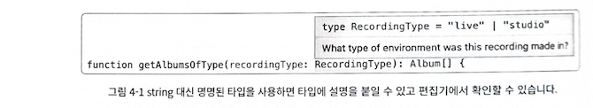
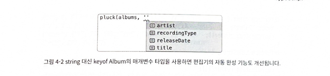

## 🦐 4-1 (아이템31) 타입 주변에 null값 배치하기

```ts
// strictNullChecks가 false인것에 주의하자
// tsConfig: {"strictNullChecks":false}

function extent(nums: number[]) {
  let min, max
  for (const num of nums) {
    if (!min) {
      min = num
      max = num
    } else {
      min = Math.min(min, num)
      max = Math.max(max, num)
    }
  }
  return [min, max]
}

```

> 문제1 : extent(0, 1, 2)의 결과는 `[0, 2]` 가 아니라 `[1, 2]` 가 됩니다.
> 왜냐하면 if(!min) 에 0도 !min에 해당하기 때문에
> 문제2: nums 배열이 비어 있다면 함수는 `[undefined, undefined]` 를 반환합니다.
> 버그와 함께 설계적 결함이 있습니다.

```ts
// tsConfig: {"strictNullChecks": true}
function extent(nums: number[]) {
  let min, max
  for (const num of nums) {
    if (!min) {
      min = num
      max = num
    } else {
      min = Math.min(min, num)
      max = Math.max(max, num)
      // ~~~ Argument of type 'number | undefined' is not
      //     assignable to parameter of type 'number'
    }
  }
  return [min, max]
}
const [min, max] = extent([0, 1, 2])
const span = max - min
// ~~~   ~~~ Object is possibly 'undefined'
```

> strictNullChecks 옵션을 true로 변경하면 문제1과 문제2가 타입체커 에러로 표시됩니다.

```ts
function extent(nums: number[]) {
  let result: [number, number] | null = null
  for (const num of nums) {
    if (!result) {
      result = [num, num]
    } else {
      result = [Math.min(num, result[0]), Math.max(num, result[1])]
    }
  }
  return result
}

// null 아님 단언(1)을 사용하여 결과 처리하기
const [min, max] = extent([0, 1, 2])!
const span = max - min // OK

// 단순 if문으로 결과 처리하기
const range = extent([0, 1, 2])
if (range) {
  const [min, max] = range
  const span = max - min // OK
}
```

> min과 max를 하나의 객체에 담아서 처리하는 방법


### null 과 null 이 아닌 값을 섞어서 사용하면 클래스에서도 문제가 생깁니다.

```ts
interface UserInfo {
  name: string
}
interface Post {
  post: string
}
declare function fetchUser(userId: string): Promise<UserInfo>
declare function fetchPostsForUser(userId: string): Promise<Post[]>
class UserPosts {
  user: UserInfo | null
  posts: Post[] | null

  constructor() {
    this.user = null
    this.posts = null
  }

  async init(userId: string) {
    return Promise.all([
      async () => (this.user = await fetchUser(userId)),
      async () => (this.posts = await fetchPostsForUser(userId)),
    ])
  }

  getUserName() {
    // ...?
  }
}
```

> 두번의 네트워크 요청이 로드되는 동안 user와 posts 속성은 null 상태입니다.
> 어떤 시점에는 둘다 null 이거나, 둘 중 하나만 null 이거나, 둘다 null 이 아닐 것입니다. 총 네 가지 경우가 존재합니다. 속성값의 불확실성이 클래스의 모든 메서드에 나쁜 영향을 미칩니다.

```ts
// 개선된 설계
interface UserInfo {
  name: string
}
interface Post {
  post: string
}
declare function fetchUser(userId: string): Promise<UserInfo>
declare function fetchPostsForUser(userId: string): Promise<Post[]>
class UserPosts {
  user: UserInfo
  posts: Post[]

  constructor(user: UserInfo, posts: Post[]) {
    this.user = user
    this.posts = posts
  }

  static async init(userId: string): Promise<UserPosts> {
    const [user, posts] = await Promise.all([fetchUser(userId), fetchPostsForUser(userId)])
    return new UserPosts(user, posts)
  }

  getUserName() {
    return this.user.name
  }
}
```

> 이제 UserPosts 클래스는 완전히 null 이 아니게 되었고, 메서드를 작성하기 쉬워졌습니다.


> 요약

- 한 값의 null 여부가 다른 값의 null 여부에 암시적으로 관련되도록 설계하면 안됩니다.
- API 작성 시에는 반환 타입을 큰 객체로 만들고 반환 타입 전체가 null이거나 null이 아니게 만들어야 합니다.사람과 타입 체커 모두에게 명료한 코드가 될 것입니다.
- 클래스를 만들 때는 필요한 모든 값이 준비되었을 때 생성하여 null이 존재 하지 않도록 하는 것이 좋습니다.
- strictNullChecks를 설정하면 코드에 많은 오류가 표시되겠지만, null 값과 관련된 문제점을 찾아낼 수 있기 때문에 반드시 필요합니다.


## 🐵 4-2 (아이템32) 유니온의 인터페이스보다는 인터페이스의 유니온을 사용하기

### 인터페이스의 유니온 사용 예시 유니온의 인터페이스 사용
```ts
type FillPaint = unknown
type LinePaint = unknown
type PointPaint = unknown
type FillLayout = unknown
type LineLayout = unknown
type PointLayout = unknown
interface Layer {
  layout: FillLayout | LineLayout | PointLayout
  paint: FillPaint | LinePaint | PointPaint
}
```

>  layout이 LineLayout 타입이면서 paint 속성이 FillPaint 타입인 것은 말이 되지 않습니다.
> 이런 조합을 허용한다면 오류가 발생하기 십상이고 인터페이스를 다루기도 어려울것이다.

```ts
type FillPaint = unknown
type LinePaint = unknown
type PointPaint = unknown
type FillLayout = unknown
type LineLayout = unknown
type PointLayout = unknown
interface FillLayer {
  layout: FillLayout
  paint: FillPaint
}
interface LineLayer {
  layout: LineLayout
  paint: LinePaint
}
interface PointLayer {
  layout: PointLayout
  paint: PointPaint
}
type Layer = FillLayer | LineLayer | PointLayer
```

> 이런 형태로 Layer를 정의하면 Layout과 paint 속성이 잘못된 조합으로 섞이는 경우를 방지할 수 있습니다.

- [n] comment
> 실제로 프로젝트 개발중에 유니온의 인터페이스를 사용하게 될 경우가 발생했다.

```ts
export interface SwiperContainerProps {
	list: MediaInfo[] | ImageGallaryInfo[];
	overrideSwiperOptions?: SwiperOptions;
}
```

> 물론 해당 코드에서 list는 유니온의 인터페이스지만 다른 프로퍼티 옵션이 1개뿐이라 MediaInfo이면서 SwiperOptions일 수 있고, ImageGallaryInfo이면서 SwiperOptions일 순 있지만 추후 프로퍼티가 추가되서 확장성을 고려해서 인터페이스이 유니온으로 변경 해보았다.

```ts
export interface SwiperContainerMediaInfo {
	list: MediaInfo[];
	overrideSwiperOptions?: SwiperOptions;
}

export interface SwiperContainerImagesGallary {
	list: ImageGallaryInfo[];
	overrideSwiperOptions?: SwiperOptions;
}

export type SwiperContainerProps =
| SwiperContainerMediaInfo
| SwiperContainerImagesGallary;
```


### 인터페이스의 유니온 사용 예시 태그된 유니온 사용

```ts
type FillPaint = unknown
type LinePaint = unknown
type PointPaint = unknown
type FillLayout = unknown
type LineLayout = unknown
type PointLayout = unknown

// 잘못된 예시
interface Layer {
  type: 'fill' | 'line' | 'point'
  layout: FillLayout | LineLayout | PointLayout
  paint: FillPaint | LinePaint | PointPaint
}

// 올바른 예시
interface FillLayer {
  type: 'fill'
  layout: FillLayout
  paint: FillPaint
}
interface LineLayer {
  type: 'line'
  layout: LineLayout
  paint: LinePaint
}
interface PointLayer {
  type: 'paint'
  layout: PointLayout
  paint: PointPaint
}
type Layer = FillLayer | LineLayer | PointLayer
```

> 잘못된 예시를 살펴보면 type: 'fill'과 함께 LineLayout과 PointPaint 타입이 쓰이는 것은 말이 되지 않는다.
> 올바른 예는 이러한 경우를 방지하기 위해 Layer를 인터페이스이 유니온으로 사용했다.


```ts
type FillPaint = unknown
type LinePaint = unknown
type PointPaint = unknown
type FillLayout = unknown
type LineLayout = unknown
type PointLayout = unknown
interface FillLayer {
  type: 'fill'
  layout: FillLayout
  paint: FillPaint
}
interface LineLayer {
  type: 'line'
  layout: LineLayout
  paint: LinePaint
}
interface PointLayer {
  type: 'paint'
  layout: PointLayout
  paint: PointPaint
}
type Layer = FillLayer | LineLayer | PointLayer
function drawLayer(layer: Layer) {
  if (layer.type === 'fill') {
    const { paint } = layer // Type is FillPaint
    const { layout } = layer // Type is FillLayout
  } else if (layer.type === 'line') {
    const { paint } = layer // Type is LinePaint
    const { layout } = layer // Type is LineLayout
  } else {
    const { paint } = layer // Type is PointPaint
    const { layout } = layer // Type is PointLayout
  }
}
```

> 태그된 유니온을 사용하여 타입의 범위를 좁힐 수 있습니다.
> 어떤 데이터 타입을 태그된 유니온으로 표현할 수 있다면, 보통은 그렇게 하는 것이 좋습니다.
> 여러 개의 선택적 필드가 동시에 값이 있거나 동시에 undefined인 경우에도 태그된 유니온 패턴이 잘 맞습니다.


- 여러 개의 선택적 필드가 동시에 값이 있거나 동시에 undefined인 경우 null 값을 경계로 두는 방법(아이템 31)

```ts
interface Person {
  name: string
  // 다음은 둘 다 동시에 있거나 동시에 없습니다.
  placeOfBirth?: string
  dateOfBirth?: Date
}

// 두 개의 속성을 하나의 객체로 모으는 것이 더 나은 설계입니다.(아이템31)
interface Person {
  name: string
  birth?: {
    place: string
    date: Date
  }
}
// place만 있고 date가 없는 경우에는 오류가 발생합니다.
const alanT: Person = {
  name: 'Alan Turing',
  birth: {
    // ~~~~ 'date' 속성이 '{ place: string; }' 형식에 없지만
    //      '{ place: string; date: Date; }' 형식에서 필수입니다.
    place: 'London',
  },
}
```

- [n] comment
> optional 프로퍼티들이 동시에 값이 있거나 동시에 없으면 객체로 모으는것이 좋다.


> 장점 1 
> 선택적 프로퍼티가 동시에 있거나 동시에 undefined여야 할때 하나의 프로퍼티가 없으면 타입체커가 오류를 잡아냅니다.


>장점2
>	Person 객체를 매개변수로 받는 함수는 birth 하나만 체크하면 됩니다.

```ts
interface Person {
  name: string
  birth?: {
    place: string
    date: Date
  }
}
function eulogize(p: Person) {
  console.log(p.name)
  const { birth } = p
  if (birth) {
    console.log(`was born on ${birth.date} in ${birth.place}.`)
  }
}
```


### 인터페이스의 유니온 사용 예시 타입의 구조를 손 댈 수 없는 상황(예를 들어 API의 결과)이면
```ts
interface Name {
  name: string
}

interface PersonWithBirth extends Name {
  placeOfBirth: string
  dateOfBirth: Date
}

type Person = Name | PersonWithBirth
function eulogize(p: Person) {
  if ('placeOfBirth' in p) {
    p // 타입이 PersonwithBirth
    const { dateOfBirth } = p // 정상, 타입이 Date
  }
  
```

> 인터 페이스의 유니온을 사용해서 속성 사이의 관계를 모델링할 수 있습니다.


> 요약

- 유니온 타입의 속성을 여러 개 가지는 인터페이스에서는 속성 간의 관계가 분명하지 않기 때문에 실수가 자주 발생하므로 주의해야 합니다.
- 유니온의 인터페이스보다 인터페이스의 유니온이 더 정확하고 타입스크립트가 이해하기도 좋습니다.
- 타입스크립트가 제어 흐름을 분석할 수 있도록 타입에 태그를 넣는 것을 고려해야 합니다. 태그된 유니온은 타입스크립트와 매우 잘 맞기 때문에 자주 볼 수 있는 패턴입니다.


## 🐶 4-3 (아이템33) string 타입보다 더 구체적인 타입 사용하기

> string 타입의 범위는 매우 넓습니다. 그보다 더 좁은 타입이 적절하지는 않을지 검토해 보아야 합니다.

```ts
// 음악 컬렉션을 만들기 위해 앨범의 타입을 정의한다고 가정
interface Album {
  artist: string
  title: string
  releaseDate: string // YYYY-MM-DD
  recordingType: string // E.g., "live" or "studio"
}
const kindOfBlue: Album = {
  artist: 'Miles Davis',
  title: 'Kind of Blue',
  releaseDate: 'August 17th, 1959', // 날짜 형식이 다릅니다
  recordingType: 'Studio', // 오타(대문자 S)
} // 타입 체커 통과

function recordRelease(title: string, date: string) {
  /* ... */
}
recordRelease(kindOfBlue.releaseDate, kindOfBlue.title) // 타입체커 통과
```

> 1.  모든 string이 다 올 수 있기 때문에 오타나 다른 형식이 와도 string이라면 타입 체커를 통과 문제
> 2. 함수의 인자값이 반대로 오더라도 둘다 string 타입이므로 타입 체커 통과 문제


- 구체적인 타입으로 명시하기

```ts
interface Album {
  artist: string
  title: string
  releaseDate: Date
  recordingType: RecordingType
}
const kindOfBlue: Album = {
  artist: 'Miles Davis',
  title: 'Kind of Blue',
  releaseDate: new Date('1959-08-17'),
  recordingType: 'Studio',
  // ~~~~~~~~~~~~ '"Studio"' 형식은 'RecordingType' 형식에 할당할 수 없습니다.
}
```


### 구체적인 타입을 사용 했을때 세 가지 장점

- 첫 번째 타입을 명시적으로 정의함으로써 다른 곳으로 값이 전달 되어도 타입 정보가 유지됩니다.

```ts
type RecordingType = 'studio' | 'live'

interface Album {
  artist: string
  title: string
  releaseDate: Date
  recordingType: RecordingType
}
function getAlbumsOfType(recordingType: string): Album[] {
  // COMPRESS
  return []
  // END
}
```


- 두 번째 타입을 명시적으로 정의하고 해당 타입의 의미를 설명하는 주석을 붙여 넣을 수 있습니다.

```ts
/** 이 녹음은 어떤 환경에서 이루어졌는지? */
type RecordingType = 'live' | 'studio'

interface Album {
  artist: string
  title: string
  releaseDate: Date
  recordingType: RecordingType
}

function getAlbumsOfType(recordingType: RecordingType): Album[] {}
```

> getAlbumsOfType 인자값 recordingType을 RecordingType으로 명시적으로 선언하면 설명을 볼 수 있습니다.



- 세 번째 keyof 연산자로 더욱 세밀하게 객체의 속성 체크가 가능해집니다.

```ts
// 어떤 배열에서 한 필드의 값만 추출하는 함수를 작성한다고 생각 해보겠습니다.
function pluck<T>(record: T[], key: string): any[] {
  return record.map(r => r[key])
  // ~~~~~~ '{}' 형식에 인덱스 시그니처가 없으므로
  //        요소에 암시적으로 'any' 형식이 있습니다.
}
```

> 타입스크립트는 key의 타입이 string이기 때문에 범위가 너무 넓다는 오류를 발생시킵니다.

```ts
function pluck<T>(record: T[], key: keyof T) {
  return record.map(r => r[key])
}
```

> 이 코드는 타입 체커를 통과합니다. 또한 타입스크립트가 반환 타입을 추론 할 수 있게 해줍니다.
> `function pluck<T>(record: T[], key: keyof T): T[keyof T][]` 


- 그러나 key의 값으로 하나의 문자열을 넣게 되면, 그 범위가 넓어서 적절한 타입이라고 보기 어렵습니다.

```ts
type RecordingType = 'studio' | 'live'

interface Album {
  artist: string
  title: string
  releaseDate: Date
  recordingType: RecordingType
}
function pluck<T>(record: T[], key: keyof T) {
  return record.map(r => r[key])
}
declare let albums: Album[]
const releaseDates = pluck(albums, 'releaseDate') // Type is (string | Date)[]
```

> `Date[]` 타입을 기대 했지만 `(string | Date)[]` 로 추론됨.
> `keyof T` 는 `string` 에 비하면 훨씬 범위가 좁기는 하지만 그래도 여전히 넓습니다.
> 두번째 제네릭 변수를 도입 해야 됩니다.

```ts
function pluck<T, K extends keyof T>(record: T[], key: K): T[K][] {
  return record.map(r => r[key])
}
type RecordingType = 'studio' | 'live'

interface Album {
  artist: string
  title: string
  releaseDate: Date
  recordingType: RecordingType
}
declare let albums: Album[]
pluck(albums, 'releaseDate') // 타입이 Date[]
pluck(albums, 'artist') // 타입이 string[]
pluck(albums, 'recordingType') // 타입이 RecordingType[]
pluck(albums, 'recordingDate')
// ~~~~~~~~~~~~    '"recordingDate"' 형식의 인수는
//                 ... 형식의 매개변수에 할당될 수 없습니다.
```



> 요약

- '문자열을 남발하여 선언된' 코드를 피합시다. 모든 문자열을 할당할 수 있는 string 타입보다는 더 구체적인 타입을 사용하는 것이 좋습니다.
- 변수의 범위를 보다 정확하게 표현하고 싶다면 string 타입보다는 문자열 리터럴 타입의 유니온을 사용하면 됩니다. 타입 체크를 더 엄격히 할 수 있고 생산성을 향상시킬 수 있습니다.
- 객체의 속성 이름을 함수 매개변수로 받을 때는 `string` 보다 `keyof T` 를 사용 하는 것이 좋습니다.


## 🐹 4-3 (아이템36) 해당 분야의 용어로 타입 이름 짓기

```ts
// 동물들의 데이터베이스를 구축 한다고 가정
interface Animal {
  name: string
  endangered: boolean
  habitat: string
}

const leopard: Animal = {
  name: 'Snow Leopard',
  endangered: false,
  habitat: 'tundra',
}
```

> 해당 코드에 4가지 문제가 있습니다.

- name은 매우 일반적인 용어입니다. 동물의 학명인지 일반적인 명칭인지 알 수 없습니다.
- endangered 속성이 멸종 위기를 표현하기 위해 boolean 타입을 사용한 것이 이상합니다. 이미 멸종된 동물을 true로 해야 하는지 판단할 수 없습니다. endangered 속성의 의도를 '멸종 위기 또는 멸종'으로 생각한 것일지도 모릅 니다.
- 서식지를 나타내는 habitat 속성은 너무 범위가 넓은 string 타입일 뿐만 아니라 서식지라는 뜻 자체도 불분명하기 때문에 다른 속성들 보다도 훨씬 모호합니다.
- 객체의 변수명이 Leopard이지만, name 속성의 값은 'Snow Leopard'입니다.객체의 이름과 속성의 name이 다른 의도로 사용된 것인지 불분명합니다.

```ts
// 개선된 코드
interface Animal {
  commonName: string
  genus: string
  species: string
  status: ConservationStatus
  climates: KoppenClimate[]
}
type ConservationStatus = 'EX' | 'EW' | 'CR' | 'EN' | 'VU' | 'NT' | 'LC'
type KoppenClimate =
  | 'Af'
  | 'Am'
  | 'As'
  | 'Aw'
  | 'BSh'
  | 'BSk'
  | 'BWh'
  | 'BWk'
  | 'Cfa'
  | 'Cfb'
  | 'Cfc'
  | 'Csa'
  | 'Csb'
  | 'Csc'
  | 'Cwa'
  | 'Cwb'
  | 'Cwc'
  | 'Dfa'
  | 'Dfb'
  | 'Dfc'
  | 'Dfd'
  | 'Dsa'
  | 'Dsb'
  | 'Dsc'
  | 'Dwa'
  | 'Dwb'
  | 'Dwc'
  | 'Dwd'
  | 'EF'
  | 'ET'
const snowLeopard: Animal = {
  commonName: 'Snow Leopard',
  genus: 'Panthera',
  species: 'Uncia',
  status: 'VU', // vulnerable
  climates: ['ET', 'EF', 'Dfd'], // alpine or subalpine
}
```

> 해당 코드는 세 가지를 개선 했습니다.

- name은 commonName, genus, species 등 더 구체적인 용어로 대체했습니다.
- endangered는 동물 보호 등급에 대한 IUCN의 표준 분류 체계인 ConservationStatus 타입의 status로 변경되었습니다.
- habitat은 기후를 뜻하는 climates로 변경되었으며, 코펜 기후 분류(Koppen climate classification)를 사용합니다.


> 타입, 속성, 변수에 이름을 붙일 때 명심해야 할 세 가지 규칙이 있습니다.

- 동일한 의미를 나타낼 때는 같은 용어를 사용해야 합니다. 글을 쓸 때나 말 을 할 때, 같은 단어를 반복해서 사용하면 지루할 수 있기 때문에 동의어(의미가 같지만 다른 단어)를 사용합니다. 동의어를 사용하면 글을 읽을 때는 좋을 수 있지만, 코드에서는 좋지 않습니다. 정말로 의미적으로 구분이 되어야 하는 경우에만 다른 용어를 사용해야 합니다.
- `data, info, thing, item, object, entity`  같은 모호하고 의미 없는 이름은 피해야 합니다. 만약 entity라는 용어가 해당 분야에서 특별한 의미를 가진다면 괜찮습니다. 그러나 귀찮다고 무심코 의미 없는 이름을 붙여서는 안됩니다.
- 이름을 지을 때는 포함된 내용이나 계산 방식이 아니라 데이터 자체가 무엇 인지를 고려해야 합니다. 예를 들어, `INodeList` 보다는 `Directory` 가 더 의미 있는 이름입니다. `Directory` 는 구현의 측면이 아니라 개념적인 측면에서 디렉터리를 생각하게 합니다. 좋은 이름은 추상화의 수준을 높이고 의도치 않은 충돌의 위험성을 줄여 줍니다.

>요약

- 가독성을 높이고, 추상화 수준을 올리기 위해서 해당 분야의 용어를 사용해야 합니다.
- 같은 의미에 다른 이름을 붙이면 안됩니다. 특별한 의미가 있을 때만 용어를 구분해야 합니다.


## 🐻 4-4 (아이템37) 공식 명칭에는 상표를 붙이기
```ts
interface Vector2D {
  x: number
  y: number
}
function calculateNorm(p: Vector2D) {
  return Math.sqrt(p.x * p.x + p.y * p.y)
}

calculateNorm({ x: 3, y: 4 }) // 정상
const vec3D = { x: 3, y: 4, z: 1 }
calculateNorm(vec3D) // 정상
```

> 구조적 타이핑 특정으로 인하여 객체를 만들어서 인자값으로 넘기면 객체에 프로퍼티가 2개가 아니라 3개 4개를 넘겨도 타입체커를 통과한다.

```ts
interface Vector2D {
  _brand: '2d'
  x: number
  y: number
}
function vec2D(x: number, y: number): Vector2D {
  return { x, y, _brand: '2d' }
}
function calculateNorm(p: Vector2D) {
  return Math.sqrt(p.x * p.x + p.y * p.y) 
}

calculateNorm(vec2D(3, 4)) // 정상
const vec3D = { x: 3, y: 4, z: 1 }
calculateNorm(vec3D) // '_brand' 속성이 ... 형식에 없습니다.

const vec3D = { _brand:'2d' as const, x: 3, y: 4, z: 1 } // 이렇게 사용하는건 못막음
```

> 타입스크립트에서 `상표(brand)` 를 사용
> 상표(`_brand` )를 사용해서 calculateNorm 함수가 Vector2D 타입만 받는 것을 보장합니다.
> 그러나 vec3D 값에` _brand: '2d'` 라고 추가하는 것 같은 악의적인 사용을 막을 수는 없습니다.
> 다만 단순한 실수를 방지하기에는 충분합니다.

> 타입시스템에서 `상표(brand)` 기법 장점

- 타입 시스템에서 동작하지만 런타임에 상표를 검사하는 것과 동일한 효과를 얻을 수 있습니다.
- 타입 시스템이기 때문에 런타임 오버헤드를 없앨 수 있습니다.
- 추가 속성을 붙일 수 없는 string이나 number 같은 내장 타입도 `상표(brand)`화할 수 있습니다.


```ts
// 절대 경로를 사용해 파일 시스템에 접근하는 함수 가정
type AbsolutePath = string & { _brand: 'abs' }
function listAbsolutePath(path: AbsolutePath) {
  // ...
}
function isAbsolutePath(path: string): path is AbsolutePath {
  return path.startsWith('/')
}

```

> 타입 시스템에서는 절대 경로를 판단하기 어렵기 때문에 상표 기법을 사용
> string 타입이면서 `_brand`  속성을 가지는 객체를 만들 수는 없습니다. AbsolutePath는 온전히 타입 시스템의 영역입니다.


- 만약 path 값이 절대 경로와 상대 경로 둘 다 될 수 있다면 타입가드 사용

```ts
// 절대 경로를 사용해 파일 시스템에 접근하는 함수 가정
type AbsolutePath = string & { _brand: 'abs' }
function listAbsolutePath(path: AbsolutePath) {
  // ...
}
function isAbsolutePath(path: string): path is AbsolutePath {
  return path.startsWith('/')
}
function f(path: string) {
  if (isAbsolutePath(path)) {
    listAbsolutePath(path)
  }
  listAbsolutePath(path)
  // ~~~~ 'string' 형식의 인수는 'AbsolutePath' 형식의
  //       매개변수에 할당될 수 없습니다.
}
```

> 타입 단언문(`as`) 를 사용해서 AbsolutePath 타입을 얻는 방법 이외에
> AbsolutePath 타입을 매개변수로 받는 방법과 타입이 맞는지 체크하는 방법이 있다.

```ts
// 이진 탐색

function binarySearch<T>(xs: T[], x: T): boolean {
  let low = 0,
    high = xs.length - 1
  while (high >= low) {
    const mid = low + Math.floor((high - low) / 2)
    const v = xs[mid]
    if (v === x) return true
    ;[low, high] = x > v ? [mid + 1, high] : [low, mid - 1]
  }
  return false
}
```

> 상표 기법은 타입 시스템 내에서 표현할 수 없는 수많은 속성들을 모델링 하는데 사용되기도 합니다.
> 타입스크립트 타입 시스템에서는 목록이 정렬되어 있다는 의도를 표현하기 어렵습니다.

```ts
type SortedList<T> = T[] & { _brand: 'sorted' }

function isSorted<T>(xs: T[]): xs is SortedList<T> {
  for (let i = 1; i < xs.length; i++) {
    if (xs[i] > xs[i - 1]) {
      return false
    }
  }
  return true
}

function binarySearch<T>(xs: SortedList<T>, x: T): boolean {
  // COMPRESS
  return true
  // END
}
```

> binarySearch를 호출하려면, 
> 정렬되었다는 상표가 붙은 SortedList 타입의 값을 사용하거나 isSorted를 호출하여 정렬되었음을 증명해야 합니다.
> isSorted 에서 목록 전체를 루프 도는 것이 효율적인 방법은 아니지만 적어도 안전성은 확보할 수 있습니다.


- number 타입에도 상표를 붙일 수 있습니다.

```ts
type Meters = number & { _brand: 'meters' }
type Seconds = number & { _brand: 'seconds' }

const meters = (m: number) => m as Meters
const seconds = (s: number) => s as Seconds

const oneKm = meters(1000) // 타입이 Meters
const oneMin = seconds(60) // 타입이 Seconds
const tenKm = oneKm * 10 // 타입이 number
const v = oneKm / oneMin // 타입이 number
```

> 요약

- 타입스크립트는 구조적 타이핑(덕 타이핑)을 사용하기 때문에, 값을 세밀하게 구분하지 못하는 경우가 있습니다. 값을 구분하기 위해 공식 명칭이 필요하다면 상표를 붙이는 것을 고려해야 합니다.
- 상표 기법은 타입 시스템에서 동작하지만 런타임에 상표를 검사하는 것과 동일한 효과를 얻을 수 있습니다.


