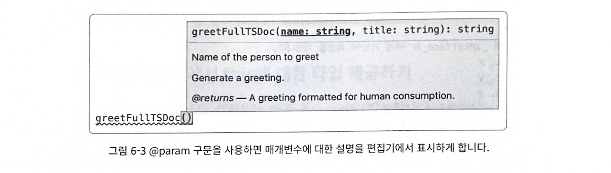

## 🍙 6-1 (아이템46) 타입 선언과 관련된 세 가지 버전 이해하기

> 타입스크립트는 알아서 의존성 문제를 해결해 주기는커녕, 의존성 관리를 오히려 더 복잡하게 만듭니다.
> 다음 세 가지 사항을 추가로 고려해야 하기 때문입니다.

- 라이브러리의 버전
- 타입 선언(`@types`)의 버전
- 타입스크립트의 버전

> 세 가지 버전 중 하나라도 맞지 않으면, 의존성과 상관없어 보이는 곳에서 엉뚱한 오류가 발생할 수 있습니다.

> 요약

- `@types` 의존성과 관련된 세 가지 버전이 있습니다. 라이브러리 버전, `@types` 버전, 타입스크립트 버전입니다.
- 라이브러리를 업데이트하는 경우, 해당 `@types`  역시 업데이트해야 합니다.
- 타입 선언을 라이브러리에 포함하는 것과 DefinitelyTyped에 공개하는 것 사이의 장단점을 이해해야 합니다. 타입스크립트로 작성된 라이브러리라면 타입 선언을 자체적으로 포함하고, 자바스크립트로 작성된 라이브러리라면 타입 선언을 DefinitelyTyped에 공개하는 것이 좋습니다.

## 🍘 6-2 (아이템48) API 주석에 TSDoc 사용하기
```ts
/**
 * 인사말을 생성합니다.
 * @param name 인사할 사람의 이름
 * @param title 그 사람의 칭호
 * @returns 사람이 보기 좋은 형태의 인사말
 */
function greetFullTSDoc(name: string, title: string) {
  return `Hello ${title} ${name}`
}
```



### 타입 정의에 TSDoc을 사용 할 수 도 있습니다
```ts
interface Vector3D {}
/** 특정 시간과 장소에서 수행된 측정 */
interface Measurement {
  /** 어디에서 측정되었나? */
  position: Vector3D;
  /** 언제 측정되었나? epoch에서부터 초 단위로 */
  time: number;
  /** 측정된 운동량 */
  momentum: Vector3D;
}
```


- TSDoc 주석은 마크다운(markdown) 형식으로 꾸며지므로 굵은 글씨, 기울임 글씨, 글머리기호 목록을 상요 할 수 있습니다.

```ts
/**
 * This _interface_ has **three** properties:
 * 1. x
 * 2. y
 * 3. z
 */
interface Vector3D {
  x: number
  y: number
  z: number
}
```


> *JSDoC에는 타입 정보를 명시하는 규칙(`@param {string} name )` 이 있지만 타입스크립트에서는 타입 정보가 코드에 있기 때문에 TSDoc에서는 타입 정보를 명시하면 안됩니다* 

- [n] comment
> 내 프로젝트 controller단의 api의 TSDoc에는 전부 타입정보가 있는데 다 지워야겠다.


## 🥝 6-3 (아이템50) 오버로딩 타입보다는 조건부 타입을 사용하기

```ts
// 오버로딩 타입을 이용해서 해결하려고 해도 문제가 발생할떄마다 계속 추가해야됨
function double(x: number): number
function double(x: string): string
function double(x: any) {
  return x + x
}

const num = double(12) // Type is number
const str = double('x') // Type is string
function f(x: number | string) {
  return double(x)
  // ~ Argument of type 'string | number' is not assignable
  //   to parameter of type 'string'
}

// 제네릭과 조건부타입을 사용하면 해결 할 수 있다
function double<T extends number | string>(x: T): T extends string ? string : number
function double(x: any) {
  return x + x
}
const num = double(12) // number
const str = double('x') // string

// function f(x: string | number): string | number
function f(x: number | string) {
  return double(x)
}
```

> 요약

- 오버로딩 타입보다 조건부 타입을 사용하는 것이 좋습니다. 조건부 타입은 추가적인 오버로딩 없이 유니온 타입을 지원할 수 있습니다.


## 🍓 6-4 (아이템51) 의존성 분리를 위해 미러 타입 상용하기

```ts
function parseCSV(contents: string | Buffer): { [column: string]: string }[] {
  if (typeof contents === 'object') {
    // 버퍼인 경우
    return parseCSV(contents.toString('utf8'))
  }
  // COMPRESS
  return []
  // END
}
```

> Buffer의 타입 정의는NodeJS 타입 선언을 설치해서 얻을 수 있습니다.

```ts
$ npm install -D @types/node
```

> 하지만 해당 parseCSV를 외부 공개 라이브러리로 만들경우 타입선언도 포함되게 됩니다. 그리고 타입선언이
> `@types/node` 에 의존하기 때문에 `devDependencies` 로 포함해야 됩니다. 이렇게 하면
> typescript node개발자한테는 상관없지만 
> 다음 두 사용자에게는 문제가 생깁니다.

- `@types` 와 무관한 자바스크립트 개발자
- NodeJS와 무관한 타입스크립트 개발자


```ts
interface CsvBuffer {
  toString(encoding: string): string
}
function parseCSV(contents: string | CsvBuffer): { [column: string]: string }[] {
  // COMPRESS
  return []
  // END
}

parseCSV(new Buffer('column1,column2\nval1,val2', 'utf-8')) // 정상
```

> CsvBuffer 는 Buffer 인터페이스보다 훨씬 짧으면서도 실제로 필요한 부분만을 떼어 내어 명시했습니다.
> 또한 해당 타입이 Buffer와 호환되기 때문에 NodeJS 프로젝트에서는 실제 Buffer 인스턴스로 parseCSV를 호출하는 것이 가능합니다.

>**만약 작성 중인 라이브러리가 의존하는 라이브러리의 구현과 무관하게 타입에만 의존한다면, 필요한 선언부만 추출하여 작성 중인 라이브러리에 넣는 것** *(미러링, mirroring)* 


> 요약

- 필수가 아닌 의존성을 분리할 때는 구조적 타이핑을 사용하면 됩니다.
- 공개한 라이브러리를 사용하는 자바스크립트 사용자가 `@types`  의존성을 가지지 않게 해야 합니다. 그리고 웹 개발자가 NodeJS 관련된 의존성을 가지지 않게 해야 합니다


## 🍒 6-5 (아이템52) 테스팅 타입의 함정에 주의하기

```ts
const square = (x: number) => x * x
test('square a number', () => {
  square(1)
  square(2)
})
```

> square 함수가 '실행' 에 대한 오류는 체크 하지만 '반환 값'에 대해서는 체크하지 않는다.
> 함수를 실행만 하는 테스트 코드가 의미 없는 것은 아니지만,
> **실제로 반한 타입을 체크하는 것이 훨씬 좋은 테스트 코드입니다.** 


- 반환값을 특정 타입의 변수에 할당하여 간단히 반환 타입을 체크

```ts
declare function map<U, V>(array: U[], fn: (u: U) => V): V[]
const lengths: number[] = map(['john', 'paul'], name => name.length)
```

> map 함수의 반환 타입이 `number[]` 임을 보장합니다.

- 반환값을 변수에 할당해서 테스팅을 하면 두가지 근본적인 문제가 있습니다.

1. 불필요한 변수를 만들어야 합니다.
2. 두 타입이 동일한지 체크하는 것이 아니라 할당 가능성을 체크하고 있습니다.


> 요약

- 타입을 테스트할 때는 특히 함수 타입의 동일성(equality)과 할당 가능성 (assignability)의 차이점을 알고 있어야 합니다.
- 콜백이 있는 함수를 테스트할 때, 콜백 매개변수의 추론된 타입을 체크해야 합니다. 또한 this가 API의 일부분이라면 역시 테스트해야 합니다.
- 타입 관련된 테스트에서 any를 주의해야 합니다. 더 엄격한 테스트를 위해 dtslint 같은 도구를 사용하는 것이 좋습니다


