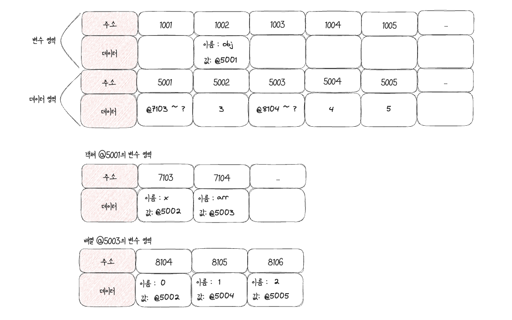

# 데이터 타입
## 데이터 할당
> Javascript에서 변수 영역에 값을 직접 대입하지 않고 데이터 영역에 값을 만들고 해당 주소를 변수 영역의 값에 할당하는 이유는?

- 데이터 변환을 자유롭게 할 수 있다.
- 메모리를 더욱 효율적으로 관리하기 위한 고민의 결과다.
### 예시1
- 문자열 `abc` 의 마지막에 `def` 를 추가하라고 하면 컴퓨터가 `abc` 가 저장된 공간에 `abcdef` 를 할당하는 대신 *새로운 문자열* 을 만들어 별도의 공간에 저장.
- 해당 주소를 변수 공간에 연결한다.
### 예시2
- 500개의 변수를 생성해서 모든 변수에 숫자 5를 할당하는 상황
	- 만약 개별 생성일 경우 : 500개의 변수 공간을 확보 -> 숫자 5를 할당한다고 가정
		- 숫자형은 8바이트 필요 : 총 4000(500 * 8)바이트 사용.
	- 만약 5를 별도의 공간에 한번만 저장 : 예를들어 주소공간이 크키가 2바이트
		- 1008(500 * 2 + 8)바이트만 사용하면 된다!!!

> 결론적으로 변수 영역과 데이터 영역을 분리하면 중복된 데이터에 대한 처리 효율이 높아진다.

- *변수와 상수를 구분 짓는 변경 가능성의 대상 -> 변수 영역 메모리* 
- *불변성 여부를 구분할 때의 변경 가능성의 대상은 -> 데이터 영역 메모리* 
## 불변성
- 데이터 영역의 메모리

```js
var a = 'abc';
a = a + 'def';

var b = 5;
var c = 5;
b = 7;
```

> 변수 `a` 에 문자열 `abc` 를 할당했다가 뒤에 `def` 를 추가하면 기존의 `abc` 가 `abcdef` 로 바뀌는게 아니다.
> 새로운 문자열 `abcdef` 를 만들어 그 주소를 변수 `a` 에 저장.
> `abc` 가 `abcdef` 둘은 완전 별개의 데이터

- 문자열, 숫자 값도 다른 값으로 변경 할 수 없다.
- 변경은 새로 만드는 동작을 통해서만 이뤄집니다.
- *불변값의 성질이다*  -> Primitive type은 불변성을 가진다.
## 가변값
- 기본형 데이터는 불변값
- 참조형 데이터
	- 기본 성질은 가변값
	- 설정에 따라 변경 불가능한 경우도 있고
	- 불변값으로 활용하는 방안도 있다.

> *객체의 변수(프로퍼티)영역* 이 별도로 존재한다.
> 객체가 별도로 할애한 영역은 변수 영역일 뿐 "데이터 영역"은 기존의 메모리 공간을 그대로 활용한다.
> *데이터 영역에 저장된 값은 모두 불변값* 
> 참조형 데이터가 불변 하지 않다(가변값)인 이유?
> > 변수에 다른 값을 얼마든지 대입할 수 있다.

```js
var obj1 = {
	a: 1,
	b: 'bbb'
};
obj1.a = 2;
```

> `obj1` 이 바라보고 있는 주소는 변하지 않는다.
> 즉, '새로운 객체'가 만들어 지는것이 아니라 기존의 객체 내부의 값만 바뀐것이다.
### 중첩객체
```js title="중첩객체"
var obj = {
	x: 3,
	arr: [ 3, 4, 5]
};
```



- `obj.arr[1]` 을 검색하고자 할때

1. obj 검색
	1. obj라는 식별자를 가진 주소를 찾습니다(@1002)
	2. 값이 주소이므로 그 주소로 이동합니다(@5001)
	3. 값이 주소이므로 그 주소로 이동합니다(@7103 ~ ?)
2. `obj.arr` 검색
	1. `arr` 이라는 식별자를 가진 주소를 찾습니다.(@7104)
	2. 값이 주소이므로 그 주소로 이동합니다(@5003)
	3. 값이 주소이므로 그 주소로 이동합니다(@8104 ~ ?)
3. `obj.arr[1]` 검색
	1. 인덱스 1에 해당하는 주소를 찾습니다(@8105)
	2. 값이 주소이므로 그 주소로 이동합니다(@5004)
	3. 값이 숫자형 데이터이므로 4를 반환합니다.


# 변수 복사 비교
```js
var a = 10;
var b = a;
console.log(a);
console.log(b);
b = 20;
console.log(a);
console.log(b);
var obj1 = { c: 10, d: 'ddd' };
var obj2 = obj1;
console.log(obj1);
console.log(obj2);
obj2.c = 20;
console.log(obj1); // { c: 20, d: 'ddd' }
console.log(obj2); // { c: 20, d: 'ddd' }
/*
* 같은 객체를 바라보고 있어서 복사한 obj2의 프로퍼티 c를 변경 했음에도 obj1의 값도
* 마치 같이 바뀐것처럼 보인다.
*/
```

- 변수를 복사하는 과정은 기본형 데이터와 참조형 데이터 모두 같은 주소를 바라보게 되는 점에서 동일하다.
- 기본형 데이터는 복사한 변수의 값을 바꿔면 -> 주소값이 달라짐.
- 참조형 데이터는 복사한 변수의 프로퍼티의 값을 바꾸었더니 -> 값은 달라지지 않았습니다.
	- 즉, `obj1` 과 `obj2` 가 여전히 같은 객체를 바라보고 있는 상태다.

> 이것이 기본형 과 참조형 데이터의 가장 큰 차이점이다.
> *자바스크립트에서 모든 데이터 타입은 참조형 데이터일수 밖에 없다* 
> > 기본형은 주소값을 복사하는 과정이 한번만 이뤄짐
> > 참조형은 한 단계를 더 거치게 된다는차이가 있다.
> *기본형도 결국 주소값을 참조한다* 


## 객체 자체를 변경 했을 때
```js
var a = 10;
var b = a;
var obj1 = { c: 10, d: 'ddd' };
var obj2 = obj1;

b = 15;
obj2 = { c: 20, d: 'ddd' };
```

> `b` 와 마찬가지로 `obj2` 에도 새로운 객체를 할당함으로 값을 직접 변경 했음!

- *참조형 데이터가 '가변값'이라고 설명할 때 '가변'은 참조형 데이터 자체를 변경할 경우가 아니라 그 내부의 프로퍼티를 변경할 때만 성립한다.* 
- 참조형 데이터 자체를 바꾼다면 그것또한 불변값이다.


# 불변 객체
- 참조형 데이터의 '가변'은 데이터 자체가 아닌 내부 프로퍼티를 변경할 때만 성립한다.
- 데이터 자체를 변경하고자 하면 기본 데이터와 마찬가지로 *기존 데이터는 변하지 않는다* 
- `immutable.js` : 내부 프로퍼티를 변경할 필요가 있을때마다 매번 새로운 객체를 만들어 재할당하거나 자동으로 새로운 객체를 만드는 도구


## 어떤 상황에 불변객체가 필요할까?
- **값으로 전달받은 객체에 변경을 가하더라도 원본 객체는 변하지 않아야 하는 경우가 종종 발생** -> 불변객체가 필요하다.

```js title="객체의 가변성에 따른 문제점"
var user = {
	name: 'Jaenam',
	gender: 'male'
};

var changeName = function (user, newName){
	var newUser = user;
	newUser.name = newName;
	return newUser;
}

var user2 = changeName(user, 'Jung');

if(user !== user2){
	console.log('유저 정보가 변경되었습니다.');
}
console.log(user.name, user2.name); // Jung Jung
console.log(user === user2); // ture
```

```ts
class User{
	constructor(name:string){
		this.name = name;
	}

	changeName(user:User, changedName: string){
		const newUser = user;
		newUser.name = changedName;
		return newUser;
	}
}
const user = new User('Jaenam');
const newUser = user.changeName(user, 'Jung');
console.log(user); // User { name: "Jung" }
console.log(newUser); // User { name: "Jung" }
```

> 와우...;; 일딴 클래스에서 setter 메서드나 다른 멤버 변수를 변경하는 메서드가 없음에도 멤버 변수를 바꿀 수 있다는것에 놀랍고 역시나 Javascript는 전부 객체다. 클래스 인스턴스를 newUser변수에 할당받고 name이라는 프로퍼티를 바꿨을때 원본도 함께 바뀌네

- `eslint에서` `eslint-plugin-functional` lint를 이용하면 불변성 규칙을 설정할 수 있다.
- 그것으로 클래스내 멤버변수를 변경 못하게 막을 수 있다.


```js title="기존 정보를 복사해서 새로운 객체를 반환하는 함수(얕은 복사)"
var copyObject = function(target){
	var result = {};
	for (var prop in target){
		/*
		* 우왕 여기 for in 돌때 getter인 fullName도 같이 호출되네
		* console.log(prop);
		* name
		* gender
		* fullName
		*/
		result[prop] = target[prop];
	}
	return result;
}

var user = {
	name: 'Jaenam',
	gender: 'male'
}

// getter와 setter 추가
Object.defineProperty(user, 'fullName', {
    get: function() {
        return `${this.name} (Full Name)`;
    },
    set: function(value) {
        this.name = value;
    },
    enumerable: true
});

// user 객체 복사
var user2 = copyObject(user);
user2.name = 'Jung';

// 복사된 객체에서 getter와 setter 동작 확인
//console.log(user.fullName); // Jaenam (Full Name)
console.log(user2.fullName); // Jaenam (Full Name) (getter가 복사되지 않았기 때문)
console.dir(user);
// { name: 'Jaenam', gender: 'male', fullName: [Getter/Setter] }
console.dir(user2);
// { name: 'Jung', gender: 'male', fullName: 'Jaenam (Full Name)' }

if(user !== user2){
	console.log("유저 정보가 변경되었습니다");
}
console.log(user.name, user2.name);
console.log(user === user2);
```

> 아 이런식으로 했을때 `getter/setter` 는 복사하지 않는구나 그래서 얕은복사구나.
> `for ... in` 루프는 객체의 열거 가능한 속성들만 복사하기 때문에 

# 얕은 복사와 깊은 복사
#Javascript/얕은복사 #Javascript/깊은복사

## 얕은 복사(Shallow Copy)
- *바로 아래 단계의 값만 복사하는 방법* 
- 중첩된 객체에서 참조형 데이터가 저장된 프로퍼티를 복사할 때 그 주솟값만 복사한다는 의미.
	- 해당 프로퍼티에 대해 원본과 사본이 모두 동일한 참조형 데이터의 주소를 가리키게 된다.
	- 즉, 사본을 바꾸면 원본도 바뀌고 원본을 바꾸면 사본도 바뀐다.

```js
var copyObject = function(target){
	var result = {};
	for (var prop in target){
		result[prop] = target[prop];
	}
	return result;
}

var user = {
	name: 'Jaenam',
	urls: {
		portfolio: 'https://github.com',
		blog: 'https://github.com',
		facebook: 'http://facebook.com'
	}
}

var user2 = copyObject(user);

user2.name = 'Jung';
console.log(user.name === user2.name); // false

user.urls.portfolio = 'https://portfolio.com';
console.log(user.urls.portfolio === user2.urls.portfolio); // true

user2.urls.blog = '';
console.log(user.urls.blog === user2.urls.blog); // true
```

> 즉, 참조형 데이터인 `urls` 가 얕은 복사 되어서 원본과 사본이 모두 동일한 참조형 데이터 주소를 가리켜 사본을 바꾸면 원본도 바뀌고 원본을 바꾸면 사본도 바뀌게 된다.
> 이를 해결하기 위해서는 `urls` 도 똑같이 불변 객체로 만들면 된다.
## 깊은 복사(Deep Copy)
- *내부의 모든 값들을 하나하나 찾아서 전부 복사하는 방법*
- 어떤 객체를 복사할 때 객체의 프로퍼티 중에서 그 값이 기본형 데이터일 경우에는 그대로 복사, *참조형 데이터는 다시 그 내부의 프로퍼티들을 복사* 해야 한다.

```js title="객체의 깊은 복사를 수행하는 범용 함수"
var copyObjectDeep = function(target){
	var result = {};
	if (typeof target === 'object' && target !== null){
		for(var prop in target){
			result[prop] = copyObjectDeep(target[prop]);
		}
	} else {
		result = target;
	}
	return result;
}

var obj = {
	a: 1,
	b: {
		c: null,
		d: [1, 2]
	}
};
var obj2 = copyObjectDeep(obj);
obj2.a = 3;
obj2.b.c = 4;
obj.b.d[1] = 3;
console.log(obj);
console.log(obj2);
```

- `haOwnProperty` 메서드를 활용해 프토토타입 체이닝을 통해 상속된 프로퍼티를 복사하지 않게 할 수 있다.


### 깊은 복사 또다른 방법 JSON문법
- 객체를 JSON 문법으로 표현된 문자열로 전환했다가 다시 JSON 객체로 바꾸는 방식.
- `httpRequest` 로 받은 데이터를 저장한 객체를 복사할 때 등 순수한 정보만 다룰 때 활용

```js title="JSON을 활용한 간단한 깊은 복사"
var copyObjectViaJSON = function (target){
	return JSON.parse(JSON.stringify(target));
};
var obj = {
	a: 1,
	b : {
		c : null,
		d: [1, 2],
		func1: function () { console.log(3); }
	},
	func2: function() { console.log(4); }
};
var obj2 = copyObjectViaJSON(obj);

obj2.a = 3;
obj2.b.c = 4;
obj.b.d[1] = 3;

console.log(obj);
/*
* 결과
* {
	  a: 1,
	  b: { c: null, d: [ 1, 3 ], func1: [Function: func1] },
	  func2: [Function: func2]
	}
*/
console.log(obj2);
/*
* 결과
* { a: 3, b: { c: 4, d: [ 1, 2 ] } }
*/
```

- JSON으로 변경 할 수 없는 프로퍼티들은 모두 무시하고 깊은 복사가 된 모습이다.

# undefined 와 null

## JS엔진이 자동으로 undefined를 부여하는 경우
1. 값을 대입하지 않은 변수, 즉 데이터 영역의 메모리 주소를 지정하지 않은 식별자에 접근 할 때
2. 객체 내부의 존재하지 않는 프로퍼티에 접근하려고 할 때
3. return 문이 없거나 호출되지 않는 함수의 실행 결과

### 값을 대입하지 않은 경우의 배열
```js title="undefined와 배열"
var arr1 = [];
arr1.length = 3;
console.log(arr1); // [empty x 3]

var arr2 = new Array(3);
console.log(arr2); // [empty x 3]

var arr3 = [undefined, undefined, undefined];
console.log(arr3); // [ undefined, undefined, undefined ]
```

- 값을 대입하지 않은 변수에는 undefined가 나와야하는데 왜 length만 줬을 뿐인데 배열이 empty가 출력 될까?
	- 배열에 3개의 빈 요소를 확보했지만 확보된 각 요소에 어떠한 값도 할당 돼 있지 않음을 의미한다.
- 즉, 비어있는 요소와 undefined를 할당한 요소는 다릅니다.

```js title="빈 요소와 배열의 순회"
var arr1 = [undefined, 1];
var arr2 = [];
arr2[1] = 1;

arr1.forEach(function(v, i){ console.log(v, i); });
arr2.forEach(function(v, i){ console.log(v, i); });

arr1.map(function (v, i) { return v + i; });
arr2.map(function (v, i) { return v + i; });

arr1.filter(function (v) { return !v; });
arr2.filter(function (v) { return !v; });

console.log(arr1.reduce(function (p, c, i){ return p + c + i;}, ''));
console.log(arr2.reduce(function (p, c, i){ return p + c + i;}, ''));
```

- *비어 있는 요소(`empty`)는 순회와 관련된 많은 배열 메서드들의 순회 대상에서 제외된다.* 
- *배열도 객체* 이므로 *값이 지정되지 않은 인덱스는 아직 존재하지 않는 프로퍼티* 

#### undefined 구분
- 사용자가 명시적으로 부여한 경우
	- `undefiend` 는 그 자체로 값이다
	- 순회의 대상이 된다.
	- 실존하는 데이터
- 비어있는 요소에 접근하려 할때 반환되는 경우
	- 해당 프로퍼티 내지 배열의 키값 자체가 존재하지 않음을 의미.
	- JS엔진이 반환해주는 `undefined` 는 문자 그대로 값이 없음을 나타냄.


- var : `environmentRecord` 의 인스턴스화 될 때 생성되면서 `undefined` 로 초기화 된다.
- let, const : `undefined` 를 할당하지 않은 채로 초기화를 마치며, 이후 실제 변수가 평가되기 전까지 해당 변수에 접근 할 수 없다.
	- `let` 과 `const` 변수는 `environmentRecord` 가 인스턴스화될 때 생성되지만 실제 변수가 평가되기 전까지는 접근할 수 없다
#### null 사용
- 비어있는 값을 명시적으로 나타내고 싶을 때 `null` 을 사용해라.
- `typeof null` 이 `object` 이다... JS 자체 버그

# 결론
## 변수와 식별자
- 변수: 변경 가능한 데이터를 담을 수 있는 공간
- 식별자: 변수의 이름
## 변수 선언 과정
- 변수 선언:
	- 메모리의 빈 공간에 식별자 저장, 기본적으로 undefined 할당
- 기본형 데이터 할당:
	- 별도의 공간에 값을 저장하고, 그 주소를 변수의 값으로 할당
- 참조형 데이터 할당:
	- 참조형 데이터의 프로퍼티들을 위한 별도의 공간 확보
	- 확보된 주소를 변수에 연결하고, 각 프로퍼티는 또 다른 공간에 주소를 연결하여 관리
## 기본형 데이터 vs 참조형 데이터
- 기본형 데이터: 단일 값, 별도 공간에 저장
- 참조형 데이터: 여러 프로퍼티의 모음, 가변적
- 깊은 복사: 참조형 데이터를 불변값으로 사용하려면 깊은 복사 사용
## undefined vs null
- undefined: 변수가 초기화되지 않았을 때 자동 할당되는 값
- null: 사용자가 명시적으로 없음을 나타내기 위해 할당한 값


# QA) 불변객체가 뭔가요?
# QA) 불변객체는 언제 쓰이나요?

# QA) 얕은 복사와 깊은 복사가 무엇인가요?
- 얕은 복사 : 
	- 흔히 한 단계만 복사하는 방법이라고도 합니다. 즉, 중첩된 객체나 배열의 내부까지는 복사되지 않습니다.
	- 참조형 데이터가 얕은 복사되면서 원본과 사본이 동일한 참조형 데이터의 주소를 가리킵니다. 따라서 사본을 바꾸면 원본도 바뀌고, 원본을 바꾸면 사본도 바뀌는 현상이 발생합니다.
	- `getter`와 `setter` 같은 열거형 접근자 프로퍼티는 복사하지 못합니다. 이 경우 복사본은 단순 값만 복사하게 됩니다.
# QA) undefined와 null의 차이는 무엇인가요?
