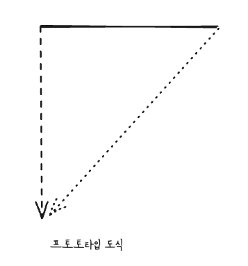
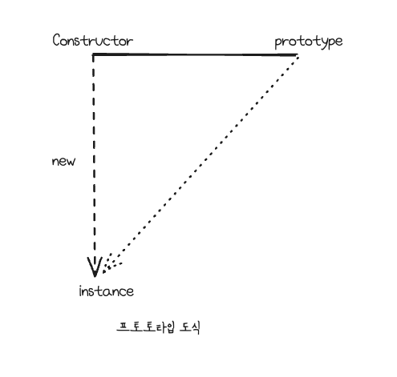

# constructor, prototype, instance



- prototype이라는 프로퍼티와 `__proto__` 라는 프로퍼티 둘의 관계가 프로토타입 개념의 핵심이다.

```js
var Person = function (name){
	this._name = name;
};
Person.prototype.getName = function(){
	console.log(this);
	return this._name;
};
var suzi = new Person('Suzi');
const result = Object.getPrototypeOf(suzi); // __proto__
result._name = "hello"; // suzi.__proto__._name 
console.log(result.getName()); // undefined
console.log(suzi.getName()); // Suzi
```

- result.getName이 undefined가 나오는 이유는 this 때문이다.
	- `result` 는 `suzi.__proto__._name` 이기 때문에 undefined가 출력 된것이다.
	- `__proto__` 에 `_name` 프로퍼티를 넣어주면 출력 될것이다.
- `__proto__` 가 생략 가능한 프로퍼티이다.

```js
suzi.__proto__.getName
-> suzi(.__proto__).getName
-> suzi.getName
```



- new 연산자로 Constructor를 호출하면 instance가 만들어 지는데, 이 instance의 생략 가능한 프로퍼티인 `__proto__` 는 Constructor의 prototype을 참조 한다.
- new 연산자로 Constructor를 호출하면 instance가 만들어진다.
- 이 instance의 생략 가능한 프로퍼티인 `(__proto__)` 는 Constructor의 prototype을 참조.
- 그래서 `__proto__` 를 생략하여 메서드를 실행하면`suzi.getName()` 여기서 `this`는 `suzi` 를 가리킨다.

1. 어떤 생성자 함수 new 연산자와 함께 호출 또는 객체 타입을 리터럴로 선언하면 Constructor에서 정의된 내용을 바탕으로 새로운 인스턴스가 생성된다.
2. 이 인스턴스에는 `__proto__` 라는 Constructor의 prototype프로퍼티를 참조하는 프로퍼티가 자동으로 부여된다.
3. `__proto__` 는 생략 가능한 속성이라 인스턴스는 Constructor.prototype의 메서드를 마치 자신의 메서드인것처럼 호출 할 수 있다.
4. Constructor.prototype에는 constructor라는 프로퍼티가 있다.
5. 이는 다시 생성자 함수 자기 자신을 가리킨다.
6. 해당 프로퍼티는 인스턴스가 자신의 생성자 함수가 무엇인지를 알고자 할 때 필요한 수단이다.
## 프로토 타입 개념 상세
- JS는 함수에 자동으로 객체인 prototype 프로퍼티를 생성해 놓는다.
- 해당 함수를 생성자 함수로서 사용할 경우 (new 연산자와 함께 함수를 호출할 경우)
- 생성된 인스턴스에는 숨겨진 프로퍼티인 `__proto__` 가 자동으로 생성된다.
- 해당 `__proto__` 프로퍼티는 생성자 함수의 prototype 프로퍼티를 참조한다.
- `__proto__` 프로퍼티는 생략 가능하도록 구현돼있다.
- 생성자 함수의 prototype에 어떤 메서드나 프로퍼티가 있다면 인스턴스에서도 마치 자신의 것처럼 해당 메서드나 프로퍼티에 접근할 수 있게 된다.

```js
var Constructor = function(name){
	this.name = name;
};
Constructor.prototype.method1 = function(){};
Constructor.prototype.property1 = 'Constructor Prototype Property';

var instance = new Constructor('Instance');
console.dir(Constructor);
console.dir(instance);
```

```js
var arr = [1, 2];
console.dir(arr);
console.dir(Array);
```


# constructor 프로퍼티
- prototype 객체 내부에 `constructor` 라는 프로퍼티가 있다.
- 인스턴스의 `__proto__` 객체 내부에도 마찬가지이다.
- 인스턴스로부터 그 원형이 무엇인지를 알 수 있는 수단이다.

```js
var arr = [1, 2];
Array.prototype.constructor === Array // true
arr.__proto__.constructor === Array // true
arr.constructor === Array // true

var arr2 = new arr.constructor(3, 4);
console.log(arr2); // [3, 4] 
```

## 다양한 constructor 접근 방법
```js
var Person = function (name){
	this.name = name;
};
var p1 = new Person('사람1');
var p1Proto = Object.getPrototypeOf(p1);
var p2 = new Person.prototype.constructor('사람2');
var p3 = new p1Proto.constructor('사람3');
var p4 = new p1.__proto__.constructor('사람4');
var p5 = new p1.constructor('사람5');

[p1, p2, p3, p4, p5].forEach(function(p){
	console.log(p, p instanceof Person);
})
// 전부 true 출력
```

```js
/*
* Constructor
*/
[Constructor]
[instance].__proto__.constructor
[instance].constructor
Object.getPrototypeOf([instance]).constructor
[Constructor].prototype.constructor

/*
* prototype
*/
[Constructor].prototype
[instance].__proto__
[instance]
Object.getPrototypeOf([instance])
```

# 프로토타입 체인

## 메서드 오버라이드
```js
var Person = function (name){
	this.name = name;
};
Person.prototype.getName = function(){
	return this.name;
};

var iu = new Person('지금');
iu.getName = function() {
	return '바로' + this.name;
}
console.log(iu.getName()); // 바로지금
```

- 자바스크립트 엔진이 `getName` 이라는 메서드를 찾는 방식은 가장 가까운 대상인 자신의 프로퍼티를 검색하고, 없으면 그다음으로 가까운 대상인 `__proto__` 를 검색하는 순서로 진행 됩니다.

## 프로토타입 체인
> 어떤 데이터의 `__proto__` 프로퍼티 내부에 다시 `__proto__` 프로퍼티가 연쇄적으로 이어진것을 프로토타입 체인(`prototype chain`) 이라 하고, 이 체인을 따라가며 검색하는 것을 프토토타입 체이닝(`prototype chaining` )이라고 합니다.

```js
var arr = [1, 2];
arr.push(3);
console.log(arr.hasOwnProperty(2)); // true

var arr2 = new Array(1, 2); // prototype 자동 생성
// arr2 instance에 __proto__ 자동생성
// arr2.push 라는것은 결국
// arr2(.__proto__).push(3);
// arr2의 인스턴스는 __proto__를 통해서 constructor의 prototype객체에 접근 가능하다.
// 근데 __proto__가 생략 가능 하기 때문에 사용자는 최종적으로
arr2.push(3);
// 이렇게 사용할 수 있다.
// arr2 인스턴스의 __proto__도 결국 객체이기 때문에 또 다시 __proto__를 가진다.
// 즉, Object.prototype을 참조 할 수 있다.
// arr2 인스턴스는 프로토타입 체인을 통해서 Object.prototype을 참조할 수 있다.
// arr2(.__proto__)(.__proto__).haOwnProperty(2); // true
// 하지만 __proto__는 생략 가능하기 때문에 사용자는 최종적으로
arr2.hasOwnProperty(2);
// 이렇게 사용 가능하게 된다.
```

- `hasOwnProperty` 메서드는 Object의 메서드인데 배열인 arr에서 도대체 어떻게 실행 할 수 있는걸까?
- 프로토타입 체인 때문이다.
- 배열의 `__proto__` 에는 constructor가 있다. -> 배열 메서드등을 사용 할 수 있다.
- 추가로 `__proto__` 안에는 또다시 `__proto__` 가 있다.
- *prototype* 객체가 "객체" 이기 때문이다.
- 모든 객체는 `__proto__` 에 Object.prototype이 연결된다. -> Object 메서드등을 사용 할 수 있다.
- prototype 객체도 객체기 때문에 Object.prototype과 연결된다.


# 객체 전용 메서드의 예외사항
- 자바스크립트의 데이터는 결국 모두 Object.prototype을 가지기 떄문에 객체에서만 사용 할 메서드는 다른 프로토타입처럼 프토토타입 객체 안에 정의 할 수 없다.
	- 항상 Object.prototype이 프로토타입 체인의 최상단에 있기 때문에
	- 정의하게 되면 다른 모든 데이터에서도 사용 할 수 있게 되어버린다.
- 객체만을 대상으로 동작하는 객체 전용 메서드들은 Object.prototype이 아닌 Object static method로 부여 할 수밖에 없었다.
- 생성자 함수인 Object와 인스턴스인 객체 리터럴 사이에는 this를 통한 연결이 불가능하기 때문에 "메서드명 앞의 대상이 곧 this" 방식이 아니라 this의 사용을 포기하고 대상 인스턴스를 인자로 직접 주입해야 하는 방식으로 구현돼있다.
	- 그래서 예를들어 `Object.freeze(instance)` 로 사용 할 수 있는데 `instance.freeze()` 로 사용 할 수 없는 이유다.
- 객체 한정 메서드들을 Object.prototype이 아닌 Object에 직접 부여할 수 밖에 없었던 이유
	- *Object.prototype* 이 여타의 참조형 데이터뿐 아니라 기본형 데이터조차 `__proto__` 에 반복 접근함으로써 도달할 수 있는 최상위 존재이기 때문이다.

> `Object.create` 를 이용하면 `__proto__` 가 없는 객체를 생성한다.


# 다중 프로토타입 체인
> 다중 프로토타입 체인을 만들려면
> 대각선의 `__proto__` 를 연결해나가기만 하면 된다.
> 대각선의 `__proto__` 를 연결하는 방법은 `__proto__` 가 가리키는 대상, 즉 생성자 함수의 prototype이 연결하고자 하는 상위 생성자 함수의 인스턴스를 바라보게끔 해주면 된다.

```js
var Grade = function() {
	// arguments는 유사배열 객체라 배열메서드를 사용하기 위해 call사용
	var args = Array.prototype.slice.call(arguments);
	for(var i = 0; i < args.length; i++){
		this[i] = args[i];
	}
	this.length = args.length;	
};
Grade.prototype = [];

var g = new Grade(100, 80);
console.log(g);
g.pop();
console.log(g);
g.push(90);
console.log(g);
```

> 인스턴스 `g` 에서 배열 메서드를 직접 쓰기 위해서
> `g.__proto__` -> Grade.prototype 이 배열의 인스턴스를 바라보게 하면 된다.

# 정리
- Object.prototype에 모든 데이터 타입에서 사용할 수 있는 범용적인 메서드만 존재
- 객체 전용 메서드는 Object 생성자 함수에 static method로 담겨 있다.
- `__proto__` 방향을 계속 찾아가면 최종적으로 Object.prototype에 도착한다.
	- 이런식으로 가장 가까운 대상부터 `__proto__` 안에 다시 `__proto__` 를 찾아가는 과정을 *프토토타입 체이닝* 이라고 한다.
	- 프토토타입 체이닝을 통해 각 프토토타입 메서드를 자신의 것처럼 호출할 수 있다.
- 프로토 타입 체인은 무한대의 단계로 생성 할 수 있다.


# QA) 프로토타입이란 무엇인가요?
- JS는 함수에 자동으로 객체인 prototype 프로퍼티를 생성해 놓는다.
- 해당 함수를 생성자 함수로서 사용할 경우 (new 연산자와 함께 함수를 호출할 경우)
- 생성된 인스턴스에는 숨겨진 프로퍼티인 `__proto__` 가 자동으로 생성된다.
- 해당 `__proto__` 프로퍼티는 생성자 함수의 prototype 프로퍼티를 참조한다.
- `__proto__` 프로퍼티는 생략 가능하도록 구현돼있다.
- 생성자 함수의 prototype에 어떤 메서드나 프로퍼티가 있다면 인스턴스에서도 마치 자신의 것처럼 해당 메서드나 프로퍼티에 접근할 수 있게 된다. 

> 리터럴로 선언 해도 위와 똑같은 방식이다.
> 즉, 리터럴로 선언하게 되면 생성자 함수를 사용하여 생성된 인스턴스로 취급한다.
# QA) 프로토타입 체인이란 무엇인가요?
> 키워드 : 메서드 오버라이딩
