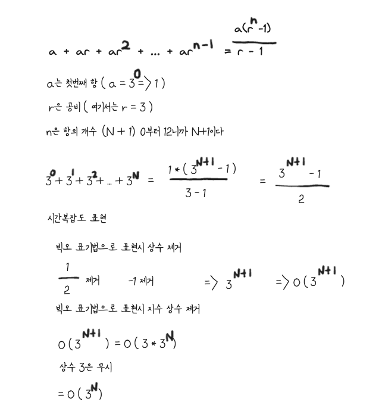

# 사고 과정
## 목표

> 문자열 길이가 주어지면 길이가 1이 될때까지 `- -` 형태로 바꾸는 문제

제약조건

1 <= N <= 12
## 어떻게 해결?

> 입출력 결과를 보면 아래와 같이 추론이 가능하다.

ans[0] = 3⁰ = 1 => `-`

ans[1] = 3¹ = 3 => `- -`

ans[2] = 3² = 9  
=> `- -` `- -`

=> ans[2-1] + 3²⁻¹ + ans[2-1]  
결론적으로

=> ans[i-1] + 3ⁱ ⁻ ¹ + ans[i-1]

> 이러한 규칙을 찾을 수 있다.

# 시간 복잡도

> 칸토어 집합은 0부터 N까지 각 단계별로 3⁰ + 3¹ + 3² + ... 3¹² 만큼의 문자열을 처리해야 하므로 모든 합이 전체 연상량이다.

0 <= N <= 12

ans[0] ~ ans[12]

ans[i]의 길이 : 3ⁱ  
ans[0] : 1  
ans[1] : 3  
ans[2] : 9  
- 위에 0,1,2일때 공백 - 합쳐서의 길이

> 등비수열

# 성찰
- 재귀적인 구조를 띄는 문제 같은 경우에 입력과 출력만 보고 규칙을 유추 할 수 있다.
- 탑다운 방식의 재귀적으로 푸는거 뿐만 아니라 바텀업 방식의 `for 루프` 를 통해서 푸는 방법도 연습 해두자.
	- 탑다운 재귀함수 : 메모이제이션
	- 바텀업 for루프 : 타뷸레이션